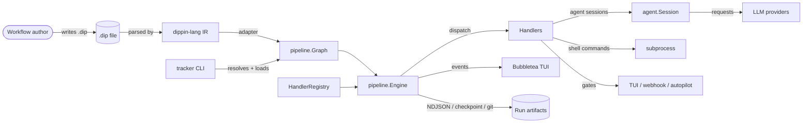
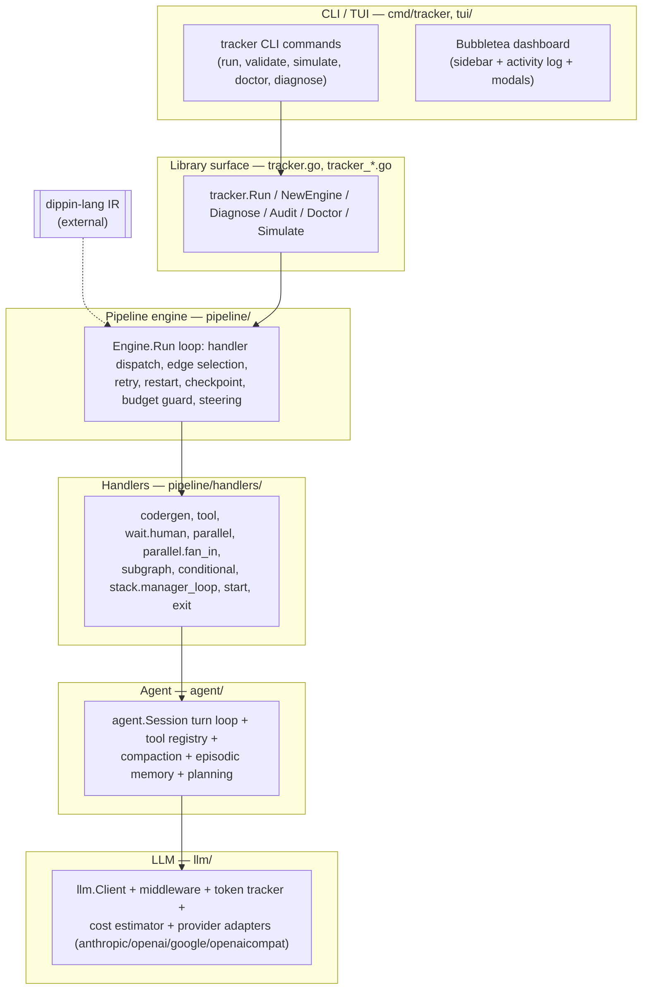
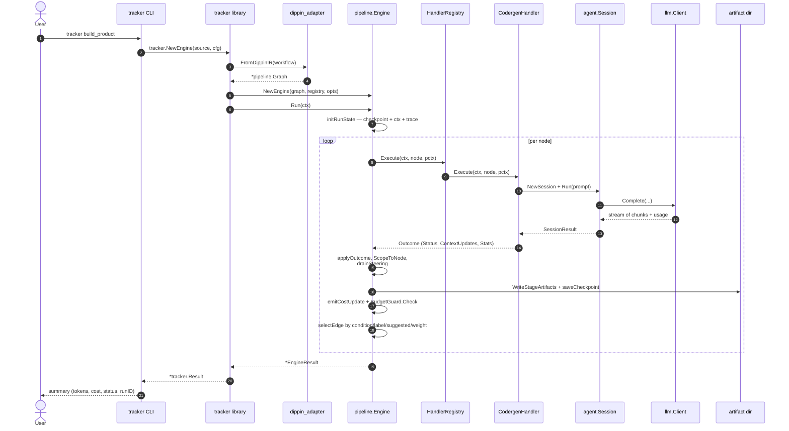

# Tracker Architecture

Tracker is a pipeline orchestration engine for multi-agent LLM workflows.
Pipelines are authored in [Dippin](https://github.com/2389-research/dippin-lang)
(`.dip`) as a small DSL that compiles to an intermediate representation (IR)
which tracker then executes as a directed graph of handler invocations. The
engine supports human-in-the-loop gates, parallel fan-out, subgraph
composition, checkpoint/resume, budget guards, a git-backed artifact trail,
and a live TUI dashboard. It is built by 2389.ai.

This document is the starting point for understanding the system. For
subsystem detail, see [`docs/architecture/README.md`](docs/architecture/README.md).

## System context

The common-case path from a human typing `tracker build_product` to a
finished run:



Dippin-lang is an external dependency — tracker does not parse `.dip` text
directly. It consumes the IR produced by dippin's parser and converts it to
its own `Graph` via `pipeline/dippin_adapter.go`. The adapter is the single
place where naming mismatches between the two ecosystems are reconciled (see
`CLAUDE.md` §Architecture Gotchas for the full contract).

## Layer diagram



Each layer only depends on layers below it. In particular, `pipeline/` never
imports `agent/` at the engine level — handlers under `pipeline/handlers/` do
the bridging, which is why the engine has no special-case code for LLM calls,
tool invocations, or human gates.

## End-to-end sequence

Happy-path execution of an agent node followed by a tool node:



Events are emitted at every step (`EventStageStarted`, `EventDecisionOutcome`,
`EventDecisionEdge`, `EventCheckpointSaved`, `EventCostUpdated`, …) and fan
out to the TUI, the NDJSON writer, and the event logger. See
[`docs/architecture/engine.md`](docs/architecture/engine.md) for the full
event list.

## Key abstractions

### Graph / Node / Edge

The static shape of a pipeline. Defined in
[`pipeline/graph.go`](pipeline/graph.go). A `Graph` has named nodes, a
directed edge list, graph-level attrs (workflow-level config, `goal`,
`max_restarts`, `default_retry_policy`, `params.*`), and a designated
`StartNode` / `ExitNode`. Each `Node` carries a shape, a label, a resolved
`Handler` name, and an `Attrs` map — the latter is the single untyped bag of
per-node configuration that handlers parse through typed accessors like
`node.AgentConfig(graphAttrs)` (see `pipeline/node_config.go`). An `Edge` has
`From` / `To`, an optional `Label` for label-routed gates, an optional
`Condition` expression, and `Attrs` (currently just `weight` for tiebreaking).

Shapes map to handler names via `shapeHandlerMap`: `box → codergen`,
`parallelogram → tool`, `hexagon → wait.human`, `diamond → conditional`,
`component → parallel`, `tripleoctagon → parallel.fan_in`, `tab → subgraph`,
`house → stack.manager_loop`, `Mdiamond → start`, `Msquare → exit`. See
[`docs/architecture/handlers.md`](docs/architecture/handlers.md).

### Engine and the Handler interface

The `Handler` interface is intentionally narrow:

```go
type Handler interface {
    Name() string
    Execute(ctx context.Context, node *Node, pctx *PipelineContext) (Outcome, error)
}
```

The engine treats every handler the same — it has no knowledge of LLM calls,
subprocess execution, parallel fan-out, or human gates. Handlers register
themselves into a `HandlerRegistry` by name; the engine resolves
`node.Handler` through the registry at dispatch time
(`pipeline/handler.go`).

The engine's job is to iterate: pick a node, call its handler, apply the
resulting outcome to the context, decide where to go next. Everything else —
concurrency, retries, branching — is either a handler concern or a
post-outcome engine concern (edge selection, budget guard). See
[`docs/architecture/engine.md`](docs/architecture/engine.md) for the run
loop in detail.

### Outcome

Every handler returns an `Outcome` ([`pipeline/handler.go`](pipeline/handler.go)):

```go
type Outcome struct {
    Status             string            // "success", "fail", "retry", or a custom status
    ContextUpdates     map[string]string // merged into PipelineContext
    PreferredLabel     string            // selects an outgoing edge by label
    SuggestedNextNodes []string          // selects an outgoing edge by target ID
    Stats              *SessionStats     // token + cost + timing (codergen only)
}
```

`Status` drives retry and strict-failure edge logic. `ContextUpdates` get
merged (and marked dirty so they enter the node-scoped namespace).
`PreferredLabel` and `SuggestedNextNodes` are the two ways a handler can
influence edge selection without using `when` conditions. The edge
selector's priority order is condition > label > suggested IDs > weight >
lexical ([`pipeline/engine_edges.go`](pipeline/engine_edges.go)).

### PipelineContext

The shared key-value store every handler reads from and writes to during a
run. Defined in [`pipeline/context.go`](pipeline/context.go). Four conceptual
namespaces:

- **Bare keys** (`outcome`, `last_response`, `tool_stdout`, …) — last-writer-wins
  globals, referenced as `${ctx.<key>}` in prompts and conditions.
- **`graph.*`** — workflow-level attrs (including `graph.goal` and
  declared workflow params).
- **`params.*`** — declared workflow params overridable at invocation time
  (`tracker run ... --param key=value`).
- **`node.<id>.<key>`** — per-node scoped aliases. After each node finishes,
  the engine calls `ScopeToNode(nodeID)` which copies keys the node
  dirtied into this namespace, letting downstream nodes reference a
  specific upstream node's output without relying on "latest writer".
- **`internal.*`** — engine bookkeeping (artifact directory, retry state);
  not visible to prompts.

See [`docs/architecture/context-flow.md`](docs/architecture/context-flow.md) for the
user-facing model. Per-node scoping is the key detail distinguishing
sequential data flow from parallel (parallel branches do NOT populate
`node.<branchID>.*` — they write a single `parallel.results` JSON blob).

### Event bus

Two event streams flow out of a run, handled identically by the TUI and by
NDJSON observers:

- `pipeline.PipelineEvent` — pipeline-level lifecycle (`pipeline_started`,
  `stage_started`, `stage_completed`, `stage_failed`, `stage_retrying`,
  `decision_edge`, `decision_condition`, `decision_outcome`,
  `decision_restart`, `cost_updated`, `budget_exceeded`,
  `checkpoint_saved`, `parallel_started`, `parallel_completed`,
  `manager_cycle_tick`, `loop_restart`, `warning`,
  `edge_tiebreaker`). Defined in [`pipeline/events.go`](pipeline/events.go).
- `agent.Event` — session-level streaming events from agent handlers
  (text deltas, tool calls, tool results, turn boundaries, usage). Defined
  in [`agent/events.go`](agent/events.go).

Both streams are multiplexed: the TUI consumes them for the dashboard, the
NDJSON writer serializes them to `activity.jsonl`, and the token tracker
sees agent usage deltas. The same event shape is produced regardless of
which backend (native, claude-code, ACP) the agent node runs on.

## Reading order

Start with [`docs/architecture/README.md`](docs/architecture/README.md) for
an index to all subsystem docs. From there:

- For how the run loop works, read [`engine.md`](docs/architecture/engine.md).
- For the set of handlers and dispatch, read
  [`handlers.md`](docs/architecture/handlers.md), then the per-handler files
  under `docs/architecture/handlers/`.
- For data flow between nodes, read
  [`docs/architecture/context-flow.md`](docs/architecture/context-flow.md).
- For the `.dip` → `Graph` bridge, read
  [`adapter.md`](docs/architecture/adapter.md).
- For agent internals (turn loop, tools, compaction, memory, planning),
  read [`agent.md`](docs/architecture/agent.md).
- For the LLM client, middleware, and provider adapters, read
  [`llm.md`](docs/architecture/llm.md).
- For the dashboard, read [`tui.md`](docs/architecture/tui.md).
- For native vs Claude-Code vs ACP backends, read
  [`backends.md`](docs/architecture/backends.md).
- For the workdir / checkpoint / activity.jsonl / git bundle layout, read
  [`artifacts.md`](docs/architecture/artifacts.md).
