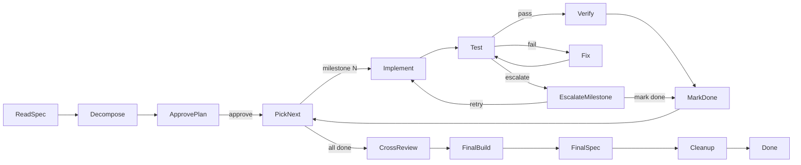
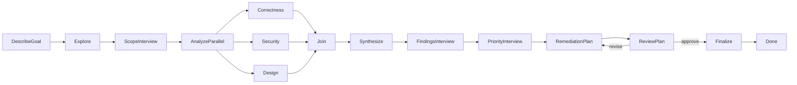
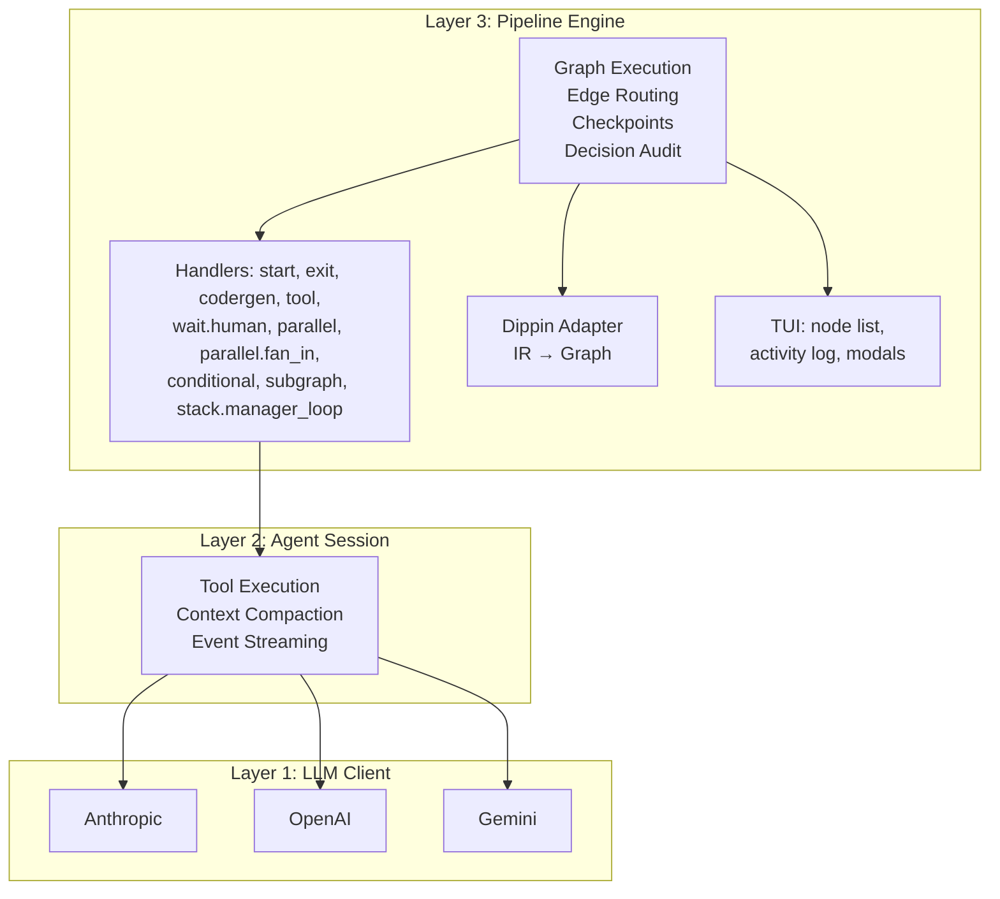

# Tracker

Pipeline orchestration engine for multi-agent LLM workflows. Define pipelines in `.dip` files (Dippin language), execute them with parallel agents, and watch progress in a TUI dashboard.

Built by [2389.ai](https://2389.ai).

## Quick Start

```bash
# Install
go install github.com/2389-research/tracker/cmd/tracker@latest

# See what's built in
tracker workflows

# Run a built-in pipeline by name — no file needed
tracker build_product

# Or copy it locally to customize
tracker init build_product
tracker build_product.dip

# Run fully autonomous with an LLM judge
tracker --autopilot mid build_product

# Use the Claude Code backend for file editing + terminal (native is the default)
tracker --backend claude-code build_product

# Or route nodes through an Agent Client Protocol server
tracker --backend acp build_product

# Check your setup (API keys, dippin binary, working directory)
tracker doctor

# Configure LLM providers interactively
tracker setup

# Validate a pipeline without running it
tracker validate build_product

# Resume a stopped run
tracker -r <run-id> build_product.dip

# When something goes wrong
tracker diagnose

# Override workflow params at runtime (v0.19.0)
tracker --param model=claude-opus-4 --param retries=3 build_product

# Pin the run's artifact directory explicitly (v0.19.0)
tracker --artifact-dir /tmp/tracker-runs build_product
```

> **What's new in v0.40.2** (2026-06-24): **`build_product`'s plan-approval gate now shows you the actual plan**. The `ApprovePlan` human gate previously displayed only its one-line label — an operator had nothing to review and could only rubber-stamp `approve`. A new `ShowPlan` tool node now reads the planner's output (`.ai/decisions/milestones.md` and the spec `requirement-coverage.md` table, including the `COVERAGE_GAPS` count) into `ctx.tool_stdout`, and `ApprovePlan` interpolates it under a `## Plan under review` heading so the full plan renders in the fullscreen review modal — the same pattern the [#407](https://github.com/2389-research/tracker/issues/407) `EscalateMilestone` gate uses. `Decompose` success now routes `-> ShowPlan -> ApprovePlan`; the approve/adjust/reject routes are unchanged. No breaking changes; core pipelines hold A grades on `dippin doctor`.
>
> **Previously in v0.40.1** (2026-06-24): **`build_product` dogfood-cascade hardening — a finished, green build is no longer discarded**. Fixes a real case-study cascade (run `634a2527ff56`) end-to-end: a turn-limit breach on a green tree now commits the work instead of abandoning it uncommitted ([#406](https://github.com/2389-research/tracker/issues/406)) via a single shared `.ai/build/verify.sh` green gate wired through `Implement`/`FixMilestone`/`TestMilestone`; compiled build artifacts are excluded from checkpoint commits — and the runtime exclusion goes to the local `.git/info/exclude`, not the tracked `.gitignore`, so the skip itself isn't out-of-scope work `VerifyMilestone` FAILs ([#405](https://github.com/2389-research/tracker/issues/405)); milestone escalation surfaces the live verify result and defaults to "mark done" so a green tree isn't silently abandoned ([#407](https://github.com/2389-research/tracker/issues/407)); `VerifyMilestone` gains an ADR-aware FAIL/WARN/PASS severity system so behaviorally-correct, fully-tested code no longer hard-FAILs over a prose-identifier mismatch ([#408](https://github.com/2389-research/tracker/issues/408)); and `Implement` self-applies the same `TEST-VERIFIES-CONTRACT` rubric `VerifyMilestone` grades against, including a "built binary" test-shape rule ([#409](https://github.com/2389-research/tracker/issues/409)). A follow-up automated multi-bot review also tightened the shared `verify.sh` to reserve exit code 2 for the `make`-missing escalation only (collapsing legitimate test-runner exit-2s to a normal failure). No breaking changes; core pipelines hold A grades on `dippin doctor`.
>
> **Previously in v0.40.0** (2026-06-22): **dippin-lang v0.43.0, four new `.dip` attributes wired end-to-end, two new per-node engine guards, and the case-study round-7 hardening batch**. The language pin moves to [dippin-lang v0.43.0](https://github.com/2389-research/dippin-lang) (from v0.39.0), bringing four IR fields online: `override:` on an edge now produces `OutcomeValidationOverridden` on success ([#271](https://github.com/2389-research/tracker/issues/271) input gap), `last_response_truncate:` caps the prior node's response injected into an agent prompt ([#56](https://github.com/2389-research/tracker/issues/56) chain-attack mitigation), `choice:` declares a stable machine-readable human-gate routing key separate from the display `label:` (DIP150), and a graph-level `stall_timeout:` default now aborts a wall-clock-stalled run through the same budget cascade ([#310](https://github.com/2389-research/tracker/issues/310)). Two new engine guards complement `max_turns`: a per-node `max_cost_usd:` ceiling and a `no_progress_turns:` detector that halts agents spinning without tool calls ([#304](https://github.com/2389-research/tracker/issues/304)), both routing `OutcomeRetry`. On the safety side, `build_product`'s FinalCommit is now mechanically commit-only — `commit_only: true` plus a `writable_paths: .git/**, .ai/**` native fs-jail so it physically cannot author product source even when failure context primes it to ([#349](https://github.com/2389-research/tracker/issues/349)). The round-7 fixes: git subprocesses no longer inherit a leaked `GIT_DIR`/`GIT_INDEX_FILE` that could re-anchor the artifact repo at the outer checkout ([#399](https://github.com/2389-research/tracker/issues/399)); `build_product`'s milestone test-gate is now scoped to the packages the milestone changed and its `accept` escalation no longer bypasses the cross-review/final-build/spec-check subgraph ([#392](https://github.com/2389-research/tracker/issues/392)); four more example workflows reach A grades ([#335](https://github.com/2389-research/tracker/issues/335) scope 3); `${ctx.tool_stdout}`/`${ctx.tool_stderr}` interpolated in prompts render as fenced ` ```text ` blocks ([#352](https://github.com/2389-research/tracker/issues/352) item 3); and `build-context.md` is refreshed with each milestone's active files at `MarkMilestoneDone` ([#351](https://github.com/2389-research/tracker/issues/351) item 3). No breaking changes; core pipelines hold A grades on `dippin doctor`.
>
> **Previously in v0.39.1** (2026-06-12): **case-study hardening rounds 5–6 — the audit log stops double-counting, per-branch security overrides actually apply, a silently-inert failure route is refused at dispatch, and the embedded built-ins clean up their act**. activity.jsonl no longer logs every LLM event twice ([#354](https://github.com/2389-research/tracker/issues/354)) — the client-level trace observer and the agent session were both writing the same stream, doubling audit volume and skewing `tracker diagnose` event counts. Per-branch `tool_access:` / `writable_paths:` overrides on block-form `parallel` branches now reach the runtime ([#368](https://github.com/2389-research/tracker/issues/368)) instead of being silently dropped by the adapter — branch values get the same fail-closed canonicalization and jail refuse-to-start treatment as agent-level attrs, and duplicate-target branches resolve deterministically (last branch wins). The parallel handler now **refuses at dispatch** a `fallback_target` (either attr spelling, on the target node or any `branch.N.*` group — shadowed duplicates included) declared on a parallel branch target ([#313](https://github.com/2389-research/tracker/issues/313) defect 2, closing the issue): `runBranch` bypasses the engine's strict-failure path, so the attr was a silently-inert failure route — the error points at the supported pattern, `fan_in_policy` + a conditional fail edge at the aggregating node, which `build_product_with_superspec`'s `ReviewParallel` now adopts (`fan_in_policy: all` + escalation edge, so a single failed cross-reviewer can't be masked). The embedded `deep_review` built-in goes from **F/35 to A/100** under `dippin doctor` ([#335](https://github.com/2389-research/tracker/issues/335) scope 1): a graph-level `on_failure` catch-all + escalation gate replace eleven dead-stop failure paths, the goal now flows verbatim via the per-node scoped context key instead of an LLM-copied file, and its analysis fan-out demands all three analyzers succeed. And `build_product` no longer leaks tracker's own issue/PR numbers into agent-visible prompt text or tool output ([#316](https://github.com/2389-research/tracker/issues/316)) — 64 references excised; rules now state themselves on their own terms ([#355](https://github.com/2389-research/tracker/issues/355) swept the last template-domain cruft, too). No breaking changes; all four embedded workflows hold A grades on `dippin doctor`.
>
> **Previously in v0.39.0** (2026-06-12): **the case-study hardening arc lands — agents stop hallucinating their location, injected context stops lying, and the expensive review fan-out is guarded by a sub-second structural check**. All six changes trace to one real run (`b68b532619c3`) that shipped an empty final milestone. The headline fix is a silent security gap: top-level `tool_access: none` on an agent node was dropped by the dippin adapter and ignored at runtime ([#366](https://github.com/2389-research/tracker/issues/366)) — the typed IR field now propagates (with precedence over the `params:` spelling, which already worked). Every codergen prompt now opens with a machine-written `# Runtime` block — absolute working directory, current date, run/node identity ([#347](https://github.com/2389-research/tracker/issues/347)) — because an agent once `cd`'d to a hallucinated path, read the clean tree as "milestone already complete," and shipped nothing. Context injection is bounded and one-shot ([#352](https://github.com/2389-research/tracker/issues/352) items 1–2): the auto-appended "Previous Node Output" is capped at 4KB (head+tail truncation with an explicit elision marker; per-node `injection_cap` override) instead of pasting whole 9KB transcripts into every downstream prompt, and a human gate's response is consumed by the first prompt-consuming node instead of replaying one stale "approve" into every later prompt as implied sign-off (the gate's scoped `node.<id>.human_response` copy keeps it for explicit reference; the clear persists across checkpoint resume). `build_product` gains a sub-second `CheckMilestoneOutputs` gate before the review fan-out ([#350](https://github.com/2389-research/tracker/issues/350)): Decompose's declared per-milestone file lists are reconciled against the disk — a missing declared directory or a broken `go build ./...` escalates to a human **before** ~$10 of reviewer tokens rediscover an absent package (missing files alone only warn: deletion milestones are legitimate). FinalCommit is now commit-only in both build_product workflows ([#349](https://github.com/2389-research/tracker/issues/349)) so a failure report in context can't con the commit node into authoring an entire milestone through zero quality gates, and `.tracker/` run metadata stays out of the product repo's history ([#351](https://github.com/2389-research/tracker/issues/351)). No breaking changes; core pipelines hold A grades on `dippin doctor`.
>
> **Previously in v0.38.1** (2026-06-11): **two gate-integrity holes that let a failed run report success are closed**. Both came from one real case-study run that finished "completed" with its final quality gate at `outcome: fail`. First, `auto_status` no longer fails open ([#346](https://github.com/2389-research/tracker/issues/346)): heading-wrapped verdicts (`## STATUS:fail`) now parse just like the bold shapes from #233, and when an `auto_status` node completes with NO parseable STATUS line, `goal_gate: true` nodes resolve to `fail` — an unparseable verdict on a gate is an anomaly, not a pass (plain `auto_status` nodes keep the legacy success default). The miss is observable end to end: a new `auto_status_missing` audit event lands in activity.jsonl and `tracker diagnose` surfaces a per-node suggestion. Second, a goal-gate retry now re-executes the gate instead of replaying the escalation tail around it ([#348](https://github.com/2389-research/tracker/issues/348) defect 1): a persisted `gate_recheck_pending` marker keeps redirected gates visible to the exit check, re-enters **at the gate itself** so remediation done on the escalation path gets re-judged (budget-free completion of the redirect cycle — works even with `max_retries: 1`), and a never-satisfied gate now drains its budget and **fails** the run instead of letting it report plain success. No breaking changes; core pipelines hold A grades on `dippin doctor`.
>
> **Previously in v0.38.0** (2026-06-11): **a parallel fan-out can finally demand that every branch succeed — and four LLM stream adapters stop swallowing mid-stream errors**. Parallel and fan_in nodes accept `fan_in_policy: any | all | quorum` (+ `quorum: <n>`) via a `params:` block ([#313](https://github.com/2389-research/tracker/issues/313) defect 1, dippin-lang v0.39.0 pin); the default stays `any`, a policy-caused failure names the failed branches in events and the `fan_in.policy_detail` context key, and `build_product`'s `ReviewParallel` opts into `all` so a single failed adversarial reviewer routes to `EscalateReview` instead of being masked by success-if-any. A full-project fresh-eyes review landed 25 individually verified fixes ([#356](https://github.com/2389-research/tracker/pull/356)): mid-stream SSE errors now surface on all four providers (Anthropic `overloaded_error`/`rate_limit_error` events, Gemini `{"error":...}` chunks, OpenAI unparseable error payloads, openai-compat code/type-only errors), interleaved tool-call starts no longer drop arguments, `ExpandGraphVariables` is a true single pass (`$target` can't clobber `$target_name`, and substituted values are never re-scanned), `tracker update` stages binaries under collision-proof temp names with close-error checks, ACP init failures reap the subprocess, and webhook gates abort their in-flight POST on cancel. And `build_product`'s `TestMilestone`/`FinalBuild` now run **every** detected stack — a Go+JS repo runs both `go test` and `npm test`, failures accumulate ([#305](https://github.com/2389-research/tracker/issues/305)). No breaking changes; core pipelines hold A grades on `dippin doctor`.
>
> **Previously in v0.37.0** (2026-06-10): **tool subprocesses learn the run's identity, and `build_product`'s CI gate stops crying wolf to humans**. Locally-executed tool subprocesses now receive `TRACKER_RUN_ID`, `TRACKER_RUN_DIR`, and `TRACKER_WORKDIR` in their environment ([#323](https://github.com/2389-research/tracker/issues/323)), so a downstream tool can read a specific upstream agent's output with `cat "$TRACKER_RUN_DIR/<NodeID>/response.md"` instead of the `ls -dt | head -1` mtime heuristic that breaks under concurrent runs in the same workdir — closing the `tool_access: none` agent → tool data-flow gap for squad/review patterns. Relatedly, `graph.workflow_dir` is now seeded from the pipeline file's parent directory ([#332](https://github.com/2389-research/tracker/issues/332)) so workflows can reference sibling scripts (`bash ${graph.workflow_dir}/scripts/setup.sh`) from any cwd, and the raw `.dip` load path finally resolves `command_file:` / `prompt_file:` / `system_prompt_file:` directives ([#331](https://github.com/2389-research/tracker/issues/331)) so multi-file workflow trees run without packing to `.dipx`. Two more fixes: a failing `make ci`/`check`/`lint` target in `build_product` no longer mis-routes to human escalation as "make not installed" — GNU make's exit-2-on-any-recipe-error collided with the reserved rc=2; make failures now collapse to rc=1 and stay in the fix loop ([#320](https://github.com/2389-research/tracker/issues/320)) — and the built-in `exec *` denylist pattern no longer false-positives on POSIX fd-only redirects like `exec 3>"$tmp"` ([#333](https://github.com/2389-research/tracker/issues/333)), with fail-closed carve-outs and whitespace-normalized matching so tab-separated commands can't evade deny patterns. No breaking changes; core pipelines hold A grades on `dippin doctor`.
>
> **Previously in v0.36.0** (2026-06-10): **epic [#308](https://github.com/2389-research/tracker/issues/308) Phases 0–2 land — `build_product` no longer dead-stops, loses work, or builds on a broken spec**. The epic's case study was a real run that went green, exhausted its turn budget before committing, and silently halted the whole pipeline — skipping the entire cross-review safety net. **Phase 0 (stop the bleeding)**: unhandled agent failure now routes to `fallback_target` / graph-level `on_failure` instead of dead-stopping ([#295](https://github.com/2389-research/tracker/issues/295), [#309](https://github.com/2389-research/tracker/issues/309), dippin v0.38 pin), and every `build_product` agent node routes failure/turn-exhaustion to escalation ([#296](https://github.com/2389-research/tracker/issues/296)). **Phase 1 (never lose work)**: the engine commits WIP to a recoverable ref before routing any failed node ([#302](https://github.com/2389-research/tracker/issues/302)); `build_product` adopts commit-first / stop-when-green + a `CommitIfDirty` checkpoint ([#297](https://github.com/2389-research/tracker/issues/297)); turn-limit breach is a guard, not a guillotine — verify → commit-if-green → classify → a new `OperatorDecision` gate with warm `continue +N` ([#303](https://github.com/2389-research/tracker/issues/303), [#318](https://github.com/2389-research/tracker/issues/318)); a per-node build-context file cures rediscovery amnesia ([#298](https://github.com/2389-research/tracker/issues/298)). **Phase 2 (quality regardless of spec/language)**: language-native quality gates when no Makefile exists ([#299](https://github.com/2389-research/tracker/issues/299)), a no-requirement-left-behind coverage table in Decompose + owner-or-fail Verify ([#300](https://github.com/2389-research/tracker/issues/300)), and a `SpecLint` spec-coherence preflight that hard-fails dangling refs / contradictory constants / contract-signature mismatches before any decomposition ([#301](https://github.com/2389-research/tracker/issues/301)). Also: `reasoning_effort` now reaches Anthropic (`output_config.effort`) and Gemini 3+ (`thinkingLevel`) ([#329](https://github.com/2389-research/tracker/pull/329)), and a silently-missing cross-review report can no longer reach `FinalBuild` ([#313](https://github.com/2389-research/tracker/issues/313) guard). No breaking changes; core pipelines hold A grades on `dippin doctor`.
>
> **Previously in v0.35.0/v0.35.1** (2026-06-02): **`writable_paths` fs-jail enforcement** ([#272](https://github.com/2389-research/tracker/issues/272)) — agent nodes can declare writable globs; in-process tools enforce via `openat2(RESOLVE_BENEATH)` against a session-root fd and Bash subprocesses are confined with Linux Landlock ABI v3 via the internal `__jail-exec` re-exec; refuse-to-start gates cover malformed globs, non-native backends, and kernels without Landlock. v0.35.1 closed the joint release loop with dippin v0.35.0.
>
> **Previously in v0.34.0** (2026-05-27): **the `workflows/` mirror is gone — built-in workflows are now embedded directly from `examples/` via explicit-file `//go:embed` lines** ([#256](https://github.com/2389-research/tracker/issues/256)). The repo previously kept four byte-identical copies of the built-in workflow `.dip` files under `workflows/` and `examples/`, kept in lockstep by a `make sync-workflows` / `make check-workflows` target, a pre-commit gate, and a CI step. Despite those guardrails, the two copies drifted three times. The `//go:embed workflows/*.dip` glob is replaced with four explicit `//go:embed examples/<name>.dip` lines pointing directly at the canonical copies, and the `workflows/` directory plus all of the sync infrastructure (Makefile targets, pre-commit gate #9, CI `Embedded workflows in sync` step) is deleted. **No functional change for CLI users** — `tracker workflows`, `tracker init`, and bare-name resolution behave identically. **Library-API note**: `WorkflowInfo.File` now reports paths with the `examples/` prefix instead of `workflows/`; that's the only externally visible delta. ~3,200 lines deleted net.
>
> **Previously in v0.33.0** (2026-05-27): **the last two visible `build_product` audit gaps from [#233](https://github.com/2389-research/tracker/issues/233) close** — the eight-gap thread is now down to a single design-scope follow-up (Gap 5.2 `OutcomeHumanOverride`), which has wide blast radius and is tracked separately. **Gap 5.1** ([#263](https://github.com/2389-research/tracker/pull/263)): `parseAutoStatus` now tolerates markdown-emphasis on STATUS lines. The audit observed `**STATUS: fail**` (bold) silently falling back to the default `success` because `HasPrefix("**STATUS:", "STATUS:")` returns false, and LLMs commonly bold/italicize STATUS lines when they want the verdict to draw the eye. `parseStatusLine` now `strings.Trim`s the line and value with the `"*_"` cutset, so `**STATUS: fail**` / `*STATUS: fail*` / `STATUS: **fail**` / `__STATUS: success__` all parse correctly. Locked semantics from `TestParseAutoStatus_V3FailFirstContract` are unchanged: last-line-wins + default-success-on-empty. New regression coverage in `TestParseAutoStatus_Gap5_1_AuditedShapes` (11 sub-tests) — six previously RED, now GREEN; five pin existing behavior. **Gap 5.3** ([#264](https://github.com/2389-research/tracker/pull/264)): `build_product` re-runs reviewers after `ApplyReviewFixes` with a one-shot budget. Pre-fix, the workflow only ran reviewers once and routed straight to `FinalBuild` after fixes, so a fix commit introducing W4 (zero-assertion stubs), W5 (wrong-target tests), or W13 (DI-bypass) regressions reached `Done` unchecked — `FinalSpecCheck` per Gap 8 v5 scopes to W17 + iface + `SPEC.md` and explicitly delegates W4/W5/W13 to reviewer rubric point 3, which only ran pre-fix. New `CheckReviewFixBudget` tool node increments `.ai/build/review_fix_attempts` and routes `ApplyReviewFixes -> CheckReviewFixBudget -> ReviewParallel restart:true` (one re-review pass) or `-> EscalateReview` (budget exhausted, MAX_ATTEMPTS=1). A `ResetReviewBudget` tool node sits on the `EscalateReview "retry" -> Decompose` edge so the counter clears when the human picks retry — otherwise the stale counter would immediately fail-close the retry's first re-review pass (caught by Codex / Copilot during PR review). Pattern mirrors the existing `TestMilestone` `fix_attempts` precedent. No breaking changes; all four example pipelines remain A grade on `dippin doctor`.
>
> **Previously in v0.32.0** (2026-05-27): **dippin-lang dependency bumped from the v0.31.0-window SHA pin to the v0.32.0 tag** — joint-release closeout for [#258](https://github.com/2389-research/tracker/issues/258) / [dippin-lang#41](https://github.com/2389-research/dippin-lang/issues/41). v0.31.0 shipped with a transient pseudo-version pin pointing at the dippin-lang#41 merge SHA because dippin v0.32.0 didn't exist yet when tracker was tagged. dippin v0.32.0 (whose go.mod pins tracker v0.31.0) is now published, so tracker v0.32.0 swaps the SHA for the tag and updates `PinnedDippinVersion`. **No functional changes vs v0.31.0** — the underlying dippin code is byte-identical between the pseudo-version and the v0.32.0 tag. With this release, the joint-release loop is closed: tracker v0.32.0 ↔ dippin v0.32.0 are mutually pinned and both tags are published.
>
> **Previously in v0.31.0** (2026-05-27): **two more `build_product` audit gaps closed + new `tool_access` runtime enforcement that bounds the v0.28.2 single-agent multi-tool-call vector**. Seven of the eight #233 audit gaps now closed; only Gap 5 (engine-level `auto_status` audit + `OutcomeHumanOverride` + post-`ApplyReviewFixes` re-check) remains as a follow-up. **Gap 7** ([#254](https://github.com/2389-research/tracker/pull/254)): `FinalSpecCheck` enforces interface-method reachability with shown-work grep evidence. `Setup` writes `.ai/build/iface-reachability-rubric.md` (language detection + per-language enumeration patterns + caller-discipline rules + stdlib carve-out principle + waiver discipline + known-limitation skips); `FinalSpecCheck` and the three reviewers reference it so the discipline lives in one place. The prompt opens with an inverted STATUS contract — `STATUS:fail` first, `STATUS:success` last only on full pass — so a truncated response fails closed under last-line-wins parsing, defending against the `parseAutoStatus` default-success-on-empty shape that was the original Gap 7 bug. **Gap 8** ([#257](https://github.com/2389-research/tracker/pull/257)): `FinalSpecCheck` adds a sleep-as-fence section restricted to tracked test files via `git grep` (so dependency dirs like `node_modules/`, `vendor/`, `.venv/`, `target/` are excluded by construction); each hit needs disposition (cite SPEC.md timing contract OR cite deterministic primitive OR `.ai/decisions/` waiver). Reviewer rubric point 3 strengthened across all three reviewers — Gemini's "stdlib-only tests FAIL" sentence promoted to ReviewClaude and ReviewCodex (W5), plus shown-work demands for zero-assertion bodies (W4) and DI bypass when a Clock/Random/IO seam exists (W13). The legacy STATUS tail at `FinalSpecCheck` was rewritten to align with PR #254's inverted contract. **`tool_access: none` enforcement** ([#259](https://github.com/2389-research/tracker/pull/259), joint with dippin-lang v0.32.0): bounds the v0.28.2 single-agent multi-tool-call vector — an LLM emitting `[bash("rm -rf"), write("payload"), bash("./payload")]` in one response would otherwise dispatch all of them before `max_turns` checks the cap. With `tool_access: none` set on an agent node, tracker hands the LLM **zero tools** so the response comes back as plain text. Defense in depth: built-in registry gate + post-`WithTools` registry clear in `NewSession` + `request.ToolChoice = ToolChoiceNone()` + `executeToolCalls` early-exit + Params-bypass defense (`allowed_tools` / `disallowed_tools` / `permission_mode` ignored when `tool_access` is set). Backend coverage: native full honor; claude-code best-effort via `--disallowedTools` enumeration; ACP refuses session creation (no verified deny-equivalent yet). Fail-closed for typos — `noen` / `None` / `off` all disable tools so a misspelling can't ship full tools. No breaking changes; all three core example pipelines remain A / 100 on `dippin doctor`.
>
> **Previously in v0.30.0** (2026-05-19): **`build_product` workflow hardened against five of the eight failure modes the #233 audit uncovered**. The audit ran `build_product` end-to-end on a real Phase 1 spec and found 38 issues the workflow declared "Done" on — wrong API shape, off-by-one retries, red CI, dead interface methods, Phase-6 features built in Phase 1 with green tests pinning the bug. Five gaps closed in this release; three (Gap 5 `auto_status` engine audit, Gap 7 interface reachability, Gap 8 `TestQuality` step) remain. **Gap 1**: `TestMilestone` + `FinalBuild` now probe for a project `Makefile` and run the first defined target out of `ci` / `check` / `lint` (parsed via sed+awk that handles multi-target rules and rejects variable assignments); a missing `make` binary fails loud instead of silently skipping. **Gaps 3 + 6**: `Implement` carries explicit "spec literals are contracts" + "tests verify the contract, not your code" + "snapshot tests must be hand-verified" rules, and `Decompose` produces a per-milestone "DO NOT implement" list so deferred-phase affordances stay inert. **Gap 2**: the three cross-reviewers (`ReviewClaude`, `ReviewCodex`, `ReviewGemini`) now share a 5-point structured rubric (spec literals grep, interface reachability, test-verifies-contract, scope, architecture); each carries a "do not trust spec ✅ markers" warning; `ReviewGemini` is now explicitly adversarial ("faithful and high-quality realization" is a forbidden phrase); `SynthesizeReviews` weights findings by evidence not vote count, so a single reviewer with grep / file:line evidence flips `STATUS:fail` over two evidence-free PASSes. **Gap 4**: `VerifyMilestone` reads `SPEC.md` directly (not just the milestone notes), runs spec-literal greps inline (with a `.ai/decisions/` documented-deviation carve-out matching Implement's contract), applies the test-asserts-contract check, and confirms tests + CI passed via the `tests-pass` sentinel rather than scanning for visible test output (which the 64KB stdout tail-cap routinely elides). Also bumps `dippin-lang` v0.27.0 → v0.29.0 across two passthrough PRs (#248, #250): `ir.ToolConfig` gains `MarkerGrep` / `RouteRequired` / `OutputLimit` / `Outputs` adapter forwarding, and dippin-side polish lands lint suppression on `marker_grep` tools (DIP138), `parseBoolAttr` normalization (`yes` / `1` / `TRUE` now parse correctly on `goal_gate` / `auto_status` / `cache_tools` / `route_required`), and `Outputs` DOT round-trip parity. No breaking changes; all three example pipelines remain A grade on `dippin doctor`.
>
> **Previously in v0.29.0** (2026-05-18): **workflows can now declare environmental dependencies in the header** ([#234](https://github.com/2389-research/tracker/issues/234)). A new `requires: <list>` keyword in the `.dip` workflow header (e.g. `requires: git`) tells tracker to verify those dependencies before any node executes — git installed AND working tree present AND HEAD points at a real commit. Unrecognized entries (`docker`, `gh`, `jq`, etc.) parse fine and warn instead of erroring, so workflow authors can forward-declare deps that future tracker versions will check. New `--git=auto|off|warn|require|init` CLI flag overrides the policy: `auto` (default) respects the workflow's `requires:`, `off` bypasses, `warn` downgrades hard-fails to warnings, `require` forces the check even if the workflow didn't declare it, and `init` (with a mandatory `--allow-init` latch or interactive `[Y/n]` prompt) auto-runs `git init` and an empty initial commit so HEAD is born. Safety refusals fire for `$HOME`, `/`, and nested git contexts — including linked worktrees (`.git` is a file), submodules (same), and bare repos (no `.git` at all); `$HOME` and root comparisons fold case on Windows. Auto-init refuses in non-empty workdirs rather than silently `git add -A`-ing content that might be secrets, build artifacts, or untracked files the user hasn't decided to keep. `tracker doctor` gets a new **Git Requires** check that previews the runtime decision under the resolved policy (`OK`/`Warn`/`Error`/`Skip`) with copy-paste remediation in `Hint`. The three built-in workflows that commit/branch/merge mid-run (`ask_and_execute`, `build_product`, `build_product_with_superspec`) now declare `requires: git` so a non-git workdir fails in seconds with a remediation message instead of burning $20–$100 of LLM spend before the first git operation. Requires dippin-lang v0.26.0.
>
> **Previously in v0.28.2** (2026-05-14): patch release fixing a runaway-agent bug in three of the four built-in workflows ([#230](https://github.com/2389-research/tracker/issues/230)). `ask_and_execute`, `build_product`, and `build_product_with_superspec` defined `Start` / `Done` as `agent` nodes with `prompt: Initialize pipeline.` and `prompt: Pipeline complete.` — which caused `ensureStartExitNodes` to skip the passthrough handler and turn them into real codergen sessions with full default tool access and no `max_turns` cap. A real `build_product` run was observed spending ~10 minutes and ~39k output tokens inside `Start`, implementing an entire separate Go project from a SPEC.md found on disk, before getting `context canceled`. Dropping the prompt lines makes Start/Done passthroughs, matching `deep_review.dip` which was already correct. Engine-policy follow-ups (default `max_turns` cap, cancel→retry mapping, runaway-node detection in `tracker diagnose`, tool-call arg logging, token accounting) remain tracked on [#230](https://github.com/2389-research/tracker/issues/230). No engine changes; no breaking changes.
>
> **Previously in v0.28.1** (2026-05-14): maintenance release — picks up dippin-lang v0.25.0 (`.dipx` format v1.1). For tracker, three bundle-load improvements arrive automatically: cycle detection in `dipx.Open` now walks every manifest-listed workflow (was: only entry-reachable), `ErrManifestInvalid` / `ErrUnsupportedFormatVersion` errors now always carry the bundle path, and `dipx.Pack` subgraph parse failures classify correctly as `ErrSubgraphParse` instead of `ErrEntryParse`. `Open` and `Pack` are also cancellable mid-loop (`ctx.Err()` checked per-entry). No tracker-side feature changes; no breaking changes. The `Source.Workflow` signature change in dippin-lang v0.25.0 doesn't affect tracker — we use `Bundle.Entry()` / `Bundle.Lookup()` directly.
>
> **Previously in v0.28.0** (2026-05-13): **the entire [#208](https://github.com/2389-research/tracker/issues/208) follow-up arc lands** — five hardening issues, all closed. New typed routing channels remove the `ctx.tool_stdout`-grep foot-gun: **`marker_grep:`** ([#210](https://github.com/2389-research/tracker/issues/210)) is a declarative regex on a tool node that populates `ctx.tool_marker` with the last match's capture group; **`_TRACKER_ROUTE=<value>`** ([#212](https://github.com/2389-research/tracker/issues/212)) is a reserved sentinel line tools emit on stdout that populates `ctx.tool_route`. Both fail loudly via `OutcomeFail` + dedicated events (`tool_marker_missing` / `tool_route_missing`) when the expected marker isn't found, instead of silently falling through. New **`TRK101`** validate-time lint ([#211](https://github.com/2389-research/tracker/issues/211)) flags the risky shape (`ctx.tool_stdout` conditional + unconditional fallback + tee/2>&1 volume + no `marker_grep`) at `tracker validate` / `tracker doctor` time, before a pipeline ships. **Activity log integrity hardening** ([#213](https://github.com/2389-research/tracker/issues/213)) relocates live writes from `<workDir>/.tracker/runs/<runID>/activity.jsonl` (mode 0o644, reachable from tool subprocesses via relative path) to `$XDG_STATE_HOME/tracker/runs/<runID>/` (mode 0o600, override via `TRACKER_AUDIT_DIR`), prefixes every runtime line with a `\x1f\x1e` sentinel that diagnose validates, and writes a sentinel-stripped snapshot back to the legacy path at Close so bundle export and external tooling keep working. New `SuggestionAuditLogInjection` fires when the secure log has non-sentinel lines. Detection-only, not authentication — documented in CLAUDE.md. **Property-based tests for `tailBuffer`** ([#214](https://github.com/2389-research/tracker/issues/214)) generalize the v0.27.0 boundary tests across the full state space via `pgregory.net/rapid`.
>
> **Previously in v0.27.0** (2026-05-13): **tool stdout/stderr truncation now keeps the tail, not the head** (closes [#208](https://github.com/2389-research/tracker/issues/208)). Pre-fix, the per-stream 64KB cap kept the *first* 64KB of output, silently dropping routing markers (`printf 'tests-pass'`) past the boundary — pipeline routing could then fall through the unconditional fallback edge and ship broken code as if it had passed. New `tailBuffer` ring-buffer keeps the trailing `limit` bytes; `CommandResult` gains structured `StdoutTruncated` / `BytesDropped` / `StderrTruncated` / `StderrBytesDropped` fields; the in-band `"...(output truncated at N bytes)"` suffix is gone. Two new activity events surface what happened: `EventToolOutputTruncated` (per truncated stream) and `EventConditionalFallthrough` (when conditional edges all evaluated false and routing fell back). `tracker diagnose` correlates the two on the same node and surfaces a combined "your routing marker may have been dropped" suggestion.
>
> **Previously in v0.26.0** (2026-05-12): **native `.dipx` bundle support across the whole CLI**. Tracker now accepts content-addressed `.dipx` bundles (produced by `dippin pack`) anywhere it accepts a pipeline file — `tracker validate`, `tracker simulate`, `tracker run`, `tracker doctor`, and `tracker -r <runID>` resume. Pre-fix, tracker read the bundle's ZIP bytes as `.dip` source and failed with bogus `DIP001`/`DIP002` validation errors. The new `pipeline.LoadDipxBundle` opens the bundle via `dipx.Open` (SHA-256 verifies every file in `manifest.json` before any content reaches the parser), uses the bundle's pre-parsed `*ir.Workflow` directly, and bypasses the filesystem subgraph walker entirely since dipx already verifies ref closure + acyclicity. The bundle's content-addressed identity (`sha256:<hex>`) is stamped on every line of `activity.jsonl`, persisted into `checkpoint.json`, and surfaced in `tracker list` (new `Bundle` column) and `tracker audit` (new `Bundle:` header line). Resume against a `.dipx` strictly verifies the stored identity matches — mismatch aborts with both hashes shown; `--force-bundle-mismatch` is the escape hatch. dippin-lang dependency bumped v0.23.0 → v0.24.0 for the new `dipx` package.
>
> **Previously in v0.25.1** (2026-05-11): **bedrock gateway integration polish + Gemini token-usage fix**. The Bedrock Gateway integration guide is refreshed for upstream gateway fixes (Cloudflare AI Gateway native routing prefixes `/anthropic` `/openai` `/google-ai-studio` `/compat`, and Gemini's `/v1beta/models/...` paths) — tracker's `--gateway-url` flag now works end-to-end against `https://bedrock-gateway.2389-research-inc.workers.dev` and `provider: gemini` is no longer broken. The Gemini SSE adapter coalesces split finish + `usageMetadata` chunks into a single `EventFinish`, fixing both the 0/0 token-count bug (gateway emits usage as a standalone trailing chunk) and the duplicate "llm finish" trace line that the first fix would have left behind. Partial-failure streams correctly emit a terminal finish before the error so accumulators record the reason for work that completed before the stream broke.
>
> **Previously in v0.25.0** (2026-05-05): **architect-side machinery for local codegen + self-healing declared writes**. New agent-tool primitive `TerminalTool` lets a tool flag itself as the terminal step of an agent session — the runtime breaks the loop the moment it succeeds, no wasted post-dispatch turns. Three new tools: `dispatch_sprints` runs a deterministic in-tool loop over a `{path, description}` JSONL plan with bounded retry+backoff for transient provider errors; `write_enriched_sprint` calls a mid-tier LLM once per sprint with a 4-strategy SEARCH/REPLACE matcher (exact → indent-preserving → whitespace-insensitive → fuzzy) plus partial-apply semantics and a tolerant audit-verdict parser; `generate_code` expands a contract into one or more files via a cheap/fast model. All four are env-gated via `TRACKER_SPRINT_WRITER_MODEL` / `TRACKER_CODEGEN_MODEL`. Validated end-to-end on Notebook synthetic (41/41 pytest passing, ~$2, 28min) and NIFB architect-only (16 sprints, ~$5, 47min). Declarative `writes:` now self-heals when an LLM returns prose instead of JSON: 4-step extraction cascade (direct parse → fenced block via strict-shape regex → balanced-brace scan that handles stray brace pairs and string-internal `{` correctly → 8 KiB-capped raw-response fallback for single-key writes only), with the fallback gated on "no extractable JSON found" so a model that returned valid JSON missing the declared key still hard-fails. Reserved-key collision rejection on `writes:` covers the tool_command safe-key allowlist (security) and the `writes_error`/`writes_warning` signal keys (integrity). `tracker doctor` provider probe restored to 16-token max output (a `maxTok=1` regression had been breaking OpenAI keys with HTTP 400). New `docs/bedrock-gateway.md` integration guide for routing through the 2389 Cloudflare Worker.
>
> **Previously in v0.24.2** (2026-05-03): **10-finding security audit pass** — ACP `CreateTerminal` now validates commands against the built-in denylist and constrains `cwd`; Claude Code backend kills subprocess process group on pipeline cancellation; `TRACKER_PASS_API_KEYS` requires `=1` (was any non-empty value); engine fails on unknown outcome status; pipeline goroutine panic recovery; `manager_loop` `steer_context` keys namespaced under `steer.*` to close a future LLM-controlled steer-key bypass.
>
> **Previously in v0.24.1** (2026-04-24): **cost-accounting + observability layer on top of v0.24.0** — claude-code backend now parses `cache_read_input_tokens` / `cache_creation_input_tokens` from the NDJSON result envelope (pre-fix: silently dropped, ~3× input-cost overcount on heavy-cache Sonnet workloads); new `TRACKER_ACP_CACHE_READ_RATIO` env var lets operators tell the ACP estimator what fraction of estimated input to price as cache-read; new `--tool-denylist-add <glob>` CLI flag + `tool_denylist_add` graph attribute let workflows extend the built-in tool-command denylist for defense in depth (completes the deferred `WorkflowDefaults.ToolDenylistAdd` adapter wiring); `Estimated` flag now plumbs through `SessionStats` → `ProviderUsage` → CLI/TUI/NDJSON so a mixed native+ACP run correctly marks heuristic spend with `(estimated)` suffixes instead of silently mixing metered and estimated figures.
>
> **Previously in v0.24.0** (2026-04-24): **two budget-bypass P1 fixes** — `subgraph` and `stack.manager_loop` nodes no longer ignore `--max-tokens` / `--max-cost` (child engines now inherit the parent's `BudgetGuard` + baseline usage, and their spend rolls up via `Outcome.ChildUsage` so parent-level guards fire between nodes); ACP backend surfaces approximate per-prompt token usage from rune counts across assistant text, reasoning chunks, and tool-call argument/result payloads; `claude-code` and `acp` backends now correctly populate `SessionResult.Provider` and thread `cfg.Model` into `TokenTracker.AddUsage`; `llm.EstimateCost` warns once per unknown model; dippin-lang v0.23.0 bump.
>
> **Previously in v0.23.0** (2026-04-22): `.dip` authors can now declare `stack.manager_loop` supervisors directly via the new `ir.NodeManagerLoop` IR kind (dippin-lang v0.22.0 contract — subgraph_ref, poll_interval, max_cycles, stop_condition, steer_condition, steer_context with percent-encoded round-trip); three new tool-safety CLI flags — `--bypass-denylist`, `--tool-allowlist <pattern>`, `--max-output-limit <bytes>` — plus `tool_commands_allow` graph attribute that unions with the CLI allowlist; manager_loop evaluator-compatibility fixes (`&&`/`||` Parsed-fallback, comma-ok attr precedence, strict steer_context validation) surfaced by the v0.22.0 review-squad pass.
>
> **Previously in v0.22.0** (2026-04-22): new `tracker-swebench analyze <results-dir>` subcommand for bulk triage of completed SWE-bench runs (auto-detects evaluator reports, surfaces empty-patch diagnostics, per-repo breakdown, error-class distribution, `--json` for downstream tooling); typed `NodeConfig` accessors on `*pipeline.Node` that replace scattered `map[string]string` parsing in codergen/human/tool/parallel/retry paths (closes the #19 Primitive Obsession refactor); tool-node `timeout: "0"` or negative durations now error with a clear "non-positive timeout" message when the tool node executes instead of being silently passed through to `context.WithTimeout` (behavior change — see CHANGELOG).
>
> **Previously in v0.21.0** (2026-04-21): declarative `writes:` / `reads:` unified structured output for agent/human/tool nodes; `tracker.SimulateGraph` graph-in variant; repository localization pre-processing; agent episodic memory across retries; plan-before-execute phase; accurate cost accounting fixes.
>
> **Previously in v0.20.0** (2026-04-21): `stack.manager_loop` supervisor handler (Attractor spec 4.11); engine-level steering channel; accurate cost estimation via catalog with cache-token pricing; April 2026 model catalog refresh (Claude Opus 4.7, GPT-5.4 family, Gemini 2.5 GA, Gemini 3.1 pro preview); ACP sandbox hardening against `..` path traversal. See [CHANGELOG.md](./CHANGELOG.md) and [`docs/architecture/handlers/manager-loop.md`](./docs/architecture/handlers/manager-loop.md).

## Pipeline Examples

Four pipelines are embedded in the binary and available via `tracker workflows`:

### `ask_and_execute`
Competitive implementation: ask the user what to build, fan out to 3 agents (Claude/Codex/Gemini) in isolated git worktrees, cross-critique the implementations, select the best one, apply it, clean up the rest.

### `build_product`
Sequential milestone builder: read a SPEC.md, decompose into milestones, implement each with verification loops (opus-powered fix agent with 50 turns), cross-review the complete result, verify full spec compliance. Context-specific escalation gates let you override flaky tests or skip milestones without aborting the build.



### `build_product_with_superspec`
Parallel stream execution for large structured specs: reads the spec's work streams and dependency graph, executes independent streams in parallel (with git worktree isolation), enforces quality gates between phases, cross-reviews with 3 specialized reviewers (architect/QA/product), and audits traceability.

### `deep_review`
Interview-driven codebase review: describe what you want reviewed, answer structured interview questions to scope the analysis, then three parallel agents analyze correctness, security, and design. A second interview presents findings for your context (is this intentional? known issue?), a third prioritizes remediation, and the pipeline produces an actionable remediation plan.



## Built-in Workflows

Pipelines are embedded in the binary so `brew` and `go install` users can run them without cloning the repo:

```bash
tracker workflows              # List all built-in workflows
tracker build_product          # Run directly by name
tracker validate build_product # Validate works too
tracker simulate build_product # Simulate too
tracker init build_product     # Copy to ./build_product.dip for editing
```

Local `.dip` files always take precedence over built-ins. After `tracker init build_product`, running `tracker build_product` uses your local copy.

## Dippin Language

Pipelines are defined in `.dip` files using the [Dippin language](https://github.com/2389-research/dippin-lang):

```dip
workflow MyPipeline
  goal: "Build something great"
  start: Begin
  exit: Done

  defaults
    model: claude-sonnet-4-6
    provider: anthropic

  agent Begin
    label: Start

  human AskUser
    label: "What should we build?"
    mode: freeform

  agent Implement
    label: "Build It"
    prompt: |
      The user wants: ${ctx.human_response}
      Implement it following the project's conventions.

  agent Done
    label: Done

  edges
    Begin -> AskUser
    AskUser -> Implement
    Implement -> Done
```

### Declaring Environmental Dependencies — `requires:` (v0.29.0)

Workflows can declare what they need from the host environment with a `requires:` line in the header:

```dip
workflow BuildProduct
  goal: "..."
  requires: git
  start: Start
  exit: Done
```

Tracker checks these at startup (when you invoke `tracker <workflow>`). If the env doesn't satisfy them, the run fails in seconds with a copy-paste remediation instead of burning LLM spend before the first failure. Override per-run with `--git=auto|off|warn|require|init` (default `auto` respects `requires:`; `--git=init --allow-init` auto-initializes the workdir, with safety refusals for `$HOME`, `/`, and nested repos — including bare repos, linked worktrees, and submodules). v0.29.0 implements `git`; unrecognized entries warn and continue so workflow authors can forward-declare deps that future tracker versions will check.

### Node Types

| Type | Shape | Description |
|------|-------|-------------|
| `agent` | box | LLM agent session (codergen) |
| `human` | hexagon | Human-in-the-loop gate (choice, freeform, or hybrid) |
| `tool` | parallelogram | Shell command execution |
| `parallel` | component | Fan-out to concurrent branches |
| `fan_in` | tripleoctagon | Join parallel branches |
| `subgraph` | tab | Execute a referenced sub-pipeline |
| `manager_loop` | house | Managed iteration loop |
| `conditional` | diamond | Condition-based routing |

### Variable Interpolation

Three namespaces for `${...}` syntax in prompts:

- `${ctx.outcome}` — runtime pipeline context (outcome, last_response, human_response, tool_stdout)
- `${params.model}` — workflow-level `vars` (optionally overridden by `--param key=value` at run time, v0.19.0) and subgraph parameters passed from a parent pipeline
- `${graph.goal}` — workflow-level attributes

Declare defaults in a top-level `vars` block and override them per-run:

```dip
workflow MyPipeline
  vars
    model: claude-sonnet-4-6
    retries: 3
```

```bash
tracker --param model=claude-opus-4 --param retries=1 MyPipeline
```

Unknown `--param` keys hard-fail at startup. Dippin-lang's lint (run automatically at .dip load) flags undeclared `${params.*}` references and other variable-reference mistakes — see `dippin doctor` for the full lint catalog.

Variables are expanded in a single pass — resolved values are never re-scanned, preventing recursive expansion.

**Important**: Each agent node runs a fresh LLM session. Data flows between nodes via context keys, not conversation history. Per-node scoping (`${ctx.node.<nodeID>.<key>}`) lets you reference a specific earlier node's output without relying on the last-writer-wins `last_response` key. See **[Pipeline Context Flow](docs/architecture/context-flow.md)** for the full model, fidelity levels, and parallel-branch patterns.

### Edge Conditions

```dip
edges
  Check -> Pass  when ctx.outcome = success
  Check -> Fail  when ctx.outcome = fail
  Check -> Retry when ctx.outcome = retry
  Gate -> Next   when ctx.tool_stdout contains all-done
  Gate -> Loop   when ctx.tool_stdout not contains all-done
```

Supported operators: `=`, `!=`, `contains`, `not contains`, `startswith`, `not startswith`, `endswith`, `not endswith`, `in`, `not in`, `&&`, `||`, `not`.

`ctx.tool_stdout` and `ctx.tool_stderr` capture the **tail** of a tool node's output (default cap 64KB per stream, configurable per-node via `output_limit: 256KB`; `--max-output-limit` is a hard global ceiling, default 10MB, that caps how high a per-node `output_limit` can go). Routing markers emitted at end-of-output via `printf` survive truncation by construction; `tracker diagnose` surfaces a `tool_output_truncated` suggestion when a stream was clipped so you know to raise the limit if the captured tail isn't what you expected.

Conditions support the `ctx.` namespace prefix (dippin convention) and `internal.*` references for engine-managed state.

### Declarative Structured Output — `writes:` / `reads:`

Agent, tool, and `mode: interview` human nodes can declare the context keys they produce and consume (v0.21.0):

```dip
agent Planner
  response_format: json_object
  writes:
    - milestone_id
    - files
  reads:
    - spec_path
```

The node output must be a valid top-level JSON object; every declared key in `writes:` must be present or the node hard-fails. Extras are allowed (surfaced as warnings), strings are stored verbatim, non-string values are stored as compact JSON. `reads:` pins fidelity for upstream keys so downstream nodes see consistent data. See **[Pipeline Context Flow](docs/architecture/context-flow.md)** for the full contract, worked examples, and interview-mode semantics.

### Per-Node Working Directory

For git worktree isolation in parallel implementations:

```dip
agent ImplementClaude
  working_dir: .ai/worktrees/claude
  model: claude-sonnet-4-6
  prompt: Implement the spec in this isolated worktree.
```

The `working_dir` attribute is validated against path traversal and shell metacharacters.

### Human Gates

Five gate modes:

- **Choice mode** (default): presents outgoing edge labels as a radio list. Arrow keys navigate, Enter selects.
- **Freeform mode** (`mode: freeform`): captures text input. If the response matches an edge label (case-insensitive), it routes to that edge. Otherwise it's stored as `ctx.human_response`.
- **Hybrid mode** (automatic): when a freeform gate has labeled outgoing edges, the TUI presents a radio list of labels plus an "other" option for custom feedback. Selecting a label submits it directly; selecting "other" opens a textarea for specific instructions.
- **Yes/No mode** (`mode: yes_no`): fixed two-option prompt. Yes maps to `OutcomeSuccess`, No maps to `OutcomeFail` — route with `when ctx.outcome = success` / `when ctx.outcome = fail` edges. Distinct from choice mode, where the outcome is always success and routing uses `preferred_label`.
- **Interview mode** (`mode: interview`): structured multi-field form driven by upstream agent output. An agent generates markdown questions with inline options; the handler parses them into individual form fields and presents a fullscreen interview form. Answers are stored as JSON and markdown summary.

Long prompts with labels (e.g., escalation gates with agent output) automatically use a fullscreen **review hybrid view**: glamour-rendered scrollable viewport on top (PgUp/PgDn to scroll), radio label selection in the middle, and an "other" freeform option at the bottom for custom retry instructions. Long prompts without labels use a **split-pane review**: scrollable viewport on top, textarea on bottom.

```dip
human ApproveSpec
  label: "Review the spec. Approve, refine, or reject."
  mode: freeform

edges
  ApproveSpec -> Build  label: "approve"
  ApproveSpec -> Revise label: "refine"  restart: true
  ApproveSpec -> Done   label: "reject"
```

#### Interview Mode

Interview gates let an agent generate structured questions that the user answers via a form:

```dip
human ScopeInterview
  label: "Help us focus the review."
  mode: interview
  questions_key: interview_questions
  answers_key: scope_answers
```

The upstream agent writes markdown questions to the `questions_key` context variable. The parser extracts:
- **Numbered/bulleted questions** ending in `?` or imperative prompts ("Describe...", "List...")
- **Inline options** from trailing parentheticals: `Auth model? (API key, OAuth, JWT)` becomes a select field
- **Yes/no patterns** detected automatically as confirm toggles

The TUI presents a fullscreen form with per-field navigation (arrow keys), pagination (PgUp/PgDn for 10+ questions), elaboration textareas (Tab), and pre-fill from previous answers on retry. Answers are stored as JSON at `answers_key` and as a markdown summary at `human_response`. If zero questions are parsed, the gate falls back to freeform. Cancellation returns `outcome=fail`.

A reusable interview loop pattern is available in `examples/subgraphs/interview-loop.dip` — embed it via `subgraph` nodes with `topic` and `focus` parameters.

Submit with **Ctrl+S**. Enter inserts newlines. Esc cancels (empty) or submits (with content). Ctrl+C cancels and unblocks the pipeline (no deadlock).

### Providers

Tracker supports four LLM providers: `anthropic`, `openai`, `gemini`, and `openai-compat` (for any OpenAI-compatible API). Set up with:

```bash
# Interactive setup wizard
tracker setup

# Verify your configuration
tracker doctor
```

Keys are stored in `~/.config/2389/tracker/.env`. You can also export them directly:

```bash
export ANTHROPIC_API_KEY=sk-ant-...
export OPENAI_API_KEY=sk-...
export GEMINI_API_KEY=...
```

**Important**: Use `gemini` (not `google`) as the provider name in `.dip` files.

Non-retryable provider errors (quota exceeded, auth failure, model not found) immediately fail the pipeline with a clear message instead of silently retrying.

### Cloudflare AI Gateway

Tracker can route every provider through [Cloudflare AI Gateway](https://developers.cloudflare.com/ai-gateway/) so you stop hitting rate limits (Anthropic, OpenAI, etc. cap per-account request rates; Cloudflare's gateway capacity is much higher), gain central analytics and caching, and enable model routing on the gateway side.

Set one env var or flag instead of four:

```bash
# The root URL of your Cloudflare AI Gateway:
#   https://gateway.ai.cloudflare.com/v1/<account_id>/<gateway_slug>
export TRACKER_GATEWAY_URL="https://gateway.ai.cloudflare.com/v1/acc/gw"

# API keys still go to the provider — Cloudflare just proxies.
export ANTHROPIC_API_KEY=sk-ant-...
export OPENAI_API_KEY=sk-...
export GEMINI_API_KEY=...

tracker build_product
```

Or as a CLI flag:

```bash
tracker --gateway-url https://gateway.ai.cloudflare.com/v1/acc/gw build_product
```

Tracker automatically appends the per-provider suffix:

| Provider | Resolved URL |
|---|---|
| `anthropic` | `<gateway>/anthropic` |
| `openai` | `<gateway>/openai` |
| `gemini` | `<gateway>/google-ai-studio` |
| `openai-compat` | `<gateway>/compat` |

**Per-provider overrides still win.** If you set `ANTHROPIC_BASE_URL` directly, Anthropic traffic goes there, and the gateway only proxies the providers you haven't explicitly overridden. This means you can point Anthropic at a self-hosted proxy while keeping OpenAI on Cloudflare with one command.

**Troubleshooting:**
- `429` from Cloudflare: something bigger is wrong (account-level limits, bad gateway slug). 429s from direct provider calls are what the gateway is meant to prevent.
- `401`: check your provider API key, not the gateway — Cloudflare passes auth through.
- Empty responses: verify the gateway slug is correct and the provider is enabled in the Cloudflare dashboard.

## Architecture

Tracker is a three-layer stack: an LLM client (provider adapters and token tracking), an agent session (turn loop, tool execution, context compaction), and a pipeline engine (graph execution, edge routing, checkpoints, decision audit, TUI). The dippin adapter converts parsed `.dip` IR into tracker's `Graph` model, and handlers implement per-node behavior.



For subsystem-level architecture docs, see **[ARCHITECTURE.md](./ARCHITECTURE.md)** and **[`docs/architecture/`](./docs/architecture/)**.

## TUI

The terminal UI shows:

- **Pipeline panel**: node list in topological execution order (Kahn's algorithm) with status lamps, thinking spinners, and tool execution indicators
- **Activity log**: per-node streaming with line-level formatting (headers, code blocks, bullets), node change separators, multi-node activity indicators for parallel execution, and inline `FAILED:`/`RETRYING:` messages when nodes fail or retry
- **Subgraph nodes**: dynamically inserted and indented under their parent

### Status Icons

| Icon | Meaning |
|------|---------|
| ○ | Pending — not yet reached |
| 🟡 (spinner) | Running — LLM thinking |
| ⚡ | Running — tool executing |
| ● (green) | Completed successfully |
| ✗ (red) | Failed |
| ↻ (amber) | Retrying |
| ⊘ (dim) | Skipped — pipeline took a different path |

### Run terminal status

`tracker.Result.Status` is one of:

| Value | Meaning | `IsSuccess()` |
|---|---|---|
| `success` | Run reached the success exit; all validations passed. | true |
| `validation_overridden` | Run reached the success exit, but a human, autopilot, or webhook accepted a failed validation along the way. See `Result.ValidationOverrides`. | true |
| `budget_exceeded` | A `BudgetGuard` halted the run. | false |
| `fail` | Run halted via failure. | false |

The enum is open — future minor releases may add new values. Use `IsSuccess()` (or `status_class` in JSON output) instead of switching on the raw string.

### Keyboard

| Key | Action |
|-----|--------|
| v | Cycle log verbosity (all / tools / errors / reasoning) |
| z | Toggle zen mode (full-width log, sidebar hidden) |
| / | Search the activity log (n/N next/prev, Esc exits) |
| ? | Help overlay with all shortcuts |
| Enter | Drill down into the selected node (Esc exits) |
| y | Copy the visible log to the clipboard |
| Ctrl+O | Toggle expand/collapse tool output |
| Ctrl+S | Submit human gate input |
| Esc | Cancel (empty) or submit (with content) |
| PgUp/PgDn | Scroll review viewport (plan approval) |
| q | Quit |

## Decision Audit Trail

Every run produces an `activity.jsonl` log. Live writes go to the integrity-protected path under `$XDG_STATE_HOME/tracker/runs/<id>/activity.jsonl` (mode `0o600`, default `$HOME/.local/state/tracker/runs/<id>/`, override via `TRACKER_AUDIT_DIR`; #213). At run-end a sentinel-stripped snapshot is mirrored back to `.tracker/runs/<id>/activity.jsonl` for bundle export and post-run grep/jq workflows. Captured content:

- **Pipeline events**: node start/complete/fail, checkpoint saves
- **Agent events**: LLM turns, tool calls, text output
- **Decision events**: edge selection (with priority level and context snapshot), condition evaluations (with match results), node outcomes (with token counts), restart detections

Reconstruct any routing decision after the fact (post-run snapshot path):

```bash
# See all edge decisions
grep 'decision_edge' .tracker/runs/<id>/activity.jsonl | python3 -m json.tool

# See condition evaluations
grep 'decision_condition' .tracker/runs/<id>/activity.jsonl | python3 -m json.tool

# See node outcomes with token counts
grep 'decision_outcome' .tracker/runs/<id>/activity.jsonl | python3 -m json.tool
```

## Git Integration

Enable git artifacts from the library via the `WithGitArtifacts(true)` option on the engine builder; the artifact run directory becomes a git repository and each terminal node outcome creates a commit. (There is no CLI flag for this today — use the `ExportBundle` helper or the `--export-bundle` CLI flag to produce a portable bundle from any run directory.)

```text
node(start): start outcome=success
node(middle): codergen outcome=success
node(end): exit outcome=success
```

Checkpoint tags (`checkpoint/<runID>/<nodeID>`) mark each save point.

### Exporting a run as a portable bundle

`ExportBundle` packages the entire git history — commits and tags — into a single file you can copy anywhere:

```go
// Library usage
result, _ := engine.Run(ctx)
if err := tracker.ExportBundle(result.ArtifactRunDir, "/tmp/run.bundle"); err != nil {
    log.Printf("bundle export failed: %v", err)
}
```

```bash
# CLI usage: export bundle after the pipeline completes
tracker --export-bundle /tmp/run.bundle examples/ask_and_execute.dip

# Restore and inspect on any machine with git
git clone /tmp/run.bundle /tmp/run
cd /tmp/run && git log --oneline
```

The bundle is self-contained — no network access needed. Clone it on another machine, inspect the exact sequence of node outcomes, and replay from any checkpoint tag.

## Troubleshooting

When a pipeline run doesn't go as expected, tracker gives you tools to understand what happened:

### `tracker diagnose`

Analyzes a run's failures and surfaces the information you need — tool stdout/stderr, error messages, timing anomalies — without manually grepping through JSONL files.

```bash
# Diagnose the most recent run
tracker diagnose

# Diagnose a specific run (prefix matching works)
tracker diagnose 7813b
```

The output shows each failed node with its output, stderr, errors, and actionable suggestions. For example, it will tell you if a tool node failed because of a stale counter file, or if a node completed suspiciously fast (suggesting a configuration issue).

### `tracker audit`

For a broader view of a run's timeline, retries, and recommendations:

```bash
# List all runs
tracker list

# Full audit report for a specific run
tracker audit <run-id>
```

### Common issues

| Symptom | Cause | Fix |
|---------|-------|-----|
| "no LLM providers configured" | Missing API keys | `tracker setup` or export env vars |
| TestMilestone instantly escalates | Stale `fix_attempts` counter | `rm .ai/milestones/fix_attempts` |
| Node fails with no visible error | Tool stderr not surfaced | `tracker diagnose` shows full output |
| Pipeline loops forever | Unconditional fallback to loop target | Ensure fallbacks go to an exit node (Done, escalation gate), not back into the loop |
| Tool retries same error 5 times | Deterministic command bug | `tracker diagnose` flags identical retries — fix the command in the .dip file |
| Every milestone needs fixing | known_failures has comments or bad format | Ensure bare test names only, no comments — v0.11.2 strips them automatically |
| Build loop skips all milestones | Milestone headers don't match expected format | Use `## Milestone N: Title` format — v0.11.2 is flexible + fails loudly |

## Cost Governance

Tracker exposes per-provider token and dollar cost from every run, and can halt
pipelines that exceed configured ceilings.

**Library consumers** read cost via `Result.Cost`:

```go
result, _ := tracker.Run(ctx, source, tracker.Config{
    Budget: pipeline.BudgetLimits{
        MaxTotalTokens: 100_000,
        MaxCostCents:   500,           // $5.00
        MaxWallTime:    30 * time.Minute,
    },
})
// IsSuccess() returns true for {success, validation_overridden}; classify by
// status_class for stable bucketing across future enum extensions.
if !result.Status.IsSuccess() {
    log.Printf("run did not complete cleanly: status=%s, spent $%.4f",
        result.Status, result.Cost.TotalUSD)
}
// To branch on overrides specifically:
if len(result.ValidationOverrides) > 0 {
    log.Printf("run involved %d override(s)", len(result.ValidationOverrides))
}
for provider, pc := range result.Cost.ByProvider {
    log.Printf("%s: %d tokens, $%.4f", provider, pc.Usage.InputTokens+pc.Usage.OutputTokens, pc.USD)
}
```

**CLI users** pass flags directly to `tracker`:

```bash
tracker --max-tokens 100000 --max-cost 500 --max-wall-time 30m \
    examples/ask_and_execute.dip
```

A halted run prints a `HALTED: budget exceeded` section naming the dimension
that tripped. Run `tracker diagnose` to see the per-provider breakdown and
remediation guidance.

**Streaming consumers** subscribe to `EventCostUpdated` via
`tracker.Config.EventHandler`. Each terminal-node outcome emits a
`CostSnapshot` with aggregate tokens, dollar cost, per-provider totals,
and wall-clock elapsed time.

Budget ceilings can also be declared inline in the workflow's `defaults:` block (v0.19.0) and act as the fallback when neither `Config.Budget` nor the matching `--max-*` CLI flags are set:

```dip
workflow MyPipeline
  defaults
    model: claude-sonnet-4-6
    max_total_tokens: 100000
    max_cost_cents:   500
    max_wall_time:    30m
```

Explicit library/CLI values still win over the `.dip` defaults.

## Headless Execution (Webhook Gate)

`--webhook-url` enables fully headless operation: instead of pausing the pipeline to wait for a human at a terminal, tracker POSTs every human gate as JSON to your URL and waits for a callback.

This is the integration point for Slack bots, email approval flows, mobile push notifications, factory workers, or any custom approval system.

### Flow

1. A human gate fires → tracker POSTs a `WebhookGatePayload` to `--webhook-url`.
2. Your service receives the payload, routes it to a human (Slack message, email, etc.).
3. The human responds → your service POSTs a `WebhookGateResponse` to the `callback_url` field.
4. Tracker resumes the pipeline with the human's answer.

### CLI

```bash
tracker --webhook-url https://factory.example.com/api/gate \
        --gate-timeout 30m \
        --gate-timeout-action fail \
        --webhook-auth "Bearer sk_live_..." \
        examples/build_product.dip
```

### Flags

| Flag | Default | Description |
|------|---------|-------------|
| `--webhook-url` | _(required to enable)_ | URL to POST gate payloads to |
| `--gate-callback-addr` | `:8789` | Local addr for the inbound callback server |
| `--gate-timeout` | `10m` | How long to wait for a reply per gate |
| `--gate-timeout-action` | `fail` | What to do on timeout: `fail` or `success` |
| `--webhook-auth` | _(empty)_ | `Authorization` header on outbound POSTs |

`--webhook-url` is mutually exclusive with `--autopilot` and `--auto-approve`.

### Payload format

Tracker POSTs JSON with this shape:

```json
{
  "gate_id": "uuid",
  "run_id": "optional-run-id",
  "node_id": "ApproveSpec",
  "prompt": "Review the spec. Approve, refine, or reject.",
  "choices": [{"label": "approve", "value": "approve"}, ...],
  "callback_url": "http://localhost:8789/gate/f47ac10b-58cc-4372-a567-0e02b2c3d479",
  "timeout_seconds": 1800,
  "gate_token": "per-gate-secret"
}
```

Your service POSTs back to `callback_url` with:

```json
{
  "choice": "approve",
  "freeform": "optional free-text response",
  "reasoning": "optional explanation"
}
```

Include the `gate_token` value in the `X-Tracker-Gate-Token` header — the callback server rejects requests with missing or wrong tokens (HTTP 401).

### Library API

> ⚠️ **Stability note (pre-v1.0):** tracker's library API is usable now, but
> breaking changes may still happen between minor releases while the surface is
> finalized. Check `CHANGELOG.md` before upgrading.

Library consumers set `tracker.Config.WebhookGate` instead of using CLI flags:

```go
result, _ := tracker.Run(ctx, source, tracker.Config{
    WebhookGate: &tracker.WebhookGateConfig{
        WebhookURL:    "https://factory.example.com/api/gate",
        CallbackAddr:  ":8789",
        Timeout:       30 * time.Minute,
        TimeoutAction: "fail",
        AuthHeader:    "Bearer sk_live_...",
    },
})
```

### Analyzing past runs from code

```go
import (
    "context"

    tracker "github.com/2389-research/tracker"
)

ctx := context.Background()
report, err := tracker.DiagnoseMostRecent(ctx, ".")
if err != nil { log.Fatal(err) }

for _, f := range report.Failures {
    fmt.Printf("failed: %s (handler=%s, retries=%d)\n",
        f.NodeID, f.Handler, f.RetryCount)
}
for _, s := range report.Suggestions {
    fmt.Printf("  %s: %s\n", s.Kind, s.Message)
}
```

`tracker.Audit`, `tracker.DiagnoseMostRecent`, `tracker.Simulate`, and `tracker.Doctor` all accept `context.Context` as their first argument and return JSON-serializable reports. `tracker.ListRuns` and `DiagnoseMostRecent`/`Diagnose` accept an optional config (`AuditConfig`, `DiagnoseConfig`) with a `LogWriter` for non-fatal parse warnings; if `LogWriter` is left unset, warnings are discarded, so embedded callers are silent by default. Set `LogWriter` to something like `os.Stderr` (or another writer/logger sink) if you want to receive those warnings. `Audit` and `Simulate` currently take just `ctx` (plus their payload); `Doctor` takes a required `DoctorConfig` plus optional functional options (e.g., `tracker.WithVersionInfo`).

If you currently shell out to `tracker diagnose` and scrape stdout, migrate to
`tracker.Diagnose()` / `tracker.DiagnoseMostRecent()` and read
`DiagnoseReport` directly instead of parsing formatted CLI text.

To stream events programmatically in the same NDJSON format as `tracker --json`, use `tracker.NewNDJSONWriter`:

```go
w := tracker.NewNDJSONWriter(os.Stdout)
result, _ := tracker.Run(ctx, source, tracker.Config{
    EventHandler: w.PipelineHandler(),
    AgentEvents:  w.AgentHandler(),
})
```

## CLI Reference

```
tracker [flags] <pipeline>       Run a pipeline (file path or built-in name)
tracker workflows                List built-in workflows
tracker init <workflow>          Copy a built-in to current directory
tracker setup                    Interactive provider configuration
tracker validate <pipeline>      Check pipeline structure
tracker simulate <pipeline>      Dry-run execution plan
tracker doctor                   Preflight health check
tracker diagnose [runID]         Analyze failures in a run
tracker audit <runID>            Full audit report for a run
tracker list                     List recent pipeline runs
tracker update                   Self-update to the latest GitHub release
tracker version                  Show version information
```

**Flags:**
- `-w, --workdir` — working directory (default: current)
- `-r, --resume` — resume a previous run by ID
- `--format` — pipeline format override: `dip` (default) or `dot` (legacy; emits a deprecation warning)
- `--json` — stream events as NDJSON to stdout
- `--no-tui` — disable TUI dashboard, use plain console
- `--verbose` — show raw provider stream events
- `--backend` — agent backend: `native` (default), `claude-code`, or `acp`
- `--autopilot <persona>` — replace human gates with an LLM judge (`lax` / `mid` / `hard` / `mentor`)
- `--auto-approve` — deterministically accept every human gate (no LLM)
- `--param key=value` — override a declared workflow var at run time (repeatable)
- `--artifact-dir` — override the node state directory (default: `<workdir>/.tracker/runs`)
- `--max-tokens` — halt if total tokens across the run exceed this value (0 = no limit)
- `--max-cost` — halt if total cost in cents exceeds this value (0 = no limit)
- `--max-wall-time` — halt if pipeline wall time exceeds this duration (0 = no limit)
- `--gateway-url` — Cloudflare AI Gateway root URL (per-provider `*_BASE_URL` env vars win)
- `--webhook-url` — POST human gate prompts to this URL and wait for callback (headless)
- `--gate-callback-addr` — local addr for the webhook callback server (default: `:8789`)
- `--gate-timeout` — per-gate wait timeout when `--webhook-url` is set (default: `10m`)
- `--gate-timeout-action` — what to do on gate timeout: `fail` (default) or `success`
- `--webhook-auth` — `Authorization` header for outbound webhook requests
- `--export-bundle` — write a portable git bundle of run artifacts to the given path after completion
- `--bypass-denylist` — disable the built-in tool command denylist (prints a stderr warning; sandboxed use only)
- `--tool-allowlist <pattern>` — glob pattern a tool command must match to execute (repeatable or comma-separated)
- `--max-output-limit <bytes>` — hard ceiling per tool command output stream (default: 10MB)

## Development

```bash
# Run tests
go test ./... -short

# Validate all example pipelines
for f in examples/*.dip; do tracker validate "$f"; done

# Run dippin simulation tests
for f in examples/*.dip; do dippin test "$f"; done

# Check with dippin-lang tools
dippin doctor examples/build_product.dip
dippin simulate -all-paths examples/build_product.dip
```

## License

See [LICENSE](LICENSE).
