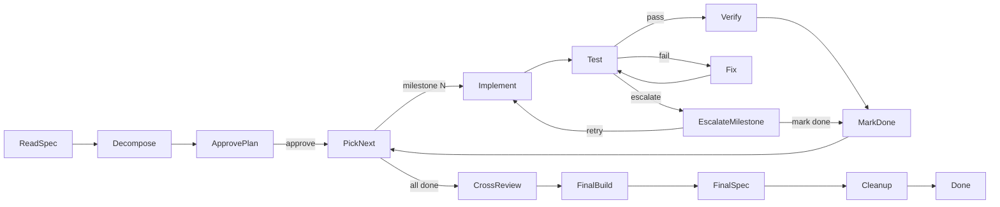
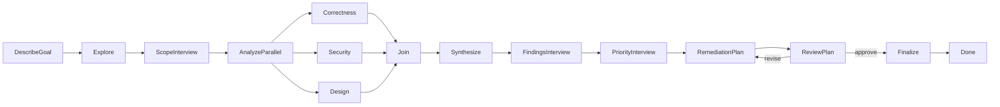
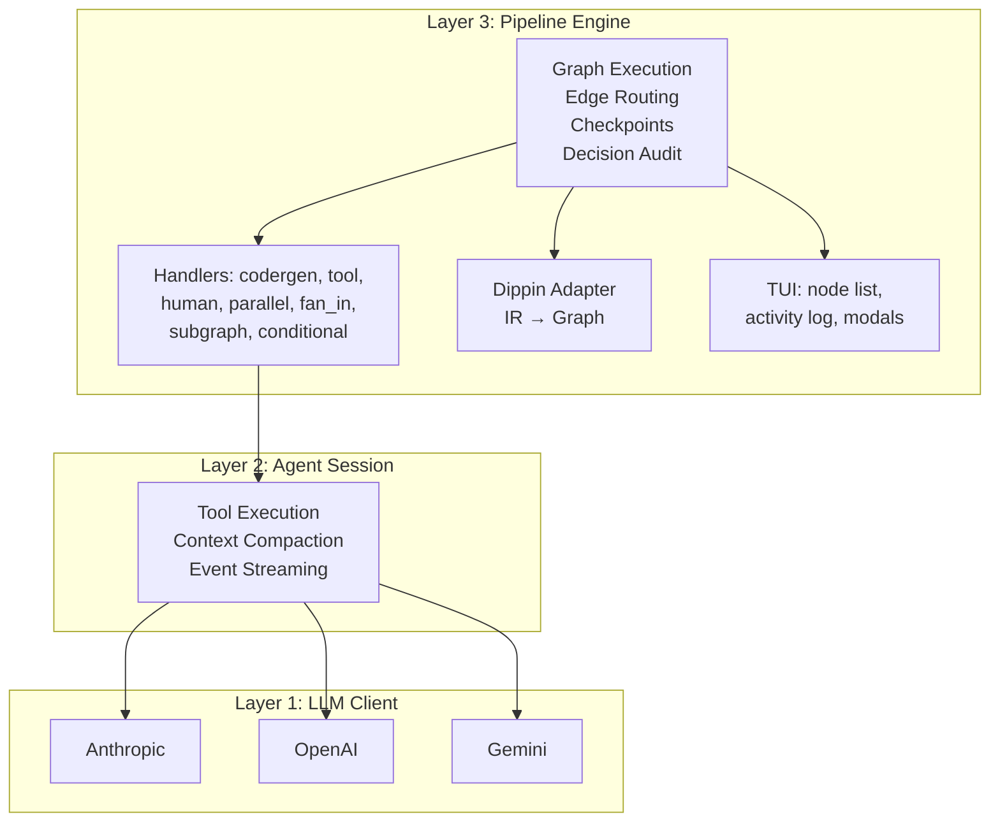

# Tracker

Pipeline orchestration engine for multi-agent LLM workflows. Define pipelines in `.dip` files (Dippin language), execute them with parallel agents, and watch progress in a TUI dashboard.

Built by [2389.ai](https://2389.ai).

## Quick Start

```bash
# Install
go install github.com/2389-research/tracker/cmd/tracker@latest

# See what's built in
tracker workflows

# Run a built-in pipeline by name — no file needed
tracker build_product

# Or copy it locally to customize
tracker init build_product
tracker build_product.dip

# Run fully autonomous with an LLM judge
tracker --autopilot mid build_product

# Use Claude Code backend for file editing + terminal (coming v0.12.0)
tracker --backend claude-code build_product

# Check your setup (API keys, dippin binary, working directory)
tracker doctor

# Configure LLM providers interactively
tracker setup

# Validate a pipeline without running it
tracker validate build_product

# Resume a stopped run
tracker -r <run-id> build_product.dip

# When something goes wrong
tracker diagnose
```

## Pipeline Examples

Four pipelines are embedded in the binary and available via `tracker workflows`:

### `ask_and_execute`
Competitive implementation: ask the user what to build, fan out to 3 agents (Claude/Codex/Gemini) in isolated git worktrees, cross-critique the implementations, select the best one, apply it, clean up the rest.

### `build_product`
Sequential milestone builder: read a SPEC.md, decompose into milestones, implement each with verification loops (opus-powered fix agent with 50 turns), cross-review the complete result, verify full spec compliance. Context-specific escalation gates let you override flaky tests or skip milestones without aborting the build.



### `build_product_with_superspec`
Parallel stream execution for large structured specs: reads the spec's work streams and dependency graph, executes independent streams in parallel (with git worktree isolation), enforces quality gates between phases, cross-reviews with 3 specialized reviewers (architect/QA/product), and audits traceability.

### `deep_review`
Interview-driven codebase review: describe what you want reviewed, answer structured interview questions to scope the analysis, then three parallel agents analyze correctness, security, and design. A second interview presents findings for your context (is this intentional? known issue?), a third prioritizes remediation, and the pipeline produces an actionable remediation plan.



## Built-in Workflows

Pipelines are embedded in the binary so `brew` and `go install` users can run them without cloning the repo:

```bash
tracker workflows              # List all built-in workflows
tracker build_product          # Run directly by name
tracker validate build_product # Validate works too
tracker simulate build_product # Simulate too
tracker init build_product     # Copy to ./build_product.dip for editing
```

Local `.dip` files always take precedence over built-ins. After `tracker init build_product`, running `tracker build_product` uses your local copy.

## Dippin Language

Pipelines are defined in `.dip` files using the [Dippin language](https://github.com/2389-research/dippin-lang):

```dip
workflow MyPipeline
  goal: "Build something great"
  start: Begin
  exit: Done

  defaults
    model: claude-sonnet-4-6
    provider: anthropic

  agent Begin
    label: Start

  human AskUser
    label: "What should we build?"
    mode: freeform

  agent Implement
    label: "Build It"
    prompt: |
      The user wants: ${ctx.human_response}
      Implement it following the project's conventions.

  agent Done
    label: Done

  edges
    Begin -> AskUser
    AskUser -> Implement
    Implement -> Done
```

### Node Types

| Type | Shape | Description |
|------|-------|-------------|
| `agent` | box | LLM agent session (codergen) |
| `human` | hexagon | Human-in-the-loop gate (choice, freeform, or hybrid) |
| `tool` | parallelogram | Shell command execution |
| `parallel` | component | Fan-out to concurrent branches |
| `fan_in` | tripleoctagon | Join parallel branches |
| `subgraph` | tab | Execute a referenced sub-pipeline |
| `manager_loop` | house | Managed iteration loop |
| `conditional` | diamond | Condition-based routing |

### Variable Interpolation

Three namespaces for `${...}` syntax in prompts:

- `${ctx.outcome}` — runtime pipeline context (outcome, last_response, human_response, tool_stdout)
- `${params.model}` — subgraph parameters passed from parent
- `${graph.goal}` — workflow-level attributes

Variables are expanded in a single pass — resolved values are never re-scanned, preventing recursive expansion.

**Important**: Each agent node runs a fresh LLM session. Data flows between nodes via context keys, not conversation history. Per-node scoping (`${ctx.node.<nodeID>.<key>}`) is an unreleased feature currently on `main`; it lets you reference a specific earlier node's output without relying on the last-writer-wins `last_response` key. See **[Pipeline Context Flow](docs/pipeline-context-flow.md)** for the full model, fidelity levels, and parallel-branch patterns.

### Edge Conditions

```dip
edges
  Check -> Pass  when ctx.outcome = success
  Check -> Fail  when ctx.outcome = fail
  Check -> Retry when ctx.outcome = retry
  Gate -> Next   when ctx.tool_stdout contains all-done
  Gate -> Loop   when ctx.tool_stdout not contains all-done
```

Supported operators: `=`, `!=`, `contains`, `not contains`, `startswith`, `not startswith`, `endswith`, `not endswith`, `in`, `not in`, `&&`, `||`, `not`.

Conditions support the `ctx.` namespace prefix (dippin convention) and `internal.*` references for engine-managed state.

### Per-Node Working Directory

For git worktree isolation in parallel implementations:

```dip
agent ImplementClaude
  working_dir: .ai/worktrees/claude
  model: claude-sonnet-4-6
  prompt: Implement the spec in this isolated worktree.
```

The `working_dir` attribute is validated against path traversal and shell metacharacters.

### Human Gates

Four gate modes:

- **Choice mode** (default): presents outgoing edge labels as a radio list. Arrow keys navigate, Enter selects.
- **Freeform mode** (`mode: freeform`): captures text input. If the response matches an edge label (case-insensitive), it routes to that edge. Otherwise it's stored as `ctx.human_response`.
- **Hybrid mode** (automatic): when a freeform gate has labeled outgoing edges, the TUI presents a radio list of labels plus an "other" option for custom feedback. Selecting a label submits it directly; selecting "other" opens a textarea for specific instructions.
- **Interview mode** (`mode: interview`): structured multi-field form driven by upstream agent output. An agent generates markdown questions with inline options; the handler parses them into individual form fields and presents a fullscreen interview form. Answers are stored as JSON and markdown summary.

Long prompts with labels (e.g., escalation gates with agent output) automatically use a fullscreen **review hybrid view**: glamour-rendered scrollable viewport on top (PgUp/PgDn to scroll), radio label selection in the middle, and an "other" freeform option at the bottom for custom retry instructions. Long prompts without labels use a **split-pane review**: scrollable viewport on top, textarea on bottom.

```dip
human ApproveSpec
  label: "Review the spec. Approve, refine, or reject."
  mode: freeform

edges
  ApproveSpec -> Build  label: "approve"
  ApproveSpec -> Revise label: "refine"  restart: true
  ApproveSpec -> Done   label: "reject"
```

#### Interview Mode

Interview gates let an agent generate structured questions that the user answers via a form:

```dip
human ScopeInterview
  label: "Help us focus the review."
  mode: interview
  questions_key: interview_questions
  answers_key: scope_answers
```

The upstream agent writes markdown questions to the `questions_key` context variable. The parser extracts:
- **Numbered/bulleted questions** ending in `?` or imperative prompts ("Describe...", "List...")
- **Inline options** from trailing parentheticals: `Auth model? (API key, OAuth, JWT)` becomes a select field
- **Yes/no patterns** detected automatically as confirm toggles

The TUI presents a fullscreen form with per-field navigation (arrow keys), pagination (PgUp/PgDn for 10+ questions), elaboration textareas (Tab), and pre-fill from previous answers on retry. Answers are stored as JSON at `answers_key` and as a markdown summary at `human_response`. If zero questions are parsed, the gate falls back to freeform. Cancellation returns `outcome=fail`.

A reusable interview loop pattern is available in `examples/subgraphs/interview-loop.dip` — embed it via `subgraph` nodes with `topic` and `focus` parameters.

Submit with **Ctrl+S**. Enter inserts newlines. Esc cancels (empty) or submits (with content). Ctrl+C cancels and unblocks the pipeline (no deadlock).

### Providers

Tracker supports four LLM providers: `anthropic`, `openai`, `gemini`, and `openai-compat` (for any OpenAI-compatible API). Set up with:

```bash
# Interactive setup wizard
tracker setup

# Verify your configuration
tracker doctor
```

Keys are stored in `~/.config/2389/tracker/.env`. You can also export them directly:

```bash
export ANTHROPIC_API_KEY=sk-ant-...
export OPENAI_API_KEY=sk-...
export GEMINI_API_KEY=...
```

**Important**: Use `gemini` (not `google`) as the provider name in `.dip` files.

Non-retryable provider errors (quota exceeded, auth failure, model not found) immediately fail the pipeline with a clear message instead of silently retrying.

### Cloudflare AI Gateway

Tracker can route every provider through [Cloudflare AI Gateway](https://developers.cloudflare.com/ai-gateway/) so you stop hitting rate limits (Anthropic, OpenAI, etc. cap per-account request rates; Cloudflare's gateway capacity is much higher), gain central analytics and caching, and enable model routing on the gateway side.

Set one env var or flag instead of four:

```bash
# The root URL of your Cloudflare AI Gateway:
#   https://gateway.ai.cloudflare.com/v1/<account_id>/<gateway_slug>
export TRACKER_GATEWAY_URL="https://gateway.ai.cloudflare.com/v1/acc/gw"

# API keys still go to the provider — Cloudflare just proxies.
export ANTHROPIC_API_KEY=sk-ant-...
export OPENAI_API_KEY=sk-...
export GEMINI_API_KEY=...

tracker build_product
```

Or as a CLI flag:

```bash
tracker --gateway-url https://gateway.ai.cloudflare.com/v1/acc/gw build_product
```

Tracker automatically appends the per-provider suffix:

| Provider | Resolved URL |
|---|---|
| `anthropic` | `<gateway>/anthropic` |
| `openai` | `<gateway>/openai` |
| `gemini` | `<gateway>/google-ai-studio` |
| `openai-compat` | `<gateway>/compat` |

**Per-provider overrides still win.** If you set `ANTHROPIC_BASE_URL` directly, Anthropic traffic goes there, and the gateway only proxies the providers you haven't explicitly overridden. This means you can point Anthropic at a self-hosted proxy while keeping OpenAI on Cloudflare with one command.

**Troubleshooting:**
- `429` from Cloudflare: something bigger is wrong (account-level limits, bad gateway slug). 429s from direct provider calls are what the gateway is meant to prevent.
- `401`: check your provider API key, not the gateway — Cloudflare passes auth through.
- Empty responses: verify the gateway slug is correct and the provider is enabled in the Cloudflare dashboard.

## Architecture



## TUI

The terminal UI shows:

- **Pipeline panel**: node list in topological execution order (Kahn's algorithm) with status lamps, thinking spinners, and tool execution indicators
- **Activity log**: per-node streaming with line-level formatting (headers, code blocks, bullets), node change separators, multi-node activity indicators for parallel execution, and inline `FAILED:`/`RETRYING:` messages when nodes fail or retry
- **Subgraph nodes**: dynamically inserted and indented under their parent

### Status Icons

| Icon | Meaning |
|------|---------|
| ○ | Pending — not yet reached |
| 🟡 (spinner) | Running — LLM thinking |
| ⚡ | Running — tool executing |
| ● (green) | Completed successfully |
| ✗ (red) | Failed |
| ↻ (amber) | Retrying |
| ⊘ (dim) | Skipped — pipeline took a different path |

### Keyboard

| Key | Action |
|-----|--------|
| Ctrl+O | Toggle expand/collapse tool output |
| Ctrl+S | Submit human gate input |
| Esc | Cancel (empty) or submit (with content) |
| PgUp/PgDn | Scroll review viewport (plan approval) |
| q | Quit |

## Decision Audit Trail

Every run produces an `activity.jsonl` log in `.tracker/runs/<id>/` that captures:

- **Pipeline events**: node start/complete/fail, checkpoint saves
- **Agent events**: LLM turns, tool calls, text output
- **Decision events**: edge selection (with priority level and context snapshot), condition evaluations (with match results), node outcomes (with token counts), restart detections

Reconstruct any routing decision after the fact:

```bash
# See all edge decisions
grep 'decision_edge' .tracker/runs/<id>/activity.jsonl | python3 -m json.tool

# See condition evaluations
grep 'decision_condition' .tracker/runs/<id>/activity.jsonl | python3 -m json.tool

# See node outcomes with token counts
grep 'decision_outcome' .tracker/runs/<id>/activity.jsonl | python3 -m json.tool
```

## Git Integration

When `WithGitArtifacts(true)` is enabled (library) or `--git-artifacts` is set (CLI — see roadmap), the artifact run directory becomes a git repository. Each terminal node outcome creates a commit:

```text
node(start): start outcome=success
node(middle): codergen outcome=success
node(end): exit outcome=success
```

Checkpoint tags (`checkpoint/<runID>/<nodeID>`) mark each save point.

### Exporting a run as a portable bundle

`ExportBundle` packages the entire git history — commits and tags — into a single file you can copy anywhere:

```go
// Library usage
result, _ := engine.Run(ctx)
if err := tracker.ExportBundle(result.ArtifactRunDir, "/tmp/run.bundle"); err != nil {
    log.Printf("bundle export failed: %v", err)
}
```

```bash
# CLI usage: export bundle after the pipeline completes
tracker --export-bundle /tmp/run.bundle examples/ask_and_execute.dip

# Restore and inspect on any machine with git
git clone /tmp/run.bundle /tmp/run
cd /tmp/run && git log --oneline
```

The bundle is self-contained — no network access needed. Clone it on another machine, inspect the exact sequence of node outcomes, and replay from any checkpoint tag.

## Troubleshooting

When a pipeline run doesn't go as expected, tracker gives you tools to understand what happened:

### `tracker diagnose`

Analyzes a run's failures and surfaces the information you need — tool stdout/stderr, error messages, timing anomalies — without manually grepping through JSONL files.

```bash
# Diagnose the most recent run
tracker diagnose

# Diagnose a specific run (prefix matching works)
tracker diagnose 7813b
```

The output shows each failed node with its output, stderr, errors, and actionable suggestions. For example, it will tell you if a tool node failed because of a stale counter file, or if a node completed suspiciously fast (suggesting a configuration issue).

### `tracker audit`

For a broader view of a run's timeline, retries, and recommendations:

```bash
# List all runs
tracker list

# Full audit report for a specific run
tracker audit <run-id>
```

### Common issues

| Symptom | Cause | Fix |
|---------|-------|-----|
| "no LLM providers configured" | Missing API keys | `tracker setup` or export env vars |
| TestMilestone instantly escalates | Stale `fix_attempts` counter | `rm .ai/milestones/fix_attempts` |
| Node fails with no visible error | Tool stderr not surfaced | `tracker diagnose` shows full output |
| Human gate shows raw markdown | Old version before glamour fix | Update to v0.9.2+ |
| Pipeline loops forever | Unconditional fallback to loop target | Ensure fallbacks go to an exit node (Done, escalation gate), not back into the loop |
| Tool retries same error 5 times | Deterministic command bug | `tracker diagnose` flags identical retries — fix the command in the .dip file |
| Every milestone needs fixing | known_failures has comments or bad format | Ensure bare test names only, no comments — v0.11.2 strips them automatically |
| Build loop skips all milestones | Milestone headers don't match expected format | Use `## Milestone N: Title` format — v0.11.2 is flexible + fails loudly |

## Cost Governance

Tracker exposes per-provider token and dollar cost from every run, and can halt
pipelines that exceed configured ceilings.

**Library consumers** read cost via `Result.Cost`:

```go
result, _ := tracker.Run(ctx, source, tracker.Config{
    Budget: pipeline.BudgetLimits{
        MaxTotalTokens: 100_000,
        MaxCostCents:   500,           // $5.00
        MaxWallTime:    30 * time.Minute,
    },
})
if result.Status == pipeline.OutcomeBudgetExceeded {
    log.Printf("halt: %s, spent $%.4f", result.Cost.LimitsHit, result.Cost.TotalUSD)
}
for provider, pc := range result.Cost.ByProvider {
    log.Printf("%s: %d tokens, $%.4f", provider, pc.Usage.InputTokens+pc.Usage.OutputTokens, pc.USD)
}
```

**CLI users** pass flags directly to `tracker`:

```bash
tracker --max-tokens 100000 --max-cost 500 --max-wall-time 30m \
    examples/ask_and_execute.dip
```

A halted run prints a `HALTED: budget exceeded` section naming the dimension
that tripped. Run `tracker diagnose` to see the per-provider breakdown and
remediation guidance.

**Streaming consumers** subscribe to `EventCostUpdated` via
`tracker.Config.EventHandler`. Each terminal-node outcome emits a
`CostSnapshot` with aggregate tokens, dollar cost, per-provider totals,
and wall-clock elapsed time.

Reading budget limits directly from `.dip` workflow attrs is a follow-up
tracked in #67.

## Headless Execution (Webhook Gate)

`--webhook-url` enables fully headless operation: instead of pausing the pipeline to wait for a human at a terminal, tracker POSTs every human gate as JSON to your URL and waits for a callback.

This is the integration point for Slack bots, email approval flows, mobile push notifications, factory workers, or any custom approval system.

### Flow

1. A human gate fires → tracker POSTs a `WebhookGatePayload` to `--webhook-url`.
2. Your service receives the payload, routes it to a human (Slack message, email, etc.).
3. The human responds → your service POSTs a `WebhookGateResponse` to the `callback_url` field.
4. Tracker resumes the pipeline with the human's answer.

### CLI

```bash
tracker --webhook-url https://factory.example.com/api/gate \
        --gate-timeout 30m \
        --gate-timeout-action fail \
        --webhook-auth "Bearer sk_live_..." \
        examples/build_product.dip
```

### Flags

| Flag | Default | Description |
|------|---------|-------------|
| `--webhook-url` | _(required to enable)_ | URL to POST gate payloads to |
| `--gate-callback-addr` | `:8789` | Local addr for the inbound callback server |
| `--gate-timeout` | `10m` | How long to wait for a reply per gate |
| `--gate-timeout-action` | `fail` | What to do on timeout: `fail` or `success` |
| `--webhook-auth` | _(empty)_ | `Authorization` header on outbound POSTs |

`--webhook-url` is mutually exclusive with `--autopilot` and `--auto-approve`.

### Payload format

Tracker POSTs JSON with this shape:

```json
{
  "gate_id": "uuid",
  "run_id": "optional-run-id",
  "node_id": "ApproveSpec",
  "prompt": "Review the spec. Approve, refine, or reject.",
  "choices": [{"label": "approve", "value": "approve"}, ...],
  "callback_url": "http://localhost:8789/gate/<gate_id>",
  "timeout_seconds": 1800,
  "gate_token": "per-gate-secret"
}
```

Your service POSTs back to `callback_url` with:

```json
{
  "choice": "approve",
  "freeform": "optional free-text response",
  "reasoning": "optional explanation"
}
```

Include the `gate_token` value in the `X-Tracker-Gate-Token` header — the callback server rejects requests with missing or wrong tokens (HTTP 401).

### Library API

Library consumers set `tracker.Config.WebhookGate` instead of using CLI flags:

```go
result, _ := tracker.Run(ctx, source, tracker.Config{
    WebhookGate: &tracker.WebhookGateConfig{
        WebhookURL:    "https://factory.example.com/api/gate",
        CallbackAddr:  ":8789",
        Timeout:       30 * time.Minute,
        TimeoutAction: "fail",
        AuthHeader:    "Bearer sk_live_...",
    },
})
```

## CLI Reference

```
tracker [flags] <pipeline>       Run a pipeline (file path or built-in name)
tracker workflows                List built-in workflows
tracker init <workflow>          Copy a built-in to current directory
tracker setup                    Interactive provider configuration
tracker validate <pipeline>      Check pipeline structure
tracker simulate <pipeline>      Dry-run execution plan
tracker doctor                   Preflight health check
tracker diagnose [runID]         Analyze failures in a run
tracker audit <runID>            Full audit report for a run
tracker list                     List recent pipeline runs
tracker version                  Show version information
```

**Flags:**
- `-w, --workdir` — working directory (default: current)
- `-r, --resume` — resume a previous run by ID
- `--format` — pipeline format override: `dip` (default) or `dot` (deprecated)
- `--json` — stream events as NDJSON to stdout
- `--no-tui` — disable TUI dashboard, use plain console
- `--verbose` — show raw provider stream events
- `--backend` — agent backend: `native` (default) or `claude-code` (coming v0.12.0)
- `--webhook-url` — POST human gate prompts to this URL and wait for callback (headless)
- `--gate-callback-addr` — local addr for the webhook callback server (default: `:8789`)
- `--gate-timeout` — per-gate wait timeout when `--webhook-url` is set (default: `10m`)
- `--gate-timeout-action` — what to do on gate timeout: `fail` (default) or `success`
- `--webhook-auth` — `Authorization` header for outbound webhook requests

## Development

```bash
# Run tests
go test ./... -short

# Validate all example pipelines
for f in examples/*.dip; do tracker validate "$f"; done

# Run dippin simulation tests
for f in examples/*.dip; do dippin test "$f"; done

# Check with dippin-lang tools
dippin doctor examples/build_product.dip
dippin simulate -all-paths examples/build_product.dip
```

## License

See [LICENSE](LICENSE).
