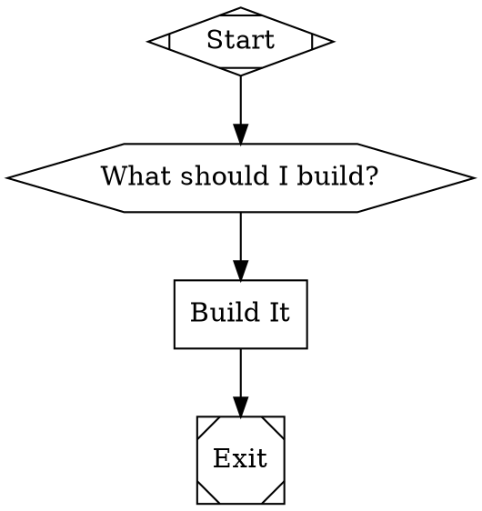

# Tracker

An agentic pipeline engine that executes multi-step AI workflows defined as Graphviz DOT graphs.

Define your pipeline as nodes and edges. Tracker parses the graph, wires up LLM providers, dispatches tools, and runs the whole thing — with a TUI dashboard, checkpoints, and human-in-the-loop gates.

```
Graphs in. Intelligence out.
```

## Quick Start

```bash
# Install
go install github.com/2389-research/tracker/cmd/tracker@latest

# Configure API keys
tracker setup

# Run a pipeline
tracker examples/ask_and_execute.dot
```

## What It Does

Tracker has three layers:

| Layer | Package | Purpose |
|-------|---------|---------|
| LLM SDK | `llm/` | Multi-provider streaming client (Anthropic, OpenAI, Gemini) |
| Agent | `agent/` | Agentic loop — LLM call, tool execution, repeat |
| Pipeline | `pipeline/` | DOT graph parser and execution engine |

A pipeline is a directed graph where each node shape maps to a handler:

| Shape | Handler | What it does |
|-------|---------|-------------|
| `box` | codergen | LLM call with tool access |
| `hexagon` | wait.human | Human gate (freeform or choice) |
| `diamond` | conditional | Branch on outcome |
| `parallelogram` | tool | Run a bash command |
| `component` | parallel | Fan out to parallel nodes |
| `tripleoctagon` | parallel.fan_in | Join parallel branches |
| `house` | stack.manager_loop | Manager loop with retries |
| `tab` | subgraph | Embed a sub-pipeline |

## Example Pipeline



```bash
tracker my_pipeline.dot
```

## Configuration

### `tracker setup`

Interactive wizard for configuring provider API keys and base URLs. Stores credentials in `~/.config/tracker/.env` (respects `$XDG_CONFIG_HOME`).

### Environment Variables

| Variable | Provider | Required |
|----------|----------|----------|
| `ANTHROPIC_API_KEY` | Anthropic | At least one key required |
| `OPENAI_API_KEY` | OpenAI | |
| `GEMINI_API_KEY` | Gemini | |
| `GOOGLE_API_KEY` | Gemini (legacy) | |
| `ANTHROPIC_BASE_URL` | Anthropic proxy | Optional |
| `OPENAI_BASE_URL` | OpenAI proxy | Optional |
| `GEMINI_BASE_URL` | Gemini proxy | Optional |

Env loading priority (highest wins):
1. Shell environment
2. Project-local `.env`
3. XDG config `~/.config/tracker/.env`

### Default Provider

When a pipeline node doesn't specify `llm_provider`, Tracker picks the first available in this order: Anthropic, OpenAI, Gemini.

## CLI Reference

```
tracker [flags] <pipeline.dot> [flags]
tracker setup
```

| Flag | Description |
|------|-------------|
| `-w, --workdir` | Working directory (default: current directory) |
| `-c, --checkpoint` | Resume from a checkpoint file |
| `--no-tui` | Plain console output instead of dashboard |
| `--verbose` | Show raw LLM stream events |

## TUI Dashboard

The default mode runs a full-screen terminal dashboard with:

- Header gauge cluster — pipeline name, elapsed time, status, token usage
- Node signal panel — live status of each pipeline node
- Agent activity log — streaming LLM traces and tool calls
- Modal gates — human input prompts overlay the dashboard

Use `--no-tui` for plain text output (CI, pipes, logging).

## Pipeline Features

**Control flow** — Conditional edges route on `outcome=success` or `outcome=fail`.

**Human gates** — Hexagon nodes pause execution for user input. Support freeform text and multiple-choice modes.

**Parallel execution** — Component nodes fan out to children; tripleoctagon nodes join results.

**Retries** — `default_max_retry=N` on the graph, `retry_target="NodeID"` on edges.

**Checkpoints** — Runs auto-save to `.tracker/runs/<runID>/`. Resume with `-c checkpoint.json`.

**Subgraphs** — Tab-shaped nodes embed sub-pipelines for compositional workflows.

**Node attributes:**

| Attribute | Purpose |
|-----------|---------|
| `llm_provider` | Provider name |
| `llm_model` | Model ID |
| `prompt` | System prompt |
| `reasoning_effort` | `high` or `low` |
| `fidelity` | `summary:high`, `summary:medium` |
| `tool_command` | Bash command for tool nodes |
| `mode` | `freeform` for human gates |
| `goal_gate` | Boolean — synthesize a decision |

## Agent Tools

Each codergen node runs an agent session with these built-in tools:

| Tool | Description |
|------|-------------|
| `read` | Read file contents |
| `write` | Write/create files |
| `edit` | Edit file ranges |
| `glob` | Glob pattern matching |
| `grep` | Regex search across files |
| `bash` | Execute shell commands |
| `apply_patch` | Apply unified diffs |
| `spawn_agent` | Create child agent sessions |

## Examples

The `examples/` directory has ready-to-run pipelines:

| Pipeline | Description |
|----------|-------------|
| `ask_and_execute.dot` | Ask user, multi-model parallel implementation, cross-review |
| `megaplan.dot` | Sprint planning with orientation, drafting, critique, merge |
| `consensus_task.dot` | Three-model consensus pipeline |
| `vulnerability_analyzer.dot` | Security analysis pipeline |
| `human_gate_showcase.dot` | Human gate interaction demo |

## Building

```bash
git clone https://github.com/2389-research/tracker.git
cd tracker
go build ./cmd/tracker
go test ./...
```

Requires Go 1.25+.

---

Built by [2389.ai](https://2389.ai)
