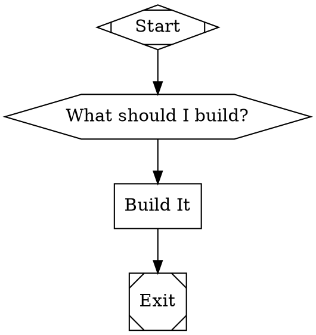

# Tracker

An agentic pipeline engine that executes multi-step AI workflows defined as `.dip` workflows or Graphviz DOT graphs.


Define your pipeline as nodes and edges. Tracker parses the graph, wires up LLM providers, dispatches tools, and runs the whole thing — with a TUI dashboard, checkpoints, and human-in-the-loop gates.

```
Graphs in. Intelligence out.
```

## Quick Start

```bash
# Install
go install github.com/2389-research/tracker/cmd/tracker@latest

# Configure API keys
tracker setup

# Run a pipeline (.dip or .dot)
tracker examples/ask_and_execute.dip
tracker examples/ask_and_execute.dot
```

Tracker auto-detects the format from the file extension. The `.dip` format is the preferred way to write pipelines — it's more readable, has explicit node types, and supports multiline prompts natively. DOT format is deprecated but still supported for backward compatibility.

## What It Does

Tracker has three layers:

| Layer | Package | Purpose |
|-------|---------|---------|
| LLM SDK | `llm/` | Multi-provider streaming client (Anthropic, OpenAI, Gemini) |
| Agent | `agent/` | Agentic loop — LLM call, tool execution, repeat |
| Pipeline | `pipeline/` | Graph parser (.dip and DOT) and execution engine |

A pipeline is a directed graph where each node type maps to a handler:

| .dip type | DOT shape | Handler | What it does |
|-----------|-----------|---------|-------------|
| `agent` | `box` | codergen | LLM call with tool access |
| `human` | `hexagon` | wait.human | Human gate (freeform or choice) |
| — | `diamond` | conditional | Branch on outcome |
| `tool` | `parallelogram` | tool | Run a bash command |
| `parallel` | `component` | parallel | Fan out to parallel nodes |
| `fan_in` | `tripleoctagon` | parallel.fan_in | Join parallel branches |
| — | `house` | stack.manager_loop | Manager loop with retries |
| `subgraph` | `tab` | subgraph | Embed a sub-pipeline |

## Example Pipeline

### .dip format (recommended)

```
workflow MyPipeline
  goal: "Ask the user what to build, then build it."
  start: Start
  exit: Exit

  agent Start
    label: Start

  agent Exit
    label: Exit

  human AskUser
    label: "What should I build?"
    mode: freeform

  agent Implement
    label: "Build It"
    provider: anthropic
    model: claude-sonnet-4-6
    prompt: Implement exactly what the user asked for.

  edges
    Start -> AskUser
    AskUser -> Implement
    Implement -> Exit
```

```bash
tracker my_pipeline.dip
```

### DOT format (deprecated)



```bash
tracker my_pipeline.dot
```

## Configuration

### `tracker setup`

Interactive wizard for configuring provider API keys and base URLs. Stores credentials in `~/.config/tracker/.env` (respects `$XDG_CONFIG_HOME`).

### Environment Variables

| Variable | Provider | Required |
|----------|----------|----------|
| `ANTHROPIC_API_KEY` | Anthropic | At least one key required |
| `OPENAI_API_KEY` | OpenAI | |
| `GEMINI_API_KEY` | Gemini | |
| `GOOGLE_API_KEY` | Gemini (legacy) | |
| `ANTHROPIC_BASE_URL` | Anthropic proxy | Optional |
| `OPENAI_BASE_URL` | OpenAI proxy | Optional |
| `GEMINI_BASE_URL` | Gemini proxy | Optional |

Env loading priority (highest wins):
1. Shell environment
2. Project-local `.env`
3. XDG config `~/.config/tracker/.env`

### Default Provider

When a pipeline node doesn't specify `llm_provider`, Tracker picks the first available in this order: Anthropic, OpenAI, Gemini.

## Pipeline Formats

Tracker supports two pipeline definition formats:

| Format | Extension | Status |
|--------|-----------|--------|
| **Dippin** | `.dip` | **Preferred** — readable syntax, explicit node types, multiline prompts |
| **DOT** | `.dot` | **Deprecated** — still supported for backward compatibility |

Both formats produce identical internal graph representations. Format is auto-detected from the file extension. New pipelines should use `.dip`.

### .dip Syntax Reference

```
workflow <Name>
  goal: "<description>"
  start: <StartNodeID>
  exit: <ExitNodeID>

  defaults                          # optional workflow-level defaults
    model: claude-sonnet-4-6
    provider: anthropic
    max_retries: 3
    fidelity: summary:medium

  agent <ID>                        # LLM agent node
    label: "Display Name"
    model: claude-opus-4-6
    provider: anthropic
    prompt:
      Multiline prompts are
      indented naturally.
    reasoning_effort: high
    goal_gate: true

  human <ID>                        # human gate node
    label: "Question for user"
    mode: freeform                  # freeform | choice | binary

  tool <ID>                         # shell command node
    label: "Run Tests"
    command:
      set -eu
      go test ./...

  parallel <ID> -> A, B, C         # fan-out to parallel nodes
  fan_in <ID> <- A, B, C           # join parallel branches

  subgraph <ID>                     # embed sub-pipeline
    ref: other_workflow.dip

  edges
    A -> B
    B -> C  when ctx.outcome = success  label: pass
    B -> D  when ctx.outcome = fail     label: retry
```

### .dip Node Attributes

| Attribute | Node types | Purpose |
|-----------|------------|---------|
| `label` | all | Display name |
| `model` | agent | LLM model ID |
| `provider` | agent | `anthropic`, `openai`, `gemini` |
| `prompt` | agent | Main prompt (supports multiline) |
| `system_prompt` | agent | System prompt |
| `reasoning_effort` | agent | `high`, `medium`, `low` |
| `fidelity` | agent | `strict`, `summary:high`, `summary:medium`, `truncate` |
| `max_turns` | agent | Max agent loop iterations |
| `goal_gate` | agent | Boolean — require success for pipeline completion |
| `cache_tools` | agent | Cache tool definitions |
| `compaction` | agent | `aggressive`, `conservative` |
| `mode` | human | `freeform`, `choice`, `binary` |
| `command` | tool | Shell command (supports multiline) |
| `timeout` | tool | Command timeout |
| `ref` | subgraph | Path to sub-pipeline file |

### .dip Edge Syntax

```
edges
  A -> B                                    # unconditional
  A -> B  label: pass                       # labeled edge
  A -> B  when ctx.outcome = success        # conditional
  A -> B  when ctx.outcome = fail  label: retry  # conditional + labeled
```

## CLI Reference

```
tracker [flags] <pipeline.dip|.dot> [flags]
tracker setup
```

| Flag | Description |
|------|-------------|
| `-w, --workdir` | Working directory (default: current directory) |
| `-c, --checkpoint` | Resume from a checkpoint file |
| `--no-tui` | Plain console output instead of dashboard |
| `--verbose` | Show raw LLM stream events |

## TUI Dashboard

The default mode runs a full-screen terminal dashboard with:

- Header gauge cluster — pipeline name, elapsed time, status, token usage
- Node signal panel — live status of each pipeline node
- Agent activity log — streaming LLM traces and tool calls
- Modal gates — human input prompts overlay the dashboard

Use `--no-tui` for plain text output (CI, pipes, logging).

## Pipeline Features

**Control flow** — Conditional edges route on `outcome=success` or `outcome=fail`.

**Human gates** — Hexagon nodes pause execution for user input. Support freeform text and multiple-choice modes.

**Parallel execution** — Component nodes fan out to children; tripleoctagon nodes join results.

**Retries** — `max_retries` on defaults or nodes, `retry_target` on edges.

**Checkpoints** — Runs auto-save to `.tracker/runs/<runID>/`. Resume with `-c checkpoint.json`.

**Subgraphs** — `subgraph` nodes embed sub-pipelines for compositional workflows.

## Agent Tools

Each codergen node runs an agent session with these built-in tools:

| Tool | Description |
|------|-------------|
| `read` | Read file contents |
| `write` | Write/create files |
| `edit` | Edit file ranges |
| `glob` | Glob pattern matching |
| `grep` | Regex search across files |
| `bash` | Execute shell commands |
| `apply_patch` | Apply unified diffs |
| `spawn_agent` | Create child agent sessions |

## Examples

The `examples/` directory has ready-to-run pipelines (each available as both `.dip` and `.dot`):

| Pipeline | Description |
|----------|-------------|
| `ask_and_execute.dip` | Ask user, multi-model parallel implementation, cross-review |
| `megaplan.dip` | Sprint planning with orientation, drafting, critique, merge |
| `consensus_task.dip` | Three-model consensus pipeline |
| `vulnerability_analyzer.dip` | Security analysis pipeline |
| `human_gate_showcase.dip` | Human gate interaction demo |
| `semport.dip` | Semantic port analysis |
| `sprint_exec.dip` | Sprint execution workflow |

## Building

```bash
git clone https://github.com/2389-research/tracker.git
cd tracker
go build ./cmd/tracker
go test ./...
```

Requires Go 1.25+.

---

Built by [2389.ai](https://2389.ai)
