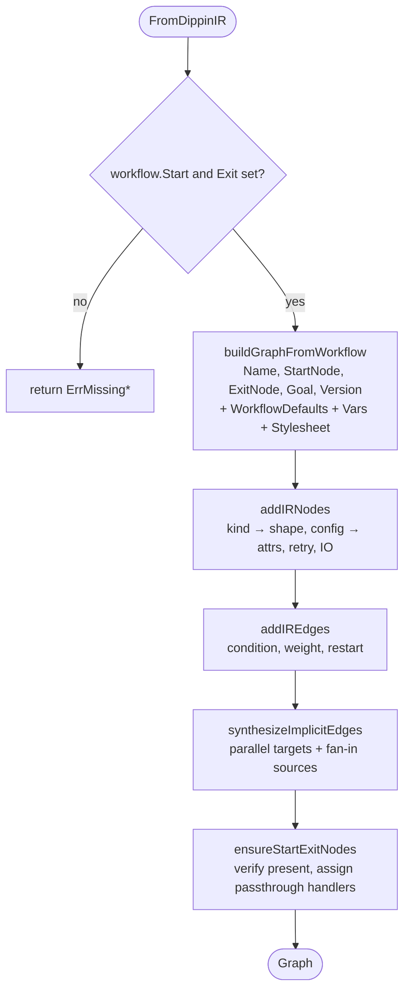
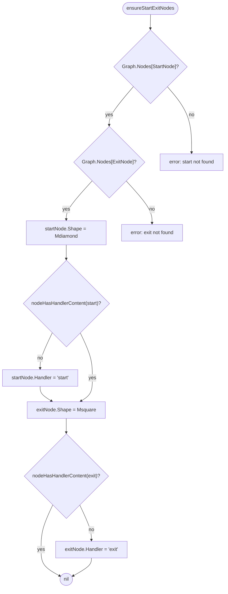

# Dippin Adapter (`pipeline/dippin_adapter.go`)

The adapter is the bridge between the `.dip` source language and tracker's runtime. Dippin-lang parses `.dip` files into a typed `ir.Workflow` — a tree of nodes with kind-specific config structs, retry policies, edges with parsed conditions, and workflow-level defaults. The adapter converts that IR into tracker's `pipeline.Graph` — a flat map of nodes with string-attribute bags and a slice of edges.

Every naming and shape mismatch between dippin conventions and tracker conventions lives in this one file (plus [`dippin_adapter_edges.go`](../../pipeline/dippin_adapter_edges.go) for the implicit-edge synthesis). When dippin-lang adds a new IR field, the adapter needs updating — nowhere else.

## Purpose

- **Convert kinds to shapes** so the existing DOT-aware handler registry keeps working unchanged (handlers switch on `Shape`, not `Kind`).
- **Flatten typed config** into the `map[string]string` attr bag handlers expect.
- **Rename fields** to tracker conventions (`model` → `llm_model`, `provider` → `llm_provider`, etc.).
- **Synthesize implicit edges** that dippin stores as `ParallelConfig.Targets` / `FanInConfig.Sources` rather than as explicit `edge` declarations.
- **Apply defaults** from `WorkflowDefaults` as graph-level attrs; nodes inherit by reading up from the graph.
- **Promote workflow `vars`** into `params.<key>` graph attrs so `${params.<key>}` variable expansion resolves.
- **Validate start/exit** and assign passthrough handlers when the user left those nodes bare.

The adapter is a pure function: `FromDippinIR(workflow *ir.Workflow) (*Graph, error)`. Inputs are typed, outputs are a fully-populated `Graph`, failures surface as sentinel errors (`ErrNilWorkflow`, `ErrMissingStart`, `ErrMissingExit`, `ErrUnknownNodeKind`, `ErrUnknownConfig`).

## Core flow

Each step is a helper in [dippin_adapter.go](../../pipeline/dippin_adapter.go) or [dippin_adapter_edges.go](../../pipeline/dippin_adapter_edges.go).

## Kind → shape mapping

Handlers predate the kind enum and dispatch on DOT `shape` attributes. The adapter translates:

| `ir.NodeKind` | Graph `Shape` | Handler |
|---------------|---------------|---------|
| `NodeAgent` | `box` | `codergen` |
| `NodeHuman` | `hexagon` | `wait.human` |
| `NodeTool` | `parallelogram` | `tool` |
| `NodeParallel` | `component` | `parallel` |
| `NodeFanIn` | `tripleoctagon` | `parallel.fan_in` |
| `NodeSubgraph` | `tab` | `subgraph` |
| `NodeConditional` | `diamond` | `conditional` |
| `NodeManagerLoop` | `house` | `stack.manager_loop` |

Plus two shapes the adapter assigns unconditionally in `ensureStartExitNodes`:

- `Mdiamond` → the start node (handler `start` when bare).
- `Msquare` → the exit node (handler `exit` when bare).

Unknown kinds return `ErrUnknownNodeKind`.

## Config → attrs translation

`extractNodeAttrs` dispatches on the concrete `ir.NodeConfig` type. Both value and pointer variants are supported (dippin's IR sometimes uses one and sometimes the other). Each config type has a dedicated extractor:

### `AgentConfig` (`extractAgentAttrs`)

| IR field | Attr key | Notes |
|----------|----------|-------|
| `Prompt` | `prompt` | |
| `SystemPrompt` | `system_prompt` | |
| `Model` | `llm_model` | **renamed** |
| `Provider` | `llm_provider` | **renamed** |
| `MaxTurns` | `max_turns` | int → decimal string |
| `CmdTimeout` | `command_timeout` | `time.Duration.String()` |
| `CacheTools` | `cache_tool_results` | `"true"` when set |
| `Compaction` | `context_compaction` | |
| `CompactionThreshold` | `context_compaction_threshold` | `%.2f` |
| `ReasoningEffort` | `reasoning_effort` | |
| `Fidelity` | `fidelity` | |
| `AutoStatus` | `auto_status` | |
| `GoalGate` | `goal_gate` | |
| `ResponseFormat` | `response_format` | v0.16.0 |
| `ResponseSchema` | `response_schema` | v0.16.0 |
| `Backend` | `backend` | |
| `WorkingDir` | `working_dir` | |
| `Params[backend, acp_agent, mcp_servers, allowed_tools, disallowed_tools, max_budget_usd, permission_mode]` | same keys | Backend selection from generic params. Only these keys are promoted; see `extractAgentBackendAttrs`. |
| any other `Params[k]` | `k` | Generic pass-through for backend-specific / future keys. **Typed fields take precedence** — `Params["model"]` will not overwrite an already-set `llm_model` because `_, exists := attrs[k]; !exists` guards the write. |

### `HumanConfig` (`extractHumanAttrs`)

| IR field | Attr key |
|----------|----------|
| `Mode` | `mode` (`yes_no`, `interview`, etc.) |
| `Default` | `default_choice` |
| `QuestionsKey` | `questions_key` |
| `AnswersKey` | `answers_key` |
| `Prompt` | `prompt` |
| `Timeout` | `timeout` (v0.19.0) |
| `TimeoutAction` | `timeout_action` (v0.19.0) |

### `ToolConfig` (`extractToolAttrs`)

| IR field | Attr key |
|----------|----------|
| `Command` | `tool_command` |
| `Timeout` | `timeout` |

### `ParallelConfig` (`extractParallelAttrs`)

| IR field | Attr key |
|----------|----------|
| `Targets` | `parallel_targets` (comma-joined) |
| `Branches[i].Target` | `branch.<i>.target` |
| `Branches[i].Model` | `branch.<i>.llm_model` |
| `Branches[i].Provider` | `branch.<i>.llm_provider` |
| `Branches[i].Fidelity` | `branch.<i>.fidelity` |

### `FanInConfig` (`extractFanInAttrs`)

| IR field | Attr key |
|----------|----------|
| `Sources` | `fan_in_sources` (comma-joined) |

### `SubgraphConfig` (`extractSubgraphAttrs`)

| IR field | Attr key |
|----------|----------|
| `Ref` | `subgraph_ref` |
| `Params` | `subgraph_params` (sorted `key=value` joined by `,`) |

### `ManagerLoopConfig` (`extractManagerLoopAttrs`, v0.22.0+)

Flattens into the six unprefixed DOT attrs consumed by the
`stack.manager_loop` handler. Zero/empty fields are omitted so the handler
applies its own defaults.

| IR field | Attr key | Format |
|----------|----------|--------|
| `SubgraphRef` | `subgraph_ref` | raw string (child `.dip` ref, required at runtime) |
| `PollInterval` | `poll_interval` | `time.Duration.String()`; omitted when `0` (handler defaults to `45s`) |
| `MaxCycles` | `max_cycles` | decimal int via `strconv.Itoa`; omitted when `0` (handler defaults to `1000`) |
| `StopCondition` | `stop_condition` | `Condition.Raw` with formatted-`Parsed` fallback via `managerLoopConditionText` |
| `SteerCondition` | `steer_condition` | same `Raw`/`Parsed` fallback as `stop_condition` |
| `SteerContext` | `steer_context` | canonical sorted `k=v,k=v` from `flattenSteerContext`; the three reserved chars (`,` `=` `%`) are percent-encoded as `%2C` `%3D` `%25` so round-trips through the handler's `parseSteerContext` are lossless |

Semantic divergence to be aware of: the IR documents `PollInterval == 0` as
"event-driven" and `MaxCycles == 0` as "unbounded", but tracker has no such
modes today — both degrade to the handler defaults. Authors who want
explicit control should set positive values.

### `ConditionalConfig`

Pure routing — no config to extract.

### Retry (`extractRetryAttrs`)

| IR field | Attr key |
|----------|----------|
| `Policy` | `retry_policy` |
| `MaxRetries` | `max_retries` |
| `BaseDelay` | `base_delay` |
| `RetryTarget` | `retry_target` |
| `FallbackTarget` | `fallback_retry_target` |

### IO (`extractNodeIO`)

| IR field | Attr key |
|----------|----------|
| `Reads` | `reads` (comma-joined) |
| `Writes` | `writes` (comma-joined) |

## Workflow-level fields

`buildGraphFromWorkflow` translates the header of a `.dip` workflow:

- `Workflow.Name` → `Graph.Name`.
- `Workflow.Start` / `Exit` → `Graph.StartNode` / `ExitNode`.
- `Workflow.Goal` → `Graph.Attrs["goal"]`.
- `Workflow.Version` → `Graph.Attrs["version"]`.
- `Workflow.Stylesheet` → `Graph.Attrs["model_stylesheet"]` (serialized via `serializeStylesheet` into CSS-like `selector { key: value; }` pairs).

`extractWorkflowDefaults` in turn promotes `WorkflowDefaults` into graph attrs that act as fallbacks:

| IR field | Attr key |
|----------|----------|
| `Model` | `llm_model` |
| `Provider` | `llm_provider` |
| `RetryPolicy` | `default_retry_policy` |
| `MaxRetries` | `default_max_retry` |
| `Fidelity` | `default_fidelity` |
| `MaxRestarts` | `max_restarts` |
| `RestartTarget` | `restart_target` |
| `CacheTools` | `cache_tool_results` |
| `Compaction` | `context_compaction` |
| `OnResume` | `on_resume` |
| `MaxTotalTokens` | `max_total_tokens` (v0.19.0 — budget guard input) |
| `MaxCostCents` | `max_cost_cents` (v0.19.0) |
| `MaxWallTime` | `max_wall_time` (v0.19.0) |

`extractWorkflowVars` walks `Workflow.Vars` (workflow params) and writes each entry as `params.<key>` via `pipeline.GraphParamAttrKey` — this is the storage shape that `ExpandVariables`'s `params` namespace reads. CLI `--param key=value` flags apply overrides through `ApplyGraphParamOverrides`, which refuses keys that weren't declared in `vars`.

## Implicit edges

Dippin's IR does not encode parallel or fan-in wiring as edges. A `parallel` node lists its branch targets in `ParallelConfig.Targets`; a fan-in node lists its source branches in `FanInConfig.Sources`. Tracker's engine traverses via `Graph.OutgoingEdges`, so these need to become real `Edge` entries.

`synthesizeImplicitEdges` in [dippin_adapter_edges.go](../../pipeline/dippin_adapter_edges.go):

1. Builds a set of existing edges keyed by `(from, to)` so re-synthesis is idempotent.
2. Builds a `fanInBySource` map: every source ID listed in any fan-in node maps to that fan-in node's ID.
3. Walks nodes with `ParallelConfig`: adds `parallel → target` edges for each branch target, and adds a `parallel → fanin` join edge using the fan-in node derived from the first target. Stores `parallel_join` on the parallel node's attrs for handler use.
4. Walks nodes with `FanInConfig`: adds `source → fanin` edges that weren't already declared.

The parallel handler uses `parallel_targets` for dispatch (not these edges — see CLAUDE.md §Parallel execution). The synthesized edges exist so edge traversal, cycle detection, and topological sort all see the full graph.

## `ensureStartExitNodes`

After nodes and edges are built, the adapter verifies the declared start and exit exist and assigns passthrough handlers when appropriate:

`nodeHasHandlerContent(n)` returns `true` when either:

- The node's `Handler` is already set to something other than `codergen` (any real handler — tool, wait.human, parallel, parallel.fan_in, conditional, subgraph, stack.manager_loop, etc.). Detection is **handler-based, not attr-based**, so future handler kinds work without edits here.
- The node is a codergen (agent) node that carries a `prompt` attr — the user wrote a real agent, just chose to name it `Start` or `Exit`.

Any other case (bare codergen with no prompt, empty handler) is a placeholder and gets the passthrough `start` / `exit` handler.

## Edge translation

`convertEdge` in [dippin_adapter.go](../../pipeline/dippin_adapter.go) copies `From`, `To`, `Label`, and:

- If `irEdge.Condition != nil`, stores `Condition.Raw` on both `gEdge.Condition` and `gEdge.Attrs["condition"]`.
- `Weight > 0` → `Attrs["weight"]` (int).
- `Restart` true → `Attrs["restart"] = "true"` (restart back-edges excluded from topo sort).

The condition string is the raw textual form. The tracker engine's condition evaluator strips `ctx.` / `context.` / `internal.` prefixes at eval time, so the adapter does not need to rewrite.

## Variable expansion interaction

The adapter does not expand `${ctx.*}` / `${params.*}` / `${graph.*}` placeholders — that happens later in `pipeline.ExpandVariables` ([pipeline/expand.go](../../pipeline/expand.go)), either at handler execution time or inside `InjectParamsIntoGraph` for subgraphs.

Two invariants from CLAUDE.md that the adapter's shape supports:

- **Single-pass expansion**. The expander walks the text once and does not re-scan resolved values. This means if a workflow param resolves to a string containing another `${...}` sequence, it is left literal — no injection loops.
- **Tool-command safe-key allowlist**. Expansion for `tool_command` strings is a separate mode; the adapter merely stores `tool_command` as an attr and the handler calls `ExpandVariables(..., toolCommandMode=true)` at run time.

## Integration points

- **Callers**: `tracker.NewEngine` (via `pipeline.LoadDippinSource`) parses `.dip` text, then calls `FromDippinIR`. `cmd/tracker/resolve.go` resolves bare names to `.dip` files before calling the library.
- **Downstream**: the resulting `*pipeline.Graph` feeds the validator (`pipeline/validate*.go`), the lint suite (`pipeline/lint_dippin*.go`), and the engine (`pipeline/engine.go`).
- **Subgraph loading**: workflow files that reference external subgraphs trigger `pipeline/dippin_load.go`, which recursively adapts each referenced file so handler attribute keys match across levels.

## Gotchas and invariants

- **Typed fields win over `Params`**. The adapter sets typed-field attrs first (`llm_model`, `llm_provider`, etc.) and only falls back to generic `Params` keys for attrs that aren't already set. Do not rely on `Params["model"]` overriding a declared `model:` field.
- **Provider name is `gemini`, not `google`**. Anywhere a provider string flows through attrs, it is `gemini`. See [llm.md](./llm.md).
- **`response_format` and `response_schema` must round-trip together**. The adapter stores both as strings. The codergen handler / session builder validates that `response_schema` is non-empty JSON when `response_format == "json_schema"`.
- **`ensureStartExitNodes` detects handlers, not attrs**. Adding a new handler kind (e.g. `stack.manager_loop`) does not require changes here — as long as the node has `Handler != ""` and is not a bare `codergen`, it is preserved.
- **Implicit-edge synthesis is idempotent**. Re-running the adapter on the same workflow produces the same graph; duplicate-edge guards are keyed by `(from, to)`. Callers that construct a `Graph` programmatically can skip synthesis safely as long as they add the same edges themselves.
- **The adapter is the only place provider / model / config field rename logic lives**. If you see naming drift downstream, fix it here, not in the handler.
- **Budget ceilings are optional**. Zero means unset — the engine's `resolveBudgetLimits` honors these as fallback when `Config.Budget` and `--max-*` CLI flags are not provided.
- **Workflow vars become `params.<k>` attrs**. Do not write bare `<k>` attrs at the graph level for workflow params — the prefix is the authoritative key shape and is what `ExtractParamsFromGraphAttrs` reads.

## Files

- [pipeline/dippin_adapter.go](../../pipeline/dippin_adapter.go) — main entry point, node/config/edge extraction, workflow defaults/vars.
- [pipeline/dippin_adapter_edges.go](../../pipeline/dippin_adapter_edges.go) — implicit edge synthesis, start/exit validation.
- [pipeline/dippin_load.go](../../pipeline/dippin_load.go) — file-level loading that feeds the adapter.
- [pipeline/graph.go](../../pipeline/graph.go) — `Graph`, `Node`, `Edge`, `NodeOrder`, `OutgoingEdges`.
- [pipeline/params.go](../../pipeline/params.go) — `GraphParamAttrKey`, `ExtractParamsFromGraphAttrs`, `ApplyGraphParamOverrides`.
- [pipeline/expand.go](../../pipeline/expand.go) — downstream variable expansion; `InjectParamsIntoGraph` clones a graph with vars substituted.
- [pipeline/stylesheet.go](../../pipeline/stylesheet.go) — stylesheet parsing at resolution time; the adapter only serializes.

## See also

- [../ARCHITECTURE.md](../../ARCHITECTURE.md) — top-level system view showing where the adapter sits in the load-to-execute pipeline.
- [./handlers.md](./handlers.md) — handlers that read the attrs this adapter writes.
- [./engine.md](./engine.md) — engine traversal that expects synthesized edges to exist.
- [../pipeline-context-flow.md](../pipeline-context-flow.md) — `${ctx.*}` / `${params.*}` / `${graph.*}` namespaces the adapter's attrs feed into.
