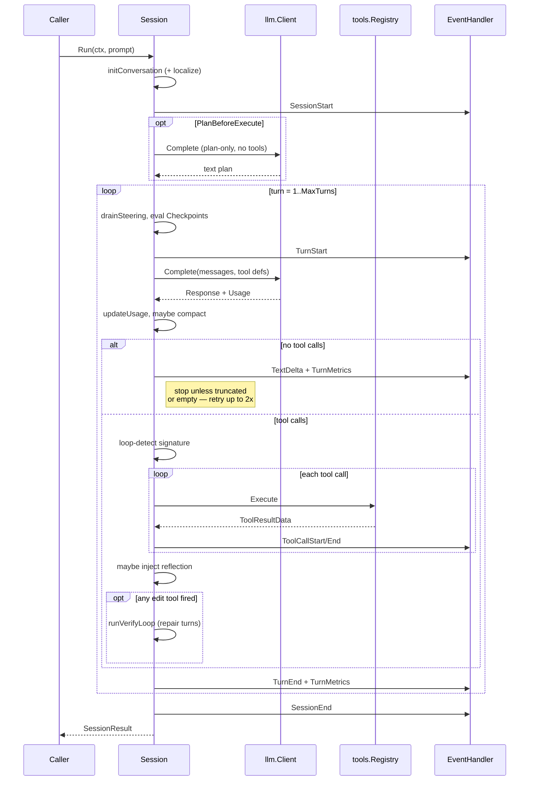

# Agent Subsystem (`agent/`)

The `agent` package drives a single LLM conversation from start to finish — prompt, LLM call, tool dispatch, result accumulation, repeat. Every pipeline node that routes through the `native` backend eventually calls `agent.Session.Run`. The package intentionally knows nothing about pipelines, graphs, or the TUI: it is a self-contained agentic loop with a small, observable event stream.

Callers above this layer (`pipeline/handlers/backend_native.go`, standalone embedding, tests) hand in an `llm.Completer`, a working directory, an `agent.SessionConfig`, and optional tools. Callers below — the LLM client, tool registry, filesystem — are supplied as dependencies.

## Purpose

- Run a **single agentic conversation**: prompt → LLM → tool calls → next turn → stop.
- Dispatch **tools** against a caller-supplied registry + filesystem-backed built-ins.
- Emit a **uniform event stream** the pipeline engine and TUI can consume.
- Apply **resilience primitives** (reflection prompts, empty-response retries, loop detection, compaction) so a flaky LLM does not sink a pipeline.
- Stay **backend-agnostic**: the native backend wraps this package, but claude-code and ACP emit the same `agent.Event` values so consumers do not branch on backend.

A `Session` is single-use — calling `Run` twice returns an error. Callers that need multiple turns of the *same* conversation build one `Session` and let `Run` drive the turn loop internally.

## Key types

| Type | File | Description |
|------|------|-------------|
| `Session` | [session.go](../../agent/session.go) | Owns the messages slice, tool registry, event handler, episode log, tool cache, working dir. |
| `SessionConfig` | [config.go](../../agent/config.go) | All knobs: `MaxTurns`, `Model`, `Provider`, `ContextCompaction`, `ReasoningEffort`, `ResponseFormat`, `ReflectOnError`, `VerifyAfterEdit`, `Localize`, `PlanBeforeExecute`, `PriorEpisodeSummaries`, `Checkpoints`, `LoopDetectionThreshold`, `ToolOutputLimits`. |
| `SessionResult` | [result.go](../../agent/result.go) | Turns, `MaxTurnsUsed`, `LoopDetected`, `ToolCalls`, accumulated `llm.Usage`, `ContextUtilization`, cache hit/miss, `ToolTimings`, `EpisodeSummary`, `Duration`, `Error`. |
| `Event` | [events.go](../../agent/events.go) | Tagged-union event with `EventType`, `SessionID`, `NodeID` (stamped by `NodeScopedHandler`), `Turn`, `ToolName`, token usage, trace slice. |
| `EventHandler` | [events.go](../../agent/events.go) | `HandleEvent(Event)` — the one interface callers implement. `MultiHandler` fans out; `NodeScopedHandler` stamps `NodeID`. |
| `Completer` | [session.go](../../agent/session.go) | Minimal interface the session needs from the LLM client: `Complete(ctx, *llm.Request) (*llm.Response, error)`. |
| `Checkpoint` | [checkpoint.go](../../agent/checkpoint.go) | User-message injected at a fraction of `MaxTurns` for mid-budget steering. |
| `tools.Registry` | [tools/registry.go](../../agent/tools/registry.go) | Tool dispatch. Tools implement `Tool` (Name/Description/Parameters/Execute) and optionally `CachePolicyProvider`. |
| `EpisodeLog` | [memory.go](../../agent/memory.go) | Structured per-tool attempt log rendered into `SessionResult.EpisodeSummary` for the next retry. |
| `ContextWindowTracker` | [context_window.go](../../agent/context_window.go) | Running utilization fraction used for the compaction and warning thresholds. |

Construction:

```go
sess, err := agent.NewSession(client, cfg,
    agent.WithEnvironment(exec.OS()),
    agent.WithEventHandler(handler),
    agent.WithTools(customTools...),
    agent.WithSessionRunner(spawner),
)
result, err := sess.Run(ctx, userPrompt)
```

## Turn loop

`Session.Run` is the single entry point. It sets up the conversation, optionally runs a planning turn, and then drives `runTurnLoop` until the LLM stops on text, tool-call loops repeat, or `MaxTurns` exhausts.



The loop lives in [`session.go`](../../agent/session.go) (`Run`, `runTurnLoop`, `executeTurn`, `handleToolCalls`, `handleNoTools`) with helpers in [`session_run.go`](../../agent/session_run.go) (`initConversation`, `doLLMCall`, `executeToolCalls`, `executeSingleTool`).

### Stopping conditions

- **Natural stop**: LLM returns no tool calls and `FinishReason.Reason != "length"/"max_tokens"`.
- **Truncation**: `length`/`max_tokens` finish injects a continuation user message and loops again (does not count against empty-response retry).
- **Empty response**: zero content parts, zero tool calls, zero output tokens — triggers session-level retry (max 2) with a diagnostic `EventError`. Third occurrence is a hard failure per CLAUDE.md ("Never silently swallow errors").
- **Loop detection**: if the tool-call signature (`name:args-json` joined) repeats `LoopDetectionThreshold` times, mark `LoopDetected` and stop.
- **MaxTurns**: set `MaxTurnsUsed=true` and return what we have.
- **Context cancel**: `ctx.Err()` checked at each turn boundary; aborts with the context error.

## Tool registry

Tools register by name; the session exposes them to the LLM via `llm.ToolDefinition` (name, description, JSON schema). Built-ins live in `agent/tools/`:

| Tool | File | Purpose |
|------|------|---------|
| `bash` | [bash.go](../../agent/tools/bash.go) | Run a shell command under the session's `ExecutionEnvironment`. |
| `read` | [read.go](../../agent/tools/read.go) | Read a file (line-numbered, truncated). |
| `write` | [write.go](../../agent/tools/write.go) | Write a file (mutating). |
| `edit` | [edit.go](../../agent/tools/edit.go) | String-exact edit with unique-match check (mutating). |
| `apply_patch` | [apply_patch.go](../../agent/tools/apply_patch.go) | Apply a unified diff (mutating). |
| `grep_search` | [grep.go](../../agent/tools/grep.go) | Ripgrep-style search. |
| `glob` | [glob.go](../../agent/tools/glob.go) | Glob file listing. |
| `spawn_agent` | [spawn.go](../../agent/tools/spawn.go) | Recursively launches a child `Session` via `tools.SessionRunner`. |

`Registry.Execute` wraps the tool's `Execute`, truncates output per `defaultToolOutputLimit` (tool-specific) or a `ToolOutputLimits` override, and synthesizes a tool-error result on panic or unknown-tool calls. A tool may declare `CachePolicyCacheable` to opt into the session's tool cache (see below).

`Session.registerBuiltinTools` only registers built-ins whose names are not already occupied — callers' `WithTools` takes precedence, enabling test doubles and custom bash wrappers.

## Context compaction

Enabled by `SessionConfig.ContextCompaction = CompactionAuto` with a `CompactionThreshold` fraction (0 < t ≤ 1). The session tracks running input tokens via `ContextWindowTracker.Utilization()` and runs `compactIfNeeded` after every turn's usage update.

Compaction walks the message slice in [`compaction.go`](../../agent/compaction.go), leaves the last `defaultProtectedTurns` (5) of assistant turns alone, and rewrites the content of prior **non-error** tool-result messages to a one-line summary:

- `read_file` / `read` → `[previously read: N lines. Re-read with <tool> if needed.]`
- `grep_search` / `grep` → `[previously searched: N matches found. Re-run <tool> if needed.]`
- `bash` / `execute_command` → `[previously ran: <cmd 80 chars> (passed|failed)? — N lines output. Re-run if needed.]`
- anything else → `[previous <tool> result — N chars. Re-run if needed.]`

Error results are preserved (the LLM needs to reason about failures). If `totalToolResultBytes` drops after compaction, `result.CompactionsApplied++` and `EventContextCompaction` fires.

A hard warning also fires once at `ContextWindowWarningThreshold` (default 0.8) as `EventContextWindowWarning` — useful for the TUI even when compaction is off.

## Episodic memory (v0.21.0+)

Every tool execution calls `s.episodeLog.Record(name, args, output, isError)` which pushes a compact `EpisodeEntry` into an append-only log. On session end, `EpisodeLog.Summary()` renders a bounded multi-line string capped at `maxEpisodeLogSummaryRunes` (2000) covering the last `maxEpisodeLogEntries` (24) attempts.

The summary is returned in `SessionResult.EpisodeSummary`. On retry (either inside a pipeline or a follow-on session), callers set `SessionConfig.PriorEpisodeSummaries` and the session prepends a "Prior attempts summary (avoid repeating failed approaches):" user message before the real prompt. `SerializeEpisodeSummaries` / `ParseEpisodeSummaries` in [`memory.go`](../../agent/memory.go) are the JSON helpers the pipeline uses to round-trip summaries through the context store.

Key bounds (enforced in `normalizeEpisodeSummaries`):

- Max 8 summaries (`maxEpisodeSummaryCount`).
- Max 4000 total runes across all summaries (`maxEpisodeSummaryTotalRunes`).
- Oldest entries are dropped first when either bound is exceeded.

## Repository localization (v0.21.0+)

`SessionConfig.Localize = true` runs a pre-turn, no-LLM analysis of the working directory to pre-load file references relevant to the user prompt. Implementation is pure text + filesystem scan — zero API calls, bounded runtime — in [`localize.go`](../../agent/localize.go).

Pipeline:

1. `extractRefs` pulls candidate paths (via `pathOrFileRE`), camelCase and snake_case identifiers, quoted and error-line phrases from the prompt.
2. `scoreFiles` walks the working directory (skipping `.git`, `node_modules`, `vendor`, build dirs, `.venv`, etc.), capped at `localizeMaxFilesToScan` (2000), skipping files larger than `localizeMaxFileSize` (256 KiB).
3. Scores are a weighted sum of filename matches, path-component matches, identifier matches, and phrase matches. Top `localizeMaxFiles` (10) survive.
4. `buildLocalizationBlock` formats the result as a human-readable block (`Likely relevant files for this task: …`) capped at `localizeMaxInjectBytes` (2048).
5. The block is prepended to the first user message inside `initConversation`.

Localization honors the parent context: `localize(ctx, …)` checks `ctx.Err()` between file reads so cancellation aborts the scan cleanly.

## Plan-before-execute (v0.21.0+)

`SessionConfig.PlanBeforeExecute = true` runs one extra LLM call before the main turn loop:

1. Append a fixed `planBeforeExecutePrompt` ("Before you start executing this task, outline your plan…").
2. Call `doPlanningCall` — same model/provider, **no tool definitions** — so the LLM has to produce text.
3. If the response contains tool calls, hard-fail the session (the LLM ignored instructions).
4. Append the plan response, then `executeAfterPlanPrompt` ("Now execute the task using the plan above."), then drop into the regular turn loop.

Planning turn usage is accumulated into `SessionResult.Usage` like any other call. There is no separate budget — plan turns count toward cost but not toward `MaxTurns`.

## Reflection-on-error

`SessionConfig.ReflectOnError` (default true) injects a structured reflection user message after any turn where at least one tool call failed:

```
One or more tool calls failed. Before your next action, briefly analyze:
1. What specifically went wrong?
2. What assumption was incorrect?
3. What is the minimal change that will fix this?

Then proceed with your corrective action.
```

Capped at `maxReflectionTurns` (3) consecutive injections — a clean turn resets the counter so a later failure gets the full window again. The prompt is constant; tool-result messages carry the error details.

## Verify-after-edit

Opt-in via `SessionConfig.VerifyAfterEdit = true`. After any turn where an *edit tool* (write/edit/apply_patch) fires **and** its tool result is non-error, `runVerifyLoop` runs:

1. Resolve a verify command (`VerifyCommand` explicit, or auto-detect: `go.mod` → `go test ./...`, `Cargo.toml` → `cargo test`, `package.json` → `npm test`, `Makefile`+`test` target → `make test`, `pytest` markers → `pytest`).
2. Execute it against the working directory.
3. On failure, inject a `verifyRepairPrompt` with the actual command, exit code, and output, then run a `runRepairTurn` (does **not** count toward `MaxTurns`).
4. Repeat up to `MaxVerifyRetries` (default 2) and then one final verification.

Verify failures after retries are a warning (`EventVerify`), not a session error — the caller decides whether to accept the edit. `VerifyBroadCommand` runs a secondary check after the focused command passes (regression detection).

## Tool cache

Opt-in via `SessionConfig.CacheToolResults = true`. Keyed by `toolName + args-json`, stores output strings, tracks hits/misses on `SessionResult.ToolCacheHits` / `ToolCacheMisses`.

Cache policy per tool:

- `CachePolicyCacheable` — write on success, read on match.
- `CachePolicyMutating` or `CachePolicyNone` (unknown) — every mutation invalidates the entire cache. Safe default: an unclassified tool might have side effects.

Built-ins: read-only tools (`read`, `grep_search`, `glob`) declare cacheable; mutating tools (`write`, `edit`, `apply_patch`, `bash`) do not.

## Steering

`Session.steering` is an optional `<-chan string` set by the pipeline when a manager loop (`stack.manager_loop`) wants to nudge a running child. The session drains the channel non-blockingly at the start of every turn in `drainSteering` and appends each message as a `[STEERING] ...` user message. See [`manager-loop.md`](../manager-loop.md) for the parent-side contract.

## Event stream

Every `Event` has a `Type` from `EventType`, a timestamp, `SessionID`, and an optional `NodeID` (stamped by `NodeScopedHandler` so the pipeline knows which parallel branch produced it).

Categorical events a consumer typically cares about:

- **Lifecycle**: `EventSessionStart`, `EventSessionEnd`, `EventTurnStart`, `EventTurnEnd`, `EventTurnMetrics`.
- **LLM trace** (live streaming): `EventLLMRequestPreparing`, `EventLLMRequestStart`, `EventLLMReasoning`, `EventLLMText`, `EventLLMToolPrepare`, `EventLLMFinish`, `EventLLMProviderRaw`.
- **Tools**: `EventToolCallStart`, `EventToolCallEnd`, `EventToolCacheHit`.
- **Conversation hooks**: `EventTextDelta` (final assistant text), `EventSteeringInjected`, `EventCheckpoint`, `EventContextCompaction`, `EventContextWindowWarning`, `EventVerify`.
- **Error**: `EventError`.

`TurnMetrics` is attached to `EventTurnMetrics` and carries per-turn input/output tokens, cache read/write, context utilization, tool-cache deltas, duration, and estimated cost (via `llm.EstimateCost` over the session's configured model if the provider didn't fill `Usage.EstimatedCost`).

## Integration points

- **Above**: `pipeline/handlers/backend_native.go` builds a `SessionConfig` from node attrs, wires a `NodeScopedHandler` that forwards every event to the pipeline's `AgentEvents` handler and the JSONL writer, and calls `Session.Run`. See [backends.md](./backends.md).
- **Above**: `cmd/tracker` and library callers can use `agent.Session` directly for standalone agents without a pipeline — the package has no pipeline dependency.
- **Below**: `llm.Client` (or any `Completer`) for model calls. See [llm.md](./llm.md).
- **Below**: `agent/exec` (`ExecutionEnvironment`) for bash / filesystem — decoupled so tests inject an in-memory FS.
- **Sideways**: `tools.Registry` is shared with `tools.SessionRunner` to support `spawn_agent`, enabling recursive child sessions.

## Gotchas and invariants

- **Single use**. `Session.Run` sets `s.ran = true` and a second call returns an error. Callers doing multi-turn orchestration reuse the same `Session`; callers doing multi-prompt work build multiple sessions.
- **Empty responses fail loudly**. Two retries max, then hard-fail. Per CLAUDE.md, providers that silently produce no content must not succeed.
- **Reflection cap resets on clean turns**. Three bad turns in a row stops injecting; a later clean turn re-earns the budget for a future failure window.
- **Repair turns skip `MaxTurns`**. This is a deliberate simplification; the upper bound is `MaxVerifyRetries` and each repair is small. Full bookkeeping would require threading the turn counter through the verify path.
- **Edit detection uses tool-result status, not just the call**. `turnHasEdits` walks backwards to the most recent `RoleTool` message and only counts successful edits — a failed write does not trigger verification against a workspace that was never modified.
- **Compaction is idempotent per turn**. `lastCompactTurn` blocks re-running on the same turn; compaction only fires when it actually reduces `totalToolResultBytes`.
- **System prompt is prepended, not replaced**. A working-dir-relative-paths instruction is always first; caller's `SystemPrompt` appends after a blank line.
- **Localization sees `ctx`**. Long working dirs can dominate session setup — cancel the context to abort mid-scan.
- **Cache invalidates aggressively**. Any tool classified as mutating (including unknown tools) clears the cache. Tools that *look* cacheable but have side effects must not declare `CachePolicyCacheable`.
- **Token cost is provider-then-catalog**. If `resp.Usage.EstimatedCost > 0` (provider reported it), use that; otherwise `llm.EstimateCost(model, usage)` fills in via the catalog.
- **NodeID comes from the caller**. The session never sets `Event.NodeID` itself — it is the pipeline's `NodeScopedHandler` that stamps it. Standalone sessions leave it empty.

## Files

- [agent/session.go](../../agent/session.go) — `Session`, `Run`, `runTurnLoop`, `executeTurn`, `handleToolCalls`, verify loop, emit helpers.
- [agent/session_run.go](../../agent/session_run.go) — `initConversation`, `doLLMCall`, `doPlanningCall`, `updateUsage`, `executeToolCalls`, `executeSingleTool`, tool cache integration.
- [agent/config.go](../../agent/config.go) — `SessionConfig`, `DefaultConfig`, validation.
- [agent/result.go](../../agent/result.go) — `SessionResult` and pretty-printing.
- [agent/events.go](../../agent/events.go) — `Event`, `EventType`, `EventHandler`, `MultiHandler`, `NodeScopedHandler`.
- [agent/memory.go](../../agent/memory.go) — `EpisodeLog`, `EpisodeEntry`, `SerializeEpisodeSummaries`, `ParseEpisodeSummaries`.
- [agent/localize.go](../../agent/localize.go) — repository localization extraction, scoring, scan bounds.
- [agent/compaction.go](../../agent/compaction.go) — `compactMessages`, tool-specific summaries.
- [agent/context_window.go](../../agent/context_window.go) — `ContextWindowTracker`.
- [agent/verify.go](../../agent/verify.go) — verify command resolution and repair prompt.
- [agent/tool_cache.go](../../agent/tool_cache.go) — in-session tool-result cache.
- [agent/tools/registry.go](../../agent/tools/registry.go) — `Registry`, `Tool`, cache policy.
- [agent/tools/](../../agent/tools) — built-in tool implementations.

## See also

- [../ARCHITECTURE.md](../../ARCHITECTURE.md) — top-level system view.
- [./llm.md](./llm.md) — the `Completer` this package consumes.
- [./backends.md](./backends.md) — how the pipeline picks between native, claude-code, and ACP.
- [./handlers.md](./handlers.md) — the codergen handler that wraps this package inside pipelines.
- [./context-flow.md](./context-flow.md) — how agent outputs (`last_response`, `episode_summary`) land in pipeline context.
