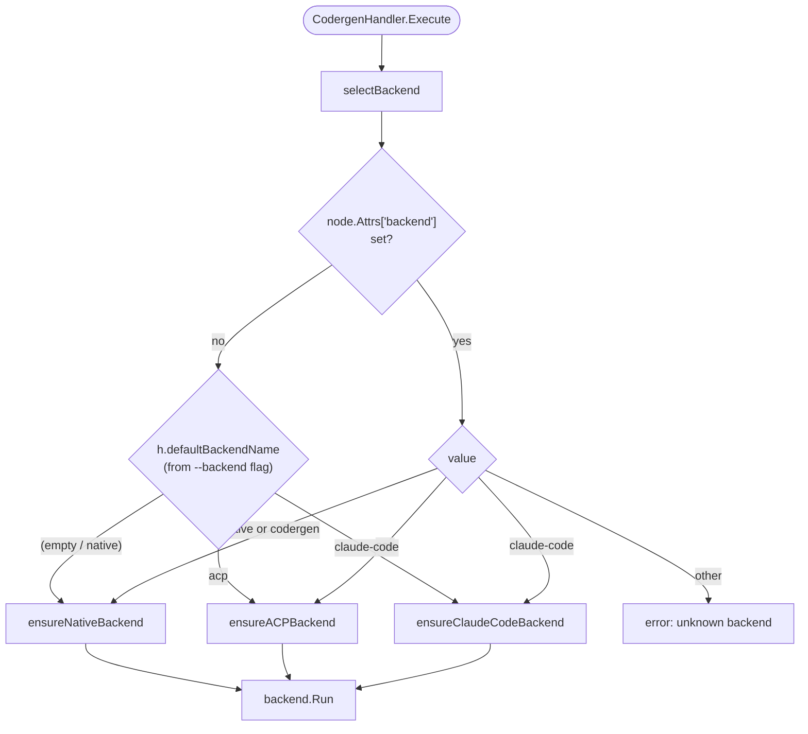
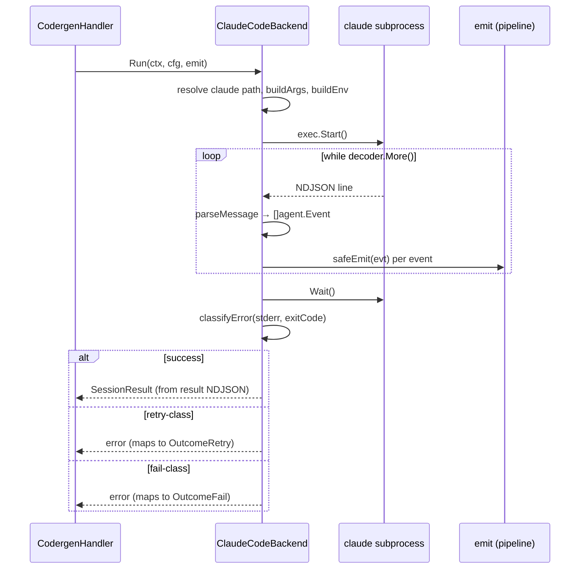

# Agent Backends (`pipeline/backend.go`, `pipeline/handlers/backend_*.go`)

An agent backend executes a single agent-node run and streams back `agent.Event` values. Tracker ships three:

- **native** — wraps `agent.Session` in-process, uses `llm.Client`, full turn loop with tool registry and compaction.
- **claude-code** — spawns the `claude` CLI as a subprocess, parses NDJSON stream output.
- **acp** — spawns an Agent Client Protocol server (claude-agent-acp, codex-acp, gemini) and talks JSON-RPC over stdio.

All three implement the same `AgentBackend` interface so the `CodergenHandler`, engine, and TUI are backend-agnostic. Selection is per-node (attr `backend: claude-code`) or global (`--backend claude-code`), with the per-node value winning.

## Purpose

- Abstract the question "how do we talk to an agent?" behind one interface so pipeline handlers do not branch on backend.
- Let pipelines mix backends — e.g. most agents native, one agent claude-code — in a single run.
- Preserve the live event stream (`agent.Event`) regardless of transport so the TUI, JSONL logger, and transcript collector have identical contracts.

## Interface

```go
// pipeline/backend.go
type AgentBackend interface {
    Run(ctx context.Context, cfg AgentRunConfig, emit func(agent.Event)) (agent.SessionResult, error)
}

type AgentRunConfig struct {
    Prompt       string
    SystemPrompt string
    Model        string
    Provider     string
    WorkingDir   string
    MaxTurns     int
    Timeout      time.Duration
    Extra        any // backend-specific: *ClaudeCodeConfig, *ACPConfig, or *agent.SessionConfig
}
```

One method. One struct. Backends put their own rich config in `Extra`:

- `*agent.SessionConfig` — native backend, lets the caller pass a fully-built session config instead of rebuilding defaults.
- `*ClaudeCodeConfig` — claude-code backend, carries MCP server list, allowed/disallowed tools, budget, permission mode.
- `*ACPConfig` — ACP backend, carries an explicit agent binary override.

## Comparison

| Dimension | native | claude-code | ACP |
|-----------|--------|-------------|-----|
| Transport | in-process Go | `exec.Command` + NDJSON stdout | `exec.Command` + JSON-RPC over stdio |
| Auth | API keys via `llm.Client` | Claude Max/Pro OAuth (or API key) | Agent handles auth internally |
| API-key env in subprocess | n/a | **stripped** by default | **passed through** by default |
| Opt-out / opt-in | n/a | `TRACKER_PASS_API_KEYS=1` passes keys | `TRACKER_STRIP_ACP_KEYS=1` strips keys |
| Tool registry | tracker's built-ins + custom | claude CLI's built-ins | agent's built-ins |
| Cost accounting | `llm.Usage` via middleware | Parsed from NDJSON `result` message | **Rune-count estimate** (`estimateACPUsage` in `backend_acp.go`): rune counts are summed across all channels per side, then `ceil(runes/4)` applied once per side. Input side = `cfg.Prompt` + `cfg.SystemPrompt` + tool-result payloads (bridge re-sends tool output as next-turn context); output side = collected assistant text + reasoning chunks + tool-call arguments (LLM-produced invocations). `Usage.ReasoningTokens` is derived from reasoning runes alone. The ceiling gives an implicit 1-token minimum for any non-empty side so TokenTracker's zero-early-return doesn't drop short sessions. ACP protocol exposes no native usage surface (`PromptResponse` only carries `StopReason`+`Meta`; no `SessionUpdate` subtype reports tokens). `Usage.Raw` is tagged with `ACPUsageMarker{Estimated:true, Source:"acp-chars-heuristic", Ratio:4}` for consumers that inspect `SessionResult.Usage` directly; aggregated CLI summaries built via `buildSessionStats` / `AggregateUsage` do **not** currently plumb that marker through (`buildSessionStats` copies the numeric fields but drops `Usage.Raw`). Budget guards (`--max-tokens`, `--max-cost`) enforce against the estimate. `Provider` is set to `"acp"` so per-provider rollups don't bucket ACP under `"unknown"`. |
| Supported models | any provider in tracker's catalog | Anthropic (non-Claude names stripped) | Depends on agent |
| Response format / schema | full `response_format` support | not exposed via CLI flag | agent-dependent |
| MCP servers | not supported directly | `--mcpServers` JSON | `McpServer` via `NewSession` |
| Permission modes | n/a | `plan`, `acceptEdits`, `bypassPermissions`, `default`, `dontAsk`, `auto` | protocol-level |
| Sandbox enforcement | `agent/exec.ExecutionEnvironment` | subprocess sees full env by default | handler validates paths (v0.20.0) |
| Failure surface | error return; session-level retries | exit-code classification → `OutcomeSuccess`/`Fail`/`Retry` | JSON-RPC error / empty response → error |
| Event stream | full (`EventTurnMetrics`, `EventTurnEnd`, etc.) | NDJSON-derived subset | SessionUpdate-derived subset |

## Selection logic



Per-node `backend` attr **always** wins over the global flag. A pipeline with `--backend claude-code` can still mark a node `backend: native` and it will use the in-process session — enabling mixed pipelines.

Backends are lazy:

- `ensureClaudeCodeBackend` mutex-guards construction; retries on failure so installing `claude` mid-run recovers without restarting tracker.
- `ensureNativeBackend` uses `sync.Once` because it needs a single `llm.Client`. If the client is nil *and* the global flag is `claude-code`/`acp`, the error says "no API keys configured — configure provider keys to use native alongside the subprocess backend." If no external backend and no client, it says "configure API keys or use --backend acp/claude-code."
- `ensureACPBackend` is mutex-guarded; path validation happens at first `Run` call.

### Lazy LLM client build

`tracker.Run` → `buildLLMClient` is lazy when `--backend claude-code` is set: failing to construct an `llm.Client` is **non-fatal** because nodes routed through the subprocess do not need one. A later node with `backend: native` that hits the missing-client path will produce the actionable error above.

## Native backend

[pipeline/handlers/backend_native.go](../../pipeline/handlers/backend_native.go) is a thin wrapper around `agent.Session`:

1. `buildSessionConfig` — if `cfg.Extra` is a `*agent.SessionConfig`, use it; otherwise start from `agent.DefaultConfig` and overlay `cfg`'s simple fields. This preserves everything the codergen handler built (reasoning effort, compaction, tool-output limits, etc.).
2. Wrap the `emit` callback in `agent.EventHandlerFunc`.
3. Create the session with `WithEnvironment(env)` if the backend was given one.
4. Call `sess.Run(ctx, cfg.Prompt)` and return.

No subprocess, no parsing, no re-implementation. This is the reference backend — it gets new features first.

## Claude-code backend

[pipeline/handlers/backend_claudecode.go](../../pipeline/handlers/backend_claudecode.go) spawns the `claude` CLI in stream-JSON mode.

Lifecycle:

1. `resolveClaudePath` — `exec.LookPath("claude")` then `claude --version` verification. A missing binary surfaces as "claude CLI not found in PATH — install with `npm install -g @anthropic-ai/claude-code`".
2. `buildArgs` — composes `--print --verbose -p <prompt> --output-format stream-json` plus optional `--model`, `--max-turns`, `--system-prompt`, `--permission-mode`, `--allowedTools`, `--disallowedTools`, `--budget`, `--mcpServers`.
3. `buildEnv` — starts from `os.Environ()` and **strips** `ANTHROPIC_API_KEY`, `OPENAI_API_KEY`, `OPENAI_COMPAT_API_KEY`, `GEMINI_API_KEY`, `GOOGLE_API_KEY`. Without this, the claude CLI prefers `ANTHROPIC_API_KEY` over the user's Max/Pro subscription and burns API credits. Override with `TRACKER_PASS_API_KEYS=1`.
4. `cmd.Start()`, wait for `stdout` pipe.
5. `decodeNDJSON` consumes the pipe line-by-line via `json.Decoder`. Each line goes through `parseMessage` ([backend_claudecode_ndjson.go](../../pipeline/handlers/backend_claudecode_ndjson.go)) which maps NDJSON message types onto `agent.Event` values (`user_message`, `assistant_text`, `tool_use`, `tool_result`, `result`, etc.). `safeEmit` recovers from handler panics so a bad emit handler cannot kill the decode loop.
6. `cmd.Wait()` then `classifyError` maps exit code + stderr to a pipeline outcome:
   - Exit 0 → `OutcomeSuccess`.
   - Auth errors ("authentication", "unauthorized", "invalid api key") → `OutcomeFail`.
   - Credit-balance errors → `OutcomeFail` **with actionable log**: "claude CLI may be using ANTHROPIC_API_KEY instead of Max subscription. Unset ANTHROPIC_API_KEY to use subscription auth."
   - Rate limits ("rate limit", "429", "throttled"/"throttling" not preceded by "un") → `OutcomeRetry`.
   - Budget / spending limit hit → `OutcomeFail`.
   - Network errors → `OutcomeRetry`.
   - Exit 137 (SIGKILL) → `OutcomeFail`.
   - Anything else → `OutcomeFail` with "unclassified error" log.



### Model name handling

`isClaudeModel(model)` returns true for model names starting with `claude` or `anthropic`. Anything else (`gpt-*`, `gemini-*`) causes `--model` to be omitted so the CLI uses its default model under the subscription. This is the safe default when `--backend claude-code` is set globally and the graph names non-Anthropic models.

## ACP backend

[pipeline/handlers/backend_acp.go](../../pipeline/handlers/backend_acp.go) uses the [`github.com/coder/acp-go-sdk`](https://github.com/coder/acp-go-sdk) package to speak the Agent Client Protocol over stdio with an external agent binary. The client-side handler is in [backend_acp_client.go](../../pipeline/handlers/backend_acp_client.go).

Default provider → binary mapping:

| Provider | Binary | Install |
|----------|--------|---------|
| `anthropic` | `claude-agent-acp` | `npm i -g @agentclientprotocol/claude-agent-acp` |
| `openai` | `codex-acp` | `npm i -g @zed-industries/codex-acp` |
| `gemini` | `gemini` (native ACP via `--acp`) | `npm i -g @google/gemini-cli` |

`ACPConfig.Agent` (set via node attr `acp_agent`) overrides the mapping — useful for testing a specific bridge build or a fork.

Lifecycle:

1. `resolveAgentName(cfg)` — explicit `ACPConfig.Agent` wins, otherwise provider mapping, otherwise `claude-agent-acp`.
2. `ensureAgentPath(name)` — `exec.LookPath`, optional `--version` probe (non-fatal — some bridges don't support it).
3. `startProcess` — spawn with stdin/stdout pipes, `buildEnvForACP()` environment.
4. `acp.NewClientSideConnection(handler, stdin, stdout)` wires up the JSON-RPC transport.
5. `initSession(ctx, conn, …)` — `Initialize` with `ClientCapabilities{Fs, Terminal}`, then `NewSession` with `Cwd` and MCP servers, optionally `SetSessionModel` if the tracker model maps to a bridge model via `mapModelToBridge` (direct match then substring like `sonnet` in `claude-sonnet-4-5`).
6. `sendPromptAndCollect` — `conn.Prompt(…)` with `buildACPPromptBlocks` (system prompt first as a separate block, then user prompt).
7. `waitForProcess` — close stdin, wait 5 seconds, then force-kill if the bridge didn't exit.
8. `buildACPResult` aggregates handler state into `agent.SessionResult`.

### Session update mapping

`acpClientHandler.SessionUpdate` converts ACP updates into `agent.Event` values:

- `AgentMessageChunk` → `EventTextDelta`.
- `AgentThoughtChunk` → reasoning (logged).
- `ToolCall` → `EventToolCallStart`.
- `ToolCallUpdate` → `EventToolCallEnd` when terminal.
- `Plan`, `AvailableCommandsUpdate`, `CurrentModeUpdate`, `UserMessageChunk` → informational / ignored.

Tool call counts feed `toolNames` and `toolCount`; `isEmpty()` checks both text and tool count so an empty response causes "acp: %s returned empty response (0 text, 0 tool calls)".

### Sandbox path validation (v0.20.0 security)

ACP agents request file reads/writes via the protocol; the tracker-side handler owns those operations. `validatePathInWorkDir` in [backend_acp_client.go](../../pipeline/handlers/backend_acp_client.go):

1. Rejects raw paths containing `..` components before any resolution.
2. Resolves symlinks on the longest existing ancestor of the path.
3. Requires the resolved path to be a descendant of the resolved working directory.

Step 1 blocks the symlink-plus-`..` escape where a symlink points outside the sandbox and a subsequent `..` traversal exits. Step 2 handles legitimate symlinks inside the sandbox.

### Environment handling

By default `buildEnvForACP` passes the full parent environment. ACP bridges generally manage their own credential routing (subscription-aware), and stripping everything can break that. Set `TRACKER_STRIP_ACP_KEYS=1` to strip `ANTHROPIC_API_KEY`, `OPENAI_API_KEY`, `OPENAI_COMPAT_API_KEY`, `GEMINI_API_KEY`, `GOOGLE_API_KEY`, `ANTHROPIC_BASE_URL`, `OPENAI_BASE_URL`, `OPENAI_COMPAT_BASE_URL`, `GEMINI_BASE_URL`, `GOOGLE_BASE_URL`, `OPENROUTER_API_KEY` — useful when the bridge should use subscription auth instead of API-key auth.

## Token accounting

Native backend usage flows through the `TokenTracker` middleware on the `llm.Client`. The other two backends cannot use that path because they do not call the client. Instead:

- **Claude-code**: the NDJSON `result` message includes token usage; `parseMessage` builds the `SessionResult.Usage`, sets `SessionResult.Provider = "claude-code"`, and `CodergenHandler.trackExternalBackendUsage` passes both (with `runCfg.Model`) to `TokenTracker.AddUsage("claude-code", usage, model)`. Model normalization through the catalog means dated IDs price correctly.
- **ACP**: the ACP protocol does not currently expose per-prompt token usage (see the `estimateACPUsage` / `ACPUsageMarker` row in the Comparison table above for the full heuristic). `buildACPResult` synthesizes an `llm.Usage` from rune counts, sets `Provider: "acp"`, and `trackExternalBackendUsage` forwards that estimate to `TokenTracker.AddUsage("acp", usage, cfg.Model)`. Passing the model is load-bearing: without it, `TokenTracker.CostByProvider` would fall back to `graph.Attrs["llm_model"]` (often empty for per-node model selection) and `EstimateCost` would return `$0`, silently disabling `--max-cost` enforcement for ACP nodes. `--max-tokens` enforces against ACP estimates today; `--max-cost` enforces when `cfg.Model` resolves to a catalog-known entry (otherwise `EstimateCost` logs a one-time unknown-model warning and returns 0). The heuristic now counts four channels: (1) the assistant text in `textParts`, (2) reasoning chunks via a `reasoningRunes` counter advanced by `handleThoughtChunk`, (3) tool-call arguments via `toolArgRunes` (advanced by `handleToolCallStart`), and (4) tool-call output via `toolResultRunes` (advanced by `handleToolCallUpdate` on completed/failed status). Channels (2)–(3) fold into the output side, (4) into the input side. Remaining intrinsic undercount: the bridge's own injected system prompt + tool schema definitions are invisible (they never flow through `cfg.Prompt`/`cfg.SystemPrompt`), so every turn still "misses" a constant block of input overhead — typically several KB for the bridges we target. This is fundamental to operating outside the protocol; closing it would require a bridge-specific `Meta` extension we don't have. The `ACPUsageMarker{Estimated:true}` tag on `Usage.Raw` is visible to callers that read `SessionResult.Usage` directly, but `llm.Usage.Add` and `buildSessionStats` both drop `Usage.Raw`, so the CLI summary, NDJSON trace entries, TUI header, and `pipeline.Trace.AggregateUsage` do not carry an "estimated" flag today. Plumbing an explicit `Estimated bool` field through `SessionStats` / `ProviderUsage` / the TUI header is a follow-up; until then the marker is effectively write-only.

## Gotchas and invariants

- **Per-node `backend` attr always wins over `--backend`.** A global flag is a default, not a mandate. Test both paths when changing handler selection logic.
- **API-key stripping for claude-code is on by default.** Subscription users burn through API credits when `ANTHROPIC_API_KEY` leaks into the subprocess. If you add a new claude-code option, do not re-introduce the key implicitly. `TRACKER_PASS_API_KEYS=1` is the only escape hatch.
- **ACP agents pass env through by default.** The opposite of claude-code — bridges handle their own auth and stripping can break them. `TRACKER_STRIP_ACP_KEYS=1` strips when a deployment needs it.
- **Exit codes map to outcomes, not return values.** A `retry`-class error from claude-code must surface as a retryable error so the engine's retry policy runs. Do not swallow.
- **Provider errors hard-fail.** CLAUDE.md: provider errors (quota, auth, model not found) must not silently retry. `classifyError` respects this — auth errors are `OutcomeFail`, not `OutcomeRetry`.
- **NDJSON decode errors count.** If the subprocess crashes mid-stream and no `result` message ever arrives, `collectResult` returns "claude CLI produced N NDJSON decode errors and no result message" rather than pretending the run succeeded.
- **ACP sandbox rejects `..` before symlink resolution.** Reordering this check would re-open the symlink-escape vector.
- **ACP force-kill after 5s grace.** A bridge that ignores stdin close gets killed. The logged force-kill is informational; the prompt's result still returns.
- **Lazy construction allows mid-run install.** `ensureClaudeCodeBackend` and `ensureACPBackend` retry on failure so a user can `npm install` the bridge while a pipeline is partway through and the next dispatch picks it up.
- **Non-Anthropic model names are stripped for claude-code.** If you need a specific non-Anthropic model, use the native backend (or ACP with a matching bridge). The CLI cannot run non-Anthropic models.

## Files

- [pipeline/backend.go](../../pipeline/backend.go) — `AgentBackend`, `AgentRunConfig`, `ClaudeCodeConfig`, `ACPConfig`, `PermissionMode`, MCP helpers.
- [pipeline/handlers/backend_native.go](../../pipeline/handlers/backend_native.go) — native (agent.Session) backend.
- [pipeline/handlers/backend_claudecode.go](../../pipeline/handlers/backend_claudecode.go) — claude CLI subprocess backend.
- [pipeline/handlers/backend_claudecode_ndjson.go](../../pipeline/handlers/backend_claudecode_ndjson.go) — NDJSON parsing.
- [pipeline/handlers/backend_acp.go](../../pipeline/handlers/backend_acp.go) — ACP backend (agent selection, process lifecycle).
- [pipeline/handlers/backend_acp_client.go](../../pipeline/handlers/backend_acp_client.go) — ACP client handler, path validation, tool calls.
- [pipeline/handlers/codergen.go](../../pipeline/handlers/codergen.go) — `CodergenHandler.selectBackend`, `ensureClaudeCodeBackend`, `ensureNativeBackend`, `ensureACPBackend`.

## See also

- [../ARCHITECTURE.md](../../ARCHITECTURE.md) — system-level view.
- [./agent.md](./agent.md) — the in-process backend's turn loop.
- [./llm.md](./llm.md) — the client the native backend uses (and the others do not).
- [./handlers.md](./handlers.md) — the codergen handler that picks a backend.
