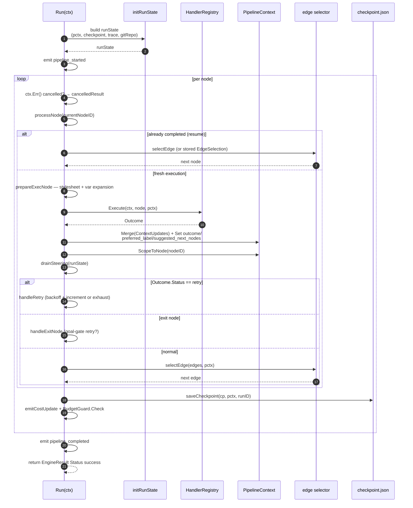
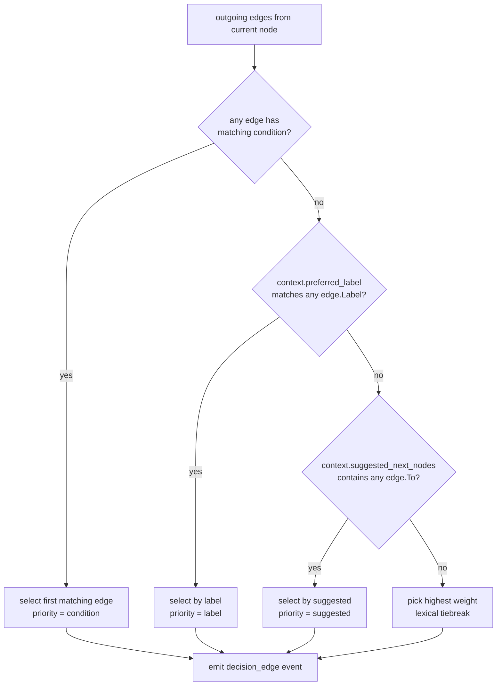
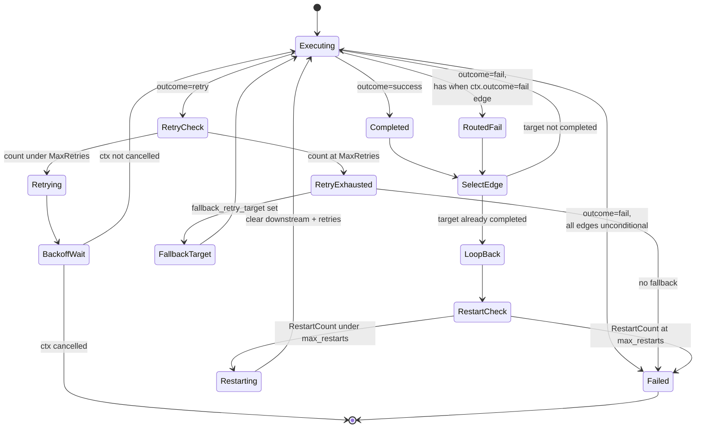
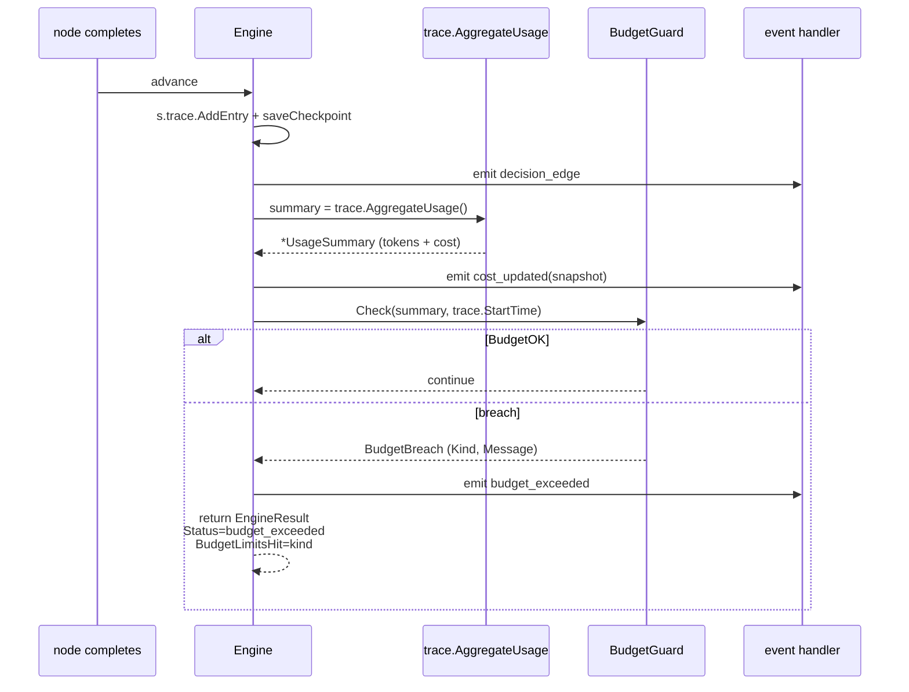
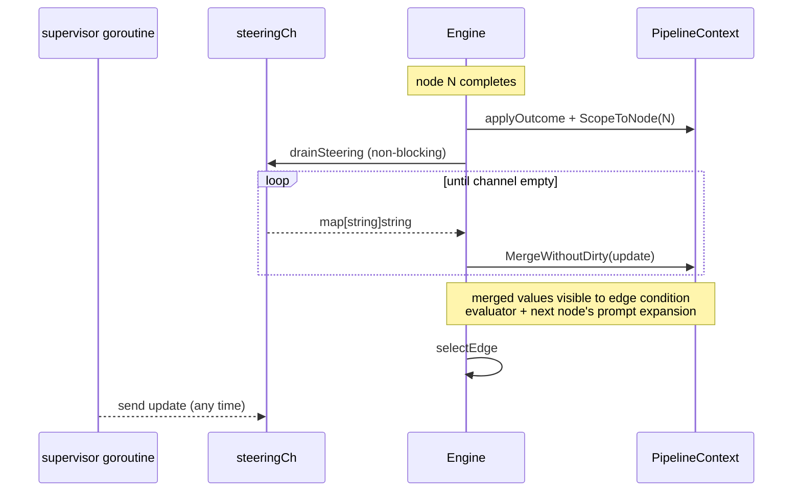

# Engine

The pipeline execution engine takes a `*pipeline.Graph` and a
`*pipeline.HandlerRegistry`, executes each node in the order determined by
handler outcomes and outgoing edges, emits lifecycle events, writes
checkpoints, optionally enforces a cost/time budget, and ultimately returns
an `*EngineResult`. Source: [`pipeline/engine.go`](../../pipeline/engine.go),
[`pipeline/engine_run.go`](../../pipeline/engine_run.go),
[`pipeline/engine_checkpoint.go`](../../pipeline/engine_checkpoint.go),
[`pipeline/engine_edges.go`](../../pipeline/engine_edges.go).

The engine is deliberately small. It has no knowledge of LLM calls,
subprocesses, human gates, or concurrency. Everything handler-specific lives
under [`pipeline/handlers/`](../../pipeline/handlers/). Everything
engine-specific — edges, retries, restarts, checkpoints, budgets, steering —
is in this file tree.

## Contents

1. [Overview](#overview)
2. [Run loop](#run-loop)
3. [Outcomes and routing](#outcomes-and-routing)
4. [Retry, restart, escalate](#retry-restart-escalate)
5. [Budget guard](#budget-guard)
6. [Steering channel](#steering-channel)
7. [Git artifact integration](#git-artifact-integration)
8. [Emitted events](#emitted-events)

## Overview

```go
type Engine struct {
    graph             *Graph
    registry          *HandlerRegistry
    eventHandler      PipelineEventHandler
    checkpointPath    string
    resolveStylesheet bool
    initialContext    map[string]string
    artifactDir       string
    budgetGuard       *BudgetGuard
    gitArtifacts      bool
    steeringCh        <-chan map[string]string
}

func NewEngine(graph *Graph, registry *HandlerRegistry, opts ...EngineOption) *Engine
func (e *Engine) Run(ctx context.Context) (*EngineResult, error)
```

The options are set-once: `WithPipelineEventHandler`, `WithCheckpointPath`,
`WithStylesheetResolution`, `WithArtifactDir`, `WithInitialContext`,
`WithBudgetGuard`, `WithGitArtifacts`, `WithSteeringChan`. Most are
effective no-ops when their arguments are empty/nil: an unset
`checkpointPath` skips `saveCheckpoint`, a nil `BudgetGuard` short-circuits
to `BudgetOK`, an empty `steeringCh` drains zero updates, and so on. One
exception: `WithPipelineEventHandler(nil)` overwrites the default
`PipelineNoopHandler` with a nil interface, which then panics on the first
`Engine.emit` call. Callers that want to disable event handling should
either omit the option entirely or pass `pipeline.PipelineNoopHandler`
explicitly. The engine owns no LLM client, no exec environment, no
interviewer — those are handler-scoped. Handlers are provided by the
registry.

`EngineResult` carries `RunID`, `Status` (one of `success`, `fail`,
`budget_exceeded`), `CompletedNodes`, a full context `Snapshot`, the
`*Trace`, aggregated `*UsageSummary`, and — when applicable — the list of
budget dimensions that halted the run.

## Run loop

`Engine.Run(ctx)` is the main loop. It follows a simple pattern: look up the
next node, dispatch to its handler, apply the outcome, scope the node's
writes, drain any steering updates, pick an outgoing edge, repeat until the
exit node is reached or an error halts the run.



`processNode` splits into `processResumeSkip` (already completed in a prior
run, advance through stored edge selection or re-select) and
`processActiveNode` (fresh dispatch). The engine clears three routing-hint
keys on the context before every handler execution (`outcome`,
`preferred_label`, `suggested_next_nodes`) so a node never inherits a stale
hint from a previous node.

### Variable expansion

Two unrelated expansion syntaxes live in the codebase, applied at different
call sites:

1. **Legacy `$key` syntax** — applied by `prepareExecNode` in
   [`pipeline/engine_run.go`](../../pipeline/engine_run.go) before every
   handler dispatch. Two transforms run over each node attr:
   - `ExpandGraphVariables(text, vars)` rewrites `$key` tokens using the
     `$key → value` map built by `GraphVarMap` from graph-scoped context
     keys (`graph.*`). It does NOT touch `${...}` syntax.
     Source: [`pipeline/transforms.go`](../../pipeline/transforms.go).
   - `ExpandPromptVariables(prompt, ctx)` substitutes only the bare literal
     `$goal` on the `prompt` attr. It does NOT expand `${ctx.*}`.
2. **Namespaced `${ns.key}` syntax** — applied by `ExpandVariables` in
   [`pipeline/expand.go`](../../pipeline/expand.go). Supports three
   namespaces: `ctx.*` (pipeline context), `params.*` (subgraph
   parameters), and `graph.*` (graph attributes). Called from:
   - `engine_edges.go` when expanding edge `Condition` expressions before
     evaluation.
   - `handlers/prompt.go` when a codergen/human handler resolves its
     `prompt` attr.
   - `handlers/tool.go` when a tool handler resolves `tool_command` (with
     `toolCommandMode=true`, which additionally blocks all non-allowlisted
     `ctx.*` keys to prevent LLM output injection).
   - `handlers/human.go` when resolving human-gate prompts.
   - `expand.go` itself when a subgraph injects its `params` into a cloned
     child graph via `InjectParamsIntoGraph`.

   The engine's `prepareExecNode` does NOT call `ExpandVariables`; that
   happens at handler-level, inside the sites listed above. The split is
   why `${ctx.*}` works in `prompt` / `tool_command` / `condition` but not
   in arbitrary node attrs.

Both expansion syntaxes are single-pass — resolved values are never
rescanned, so a context value containing `$key` or `${...}` syntax is left
as-is. (See `CLAUDE.md` §Dippin-lang compatibility.)

### Stylesheet resolution

If `WithStylesheetResolution(true)` is set and the graph has a
`model_stylesheet` attr, `prepareExecNode` resolves per-role model
overrides through the stylesheet before variable expansion. Used to
override per-node `llm_model` / `llm_provider` based on role tags without
rewriting the `.dip` file. See [`pipeline/stylesheet.go`](../../pipeline/stylesheet.go).

### Checkpoint semantics

- **Checkpoint file**: `checkpoint.json` inside the run artifact dir (or at
  `Config.CheckpointDir` if explicitly set). Format in
  [`pipeline/checkpoint.go`](../../pipeline/checkpoint.go).
- **Loaded at startup**: `loadCheckpointAndMerge` restores `RunID`,
  `CompletedNodes`, `RetryCounts`, `Context`, `RestartCount`,
  `EdgeSelections`, `FallbackTaken`. Graph attrs (`graph.*`) are re-seeded
  from the live graph so `--param` overrides don't regress to stale
  checkpoint values.
- **Saved on node outcome**: every successful non-terminal node outcome
  and every retry saves the checkpoint. Most failure paths also save a
  partial-context checkpoint so a resume can see what was written before
  the error, with three intentional exceptions:
  - `handleExitNode` (in `engine_run.go`) on the plain success path
    records the trace entry, emits git/cost/budget events, and returns
    without calling `saveCheckpoint` / `saveCheckpointWithTag` — the
    exit node is the end of the run, so there is nothing to resume.
    (The goal-gate retry and fallback branches inside `handleExitNode`
    still call `saveCheckpointWithTag`, since those redirect to
    another node.)
  - `checkStrictFailure` (in `engine.go`) returns its fail `loopResult`
    without calling `saveCheckpoint` — a strict-failure halt is terminal,
    so no resume would revisit this node.
  - `handleRetryExhausted` (in `engine_run.go`) with no
    `fallback_retry_target` attr calls `failResult` directly, skipping
    the checkpoint save. Retries exhausted with no fallback is also
    terminal.
  All non-terminal failure paths (retry with budget remaining, fallback
  routing, loop-restart cap exceeded, handler error) do save a checkpoint.
- **Edge selections are replayed**: if `cp.EdgeSelections[nodeID]` is set,
  resume uses the stored target instead of re-evaluating the condition —
  this prevents a condition like `when ctx.outcome = success` from being
  re-evaluated against stale context after a resume.
- **Fidelity-aware compaction**: on resume, completed-node context is
  compacted to the node's declared fidelity level (preserving declared
  `reads:` keys pinned at full fidelity). See `pipeline/fidelity.go` and
  [`context-flow.md`](./context-flow.md).

## Outcomes and routing

Every handler returns an `Outcome`:

```go
type Outcome struct {
    Status             string            // "success", "fail", "retry", or custom
    ContextUpdates     map[string]string
    PreferredLabel     string
    SuggestedNextNodes []string
    Stats              *SessionStats
}
```

After `applyOutcome`, the engine picks the next edge via `selectEdge` using
priority order:



Source: [`pipeline/engine_edges.go`](../../pipeline/engine_edges.go).

### Condition expressions

Edge conditions use a small language evaluated by
[`pipeline/condition.go`](../../pipeline/condition.go): `=`, `==`, `!=`,
`contains`, `startswith`, `endswith`, `in`, `not`, `&&`, `||` (no
parentheses — `||` is lowest precedence, `&&` higher). The evaluator strips
the `ctx.`, `context.`, and `internal.` prefixes from keys before lookup,
so dippin-lang conditions like `ctx.outcome = success` match tracker's bare
`outcome` key.

Condition variables are expanded through `ExpandVariables` before
evaluation. In the default lenient mode used by the engine
(`strict=false`), an unresolved `${ctx.x}` expands to an empty string
**without logging** — see `expandVariablesPass` in
[`pipeline/expand.go`](../../pipeline/expand.go). The only built-in
warning path for unresolved variables lives inside
[`pipeline/condition.go`](../../pipeline/condition.go) at
`resolveAndWarnVar`: when a condition clause like `ctx.outcome = success`
references a key the evaluator can't resolve, it logs `warning: unresolved
condition variable %q ...` via the standard `log` package and treats the
value as an empty string. `ExpandVariables` with `strict=true` returns an
error instead of expanding to empty, but no engine call site currently
uses strict mode.

### `SuggestedNextNodes` override

The parallel handler uses this to direct post-dispatch control flow to the
fan-in join node. After spawning branches, it records the join hint in its
`Outcome.ContextUpdates` as `suggested_next_nodes: <joinID>` (see
[`pipeline/handlers/parallel.go`](../../pipeline/handlers/parallel.go)
writing `pipeline.ContextKeySuggestedNextNodes` into `ContextUpdates`). The
engine's edge selector reads the value from the pipeline context via
`pctx.Get(ContextKeySuggestedNextNodes)` in
[`engine_edges.go`](../../pipeline/engine_edges.go), not from the
`Outcome.SuggestedNextNodes` struct field, and uses it as a priority hint
when selecting among the current node's existing outgoing edges — the
selector matches each suggested ID against `edge.To` and picks the first
match. This is a routing **hint**, not an override that can jump to
arbitrary nodes outside the graph's edge set. It's how the engine supports
parallel execution without knowing what parallel execution is, while still
respecting the declared graph. (`applyOutcome` does also mirror a non-empty
`Outcome.SuggestedNextNodes` slice into the same context key — parallel
just happens to route through `ContextUpdates`.)

### Strict failure edges

When a node's outcome is `fail` and none of its outgoing edges carry a
`Condition`, the pipeline stops with
`fmt.Errorf("node %q failed with no conditional edges to handle failure")`.
Implementation: `checkStrictFailure` in `engine.go`. This prevents tool
nodes (Setup, Build, …) from silently continuing after a failure — pipelines
that want to recover must use an explicit `when ctx.outcome = fail` edge.
Nodes with **any** conditional edge are considered intentionally
routed and are exempted from the check.

## Retry, restart, escalate

Three related but distinct recovery mechanisms:



### Retry

Per-node. Controlled by `RetryPolicy` resolved in
[`pipeline/retry_policy.go`](../../pipeline/retry_policy.go):

- Named policies: `none`, `standard` (default: 2 retries, 2s base,
  exponential), `aggressive` (5 retries, 500ms), `patient` (3 retries, 10s),
  `linear` (3 retries, 2s linear).
- Resolution order: node attr `retry_policy` → graph attr
  `default_retry_policy` → `standard`.
- Overrides: node attr `max_retries` / graph attr `default_max_retry`
  override `MaxRetries`; node attr `base_delay` overrides `BaseDelay`.
- Backoff: `ExponentialBackoff` (2ⁿ × base + ±25% jitter) or
  `LinearBackoff` ((n+1) × base + ±25% jitter). Both capped at 60s.

When a handler returns `OutcomeRetry`:

1. If `RetryCount(nodeID) < MaxRetries`: increment, wait backoff, emit
   `EventStageRetrying`, clear downstream completion (so dependent nodes
   re-run), save checkpoint, route to `retry_target` (default: the node
   itself).
2. Otherwise: route to `fallback_retry_target` if set; else fail the
   pipeline.

### Restart

Pipeline-level. Triggered when the edge selector picks a target node that's
already in `CompletedNodes` — this indicates a loop-back. `handleLoopRestart`
in `engine_run.go` increments `cp.RestartCount`, emits `EventLoopRestart`
and `EventDecisionRestart`, clears all downstream completion and retry
counters from the loop target, saves the checkpoint, and resumes at the
loop target.

The budget is controlled by graph attr `max_restarts` (default 5). Hitting
the ceiling fails the pipeline with `max restarts (N) exceeded`.

**Caveat** (per CLAUDE.md §Architecture Gotchas): the restart counter is
**global** across the run. A fix loop on milestone 1 consumes restart budget
milestone 10 needs. The `build_product.dip` workflow uses a per-milestone
on-disk counter (`fix_attempts`) to work around this.

### Escalate

Not a distinct outcome status. Escalation is a routing convention:

- Failed nodes can route to an escalation node via `when ctx.outcome = fail`.
- Goal-gate nodes (those with `goal_gate: "true"` attr) get a goal-gate
  retry loop when the exit node is reached: if a goal gate was
  unsatisfied, the engine routes back to its `retry_target` (or
  `fallback_target` / `fallback_retry_target`) until retries are
  exhausted. Implementation: `goalGateRetryTarget` in
  `engine_checkpoint.go`.
- The one-shot fallback/escalation path is guarded by `cp.FallbackTaken[gateID]`
  to prevent infinite fallback loops.

## Budget guard

`pipeline.BudgetGuard` ([`pipeline/budget.go`](../../pipeline/budget.go))
enforces three optional ceilings across the entire run:

```go
type BudgetLimits struct {
    MaxTotalTokens int
    MaxCostCents   int
    MaxWallTime    time.Duration
}
```

`NewBudgetGuard(limits)` returns `nil` when all limits are zero, so
`BudgetGuard.Check(nil guard, ...)` is safely a no-op. The engine calls the
guard after every `emitCostUpdate` (between nodes):



Three dimensions: tokens (`UsageSummary.TotalTokens`), cost (cents computed
from `TotalCostUSD`), wall-time (since `trace.StartTime`). `BudgetGuard.Check`
evaluates them in a **fixed precedence order**: tokens → cost → wall-time.
When multiple limits are exceeded in the same check, the reported
`BudgetBreach.Kind` follows this ordering (a simultaneous token + wall-time
breach reports as `tokens`). `BudgetBreach.Kind.String()` populates
`EngineResult.BudgetLimitsHit`. Thresholds are **inclusive** — hitting the
exact limit is not a breach; only strictly exceeding it is.

Configuration flows through `tracker.Config.Budget` or CLI flags
`--max-tokens`, `--max-cost` (cents), `--max-wall-time`. Reading from
workflow attrs is blocked on dippin-lang IR support (issue #67).

## Steering channel

`WithSteeringChan(ch <-chan map[string]string)` provides an external input
for context updates between nodes. Used by `stack.manager_loop` to inject
context into a running child pipeline, but available to any supervisor.



Two important properties:

- **Non-blocking drain**. The engine reads until the channel is empty or
  would block, so supervisors never slow the run even if they publish
  bursts.
- **`MergeWithoutDirty`**. Steering values land in the bare/global
  namespace and are NOT copied into any node's `node.<id>.*` scope.
  Otherwise external writes would be misattributed to whatever node
  happened to be running next.

Mirror: `agent/session_run.go` has a parallel `drainSteering` for mid-turn
agent-session steering. The two systems share the channel-pattern but are
independent — pipeline steering acts between nodes, agent steering acts
between turns.

## Git artifact integration

`WithGitArtifacts(true)` initializes the artifact run directory as a git
repo at run start (`gitRepo.Init()` in
[`pipeline/git_artifacts.go`](../../pipeline/git_artifacts.go)) and commits
after every terminal node outcome:

- `emitGitCommit(runState, nodeID, traceEntry)` runs `git add . && git
  commit --allow-empty -m "<msg>"` where `<msg>` has a one-line subject
  and a structured body. Subject:
  `node(<nodeID>): <handler> outcome=<status>`. Body (blank line after
  the subject) is a `key: value` block that callers can grep/parse:
  `duration: <d>`, `edge_to: <nextNode>` (when set), and
  `tokens: <n> cost: $<usd>` (when the trace entry carries session
  stats). Source: `gitArtifactRepo.CommitNode` in
  [`pipeline/git_artifacts.go`](../../pipeline/git_artifacts.go).
- `saveCheckpointWithTag` creates a lightweight tag
  `checkpoint/<runID>/<nodeID>` pointing at the most recent commit.
  `checkpoint.json` itself is `.gitignore`d.

Best-effort: failures emit `EventWarning` and do not halt the pipeline.
Requires `git` in `PATH`; silently no-ops when `ArtifactDir` is unset.

After the run, callers can bundle the repo for portable hand-off:

```go
tracker.ExportBundle(runDir, outPath) // wraps git bundle create --all
```

Implementation in [`tracker_bundle.go`](../../tracker_bundle.go). Clone with
`git clone <bundle>` on any machine — commits, tags, and the full history
travel in one file.

## Emitted events

The engine emits `PipelineEvent` values via the handler registered with
`WithPipelineEventHandler`. Full set:

| Event | Fired when |
|---|---|
| `pipeline_started` | `Run` begins after `initRunState`. |
| `pipeline_completed` | Run reaches exit node successfully. |
| `pipeline_failed` | Context cancellation (`cancelledResult`), max-restart ceiling exceeded (`handleLoopRestart`), or terminal failure built by `failResult` (retry exhausted with no fallback, exit-node goal-gate failure). Handler errors do **not** emit this event — they emit `stage_failed` instead. |
| `stage_started` | Before each handler is dispatched. |
| `stage_completed` | Handler returned `success`. |
| `stage_failed` | Handler returned `fail`, strict-failure halted the pipeline, retries were exhausted, or the handler returned a Go error. |
| `stage_retrying` | Retry budget remaining; about to loop back to `retry_target`. |
| `checkpoint_saved` | `saveCheckpoint` succeeded. |
| `checkpoint_failed` | `saveCheckpoint` wrote error output. |
| `parallel_started` | `ParallelHandler` begins branch dispatch. |
| `parallel_completed` | All branches returned. |
| `manager_cycle_tick` | Each poll cycle inside `stack.manager_loop`. |
| `loop_restart` | Edge selector picked an already-completed target; restart budget check. |
| `warning` | Git commit/tag failure, unknown outcome status, other non-fatal. |
| `edge_tiebreaker` | Multiple unconditional edges with equal weight; lexical tiebreak used. |
| `decision_edge` | Edge selection recorded (carries priority: condition, label, suggested, weight, lexical). |
| `decision_condition` | Edge condition evaluator ran; records match result. |
| `decision_outcome` | Handler outcome applied; records token stats and context snapshot. |
| `decision_restart` | Loop-back restart happened; records cleared node list. |
| `cost_updated` | After each node, with aggregate `CostSnapshot` (tokens + USD + wall time + per-provider). |
| `budget_exceeded` | `BudgetGuard.Check` returned a breach. Halts the run. |

All event types are defined in
[`pipeline/events.go`](../../pipeline/events.go). Decision-class events
carry a `DecisionDetail` payload with routing-relevant context; cost events
carry a `CostSnapshot`. The TUI and `activity.jsonl` writer consume the same
stream via `PipelineMultiHandler`.

## Related docs

- [`handlers.md`](./handlers.md) — every built-in handler and its
  responsibilities at outcome time.
- [`context-flow.md`](./context-flow.md) — user-facing
  model of the data flow the engine mediates.
- [`artifacts.md`](./artifacts.md) — what the engine writes to disk during
  and after a run.
- [`backends.md`](./backends.md) — how codergen handlers route through
  different execution backends while the engine stays unaware.
