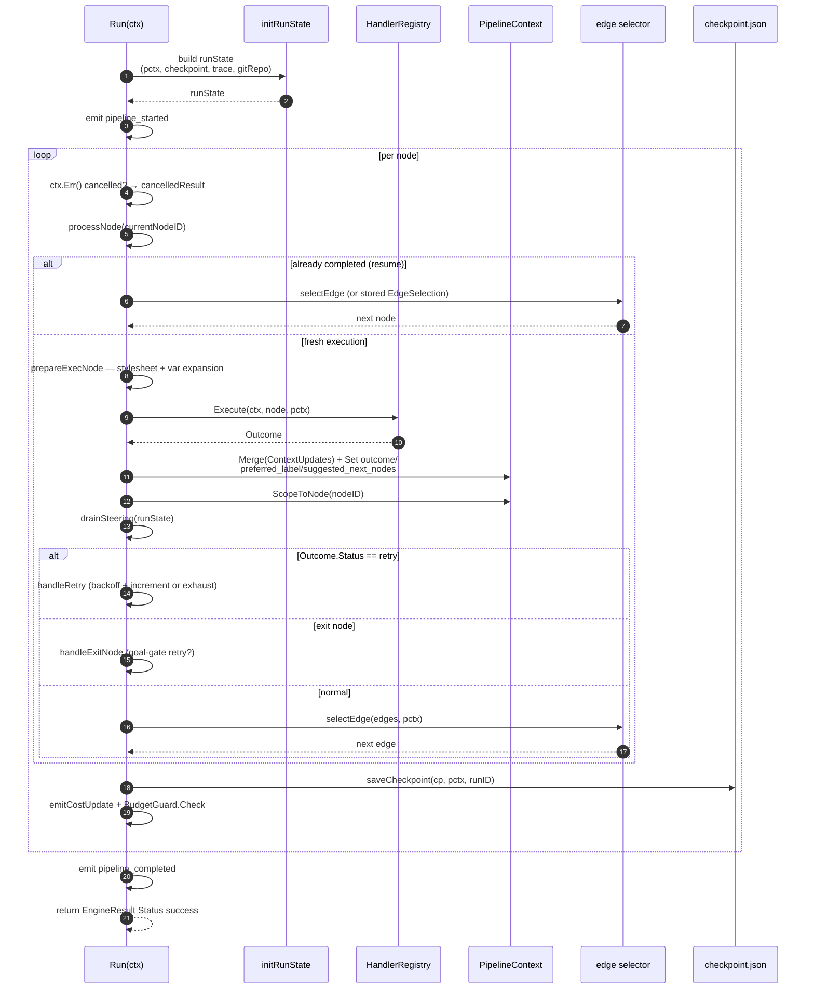
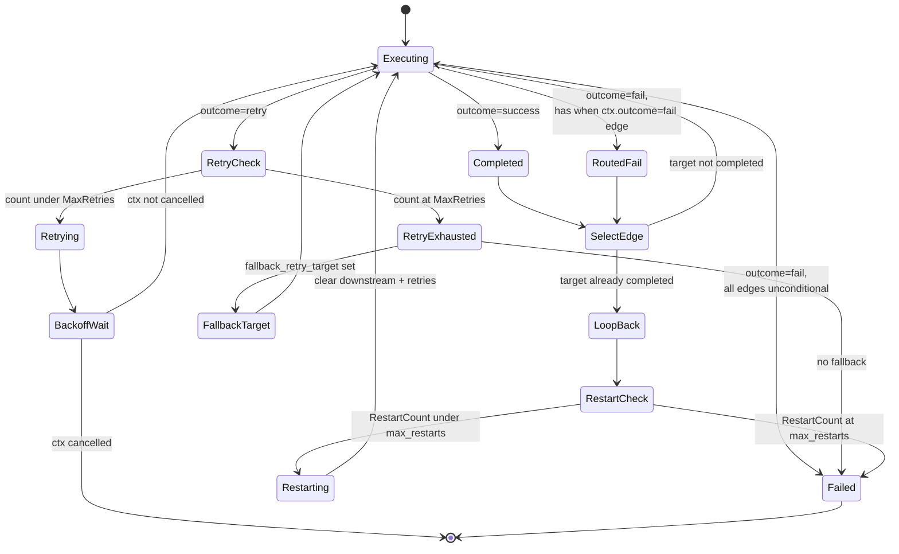
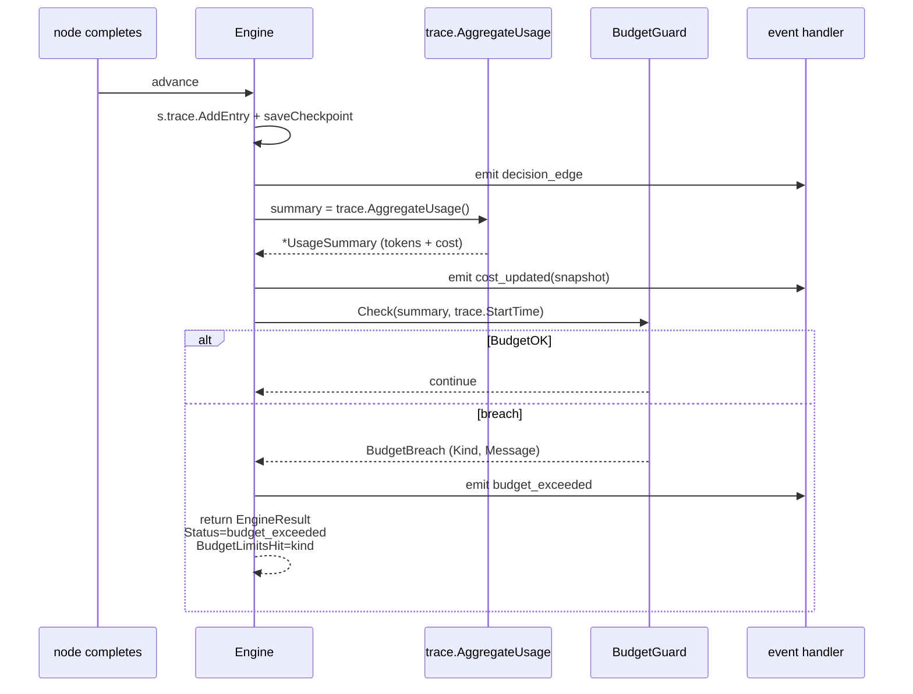
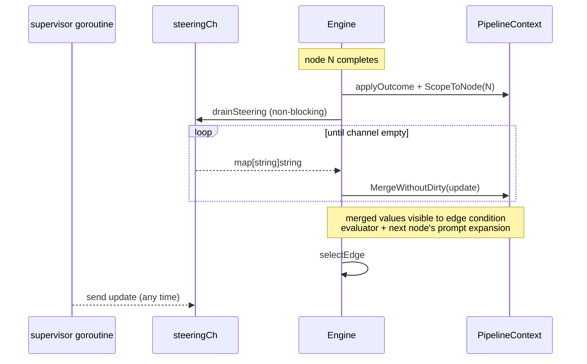

# Engine

The pipeline execution engine takes a `*pipeline.Graph` and a
`*pipeline.HandlerRegistry`, executes each node in the order determined by
handler outcomes and outgoing edges, emits lifecycle events, writes
checkpoints, optionally enforces a cost/time budget, and ultimately returns
an `*EngineResult`. Source: [`pipeline/engine.go`](../../pipeline/engine.go),
[`pipeline/engine_run.go`](../../pipeline/engine_run.go),
[`pipeline/engine_checkpoint.go`](../../pipeline/engine_checkpoint.go),
[`pipeline/engine_edges.go`](../../pipeline/engine_edges.go).

The engine is deliberately small. It has no knowledge of LLM calls,
subprocesses, human gates, or concurrency. Everything handler-specific lives
under [`pipeline/handlers/`](../../pipeline/handlers/). Everything
engine-specific — edges, retries, restarts, checkpoints, budgets, steering —
is in this file tree.

## Contents

1. [Overview](#overview)
2. [Run loop](#run-loop) — variable expansion,
   [`${graph.workflow_dir}` for embedded built-ins](#graphworkflow_dir-for-embedded-built-ins),
   [declared inputs binding](#declared-inputs-binding-553-555-556),
   [checkpoint semantics](#checkpoint-semantics) (restart budgets, fail-routing
   provenance, resume rewind)
3. [Run-state integrity: activity log and checkpoint](#run-state-integrity-activity-log-and-checkpoint-213-559)
4. [Outcomes and routing](#outcomes-and-routing) —
   [strict failure edges and the failure cascade](#strict-failure-edges-and-the-failure-cascade)
5. [Retry, restart, escalate](#retry-restart-escalate)
6. [Agent jail refusal and `writable_paths_mode`](#agent-jail-refusal-and-writable_paths_mode-642-648)
7. [Budget guard](#budget-guard) — [cost estimation and pricing](#cost-estimation-and-pricing-558-639)
8. [Steering channel](#steering-channel)
9. [Git artifact integration](#git-artifact-integration)
10. [Emitted events](#emitted-events)

`CLAUDE.md` carries only the short rule + pointer for each of these; this
file is the authoritative long-form text.

## Overview

```go
type Engine struct {
    graph             *Graph
    registry          *HandlerRegistry
    eventHandler      PipelineEventHandler
    checkpointPath    string
    resolveStylesheet bool
    initialContext    map[string]string
    artifactDir       string
    budgetGuard       *BudgetGuard
    gitArtifacts      bool
    steeringCh        <-chan map[string]string
}

func NewEngine(graph *Graph, registry *HandlerRegistry, opts ...EngineOption) *Engine
func (e *Engine) Run(ctx context.Context) (*EngineResult, error)
```

The options are set-once: `WithPipelineEventHandler`, `WithCheckpointPath`,
`WithStylesheetResolution`, `WithArtifactDir`, `WithInitialContext`,
`WithBudgetGuard`, `WithGitArtifacts`, `WithSteeringChan`. Most are
effective no-ops when their arguments are empty/nil: an unset
`checkpointPath` skips `saveCheckpoint`, a nil `BudgetGuard` short-circuits
to `BudgetOK`, an empty `steeringCh` drains zero updates, and so on. One
exception: `WithPipelineEventHandler(nil)` overwrites the default
`PipelineNoopHandler` with a nil interface, which then panics on the first
`Engine.emit` call. Callers that want to disable event handling should
either omit the option entirely or pass `pipeline.PipelineNoopHandler`
explicitly. The engine owns no LLM client, no exec environment, no
interviewer — those are handler-scoped. Handlers are provided by the
registry.

`EngineResult` carries `RunID`, `Status` (one of `success`, `fail`,
`budget_exceeded`), `CompletedNodes`, a full context `Snapshot`, the
`*Trace`, aggregated `*UsageSummary`, and — when applicable — the list of
budget dimensions that halted the run.

## Run loop

`Engine.Run(ctx)` is the main loop. It follows a simple pattern: look up the
next node, dispatch to its handler, apply the outcome, scope the node's
writes, drain any steering updates, pick an outgoing edge, repeat until the
exit node is reached or an error halts the run.


```mermaid
sequenceDiagram
    autonumber
    participant R as Run(ctx)
    participant S as initRunState
    participant Reg as HandlerRegistry
    participant P as PipelineContext
    participant Sel as edge selector
    participant FS as checkpoint.json

    R->>S: build runState<br/>(pctx, checkpoint, trace, gitRepo)
    S-->>R: runState
    R->>R: emit pipeline_started
    loop per node
        R->>R: ctx.Err() cancelled? → cancelledResult
        R->>R: processNode(currentNodeID)
        alt already completed (resume)
            R->>Sel: selectEdge (or stored EdgeSelection)
            Sel-->>R: next node
        else fresh execution
            R->>R: prepareExecNode — stylesheet + var expansion
            R->>Reg: Execute(ctx, node, pctx)
            Reg-->>R: Outcome
            R->>P: Merge(ContextUpdates) + Set outcome/<br/>preferred_label/suggested_next_nodes
            R->>P: ScopeToNode(nodeID)
            R->>R: drainSteering(runState)
            alt Outcome.Status == retry
                R->>R: handleRetry (backoff + increment or exhaust)
            else exit node
                R->>R: handleExitNode (goal-gate retry?)
            else normal
                R->>Sel: selectEdge(edges, pctx)
                Sel-->>R: next edge
            end
        end
        R->>FS: saveCheckpoint(cp, pctx, runID)
        R->>R: emitCostUpdate + BudgetGuard.Check
    end
    R->>R: emit pipeline_completed
    R-->>R: return EngineResult Status success
```

`processNode` splits into `processResumeSkip` (already completed in a prior
run, advance through stored edge selection or re-select) and
`processActiveNode` (fresh dispatch). The engine clears three routing-hint
keys on the context before every handler execution (`outcome`,
`preferred_label`, `suggested_next_nodes`) so a node never inherits a stale
hint from a previous node.

### Variable expansion

Two unrelated expansion syntaxes live in the codebase, applied at different
call sites:

1. **Legacy `$key` syntax** — applied by `prepareExecNode` in
   [`pipeline/engine_run.go`](../../pipeline/engine_run.go) before every
   handler dispatch. Two transforms run over each node attr:
   - `ExpandGraphVariables(text, vars)` rewrites `$key` tokens using the
     `$key → value` map built by `GraphVarMap` from graph-scoped context
     keys (`graph.*`). It does NOT touch `${...}` syntax.
     Source: [`pipeline/transforms.go`](../../pipeline/transforms.go).
   - `ExpandPromptVariables(prompt, ctx)` substitutes only the bare literal
     `$goal` on the `prompt` attr. It does NOT expand `${ctx.*}`.
2. **Namespaced `${ns.key}` syntax** — applied by `ExpandVariables` in
   [`pipeline/expand.go`](../../pipeline/expand.go). Supports three
   namespaces: `ctx.*` (pipeline context), `params.*` (subgraph
   parameters), and `graph.*` (graph attributes). Called from:
   - `engine_edges.go` when expanding edge `Condition` expressions before
     evaluation.
   - `handlers/prompt.go` when a codergen/human handler resolves its
     `prompt` attr.
   - `handlers/tool.go` when a tool handler resolves `tool_command` (with
     `toolCommandMode=true`, which additionally blocks all non-allowlisted
     `ctx.*` keys to prevent LLM output injection).
   - `handlers/human.go` when resolving human-gate prompts.
   - `expand.go` itself when a subgraph injects its `params` into a cloned
     child graph via `InjectParamsIntoGraph`.

   The engine's `prepareExecNode` does NOT call `ExpandVariables`; that
   happens at handler-level, inside the sites listed above. The split is
   why `${ctx.*}` works in `prompt` / `tool_command` / `condition` but not
   in arbitrary node attrs.

Both expansion syntaxes are single-pass — resolved values are never
rescanned, so a context value containing `$key` or `${...}` syntax is left
as-is. (See `CLAUDE.md` §Dippin-lang compatibility.)

### `${graph.workflow_dir}` for embedded built-ins

`${graph.workflow_dir}` is the one graph attr the loader seeds rather than
the author. **Contract:** `${graph.workflow_dir}/<relpath>` resolves a
workflow-relative file; the concrete path is implementation-defined and
workflow authors must not rely on it.

- **Disk load** — the source `.dip`'s directory (`pipeline.SeedWorkflowDir`,
  #332), seeded by both the CLI loader and the library's `SourceRef{Path}`
  path.
- **Embedded built-in** (bare name `tracker build_product`, or
  `SourceRef{Builtin}`) — the loader has no directory, so the graph is marked
  `workflow_builtin = <name>` (`pipeline.WorkflowBuiltinAttr`) at load and
  `NewEngineFromGraph` — after `resolveWorkDir`, before `bindInputs`
  (`stageWorkDir` in `tracker.go`) — materializes the built-in's embedded
  tree (`<name>.dip`, all of `prompts/<name>/` and `scripts/<name>/`, plus
  every directive-referenced sidecar) into the workdir via
  `pipeline.MaterializeBuiltinWorkflowDir` and sets `workflow_dir` to that
  absolute path. The whole tree is copied, not just directive-referenced
  files, so a sourced `lib/*.sh` helper is reachable. It is overwritten on
  every engine construction (fresh run and resume — the content is the
  running binary's, never stale); an author-declared `workflow_dir` wins;
  files are 0644 (sourced / `sh`'d, never exec'd); symlinked destinations are
  refused (`refuseIfSymlink`). The copy lives under `.tracker/` so the
  artifact-repo exclude keeps it out of commits/bundles. Customizing a
  built-in is `tracker init <name>` (a disk load), not editing the copy.
  Read-only entry points (`validate`, `simulate`, `doctor`, `DescribeInputs`)
  never materialize. The `writable_paths` jail only bounds writes (Landlock
  `RODirs("/")`), so a jailed tool node can still read the copy.
- **Packed `.dipx` is deliberately NOT covered**: its sidecars would come from
  an unverified sibling directory, a supply-chain regression for a
  SHA-verified bundle (#467), so `guardPackedWorkflowDir` keeps failing loud
  (#430). Built-ins are exempt from that objection because their sidecars are
  `go:embed`ded — the binary's own content.

The four embedded built-ins resolve their `prompt_file` / `command_file`
sidecars via `pipeline.ResolveFileDirectivesFS` over the embed FS
(`tracker.EmbeddedWorkflowFS()`) — a stopgap mirror of dippin's disk resolver
until dippin-lang#304 ships an `fs.FS` variant (signature stays, body becomes
a wrapper); the parity test in `pipeline/dippin_resolve_fs_test.go` pins it.
Giving an embedded built-in sidecars requires adding its
`examples/prompts/<name>` / `examples/scripts/<name>` dirs to the `go:embed`
list in `tracker_workflows.go`, or the embedded run cannot find them.
`tracker init <name>` copies the same sidecar set the engine materializes
(`pipeline.WorkflowFiles`: all of `prompts/<name>/` + `scripts/<name>/` —
including sourced `lib/` helpers no directive names — plus every `*_file`
directive path, e.g. superspec's shared `prompts/build_product/SpecLint.md`)
and refuses to overwrite any of them.

**Library callers must anchor a source** (`tracker.SourceRef`):
`Config.Source` / `WithSource` / `WithValidateSource` with `Path` (on-disk
file — sidecars resolve next to it, from any cwd) or `Builtin` (embed FS);
`ResolveSource` returns the right one via `WorkflowInfo.Ref()`. An
un-anchored source falls back to "byte-identical to a built-in → embed FS,
else cwd", which is wrong for a `tracker init` copy with edited sidecars —
always pass the ref (chatops and the CLI do).

### Declared inputs binding (#553, #555, #556)

Requires dippin ≥ v0.51. A workflow's dippin `inputs` block →
`Graph.Inputs []pipeline.InputSpec` (adapter `inputsFromIR`, see
[`adapter.md`](./adapter.md)). The library seam — `tracker.DescribeInputs`
(introspect, no run), `tracker.ValidateInputs` (structured
`[]pipeline.InputError`, standalone), `Config.Inputs []tracker.Input`
(`StringInput` / `FileInput` / `FileInputBytes` / `SecretInput`) — is
documented for embedders in [`embedding.md` §1a](./embedding.md). Engine-side
contract:

- **Bound at t=0, fail closed.** `bindInputs` (`tracker_inputs.go`) validates
  + stages at run start — in `NewEngineFromGraph`, after `resolveWorkDir` and
  the built-in materialization above — and returns `*InputValidationError`
  before any node runs on a missing-required (empty/whitespace counts) or
  constraint violation.
- **Closed, untrusted namespace.** Values seed a dedicated
  `${inputs.<name>}` namespace that is **untrusted by construction** — never
  on the tool_command safe-key allowlist (`inputContextPrefix` in
  `pipeline/expand.go`; also in `ambientVarPrefixes` so the submit-time
  validator doesn't flag it; dippin lints `${inputs.*}` in a `command:` as
  DIP157).
- **`file` AND `secret` inputs are staged** to `<workDir>/.tracker/inputs/<name>`
  (fixed path from the declared name; `pipeline.StageInputFile`, 0600 +
  `O_NOFOLLOW`, `MaxInputFileBytes` = 10 MiB cap) so a workflow's shell reads
  the staged path directly — never `${inputs.spec}`. `build_product` /
  `build_product_with_superspec` declare `spec: file` and adopt the staged
  file as `SPEC.md`.
- **Secrets never enter the context value.** A `secret` input's VALUE is
  staged to the 0600 file and `${inputs.<name>}` is only the PATH (#555), so
  the secret never enters a prompt / provider wire / trace / checkpoint — read
  it from the staged path in a tool (`API_KEY=$(cat "$path")`). `.tracker/`
  is git-excluded from artifact repos so staged secrets never reach a
  commit/bundle. Residual: the 0600 file on same-UID local disk, and the value
  on the provider wire when the agent uses it.
- **Subgraph call-site binding (#556; requires dippin ≥ v0.58's DIP160 arity
  lint).** `SubgraphHandler` validates the parent's `subgraph_params` against
  the child graph's declared value-kind inputs (`bindSubgraphInputs` in
  `pipeline/subgraph.go`) and seeds the child's `inputs.*` namespace — a
  subgraph drives a child's inputs the same way a top-level run does, failing
  closed on a missing-required/invalid value. `file`/`secret` inputs are NOT
  bindable from a subgraph call site (a params string can't be staged) and
  are filtered out — the child resolves them itself.

Design + phases:
[`docs/superpowers/specs/2026-08-06-issue-553-pipeline-inputs-design.md`](../superpowers/specs/2026-08-06-issue-553-pipeline-inputs-design.md).

### Stylesheet resolution

If `WithStylesheetResolution(true)` is set and the graph has a
`model_stylesheet` attr, `prepareExecNode` resolves per-role model
overrides through the stylesheet before variable expansion. Used to
override per-node `llm_model` / `llm_provider` based on role tags without
rewriting the `.dip` file. See [`pipeline/stylesheet.go`](../../pipeline/stylesheet.go).

### Checkpoint semantics

Checkpoints store completed nodes, per-node edge selections, retry/restart
counters, per-node gate state, and a context snapshot. Resume is fragile by
nature — every field below exists because a naive resume produced a wrong
route at some point.

- **Checkpoint file**: the AUTHORITATIVE `checkpoint.json` lives in the
  secure state dir (`pipeline.SecureCheckpointPath(runID)`, #559 — see
  [Run-state integrity](#run-state-integrity-activity-log-and-checkpoint-213-559)),
  with a best-effort non-authoritative snapshot under the run artifact dir.
  An explicit `WithCheckpointPath` / `Config.CheckpointDir` is honored as-is
  (no relocation). Format in
  [`pipeline/checkpoint.go`](../../pipeline/checkpoint.go).
- **Loaded at startup**: `loadCheckpointAndMerge` restores `RunID`,
  `CompletedNodes`, `RetryCounts`, `Context`, `RestartCount` +
  `RestartCounts`, `EdgeSelections`, `GateStates` (per-node goal-gate state,
  #602; a pre-#602 checkpoint's
  `node_outcomes`/`fallback_taken`/`gate_recheck_pending`/`overridden_gates`
  maps are migrated into it one-way on load), `HaltedAt`. Graph attrs
  (`graph.*`) are re-seeded from the live graph so `--param` overrides don't
  regress to stale checkpoint values.
- **Restart budget is per resolved loop target AND per iteration of the
  enclosing loop** (#603, #643): `Checkpoint.RestartCounts[target]` keys the
  `max_restarts` ceiling by the resolved restart target; the loop-header
  boundary resets nested targets' counts and re-arms their one-shot fallback
  latches (`Checkpoint.ClearFallbackTaken`). Full mechanics, including the
  dominator analysis in `pipeline/engine_restart_scope.go` and the
  "outermost loop's `max_restarts` is the run-wide bound" consequence, are in
  [Restart](#restart) below. A legacy pre-#603 checkpoint carries only the
  scalar `RestartCount` (unattributable to a target), so per-target budgets
  start fresh on resume — a conservative reset.
- **On-disk circuit breakers are belt-and-suspenders, and must be
  branch-namespaced under `parallel`.** The per-milestone on-disk counters
  (e.g. the `fix_attempts` file in `build_product.dip`) are no longer the sole
  isolation mechanism, but for **parallel** milestones they must still be
  branch-namespaced or concurrent fix-loops clobber one shared path: the
  parallel handler seeds `ctx.branch_id` (the branch target node ID) into each
  branch's isolated context, so a branch's tool node can key its counter as
  `.ai/milestones/${ctx.branch_id}/fix_attempts` (#420; `branch_id` is
  engine-set, author-controlled, and safe-key allowlisted for `tool_command`
  interpolation). A branch that fans out to a subgraph gets its own restart
  budget for free — each subgraph runs a child engine with a separate
  checkpoint / `RestartCounts`.
- **Saved on node outcome**: every successful non-terminal node outcome
  and every retry saves the checkpoint. Failure paths also save a
  partial-context checkpoint so a resume can see what was written before
  the error, with one intentional exception: `handleExitNode` (in
  `engine_run.go`) on the plain success path records the trace entry, emits
  git/cost/budget events, and returns without calling `saveCheckpoint` /
  `saveCheckpointWithTag` — the exit node is the end of the run, so there is
  nothing to resume. (The goal-gate retry and fallback branches inside
  `handleExitNode` still call `saveCheckpointWithTag`, since those redirect
  to another node.) The **terminal-halt** paths — `checkStrictFailure`'s
  dead stop, `handleRetryExhausted` with no `fallback_retry_target`, a
  failed exit node, and an unsatisfied goal gate with no redirect — save
  through `recordHalt` (#651), which stamps `Checkpoint.HaltedAt` with the
  node the run died at so the next resume can tell "ended here" from
  "was on the way here".
- **Fail-routing provenance** (#651): whenever the engine routes AWAY from a
  failed node — a `when ctx.outcome = fail` edge (`advanceToNextNode`), the
  node/graph `fallback_target` (`strictFailureFallback`), an exhausted
  retry's `fallback_retry_target` (`handleRetryExhausted`), or a goal gate's
  exit-time redirect (`handleExitNode`) — it records the provenance on the
  TARGET's `GateState` (`RecordFallbackOrigin`): #650's `FallbackOrigin`
  node field plus `FallbackOriginOutcome` / `FallbackOriginReason` (240-byte
  cap) / `FallbackOriginKind` — one persisted representation, read back as a
  `FallbackOriginRecord` by `GetFallbackOrigin`. `advanceToNextNode` clears
  the target's origin on every ordinary advance BEFORE a fail-edge hop
  re-records it, so a shared escalation node carries the latest origin. A
  `fail_edge` hop is hidden from #650's node-only `FallbackOrigin(id)`
  accessor: an authored `when fail` edge is not a fallback, but it is still
  fail-routing provenance for the rewind. Terminal copy and diagnose use the
  kind-aware `FailRouteOrigin(id)` (#654) instead, rendering `routed from
  "X" via fail edge` for a `fail_edge` hop and `reached from "X" failure`
  for the fallback kinds (`NodeFailure.ReachedFrom` + `ReachedVia`). A
  self-route (target == origin) is ignored. All fields are `omitempty`: a
  pre-#651 checkpoint loads unchanged and resumes exactly as before.
- **Resume entry point** (#651, `Engine.resumeEntryNode` in
  `engine_resume.go`): on resume the engine consumes `HaltedAt` (the halted
  node is un-completed so it re-executes — `OutcomeFail` marks completion
  before routing, and skipping a completed terminal through its edge would
  otherwise fabricate a success) and then picks where to re-enter:
  1. `ResumePolicy.From` (`tracker -r <id> --from <node>`,
     `Config.ResumeFrom`) — explicit. Validated in `initRunState` before
     `pipeline_started`: the node must exist and have been reached
     (completed, or the checkpoint's current node); otherwise the run is
     refused with a clear error.
  2. **Automatic rewind**, unless `NoRewind` (`--resume-no-rewind`,
     `Config.ResumeExact`): if the run halted AT a node that has a
     `FallbackOrigin` **and is a true dead end** (`isFailDeadEnd`, #654) —
     build_product's `Setup -> AbortRun when ctx.outcome = fail` followed by
     AbortRun's `exit 1` — re-entering the terminal would only fail again,
     so the run rewinds to the origin (`Setup`) and the failed step is
     retried with its cause presumably fixed. A dead end is a node whose only continuation is the exit
     node (no outgoing edges, or every edge leads to `ExitNode`); a declared
     fallback sink with real onward routing (`EscalateMilestone`) is not one. A
     fail-routed node with real onward routing — `Test -> Fix when fail`,
     `Fix -> Test`, and `Fix` died transiently — is not: the run resumes at
     `Fix` in place rather than re-running `Test`, which already did its job.
     The rewind is
     **refused with a `warning`** (and the run resumes at the terminal as
     before) when the origin is a `wait.human` gate — its failure was a
     decision (yes/no "No", abandon), not a transient fault — or a
     `parallel` / `subgraph` / `stack.manager_loop` node, whose child work
     may have partially completed invisibly to the parent checkpoint.
     `--from` still reaches those: it is an explicit operator instruction.
  3. Otherwise `CurrentNode`, exactly as before.

  A rewind (`rewindTo`) un-completes the target and everything reachable
  from it plus the halted node and its downstream (a fail-closed terminal
  is usually not reachable from the origin through edges — `on_failure` is
  an attribute), drops their stale edge selections, resets their retry
  counters and re-arms their one-shot fallback latches (so a second genuine
  failure can still escalate — the rewind never turns a fail-closed
  terminal into a silent pass), deletes the consumed `FallbackOrigin`
  entry, sets `CurrentNode`, emits `resume_rewound` (`edge_from` = halted
  node, `edge_to` = entry node, `cleared_nodes`, `rewind_reason`,
  `outcome_status` = the origin's recorded outcome) and saves the
  checkpoint. `RestartCounts` are deliberately untouched: a rewind is
  operator-initiated recovery, not a loop iteration, so the `max_restarts`
  ceiling keeps counting the loop's real restarts (#603).
- **Edge selections are replayed**: if `cp.EdgeSelections[nodeID]` is set,
  resume uses the stored target instead of re-evaluating the condition —
  this prevents a condition like `when ctx.outcome = success` from being
  re-evaluated against stale context after a resume.
- **Fidelity-aware compaction**: on resume, completed-node context is
  compacted to the node's declared fidelity level (preserving declared
  `reads:` keys pinned at full fidelity). See `pipeline/fidelity.go` and
  [`context-flow.md`](./context-flow.md).

## Run-state integrity: activity log and checkpoint (#213, #559)

The operational contract (path resolution, sentinel, absolute-env rule,
runID validation, snapshot) is the *Activity log integrity* entry in
`CLAUDE.md` Critical Rules. This section is the threat model and the
residual risks behind it.

### Activity log (#213)

- **Path.** The live audit log path is computed by
  `pipeline.SecureActivityLogPath(runID)`; reads go through
  `tracker.ResolveActivityLogPath`. Resolution order
  (`secureActivityLogBase` in `pipeline/audit_path.go`; each step yields
  `<base>/<runID>/activity.jsonl`): `$TRACKER_AUDIT_DIR/<runID>/` →
  `$XDG_STATE_HOME/tracker/runs/<runID>/` → on Windows,
  `%LOCALAPPDATA%\tracker\runs\<runID>\` →
  `$HOME/.local/state/tracker/runs/<runID>/` →
  `os.TempDir()/tracker-audit/<runID>/` (last-resort when `$HOME` is
  unresolvable). File mode `0o600`, opened `O_NOFOLLOW`.
- **Sentinel.** Every runtime-written line is prefixed with `\x1f\x1e`
  (`pipeline.ActivityLogSentinel`). Lines lacking it count as
  `runtimeAnomalies.InjectedLines` and fire `SuggestionAuditLogInjection` in
  `tracker diagnose`. The sentinel is detection, not authentication.
- **Absolute env only.** `TRACKER_AUDIT_DIR` and `XDG_STATE_HOME` MUST be
  absolute paths — relative values are silently ignored (`pipeline.absEnv`)
  so CWD can't re-anchor the secure log.
- **RunID validation.** `pipeline.validateRunID` rejects separators, `..`,
  `.` so a tampered checkpoint can't escape the base.
- **Snapshot.** A sentinel-stripped snapshot is written to the legacy
  `<workDir>/.tracker/runs/<runID>/activity.jsonl` on close (best-effort, for
  `--export-bundle` / git_artifacts).

**Threat model and residuals:**

- Pre-#213 the log lived at `<workDir>/.tracker/runs/<runID>/activity.jsonl`
  mode `0o644`. A tool subprocess running with `cmd.Dir = workDir` could
  append fake decision edges, truncate to suppress `tool_output_truncated`,
  or forge `pipeline_completed status=success` via relative-path shell
  redirection. Relocation to `$XDG_STATE_HOME/.../<runID>/` removes that
  *relative-path* reach.
- **Absolute-path reach by a same-UID subprocess is a residual, not a bug.**
  An *unjailed* tool subprocess is given `TRACKER_RUN_ID` (#323) and inherits
  `HOME`, so it can reconstruct
  `$HOME/.local/state/tracker/runs/$TRACKER_RUN_ID/activity.jsonl` and
  truncate / `sed -i` / delete it. Relocation only defends the relative-path
  (`cmd.Dir=workDir`) vector; a process at tracker's UID can always reach
  tracker's own state files (dir `0700` / file `0600` gate only *other*
  users), and could enumerate the runs dir even without `TRACKER_RUN_ID`. The
  sentinel counts *injected* lines, not *deleted* ones, so silent
  line-deletion is out of scope by construction. The real boundary for an
  untrusted tool node is the `writable_paths` Landlock jail (which bounds
  writes to the workdir globs, so `$HOME/.local/state` is unreachable).
  Operator copy must not claim the secure log is tamper-proof against a
  same-UID node.
- The sentinel detects casual injection (shell redirection, `tee -a`,
  `find ... -delete`). It does **not** detect a motivated forger who reads
  tracker's source and emits the sentinel bytes themselves. Per-line HMAC was
  considered (Option C) and dropped — key-management cost beats marginal
  gain. Operator-facing copy must not claim the runtime "prevents" forgery.
- Snapshot guards: the Close-time copy (`pipeline/events_jsonl_snapshot.go`)
  `Lstat`s `<artifactDir>` and `<artifactDir>/<runID>` before MkdirAll/open
  and refuses if either is a symlink. Residual TOCTOU between Lstat and
  MkdirAll (microsecond window) is accepted because the secure file remains
  authoritative.
- Legacy runs without a secure file (pre-#213 or archive-moved):
  `ResolveActivityLogPath` falls back to `<runDir>/activity.jsonl` without
  sentinel validation — absence of sentinel on the legacy path is not an
  injection signal.

### Checkpoint (#559, relocated like #213)

`checkpoint.json` is **authoritative for resume** (`EdgeSelections` picks the
next edge, `Context` is restored), so the authoritative copy lives in the
secure state dir — `pipeline.SecureCheckpointPath(runID)`, the SAME
`<secureBase>/<runID>/` as the activity log — out of the tool-reachable
workdir (`e.checkpointPath` is set to it in `engine_run.go` when no explicit
path was given). `tracker.ResolveCheckpoint` reads secure-first (legacy
`<workDir>/.tracker/runs/<runID>/checkpoint.json` fallback for pre-#559 /
archive-moved runs). A best-effort **snapshot** is still written under the
artifact dir so read-only tooling (diagnose / audit / run-manifest) keeps
working; that snapshot is NOT authoritative — a tampered snapshot corrupts
only diagnostics, never resume routing. An explicit `WithCheckpointPath` /
`Config.CheckpointDir` is honored as-is (no relocation). The residual is
identical to the activity log: relocation removes the relative-path
(`cmd.Dir=workDir`) tamper vector, not the absolute-path reach of a same-UID
process that knows `TRACKER_RUN_ID` + `$HOME`; the `writable_paths` jail
remains the boundary for an untrusted tool node. `writeFileAtomic` also
`O_NOFOLLOW`s the temp write.

## Outcomes and routing

Every handler returns an `Outcome`:

```go
type Outcome struct {
    Status             string            // "success", "fail", "retry", or custom
    ContextUpdates     map[string]string
    PreferredLabel     string
    SuggestedNextNodes []string
    Stats              *SessionStats
}
```

After `applyOutcome`, the engine picks the next edge via `selectEdge` using
priority order:

```mermaid
flowchart TD
    start["outgoing edges from current node"]
    start --> cond{any edge has<br/>matching condition?}
    cond -->|yes| c_sel["select first matching edge<br/>priority = condition"]
    cond -->|no| lbl{context.preferred_label<br/>matches any edge.Label?}
    lbl -->|yes| l_sel["select by label<br/>priority = label"]
    lbl -->|no| sug{context.suggested_next_nodes<br/>contains any edge.To?}
    sug -->|yes| s_sel["select by suggested<br/>priority = suggested"]
    sug -->|no| els{no unconditional edge,<br/>Graph.ElseTarget set,<br/>outcome != fail?}
    els -->|yes| e_sel["route to section-level else<br/>priority = else"]
    els -->|no| unc{any unconditional edge?}
    unc -->|yes| wgt["pick highest weight<br/>lexical tiebreak"]
    unc -->|no| fail{outcome = fail and<br/>fallback_target / on_failure<br/>resolves (not latched, not self)?}
    fail -->|yes| f_sel["route to fallback<br/>priority = fallback (#653)"]
    fail -->|no| halt["no matching edges — halt"]
    c_sel --> emit["emit decision_edge event"]
    l_sel --> emit
    s_sel --> emit
    e_sel --> emit
    wgt --> emit
    f_sel --> emit
```

Source: [`pipeline/engine_edges.go`](../../pipeline/engine_edges.go) (steps
through weight) and
[`pipeline/engine_failure_cascade.go`](../../pipeline/engine_failure_cascade.go)
(the fallback step, run by `advanceToNextNode` when `selectEdge` returns the
typed `noMatchingEdgesError`). The fallback step sits **after** `else` in the
walk but the two never compete: `else` is skipped on a `fail` outcome, and the
fallback step only runs on one.

#### Section-level `else ->` default (#649)

A dippin `edges` block may end with one `else -> <node>` line
(`ir.Workflow.ElseTarget`, dippin ≥ v0.43). The adapter stores it as
`Graph.ElseTarget` — a graph-level field, **not** a synthesized edge — and
`selectByElse` consults it as the last step before the no-matching-edge
error. The rule mirrors dippin's `simulate.resolveConditionalNext` exactly:

- The node must have **at least one outgoing edge and none of them
  unconditional** (`Graph.ElseRoute`). A node with its own unconditional
  edge takes that edge (weight/lexical) and never sees `else`; an edge-less
  node is a dead end in both runtimes (`no outgoing edges from non-exit
  node`) and is not rescued by `else`.
- Every guard evaluated false, no `preferred_label` matched (human gates
  route by label first, exactly as in dippin), and no `suggested_next_nodes`
  hint matched.
- **Success-side only.** When `ctx.outcome` is `fail`, `else` is skipped and
  the node runs the failure cascade (#653) instead — `fallback_target` /
  `defaults.on_failure` — halting only if nothing resolves. This is dippin's
  documented runtime contract (`docs/edges.md` § *Section-level default*:
  "`else` never intercepts a genuine node failure"), and it also keeps `else`
  out of the strict-failure rule — a synthesized unconditional edge would
  have made a failed node look like it had *no* failure route. `dippin
  simulate --scenario X.outcome=fail` cannot model a genuine failure (it has
  no failure channel and would walk to `else`); the spec, not that
  simulation, is the authority for the fail case.
- Parallel branch targets are never *routed by else at run time*: they
  execute inside `ParallelHandler`, not the run loop, so `selectEdge` never
  runs for them. (`Graph.ElseRoute` can still return true for a branch node
  whose author-written conditional edge deduplicated the implicit
  unconditional fan-in edge — that only affects the static walks.) dippin
  does run `resolveNext` on branch nodes; what keeps `else` out there is the
  implicit unconditional edge to the fan-in join.
- The restart machinery walks the same else-aware graph: `clearDownstream`,
  `downstreamNodes`, and the #643 dominance analysis (`reachableInBFSOrder`,
  `predecessorDominators`, back-edge detection) use `successorIDs` /
  `predecessorIDs`, which include the else route. So a restart of a node
  upstream of an else-only target clears that target, its next else hop is a
  fresh visit (not a spurious `loop_restart`), and an `else`-target → header
  edge is a real back edge.

The hop emits `decision_edge` with `edge_priority = "else"` plus a
`conditional_fallthrough` event carrying the missed conditions and the same
`edge_priority`, so `tracker diagnose` explains the route as "took the
section-level `else -> X` default" rather than a generic fallback. The
synthesized in-memory edge is tagged `Attrs["synthesized"]="else"` and is
never added to the graph, so edge listings, coverage, and the TUI edge view
show only what the author wrote. `tracker simulate` and the
variable-availability validator (#505) both follow the else route in their
reachability walks, so an else-only target is not reported unreachable.

### Condition expressions

Edge conditions use a small language evaluated by
[`pipeline/condition.go`](../../pipeline/condition.go): `=`, `==`, `!=`,
`<`, `<=`, `>`, `>=` (numeric, float-coerced), `contains`, `startswith`,
`endswith`, `in`, `matches` (regex), `not`, `&&`, `||` (no
parentheses — `||` is lowest precedence, `&&` higher). The dippin word forms
`and` / `or` are accepted as quote-aware, whitespace-bounded synonyms (#647),
but a `.dip` condition never reaches this parser as raw text: the adapter
serializes dippin's `Condition.Parsed` AST into this dialect
([`SerializeDippinCondition`](../../pipeline/condition_serialize.go), see
[adapter.md](adapter.md#condition-serialization-647)), so evaluation cannot
drift from `dippin simulate`. Numeric and `matches`
operators require surrounding spaces (like `==`); a non-numeric numeric-literal
or a malformed regex is an author error the evaluator surfaces (and validation
catches), whereas a non-numeric runtime value on the left warns and yields false. The evaluator strips
the `ctx.`, `context.`, and `internal.` prefixes from keys before lookup,
so dippin-lang conditions like `ctx.outcome = success` match tracker's bare
`outcome` key.

Condition variables are expanded through `ExpandVariables` before
evaluation. In the default lenient mode used by the engine
(`strict=false`), an unresolved `${ctx.x}` expands to an empty string
**without logging** — see `expandVariablesPass` in
[`pipeline/expand.go`](../../pipeline/expand.go). The only built-in
warning path for unresolved variables lives inside
[`pipeline/condition.go`](../../pipeline/condition.go) at
`resolveAndWarnVar`: when a condition clause like `ctx.outcome = success`
references a key the evaluator can't resolve, it logs `warning: unresolved
condition variable %q ...` via the standard `log` package and treats the
value as an empty string. `ExpandVariables` with `strict=true` returns an
error instead of expanding to empty, but no engine call site currently
uses strict mode.

### `SuggestedNextNodes` override

The parallel handler uses this to direct post-dispatch control flow to the
fan-in join node. After spawning branches, it sets the typed
`Outcome.SuggestedNextNodes = []string{joinID}` field (see
[`pipeline/handlers/parallel.go`](../../pipeline/handlers/parallel.go), #451)
— engine-internal routing state stays off the user-visible context map. The
single serialization point is `applyOutcome`
([`engine_run.go`](../../pipeline/engine_run.go)), which mirrors a non-empty
`Outcome.SuggestedNextNodes` slice into `pipeline.ContextKeySuggestedNextNodes`
(comma-joined). The engine's edge selector then reads that context key via
`pctx.Get(ContextKeySuggestedNextNodes)` in
[`engine_edges.go`](../../pipeline/engine_edges.go) and uses it as a priority
hint when selecting among the current node's existing outgoing edges — the
selector matches each suggested ID against `edge.To` and picks the first
match. This is a routing **hint**, not an override that can jump to
arbitrary nodes outside the graph's edge set. It's how the engine supports
parallel execution without knowing what parallel execution is, while still
respecting the declared graph. Edge selection, checkpoint routing-hints, and
memo replay all read the mirrored context key.

### Strict failure edges and the failure cascade

A `fail` outcome resolves in dippin's documented order (dippin `docs/edges.md`
§ Failure Handling; #653):

1. an outgoing edge whose condition matches (`when ctx.outcome = fail` /
   `on fail`);
2. bounded node retry (`retry_target` + `max_retries` — the `OutcomeRetry`
   path, see [Retry](#retry));
3. the node's own `fallback_target` / `fallback_retry_target`;
4. the graph's `defaults.on_failure` (adapter → graph attr `fallback_target`,
   #309);
5. halt.

`findFallbackTarget` implements 3→4 (node first, then graph). The
section-level `else ->` default (#649) is success-side only and is **never**
in this path: it is skipped when the outcome is `fail`, so a failed node whose
guards all miss runs the cascade rather than being funneled to the else
target.

**Pure strict-failure rule (#295, unchanged).** When a node's outcome is
`fail` and ALL outgoing edges are unconditional, `checkStrictFailure`
(`engine.go`) never takes the unconditional edge — it preserves WIP first
(`commitWIPBeforeRouting`, #302), runs steps 3–5 via `strictFailureFallback`,
and dead-stops if nothing resolves with
`node %q failed with no conditional edges to handle failure`. This prevents
tool nodes (Setup, Build, …) from silently continuing after a failure. Nodes
with **any** conditional edge are considered intentionally routed and are
exempted from the check: a failed node with conditional edges AND an
unconditional edge still takes the unconditional edge (weight/lexical) as
before. A failing node with **no** outgoing edges takes the same path (an
abort terminal, #650): `checkStrictFailure` runs before the
no-outgoing-edges invariant so WIP preservation and the reason-carrying
`stage_failed` still fire; a success outcome with no edges remains the
invariant error.

**Cascade for a failed node with conditional edges (#653).** For a failed node
that *has* conditional edges, `checkStrictFailure` returns early. If one of
those edges matches `fail` it wins. When **every** edge is conditional and
none matched, `selectEdge` returns the typed `noMatchingEdgesError` and
`advanceToNextNode` runs `unmatchedFailureCascade`
([`engine_failure_cascade.go`](../../pipeline/engine_failure_cascade.go)),
which runs steps 3–5 — no longer a bare `no matching edges` dead-stop even
with `defaults.on_failure` set. It resolves the target with
`findFallbackTarget`, preserves WIP before the routing decision, honours the
one-shot `FallbackTaken` latch (#642 — a latched node emits
`fallback_latched` and halts naming the consumed fallback), and hands off to
`strictFailureFallback` for the actual advance, which records
`FallbackOrigin` on the target (kind `strict_failure` — the cascade lands on
the same mechanism; the two are told apart by the cascade's
`conditional_fallthrough` event). `tracker diagnose` explains the route as
the failure cascade rather than a generic fallback.

**Every fallback hop is recorded** — cascade AND pure strict-failure go
through `recordFallbackHop`: `decision_edge` with `edge_priority = fallback`
(`EdgePriorityFallback`), `conditional_fallthrough` carrying the missed
guards when any were tried, and `SetEdgeSelection` so a resume replays the
hop instead of re-selecting the unconditional edge (previously a
strict-routed node had no selection, and a resume replaying it via
`resumeSkipNode` re-ran `selectEdge`, took the unconditional edge, and
silently skipped the fallback).

**Step 5 is a real terminal** (`terminalFailureHalt`, shared by
`checkStrictFailure` and the cascade): WIP preserved
(`escalateWorkPreserve`), reason-carrying `stage_failed`, `recordHalt` (so
resume sees `halted_at`), an `OutcomeFail` result whose error text still
contains `no matching edges`.

**One-shot fallback latch (#642).** Every fallback (retry-exhausted
`fallback_retry_target`, strict-failure `fallback_target`, goal-gate
exhausted path) is one-shot per node per run (`GateState.FallbackTaken` on
the checkpoint): a second failure after the fallback path looped back emits
`EventFallbackLatched` from all three sites (`emitFallbackLatched`) and
dead-stops with `OutcomeFail` naming the consumed fallback instead of cycling
forever or claiming "no failure edge". The latch is re-armed only by a
counted restart of an enclosing loop header (#643, see [Restart](#restart))
or by a resume rewind (#651, see [Checkpoint semantics](#checkpoint-semantics)).

**A self-target is no fallback (#650).** `findFallbackTarget` /
`handleRetryExhausted` skip a fallback that resolves to the failing node
itself, so a fail-closed terminal like build_product's `AbortRun` (the
graph-level `on_failure` target) runs once and halts — no re-entry, no latch
consumed, no `fallback_latched`. The node reached via a fallback records its
origin (`GateState.FallbackOrigin`, cleared on ordinary-edge entry; see
[Checkpoint semantics](#checkpoint-semantics)) so the terminal
`stage_failed` / CLI error names the real cause:
`node "AbortRun" (reached from "Setup" failure)`.

**Tool timeouts are ordinary failures (#644).** A tool node exceeding its
`timeout:` is an `OutcomeFail`: the process group is killed,
`ctx.tool_stderr` gets `command timed out after <timeout>` appended, the
stdout tail is kept, and `EventToolTimeout` is emitted — so
`when ctx.outcome = fail` / `fallback_target` route it, and the strict rule
applies when nothing routes it. Only a mid-command cancellation of the run's
context (Ctrl+C, library caller ctx, parallel `branch_timeout`, parent
deadline — not `--max-wall-time`, which `BudgetGuard` checks between nodes)
stays a hard handler error.

**Failure reasons ride the events (#652).** Tool nodes set
`Outcome.FailureReason = "exit <code>: <stderr tail>"` on non-zero exit
(stdout tail when stderr is empty) — it rides `stage_failed.Err` →
activity-log `error` → TUI `FAILED:` → diagnose. Capture of
`ctx.tool_stdout` / `tool_stderr` is unchanged.

Pipelines that want a node-specific failure route use
`when ctx.outcome = fail` edges (step 1); `defaults.on_failure` is the
workflow-wide catch-all (step 4).

## Retry, restart, escalate

Three related but distinct recovery mechanisms:


```mermaid
stateDiagram-v2
    [*] --> Executing
    Executing --> Completed: outcome=success
    Executing --> Failed: outcome=fail,<br/>all edges unconditional
    Executing --> RoutedFail: outcome=fail,<br/>has when ctx.outcome=fail edge
    Executing --> RetryCheck: outcome=retry
    RetryCheck --> Retrying: count under MaxRetries
    RetryCheck --> RetryExhausted: count at MaxRetries
    Retrying --> BackoffWait
    BackoffWait --> Executing: ctx not cancelled
    BackoffWait --> [*]: ctx cancelled
    RetryExhausted --> FallbackTarget: fallback_retry_target set
    RetryExhausted --> Failed: no fallback
    FallbackTarget --> Executing
    Completed --> SelectEdge
    RoutedFail --> SelectEdge
    SelectEdge --> LoopBack: target already completed
    SelectEdge --> Executing: target not completed
    LoopBack --> RestartCheck
    RestartCheck --> Restarting: RestartCount under max_restarts
    RestartCheck --> Failed: RestartCount at max_restarts
    Restarting --> Executing: clear downstream + retries
    Failed --> [*]
```

### Retry

Per-node. Controlled by `RetryPolicy` resolved in
[`pipeline/retry_policy.go`](../../pipeline/retry_policy.go):

- Named policies: `none`, `standard` (default: 2 retries, 2s base,
  exponential), `aggressive` (5 retries, 500ms), `patient` (3 retries, 10s),
  `linear` (3 retries, 2s linear).
- Resolution order: node attr `retry_policy` → graph attr
  `default_retry_policy` → `standard`.
- Overrides: node attr `max_retries` / graph attr `default_max_retry`
  override `MaxRetries`; node attr `base_delay` overrides `BaseDelay`.
- Backoff: `ExponentialBackoff` (2ⁿ × base + ±25% jitter) or
  `LinearBackoff` ((n+1) × base + ±25% jitter). Both capped at 60s.

When a handler returns `OutcomeRetry`:

1. If `RetryCount(nodeID) < MaxRetries`: increment, wait backoff, emit
   `EventStageRetrying`, clear downstream completion (so dependent nodes
   re-run), save checkpoint, route to `retry_target` (default: the node
   itself).
2. Otherwise: route to `fallback_retry_target` if set; else fail the
   pipeline. The fallback is **one-shot per node per run** (#642): taking it
   sets the node's `FallbackTaken` latch (persisted on the checkpoint's
   per-node `GateState`, so a resume cannot re-take it). If the fallback path
   leads back into the node and it exhausts its retries again, the engine
   emits `EventFallbackLatched` and dead-stops with `OutcomeFail` instead of
   re-routing — the same semantics as `strictFailureFallback` and the
   goal-gate exhausted path. Without the latch, `clearDownstream` un-completed
   the loop and the cycle never counted as a restart. A fallback that resolves
   to the failing node itself is no fallback at all (#650): all three sites
   skip it — no re-entry, no latch consumed, no `fallback_latched` — and the
   node reached via a fallback records its origin (`GateState.FallbackOrigin`)
   so the terminal `stage_failed` reads `node "AbortRun" (reached from "Setup"
   failure) …`.

### Restart

Pipeline-level. Triggered when the edge selector picks a target node that's
already in `CompletedNodes` — this indicates a loop-back — or traverses a
**back edge** into a loop header (an edge `u -> h` where `h` dominates `u`;
#643, see below). `handleLoopRestart`
in `engine_run.go` resolves the restart target (the loop-back node, or the
graph's `restart_target` attr if set), bumps `cp.RestartCounts[target]` (and
the run-wide aggregate `cp.RestartCount`), emits `EventLoopRestart` and
`EventDecisionRestart`, clears all downstream completion and retry counters
from the loop target, saves the checkpoint, and resumes at the loop target.

The budget is controlled by graph attr `max_restarts` (default 5) and is
enforced **per resolved restart target** (#603). Hitting the ceiling for a
given target fails the pipeline with `max restarts (N) exceeded`.

**Per-target budget** (#603): each loop target has its own restart budget
keyed in `cp.RestartCounts[target]`, so a fix loop on milestone 1 no longer
drains the restart budget milestone 10 needs. `cp.RestartCount` is retained as
the run-wide aggregate for manifests and event payloads. Legacy pre-#603
checkpoints carry only the scalar, which cannot be attributed to a target, so
per-target budgets start fresh on resume (a conservative reset, never a false
trip). The `build_product.dip` per-milestone on-disk counter (`fix_attempts`)
remains as belt-and-suspenders but is no longer required to isolate budgets.

**Per-iteration scoping** (#643): a per-target count alone is still shared
across every iteration of an enclosing loop — a milestone loop always
restarts the same `TestMilestone`, so 30 milestones × 2 fixes exhausted a
50-restart budget on milestone 17. `pipeline/engine_restart_scope.go` derives
each loop header's *natural loop* from the graph once per engine (dominators
from `StartNode`; back edge = `u -> h` with `h` dominating `u`; loop body =
every node that reaches a back-edge source without passing through `h`).
Loop containment is a strict partial order, so an inner fix loop
(`TestMilestone`) sits inside the milestone loop (`PickNextMilestone`). On
every restart of a header, `resetEnclosedRestartBudgets` zeroes
`RestartCounts[t]` for each target `t` nested inside that header's loop and
emits `restart_budget_reset` (`NodeID` = `t`, `Decision.RestartCount` =
previous count, `Decision.ResetBy` = header) — the outer loop advanced, the
inner budgets are fresh. Because `clearDownstream` from an inner restart also
wipes the outer header's completed flag, a back-edge traversal is treated as
a restart *regardless* of completion state; otherwise the outer header was
only counted on iterations with no inner restart and could not serve as the
reset signal or as a bound. Consequences: the **outermost loop** has no
enclosing header, so its `max_restarts` is the run-wide bound the author must
size (`build_product.dip` uses 200 — a cap on milestones, not on fix
attempts); an irreducible re-entry (target does not dominate the source) is
not a back edge and keeps the plain completed-node counting (pre-#643
completed-node semantics), though its count is still reset when an enclosing
header whose natural loop contains it restarts (e.g. `CheckMilestoneOutputs`
inside `PickNextMilestone`'s loop) — no budget can reset without bound,
because every reset is driven by a counted, budgeted restart; a side entry into a loop *body* (an edge into a non-header
member from outside) makes that loop irreducible — the would-be header no
longer dominates the body, no back edge is recognised, and scoping is
disabled for it (conservative shared budget, exactly pre-#643); the
run-wide aggregate `cp.RestartCount` is never reset. Total restarts remain
bounded by `max_restarts` per nesting level (multiplicative in depth).

The same boundary re-arms the **one-shot fallback latch**
(`GateState.FallbackTaken`, #642) of every target nested in the restarted
loop via `Checkpoint.ClearFallbackTaken`. The latch stops a
fallback → gate → node cycle from re-escalating forever *within* an
iteration; a counted, budgeted restart of the enclosing header is the point
at which re-arming is safe (fallbacks per node ≤ the header's `max_restarts`
× 1), and the fallback cycle itself never reaches `handleLoopRestart`
(`clearDownstream` un-completes the failing node), so this cannot reopen
#642. A header never clears its own latch. The reset event reports it as
`fallback_latch_cleared`.

### Escalate

Not a distinct outcome status. Escalation is a routing convention:

- Failed nodes can route to an escalation node via `when ctx.outcome = fail`.
- Goal-gate nodes (those with `goal_gate: "true"` attr) get a goal-gate
  retry loop when the exit node is reached: if a goal gate was
  unsatisfied, the engine routes back to its `retry_target` (or
  `fallback_target` / `fallback_retry_target`) until retries are
  exhausted. Implementation: `goalGateRetryTarget` in
  `engine_checkpoint.go`.
- The one-shot fallback/escalation path is guarded by the gate's fallback latch
  (`cp.IsFallbackTaken(gateID)` / `cp.MarkFallbackTaken(gateID)`, stored on the
  per-node `GateState`, #602) to prevent infinite fallback loops.

When a human user chooses "accept" at a failed goal gate's escalation via an `override: true`
edge, the gate is marked overridden in the checkpoint (its `GateState.Phase` becomes
`overridden`, via `cp.MarkGateOverridden(gateID)`). The
exit-time goal-gate validation treats an overridden gate as satisfied, allowing the pipeline
to complete with terminal status `validation_overridden` instead of failing. Only human actors
can resolve a failed goal gate; autopilot, `--auto-approve`, and webhook actors still fail an
unsatisfied gate. The override is cleared if the gate re-executes, so looping workflows
re-prompt the user.

### Operator rejection at the exit node (#633)

The exit node's passthrough handler always returns success, so a run that
reaches the exit after the operator declined an escalation gate would
historically terminate `success` — masking the rejection. The engine now
checks, on the exit success path (after budget, via `exitSuccessHalt` in
[`pipeline/engine_exit_rejection.go`](../../pipeline/engine_exit_rejection.go)),
whether the run's **durable checkpoint edge selection** recorded a
`wait.human` gate choosing a **rejection-labeled non-override edge into the
exit node**. Rejection labels are a small exact-match denylist
(`abandon` / `reject`, case-insensitive, on the edge's `label` or `choice`).
Such a run terminates `fail` with a `run rejected at human gate …` message.

The rule is deliberately label-keyed, not shape-keyed: an operator *accept*
either carries `override: true` (disambiguated via the checkpoint's
`ValidationOverrides` when a gate has both accept and reject edges into the
exit) or routes to further work first; affirmative ("accept") and unlabeled
(freeform/interview continue) gate→exit edges stay success. The convention
across the bundled workflows is to label decline edges `abandon` or
`reject` — label a gate's exit edge that way to get a non-success terminal.
(An explicit terminal-intent marker in the dipp IR would be the general
fix; the denylist is the conservative near-term rule.)

## Agent jail refusal and `writable_paths_mode` (#642, #648)

The `writable_paths` jail itself (Landlock re-exec via `__jail-exec`,
`openat2` tiers, residual escape classes) is documented in
[`linux-security-primitives.md`](./linux-security-primitives.md) and the
[#272 design](../superpowers/specs/2026-06-01-issue-272-writable-paths-enforcement-design.md);
backend selection in [`backends.md`](./backends.md). This section is how a
refusal or degrade reaches the engine and the operator.

**Refuse-to-start gate** (`pipeline/handlers/codergen_jail.go`), three
classes:

- **G1 authoring** — invalid `working_dir`, malformed globs (absolute / `~` /
  parent-escape / **any brace usage** / unsupported doublestar / malformed
  character classes).
- **G2 backend** — backend ∈ {claude-code, acp, unknown}, plus the
  dispatcher-layer `backend: claude-code` / `acp` type check in
  `CodergenHandler.Execute` (out-of-process; tracker cannot apply Landlock to
  it — silently ignoring the declaration is the #275 hole).
- **G3 host capability** — Landlock unavailable (`ProbeLandlock` fails:
  Landlock ABI < 3, i.e. kernel < 6.2, or non-Linux).

**A refusal is a non-retryable, routable `OutcomeFail`** (`jailRefusedOutcome`,
#642) — never `OutcomeRetry` and never a hard handler error, since retrying a
host-capability check re-hits the same probe; a `fallback_target` /
`when ctx.outcome = fail` edge can escalate it once. The handler's
`Outcome.FailureReason` rides on the node's `stage_failed` events as `Err` so
the TUI line and `tracker diagnose` show the cause.

**`writable_paths_mode: require|prefer` (#648; default `require`,
unchanged).** Delivered via the agent `params:` passthrough;
`AgentConfig.WritablePathsMode` (`pipeline.AttrWritablePathsMode`); any other
value (case/whitespace variants, empty) is a load error naming the node
(`pipeline.ValidateWritablePathsMode`). `branch.<n>.writable_paths_mode`
(parallel params spill) is validated the same way. G1 and G2 refuse in BOTH
modes. G3 refuses under `require` and **degrades** under `prefer`:

- *What degrades:* only the Bash subprocess (no `CommandWrapper`, so it has
  its pre-#272 write reach).
- *What never degrades:* in-process `Write` / `Edit` / `ApplyPatch` (+
  env-routed `generate_code` / `write_enriched_sprint`) keep the glob policy
  via `installDegradedPolicy` with the strongest available symlink-safe
  resolver — the enforced tier's `openat2` closures on Linux 5.6–6.1
  (`execpkg.ProbeOpenat2`), else `os.Root` per-component resolution (macOS,
  Linux < 5.6); both refuse a symlink at ANY path component (the `os.Root`
  tier `Lstat`-walks every component first — `rootRefuseSymlinks` — so
  relative in-anchor links like `ok -> .` are refused too; residual: TOCTOU
  between that walk and the open, same-UID only); authoring/backend
  refusals; the #275 hole; a post-probe `__jail-exec` Landlock failure is
  still a hard error, never a degrade.
- *A degrade is recorded everywhere:* `pipeline.EventJailDegraded`
  (`jail_degraded`; `jail_mode` / `jail_reason` / `jail_declared_globs` on the
  wire; emitted by the codergen handler BEFORE the session's first turn, from
  the `NativeBackend`'s internal `jail_degraded` agent event which is
  consumed, not forwarded), a TUI `MsgNodeWarning` / CLI line,
  `tracker diagnose` `SuggestionJailDegraded`, a `tracker doctor <pipeline>`
  warning per `prefer` node when this host lacks Landlock, `run.json`
  `jail_degraded_nodes` + `nodes[].jail`, and `stats.jail: "degraded"`
  (`pipeline.JailDegraded`) on the trace entry.
- **Operator copy must never call a `prefer` node sandboxed** — every degrade
  message says UNJAILED.

`examples/build_product.dip` `FinalCommit` uses `prefer` (so the #349 guard
enforces on Linux ≥ 6.2 and the pipeline still runs on macOS). Contract +
invariants C1–C11:
[`docs/superpowers/specs/2026-09-17-issue-648-writable-paths-prefer.md`](../superpowers/specs/2026-09-17-issue-648-writable-paths-prefer.md).

## Budget guard

`pipeline.BudgetGuard` ([`pipeline/budget.go`](../../pipeline/budget.go))
enforces three optional ceilings across the entire run:

```go
type BudgetLimits struct {
    MaxTotalTokens int
    MaxCostCents   int
    MaxWallTime    time.Duration
}
```

`NewBudgetGuard(limits)` returns `nil` when all limits are zero, so
`BudgetGuard.Check(nil guard, ...)` is safely a no-op. The engine calls the
guard after every `emitCostUpdate` (between nodes):


```mermaid
sequenceDiagram
    participant N as node completes
    participant Eng as Engine
    participant T as trace.AggregateUsage
    participant G as BudgetGuard
    participant Evt as event handler

    N->>Eng: advance
    Eng->>Eng: s.trace.AddEntry + saveCheckpoint
    Eng->>Evt: emit decision_edge
    Eng->>T: summary = trace.AggregateUsage()
    T-->>Eng: *UsageSummary (tokens + cost)
    Eng->>Evt: emit cost_updated(snapshot)
    Eng->>G: Check(summary, trace.StartTime)
    alt BudgetOK
        G-->>Eng: continue
    else breach
        G-->>Eng: BudgetBreach (Kind, Message)
        Eng->>Evt: emit budget_exceeded
        Eng-->>Eng: return EngineResult<br/>Status=budget_exceeded<br/>BudgetLimitsHit=kind
    end
```

Three dimensions: tokens (`UsageSummary.TotalTokens`), cost (cents computed
from `TotalCostUSD`), wall-time (since `trace.StartTime`). `BudgetGuard.Check`
evaluates them in a **fixed precedence order**: tokens → cost → wall-time.
When multiple limits are exceeded in the same check, the reported
`BudgetBreach.Kind` follows this ordering (a simultaneous token + wall-time
breach reports as `tokens`). `BudgetBreach.Kind.String()` populates
`EngineResult.BudgetLimitsHit`. Thresholds are **inclusive** — hitting the
exact limit is not a breach; only strictly exceeding it is.

Configuration flows through `tracker.Config.Budget`, the CLI flags
`--max-tokens` / `--max-cost` (cents) / `--max-wall-time`, or a `defaults:`
block in the `.dip` workflow (the adapter writes `max_total_tokens`,
`max_cost_cents`, `max_wall_time` graph attrs from `WorkflowDefaults`).
Precedence: CLI flags / `Config.Budget` win; `defaults:` is the fallback,
folded in by `tracker.ResolveBudgetLimits`. A breach sets
`EngineResult.BudgetLimitsHit`, returns `OutcomeBudgetExceeded` /
`Status=budget_exceeded`, and emits `EventBudgetExceeded`.

### Per-node guards

Distinct from the run-wide `BudgetGuard`, an individual agent node can carry
two opt-in ceilings on its own execution, both evaluated inside the agent
session loop ([`agent/session.go`](../../agent/session.go)) rather than
between nodes:

- **`max_cost_usd` (#304)** — a dollar cap on that single node's spend. When
  the session's cumulative estimated cost exceeds it, the loop stops and sets
  `SessionResult.NodeCostExceeded`; the engine emits `EventNodeCostLimitExceeded`
  and routes the node's `fail` edges (it is not turn exhaustion).
- **`no_progress_turns` (#304, refined #531)** — a runaway detector that halts
  the session after K consecutive turns with no progress. "Progress" keys on a
  successful **edit** landing once the agent has shown it edits (an in-session
  proxy for a new commit / verify-state change), so an agent that calls tools
  every turn without advancing the workspace — the exact tight-loop #304's AC2
  targeted — trips it; before the first edit (read-only/investigative agents)
  it falls back to a raw tool-call heuristic. Breach sets
  `SessionResult.NoProgressDetected` and emits `EventNodeNoProgressDetected`.

Both are typed on `AgentNodeConfig` (`node_config.go`), default off (`0` /
unset), and settable per node or as a graph-level default. They exist because
the run-wide budget can't catch one backend looping expensively inside a single
node before control returns to the engine.

### Cost estimation and pricing (#558, #639)

- **Base model prices come from `dippin-lang/pricing` (#558), NOT a tracker
  table.** `llm.EstimateCost` resolves the model via `pricing.Lookup`
  (ID/alias + version fold) and calls `pricing.Cost`; tracker retired its own
  `InputCostPerM` / `OutputCostPerM` catalog fields. tracker still owns
  per-model **cache** multipliers as an overlay (`overlayCacheMultipliers` in
  `llm/pricing.go`) until dippin's `prices.json` carries cache rates, then
  dippin wins. Reasoning is not double-counted (`llm.Usage.OutputTokens`
  already includes it, so the mapping passes `Reasoning: 0`). A model dippin
  doesn't price → $0 + one-time warning (never a hard fail);
  `TestCatalogModelsArePricedByDippin` (`llm/pricing_test.go`) guards against
  a catalog model silently dropping out of pricing. New/repriced models are
  adopted by bumping the dippin pin.
- **Dated snapshot fold (#639).** dippin's `Lookup` does not strip a trailing
  dated-snapshot suffix (dippin#301), so `llm/pricing.go` routes every lookup
  through `lookupModel` / `lookupProviderModel`, which retry once with a
  trailing `-YYYYMMDD` or `-YYYY-MM-DD` stripped (`stripDateSuffix`). Exact
  match is always tried first, so a genuinely dated catalog key wins over its
  family; a dated id whose family is also unknown stays `(0, false)`, and the
  unknown-model warning names the original string.
- `UsageSummary.ProviderTotals` carries tokens + cost; `tracker.Result.Cost`
  exposes dollar cost via `llm.TokenTracker.CostByProvider`. The token flow
  feeding it: `llm.Usage` (per API call) → `agent.SessionResult.Usage` (per
  session) → `pipeline.SessionStats` (per trace entry, built in
  `pipeline/handlers/transcript.go`) → `EngineResult.Usage` (aggregated by
  `Trace.AggregateUsage`). See [`llm.md`](./llm.md) for the middleware-level
  `TokenTracker` view.

## Steering channel

`WithSteeringChan(ch <-chan map[string]string)` provides an external input
for context updates between nodes. Used by `stack.manager_loop` to inject
context into a running child pipeline, but available to any supervisor.


```mermaid
sequenceDiagram
    participant Sup as supervisor goroutine
    participant Ch as steeringCh
    participant Eng as Engine
    participant P as PipelineContext

    Note over Eng: node N completes
    Eng->>P: applyOutcome + ScopeToNode(N)
    Eng->>Ch: drainSteering (non-blocking)
    loop until channel empty
        Ch-->>Eng: map[string]string
        Eng->>P: MergeWithoutDirty(update)
    end
    Note over Eng,P: merged values visible to edge condition<br/>evaluator + next node's prompt expansion
    Eng->>Eng: selectEdge
    Sup-->>Ch: send update (any time)
```

Two important properties:

- **Non-blocking drain**. The engine reads until the channel is empty or
  would block, so supervisors never slow the run even if they publish
  bursts.
- **`MergeWithoutDirty`**. Steering values land in the bare/global
  namespace and are NOT copied into any node's `node.<id>.*` scope.
  Otherwise external writes would be misattributed to whatever node
  happened to be running next.

Mirror: `agent/session_run.go` has a parallel `drainSteering` for mid-turn
agent-session steering. The two systems share the channel-pattern but are
independent — pipeline steering acts between nodes, agent steering acts
between turns.

## Git artifact integration

`WithGitArtifacts(true)` initializes the artifact run directory as a git
repo at run start (`gitRepo.Init()` in
[`pipeline/git_artifacts.go`](../../pipeline/git_artifacts.go)) and commits
after every terminal node outcome:

- `emitGitCommit(runState, nodeID, traceEntry)` runs `git add . && git
  commit --allow-empty -m "<msg>"` where `<msg>` has a one-line subject
  and a structured body. Subject:
  `node(<nodeID>): <handler> outcome=<status>`. Body (blank line after
  the subject) is a `key: value` block that callers can grep/parse:
  `duration: <d>`, `edge_to: <nextNode>` (when set), and
  `tokens: <n> cost: $<usd>` (when the trace entry carries session
  stats). Source: `gitArtifactRepo.CommitNode` in
  [`pipeline/git_artifacts.go`](../../pipeline/git_artifacts.go).
- `saveCheckpointWithTag` creates a lightweight tag
  `checkpoint/<runID>/<nodeID>` pointing at the most recent commit.
  `checkpoint.json` itself is `.gitignore`d.

Best-effort: failures emit `EventWarning` and do not halt the pipeline.
Requires `git` in `PATH`; silently no-ops when `ArtifactDir` is unset.

After the run, callers can bundle the repo for portable hand-off:

```go
tracker.ExportBundle(runDir, outPath) // wraps git bundle create --all
```

Implementation in [`tracker_bundle.go`](../../tracker_bundle.go). Clone with
`git clone <bundle>` on any machine — commits, tags, and the full history
travel in one file.

## Emitted events

The engine emits `PipelineEvent` values via the handler registered with
`WithPipelineEventHandler`. Full set:

| Event | Fired when |
|---|---|
| `pipeline_started` | `Run` begins after `initRunState`. |
| `pipeline_completed` | Run reaches exit node successfully. |
| `pipeline_failed` | Context cancellation (`cancelledResult`), max-restart ceiling exceeded (`handleLoopRestart`), or terminal failure built by `failResult` (retry exhausted with no fallback, exit-node goal-gate failure). Handler errors do **not** emit this event — they emit `stage_failed` instead. |
| `stage_started` | Before each handler is dispatched. |
| `stage_completed` | Handler returned `success`. |
| `stage_failed` | Handler returned `fail`, strict-failure halted the pipeline, retries were exhausted, or the handler returned a Go error. |
| `stage_retrying` | Retry budget remaining; about to loop back to `retry_target`. |
| `checkpoint_saved` | `saveCheckpoint` succeeded. |
| `checkpoint_failed` | `saveCheckpoint` wrote error output. |
| `parallel_started` | `ParallelHandler` begins branch dispatch. |
| `parallel_completed` | All branches returned. |
| `manager_cycle_tick` | Each poll cycle inside `stack.manager_loop`. |
| `loop_restart` | Edge selector picked an already-completed target or traversed a back edge into a loop header; restart budget check. |
| `restart_budget_reset` | A header's restart reset a nested target's per-target budget and/or re-armed its fallback latch (#643); carries `restart_count` (previous), `reset_by`, `fallback_latch_cleared`. |
| `resume_rewound` | Once at resume when the run re-enters somewhere other than the checkpoint's current node (#651): an automatic rewind past a fail-closed dead end (an exit-only node, #654) to the node that failed, or an explicit `--from`. `NodeID` = entry node; carries `edge_from` (halted node), `edge_to`, `cleared_nodes`, `rewind_reason`, `outcome_status`. |
| `warning` | Git commit/tag failure, unknown outcome status, other non-fatal. |
| `edge_tiebreaker` | Multiple unconditional edges with equal weight; lexical tiebreak used. |
| `decision_edge` | Edge selection recorded (carries priority: condition, label, suggested, else, weight, lexical, fallback, override). |
| `decision_condition` | Edge condition evaluator ran; records match result. |
| `decision_outcome` | Handler outcome applied; records token stats and context snapshot. |
| `decision_restart` | Loop-back restart happened; records cleared node list. |
| `cost_updated` | After each node, with aggregate `CostSnapshot` (tokens + USD + wall time + per-provider). |
| `budget_exceeded` | `BudgetGuard.Check` returned a breach. Halts the run. |
| `conditional_fallthrough` | A node's conditional edges all evaluated false and routing fell through — to an unconditional edge, the `else` target (`edge_priority: else`), or a fallback hop (the #653 cascade); carries the missed conditions. `tracker diagnose` correlates it with `tool_output_truncated` to surface a dropped routing marker. |
| `fallback_latched` | A failed node's one-shot fallback was already consumed this iteration (#642); the run dead-stops naming the consumed fallback. Emitted from all three fallback sites via `emitFallbackLatched`. |
| `tool_timeout` | A tool node exceeded its `timeout:` (#644); the node fails with `OutcomeFail` and `command timed out after <timeout>` appended to `ctx.tool_stderr`. |
| `tool_output_truncated` | A tool stream overflowed its per-stream cap; carries `stream`, `limit`, `captured_bytes`, `dropped_bytes`. Only the tail is kept. |
| `jail_degraded` | A `writable_paths_mode: prefer` node ran with an UNJAILED Bash subprocess because Landlock is unavailable (#648); carries `jail_mode`, `jail_reason`, `jail_declared_globs`. Emitted once per attempt, before the first turn. |

All event types are defined in
[`pipeline/events.go`](../../pipeline/events.go). Decision-class events
carry a `DecisionDetail` payload with routing-relevant context; cost events
carry a `CostSnapshot`. The TUI and `activity.jsonl` writer consume the same
stream via `PipelineMultiHandler`.

## Related docs

- [`handlers.md`](./handlers.md) — every built-in handler and its
  responsibilities at outcome time.
- [`context-flow.md`](./context-flow.md) — user-facing
  model of the data flow the engine mediates.
- [`artifacts.md`](./artifacts.md) — what the engine writes to disk during
  and after a run.
- [`backends.md`](./backends.md) — how codergen handlers route through
  different execution backends while the engine stays unaware.
