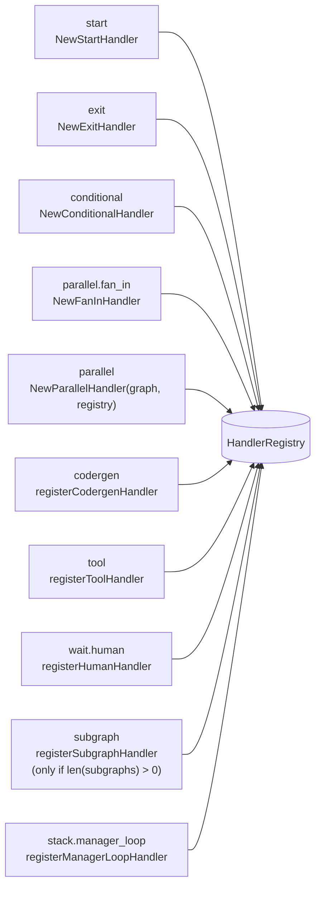

# Handlers

Pipeline handlers are the unit of execution. Each node in a graph is
dispatched to a handler by name; the handler does the work (call an LLM,
run a shell command, wait on a human, fan out branches, …) and returns an
`Outcome`. The engine consumes the outcome and moves on. Handlers are where
all non-trivial behavior lives — the engine itself stays narrow (see
[`engine.md`](./engine.md)).

## Contents

1. [Interface](#interface)
2. [Registry](#registry)
3. [Shape to handler mapping](#shape-to-handler-mapping)
4. [Handler index](#handler-index)
5. [Writes and reads contract](#writes-and-reads-contract)

## Interface

The contract is minimal. From [`pipeline/handler.go`](../../pipeline/handler.go):

```go
const (
    OutcomeSuccess = "success"
    OutcomeRetry   = "retry"
    OutcomeFail    = "fail"
)

type Outcome struct {
    Status             string            // one of the consts above, or a handler-specific value
    ContextUpdates     map[string]string // merged into PipelineContext (dirty-tracked)
    PreferredLabel     string            // picks an outgoing edge by Edge.Label
    SuggestedNextNodes []string          // picks an outgoing edge by Edge.To
    Stats              *SessionStats     // optional; populated by codergen
}

type Handler interface {
    Name() string
    Execute(ctx context.Context, node *Node, pctx *PipelineContext) (Outcome, error)
}
```

A handler's `Name()` is its registry key — the engine resolves
`node.Handler` to an implementation via this name. `Execute` is pure with
respect to the engine: it receives the resolved node (after stylesheet and
variable expansion) and the shared `*PipelineContext`, and returns an
outcome or an error. Errors halt the pipeline (after a checkpoint save);
`OutcomeFail` is a routable status that participates in edge selection.

The pseudo-status `OutcomeRetry` tells the engine to consult the retry
policy for this node, increment the counter, wait the backoff, and
re-dispatch — see [`engine.md#retry-restart-escalate`](./engine.md#retry-restart-escalate).

## Registry

`HandlerRegistry` ([`pipeline/handler.go`](../../pipeline/handler.go)) is a
name→handler map with `Register`, `Has`, `Get`, and `Execute` operations.
The engine holds a single registry and calls
`registry.Execute(ctx, node, pctx)` at dispatch time.

Registration happens once, up-front, in
[`pipeline/handlers/registry.go`](../../pipeline/handlers/registry.go).
`NewDefaultRegistry(graph, opts...)` builds a fully wired registry with:



Registration has conditional branches driven by `RegistryOption`:

- **`WithLLMClient`** — enables the native codergen backend. Absent, per-node
  `backend: claude-code` or `backend: acp` can still be used as long as
  `WithDefaultBackend` or any node's `backend` attr picks an external
  backend.
- **`WithExecEnvironment`** — registers the real tool handler. If neither
  `WithExecEnvironment` nor `WithToolExecFunc` is supplied, the `tool`
  handler is **not registered at all**, and tool nodes will error at
  dispatch with `no handler registered for "tool" (node "<nodeID>")`
  (from `HandlerRegistry.Execute` in
  [`pipeline/handler.go`](../../pipeline/handler.go)).
  `WithToolExecFunc` is the test-stub path (used when `execEnv` is nil).
- **`WithInterviewer`** — required to register the human handler.
- **`WithSubgraphs`** — enables the `subgraph` handler when the provided
  map is non-empty (`len(subgraphs) > 0`). An empty or nil map leaves
  `subgraph` unregistered. The `stack.manager_loop` handler is always
  registered, but falls back to a clear-error stub when no subgraphs are
  available (so `tracker validate` and conformance tests can still reach
  it).
- **`WithCodergenFunc` / `WithToolExecFunc` / `WithHumanCallback`** — stub
  overrides for tests.
- **`WithTokenTracker` / `WithAgentEventHandler` / `WithPipelineEventHandler`** —
  observability wiring.

The `NewRegistryFactory` helper returns a `pipeline.RegistryFactory` used
by the subgraph and manager-loop handlers to create child registries whose
event handlers are namespaced under a parent node ID (e.g.
`SubgraphNode/ChildAgent`). That way the TUI can keep nested-pipeline
events attributable to their wrapper node.

## Shape to handler mapping

Dippin-lang IR `NodeKind` values compile (via the adapter) to DOT-style
shapes on each `Node`. The shape is what the engine uses to derive the
handler name. Mapping lives in
[`pipeline/graph.go`](../../pipeline/graph.go):

```go
var shapeHandlerMap = map[string]string{
    "Mdiamond":      "start",
    "Msquare":       "exit",
    "box":           "codergen",
    "hexagon":       "wait.human",
    "diamond":       "conditional",
    "component":     "parallel",
    "tripleoctagon": "parallel.fan_in",
    "parallelogram": "tool",
    "house":         "stack.manager_loop",
    "tab":           "subgraph",
}
```

| `.dip` keyword | IR NodeKind | Shape | Handler name |
|---|---|---|---|
| `start` | (no IR NodeKind — workflow-level `ir.Workflow.Start` field; shape forced by `ensureStartExitNodes` in the adapter) | `Mdiamond` | `start` |
| `exit` | (no IR NodeKind — workflow-level `ir.Workflow.Exit` field; shape forced by `ensureStartExitNodes` in the adapter) | `Msquare` | `exit` |
| `agent` | `NodeAgent` | `box` | `codergen` |
| `human` | `NodeHuman` | `hexagon` | `wait.human` |
| `conditional` | `NodeConditional` | `diamond` | `conditional` |
| `parallel` | `NodeParallel` | `component` | `parallel` |
| `fan_in` | `NodeFanIn` | `tripleoctagon` | `parallel.fan_in` |
| `tool` | `NodeTool` | `parallelogram` | `tool` |
| `stack.manager_loop` | `NodeManagerLoop` | `house` | `stack.manager_loop` |
| `subgraph` | `NodeSubgraph` | `tab` | `subgraph` |

The adapter's `nodeKindToShapeMap` in [`pipeline/dippin_adapter.go`](../../pipeline/dippin_adapter.go)
maps exactly `{NodeAgent, NodeHuman, NodeTool, NodeParallel, NodeFanIn, NodeSubgraph, NodeConditional, NodeManagerLoop}`.
`start` / `exit` are workflow-level fields (not NodeKinds) whose shapes are
forced by `ensureStartExitNodes`. `stack.manager_loop` is reachable via the
`NodeManagerLoop` IR kind (dippin-lang v0.22.0+) — `ir.ManagerLoopConfig` is
flattened into the six DOT-style attrs the handler consumes by
[`extractManagerLoopAttrs`](../../pipeline/dippin_adapter.go). Hand-authored
DOT graphs with a `type: stack.manager_loop` override continue to work.

Two overrides handled by `applyDiamondOverrides` ([`graph.go`](../../pipeline/graph.go)):

- A `diamond` node with a `tool_command` attr is reclassified to the
  `tool` handler (some graph generators emit diamond-shaped tool nodes).
- A `diamond` node with a `prompt` attr (but no `tool_command`) is
  reclassified to `codergen` and gets `auto_status: "true"` defaulted in.

An explicit `type:` attribute on any node overrides shape-based resolution
entirely — useful for edge cases or pipelines hand-authored in DOT.

## Handler index

Each per-handler doc goes deep on configuration attrs, outcomes, edge-case
behavior, and invariants. This table is the flat index.

| Handler | Source | Deep dive | Purpose |
|---|---|---|---|
| `codergen` | [`pipeline/handlers/codergen.go`](../../pipeline/handlers/codergen.go) | [`handlers/codergen.md`](./handlers/codergen.md) | LLM agent sessions: resolves prompt, picks backend, runs a session, captures response into `last_response` / `response.<nodeID>`, optionally parses `STATUS:` tokens. |
| `tool` | [`pipeline/handlers/tool.go`](../../pipeline/handlers/tool.go) | [`handlers/tool.md`](./handlers/tool.md) | Shell command execution with safe-key variable expansion, timeouts, output caps, denylist/allowlist enforcement, and sensitive-env stripping. |
| `wait.human` | [`pipeline/handlers/human.go`](../../pipeline/handlers/human.go) | [`handlers/human.md`](./handlers/human.md) | Blocking human gate: choice, freeform, yes/no, interview, hybrid review modes. Routed through a pluggable interviewer (TUI, autopilot, webhook). |
| `parallel` | [`pipeline/handlers/parallel.go`](../../pipeline/handlers/parallel.go) | [`handlers/parallel-fan-in.md`](./handlers/parallel-fan-in.md) | Concurrent fan-out over `parallel_targets`. Spawns one goroutine per branch with an isolated context snapshot; records the fan-in join hint in `Outcome.ContextUpdates` as `suggested_next_nodes` (the engine's edge selector reads it from the context). The two hinting paths converge: `applyOutcome` mirrors any non-empty `Outcome.SuggestedNextNodes` slice into the same context key, so parallel just skips the struct and writes the key directly. |
| `parallel.fan_in` | [`pipeline/handlers/fanin.go`](../../pipeline/handlers/fanin.go) | [`handlers/parallel-fan-in.md`](./handlers/parallel-fan-in.md) | Join/aggregation node after a `parallel` dispatch. Reads `parallel.results` JSON; aggregates stats. |
| `subgraph` | [`pipeline/subgraph.go`](../../pipeline/subgraph.go) | [`handlers/subgraph.md`](./handlers/subgraph.md) | Executes a named child graph inline. Merges `subgraph_params` with child `vars` defaults, runs a child `Engine` with scoped event handlers, propagates the result outcome. |
| `conditional` | [`pipeline/handlers/conditional.go`](../../pipeline/handlers/conditional.go) | [`handlers/conditional.md`](./handlers/conditional.md) | Pure routing node: returns `OutcomeSuccess` with no writes and lets the engine's edge condition evaluator pick the next node based on existing context. |
| `stack.manager_loop` | [`pipeline/handlers/manager_loop.go`](../../pipeline/handlers/manager_loop.go) | [`../manager-loop.md`](../manager-loop.md) | Async child-pipeline supervisor: launches a child in a goroutine, polls at intervals, evaluates `manager.steer_condition`, and injects the `manager.steer_context` map through the engine's steering channel. Attractor spec 4.11. Canonical deep-dive lives at [`docs/manager-loop.md`](../manager-loop.md) today; a dedicated `docs/architecture/handlers/manager-loop.md` will land in a later PR (tracked in [#165](https://github.com/2389-research/tracker/issues/165)). |
| `start` | [`pipeline/handlers/start.go`](../../pipeline/handlers/start.go) | — | Pass-through entry node. Always returns `OutcomeSuccess` with no writes. Dispatches to whatever edge is selected. |
| `exit` | [`pipeline/handlers/exit.go`](../../pipeline/handlers/exit.go) | — | Pass-through terminal node. Returns `OutcomeSuccess`; the engine's `handleExitNode` takes over to run the goal-gate retry check and finalize the trace. |

`start` and `exit` are internal and don't get deep-dive docs — they're
pure pass-throughs whose behavior lives in the engine rather than in the
handler (see [`engine.md#run-loop`](./engine.md#run-loop)).

## Writes and reads contract

Handlers — notably `codergen`, `tool`, and `wait.human` in interview mode —
support declarative `writes:` and `reads:` attributes for structured I/O:

- `writes:` — a list of keys the node promises to produce in
  `Outcome.ContextUpdates`. After each handler returns,
  [`pipeline/handlers/declared_writes.go`](../../pipeline/handlers/declared_writes.go)
  extracts those keys from the handler's output, validates required fields,
  and fails the node if anything declared is missing or malformed.
- `reads:` — a list of keys the node consumes. These keys are pinned at
  full fidelity when compaction runs on resume, so downstream nodes see
  consistent data even when unrelated earlier keys get elided.

The user-facing model (including examples, `response_format: json_object`
integration, and the safe-key restrictions on tool `command:` fields) is
documented in full at
[`docs/pipeline-context-flow.md`](../pipeline-context-flow.md#returning-custom-data-from-a-node).

## Related docs

- [`engine.md`](./engine.md) — how the engine invokes handlers and consumes
  outcomes.
- [`../pipeline-context-flow.md`](../pipeline-context-flow.md) — how
  handlers write and read the shared context.
- [`backends.md`](./backends.md) — how `codergen` delegates to pluggable
  agent backends.
- [`adapter.md`](./adapter.md) — how dippin-lang IR maps to the shapes
  this doc describes.
