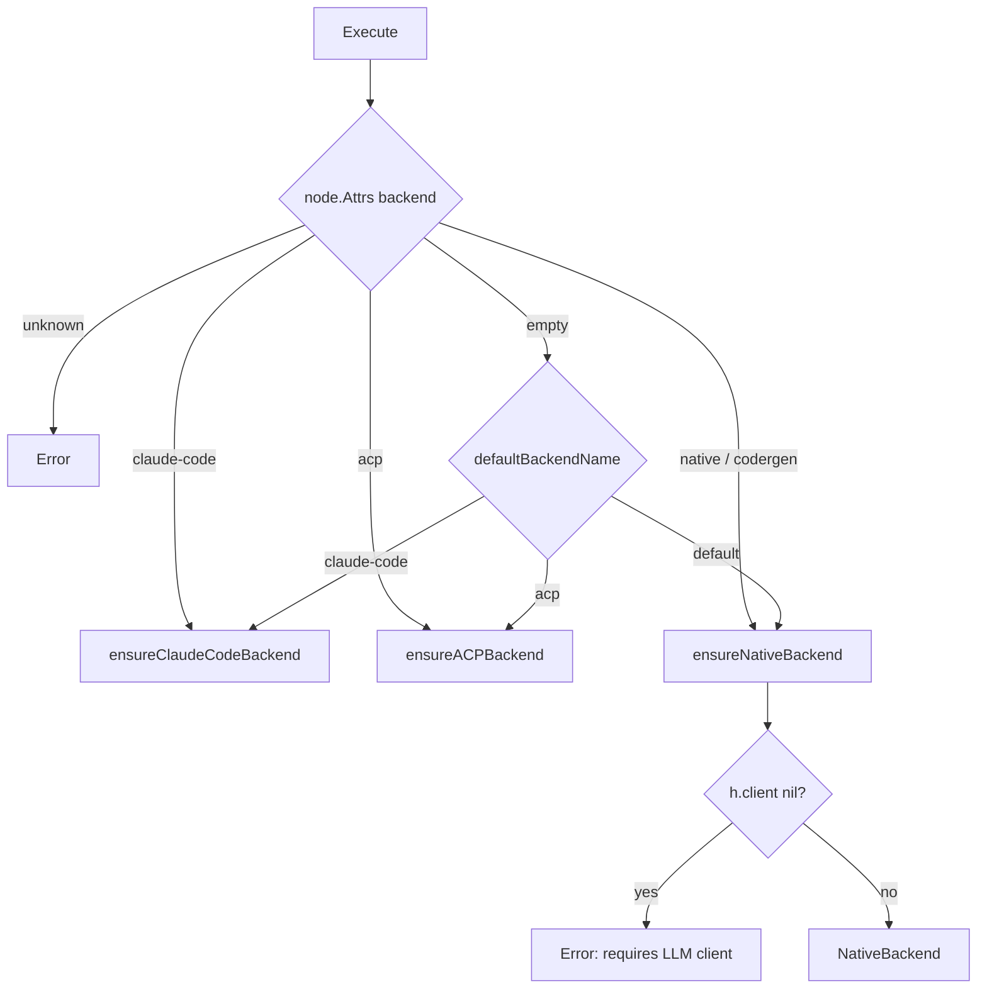
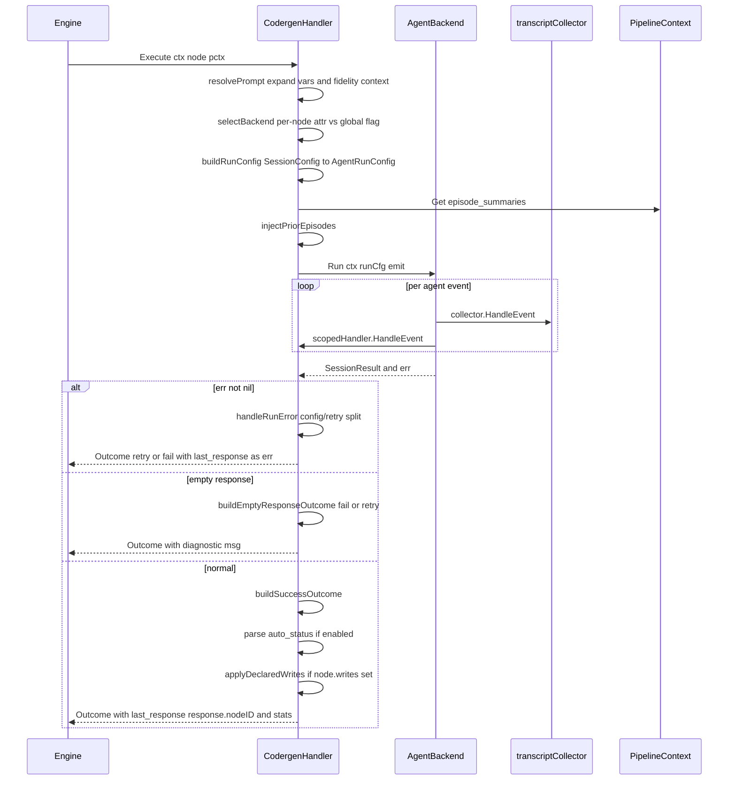

# Codergen (Agent) Handler (`codergen`)

## Purpose

`CodergenHandler` is the bridge between pipeline nodes and LLM agent sessions.
Every agent node (bare `agent X` or `codergen`-resolved handler in a `.dip`
file) routes through this handler. It resolves the prompt, chooses an
`AgentBackend` (native turn loop, Claude Code subprocess, or ACP), builds a
run config from the node's typed `AgentNodeConfig`, invokes the backend, and
translates the resulting `SessionResult` into a pipeline `Outcome`.

The handler does **not** make LLM calls directly — that's the backend's job.
It's a configuration and outcome-translation layer. This separation is what
lets the same pipeline run with either a native API session (with
tool-compaction, context management, verification retries) or a subscription
Claude Code subprocess (which handles those concerns internally).

Ground truth:
[`pipeline/handlers/codergen.go`](../../../pipeline/handlers/codergen.go).

## Node attributes

Typed accessor: [`Node.AgentConfig(graphAttrs)`](../../../pipeline/node_config.go),
which resolves graph-level defaults then overlays node-level overrides for
the attrs that support that pattern.

| Attribute | Graph default? | Behavior |
|-----------|----------------|----------|
| `prompt` | no | Required. Variable-expanded before execution (`${ctx.foo}`, `${graph.bar}`, `${params.baz}`). |
| `backend` | no | `native` (alias `codergen`), `claude-code`, or `acp`. Per-node override wins over global `--backend` flag. |
| `llm_model` | yes | Model ID. Graph `llm_model` applies unless node overrides. |
| `llm_provider` | yes | Provider name (`anthropic`, `openai`, `gemini`, etc.). |
| `system_prompt` | no | System message prepended to the session. |
| `max_turns` | no | Turn limit. Zero/empty → `agent.DefaultConfig()` default. |
| `working_dir` | no | Overrides handler's working dir for this session. |
| `command_timeout` | no | Per-tool exec timeout (native backend only — external backends manage this internally). |
| `reasoning_effort` | yes | `low`/`medium`/`high`/`minimal` for reasoning-capable models. |
| `response_format` | no | `json_object` to force JSON via the provider API. |
| `response_schema` | no | Optional JSON schema to enforce with response_format. |
| `cache_tool_results` | yes (true only) | Reuse tool result outputs across turns. Node-level can explicitly disable. |
| `context_compaction` | yes (auto only) | `auto` enables automatic mid-session compaction at a threshold. |
| `context_compaction_threshold` | no | Fraction (0–1) of context window at which to compact. Default 0.6 with `auto`. |
| `reflect_on_error` | no | Defaults to true. `false` disables reflection-on-error. |
| `verify_after_edit` | yes | Run `verify_command` after each edit and retry on failure. |
| `verify_command` | yes | Shell command whose exit status gates verification. |
| `max_verify_retries` | yes | Cap on verification retry attempts. |
| `plan_before_execute` (alias `plan`) | yes | Force a plan turn before the main execution turn. |
| `auto_status` | no | Parse `STATUS: success/fail/retry` directives from response text and use them as the outcome. |
| `mcp_servers` | no | JSON-encoded MCP server list (claude-code backend only). |
| `allowed_tools` / `disallowed_tools` | no | Tool allowlist/denylist (claude-code). |
| `permission_mode` | no | claude-code permission mode (default `bypassPermissions` for headless). |
| `max_budget_usd` | no | Claude Code budget ceiling. |
| `acp_agent` | no | ACP agent name (ACP backend). |
| `writes` | no | Comma-separated declared JSON keys to extract from the response into context. |

## Backend selection



Priority: **per-node `backend` attr always wins over the global
`--backend` flag**. This enables mixed-backend pipelines — a node with
`backend: native` uses the native API even when the global flag is
`claude-code`.

Backends are lazy-initialized on first use:

- Native: `sync.Once` — one-shot init from the injected `agent.Completer`
  client.
- Claude Code, ACP: mutex-guarded retry — failure leaves the backend slot
  empty so a subsequent call can retry (useful when installing the CLI
  mid-run).

## Session config mapping

[`buildConfig`](../../../pipeline/handlers/codergen.go) constructs an
`agent.SessionConfig` from the typed `AgentNodeConfig`. Non-zero / non-empty
fields override the corresponding defaults from `agent.DefaultConfig()`. The
typed accessor already handles the graph-then-node merge, so the handler
just copies fields across:

```text
AgentNodeConfig               agent.SessionConfig
─────────────────             ─────────────────────
Model            ──────────►  Model
Provider         ──────────►  Provider
SystemPrompt     ──────────►  SystemPrompt
MaxTurns         ──────────►  MaxTurns (if > 0)
CommandTimeout   ──────────►  CommandTimeout (if > 0, native only)
ReasoningEffort  ──────────►  ReasoningEffort
ResponseFormat   ──────────►  ResponseFormat
ResponseSchema   ──────────►  ResponseSchema
CacheToolResults ──────────►  CacheToolResults (when Set)
ContextCompaction ─────────►  ContextCompaction + CompactionThreshold
ReflectOnError   ──────────►  ReflectOnError (when explicitly false)
VerifyAfterEdit/VerifyCommand/MaxVerifyRetries ─► VerifyAfterEdit/…
PlanBeforeExecute ─────────►  PlanBeforeExecute (when Set)
```

Compaction has a specific rule in
[`applyTypedCompaction`](../../../pipeline/handlers/codergen.go):

- `context_compaction=auto` → enables `agent.CompactionAuto`, default
  threshold 0.6 (overridable via `context_compaction_threshold`).
- Any other non-empty value → `agent.CompactionNone`, but
  `context_compaction_threshold` still wins if set.

## AgentRunConfig and Extra

[`buildRunConfig`](../../../pipeline/handlers/codergen.go) packages the
session config into a backend-neutral
[`pipeline.AgentRunConfig`](../../../pipeline/backend.go). Common fields
(prompt, model, working dir, max turns) travel in `AgentRunConfig`;
backend-specific config rides along in `Extra`:

| Backend | Extra payload |
|---------|---------------|
| NativeBackend | `*agent.SessionConfig` (full) |
| ClaudeCodeBackend | `*pipeline.ClaudeCodeConfig` (MCPs, tools, budget, permission mode) |
| ACPBackend | `*pipeline.ACPConfig` (agent name) |

`CommandTimeout` is only set on `AgentRunConfig.Timeout` for the native
backend. External backends (claude-code, ACP) manage tool timeouts
internally; applying a subprocess timeout to them would kill the agent
prematurely.

## Execute lifecycle



## Prompt resolution

[`resolvePrompt`](../../../pipeline/handlers/codergen.go) delegates to
`ResolvePrompt` in [prompt.go](../../../pipeline/handlers/prompt.go), which:

1. Reads `node.Attrs["prompt"]`.
2. Expands variables against the pipeline context (`${ctx.foo}`,
   `${graph.bar}`, `${params.baz}`) with single-pass resolution.
3. Applies the fidelity level to select which upstream context keys are
   included as a "Context Summary" prepend.

The handler also reads `pipeline.InternalKeyArtifactDir` so nested
subgraph nodes use the parent's artifact directory for writes and the
prompt expansion has access to the artifact root.

## Event collection

[`transcriptCollector`](../../../pipeline/handlers/transcript.go) receives
every `agent.Event` from the backend and extracts:

- Final response text (returned via `collector.text()`).
- Full transcript (returned via `collector.transcript()`) — used as the
  artifact written to disk.

Events are simultaneously dispatched via `scopedHandler` (which prefixes
node IDs for TUI display) so the TUI updates in real-time while the
collector accumulates the transcript.

## Outcomes produced

Three paths through
[`buildOutcome`](../../../pipeline/handlers/codergen.go):

### handleRunError

Triggered when `backend.Run` returns an error.

- `llm.ConfigurationError` → hard error returned to the engine (quota,
  auth, model misconfiguration). Pipeline halts.
- Non-retryable provider error → hard error returned to the engine.
- Otherwise → `OutcomeRetry` with `last_response` set to the error
  message. Lets the engine's retry policy have a shot.

### buildEmptyResponseOutcome

Two subcases:

1. **No turns, no tool calls** → session never started → `OutcomeFail` with
   diagnostic `"agent session produced no output (0 tokens, 0 tool calls) —
   check provider/model configuration"`.
2. **Turns > 0 but zero output tokens and zero tool calls** → API swallowed
   an error → `OutcomeRetry` with `"provider returned empty API response
   (0 output tokens, 0 tool calls); retrying session"`.

Case 2 doesn't apply when there were tool calls — the agent did real work,
the lack of final-assistant text is a different issue.

### buildSuccessOutcome

The normal path. Sets `Status = OutcomeSuccess` by default. Two overrides:

- **Turn-limit exhaustion** (`sessResult.MaxTurnsUsed`) → `OutcomeFail`
  with a `turn_limit_msg` context write. Loop detection
  (`sessResult.LoopDetected`) produces a slightly different message. On
  nodes without conditional failure edges, this hits the strict-failure-edge
  rule and the pipeline stops — which is correct: silently continuing
  after an agent ran out of turns is almost always a bug.
- **`auto_status=true`** → parses the response text for `STATUS:
  success/fail/retry` directives via
  [`parseAutoStatus`](../../../pipeline/handlers/codergen.go). The last
  STATUS line wins. Lines inside ``` code fences are skipped so the agent
  can discuss statuses in examples without triggering parsing.

### ContextUpdates

| Key | When | Value |
|-----|------|-------|
| `last_response` | always | Final assistant message text |
| `response.<nodeID>` | always | Same as `last_response`, addressable by node ID |
| `episode_summary` | always | Session's episode summary (tool attempts + outcomes) |
| `episode_summaries` | when new summary is non-empty | JSON array of accumulated prior summaries |
| `last_cost` | when `EstimatedCost > 0` | Dollar cost of the session, formatted to 4 decimals |
| `last_turns` | when `Turns > 0` | Turn count as integer string |
| `turn_limit_msg` | on turn exhaustion | Diagnostic message |
| declared `writes` keys | when `writes` attr set | Top-level extraction of JSON fields from `last_response` |

## Events emitted

The codergen handler emits no pipeline events directly. Agent-level events
from the backend are forwarded to the configured `agent.EventHandler` via
`NodeScopedHandler`, which prefixes node IDs so the TUI and activity log
can attribute events correctly. The engine emits `EventStageStarted` /
`Completed` / `Failed` around `Execute`.

## Structured output (response_format)

From `CLAUDE.md`:

> The `response_format: json_object` attribute on agent nodes forces JSON
> output at the LLM API level. The path: `.dip` file → `AgentConfig.ResponseFormat`
> → adapter → `node.Attrs["response_format"]` → `codergen.applyResponseFormat()`
> → `SessionConfig.ResponseFormat` → `session.buildResponseFormat()` →
> `llm.Request.ResponseFormat` → provider translator.

Per-provider translation:

- Anthropic: system instruction.
- OpenAI: native `json_object` response format.
- Gemini: `responseMimeType`.

Use this on any agent that must produce structured JSON — interview
question generators, autopilot decisions, structured planners.

## Episode summaries and retries

[`injectPriorEpisodes`](../../../pipeline/handlers/codergen.go) reads
`episode_summaries` from context at handler start and seeds
`SessionConfig.PriorEpisodeSummaries`. Backends that support it (native)
prepend these summaries so retried or resumed sessions carry forward what
earlier attempts tried.

[`applyEpisodeContextUpdates`](../../../pipeline/handlers/codergen.go)
appends the new session's `EpisodeSummary` to the accumulated list after
each run.

## Planning turn

`plan_before_execute: true` (shorthand `plan: true`) tells the native
backend to run a planning turn before the main execution turn. The plan
turn produces a structured plan that the execution turn consumes as
context. `applyTypedCompaction`-style `*Set` flags in
`AgentNodeConfig.PlanBeforeExecuteSet` distinguish "unset" from "false"
so consumers can treat absence differently from explicit disable.

## External backend usage tracking

Native backend usage is tracked by the LLM middleware automatically.
Claude Code and ACP backends bypass the middleware, so the handler calls
[`trackExternalBackendUsage`](../../../pipeline/handlers/codergen.go) to
explicitly attribute their usage to the `claude-code` or `acp` provider
slots in the shared `TokenTracker`. Native backend usage is skipped to
avoid double-counting.

## Edge cases and gotchas

- **Provider errors are hard failures, not retries.** Quota and auth
  errors from the LLM propagate out of `Execute` as errors, halting the
  pipeline. CLAUDE.md explicitly calls this out: "Provider errors
  (quota, auth, model not found) must hard-fail the pipeline, not retry."
- **Empty response detection is load-bearing.** Silently succeeding on a
  session with zero output tokens hides provider-side problems.
- **Claude Code strips API keys from the subprocess env** unless
  `TRACKER_PASS_API_KEYS=1` is set. This forces OAuth / subscription
  auth for Max/Pro accounts. See `CLAUDE.md` § Claude Code backend.
- **`auto_status` only runs inside fence-free regions** of the response.
  The agent can safely write example STATUS lines inside triple-backtick
  blocks.
- **`buildLLMClient()` is lazy** — failure to construct a native LLM
  client is non-fatal when `--backend claude-code` is set globally. The
  native backend only needs to exist when a node explicitly selects it.

## Example

```dip
vars:
  llm_model: "claude-sonnet-4"
  llm_provider: "anthropic"

agent Planner
  prompt: |
    Given the goal: ${graph.goal}
    Produce a plan. End with STATUS: success if coherent, retry if you need more info.
  auto_status: true
  max_turns: 10
  response_format: "json_object"

agent Executor
  prompt: |
    Execute this plan:
    ${ctx.response.Planner}
  plan_before_execute: true
  verify_after_edit: true
  verify_command: "go build ./..."
  max_verify_retries: 3
  backend: "claude-code"
  permission_mode: "bypassPermissions"

Planner -> Executor when: ctx.outcome = success
Planner -> Replan when: ctx.outcome = retry
```

`Planner` runs with the native Anthropic API, must produce JSON, uses
`auto_status` to self-diagnose. `Executor` runs through the Claude Code
subprocess with a planning turn and a verify loop tied to `go build`.

## See also

- [`pipeline/handlers/codergen.go`](../../../pipeline/handlers/codergen.go)
  — this handler
- [`pipeline/backend.go`](../../../pipeline/backend.go) —
  `AgentBackend` interface, `AgentRunConfig`, `ClaudeCodeConfig`,
  `ACPConfig`
- [`pipeline/handlers/backend_native.go`](../../../pipeline/handlers/backend_native.go)
  — native backend (turn loop + tool registry)
- [`pipeline/handlers/backend_claudecode.go`](../../../pipeline/handlers/backend_claudecode.go)
  — subprocess backend
- [`pipeline/handlers/backend_acp.go`](../../../pipeline/handlers/backend_acp.go)
  — ACP backend
- [`pipeline/handlers/prompt.go`](../../../pipeline/handlers/prompt.go) —
  prompt resolution and fidelity prepend
- [`pipeline/handlers/transcript.go`](../../../pipeline/handlers/transcript.go)
  — `transcriptCollector` + `buildSessionStats`
- [`pipeline/handlers/declared_writes.go`](../../../pipeline/handlers/declared_writes.go)
  — `applyDeclaredWrites`
- [`pipeline/node_config.go`](../../../pipeline/node_config.go) —
  `AgentNodeConfig`
- [`agent/session.go`](../../../agent/session.go) — native session runtime
- [`llm/`](../../../llm/) — provider translators
- [Pipeline Context Flow](../../pipeline-context-flow.md) — how
  `last_response` / `response.<id>` / `episode_summary` are consumed
- `CLAUDE.md` §§ `Structured output`, `Claude Code backend`,
  `Strict failure edges`, `Tool node safety`
