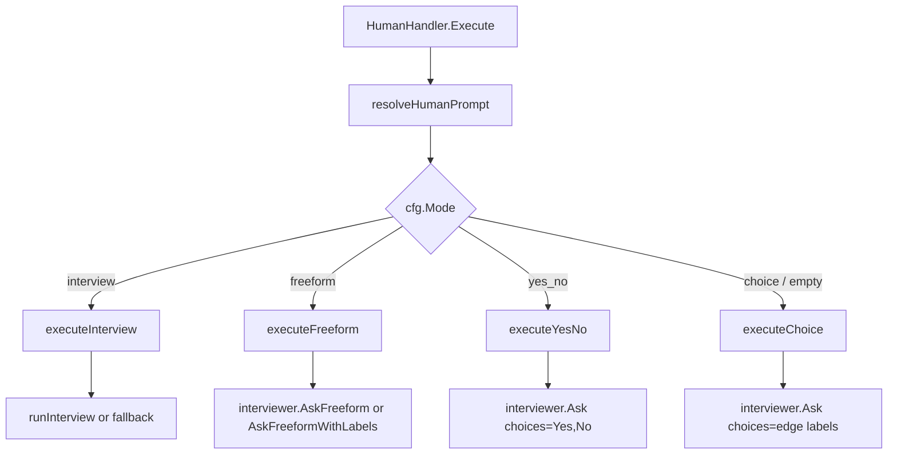
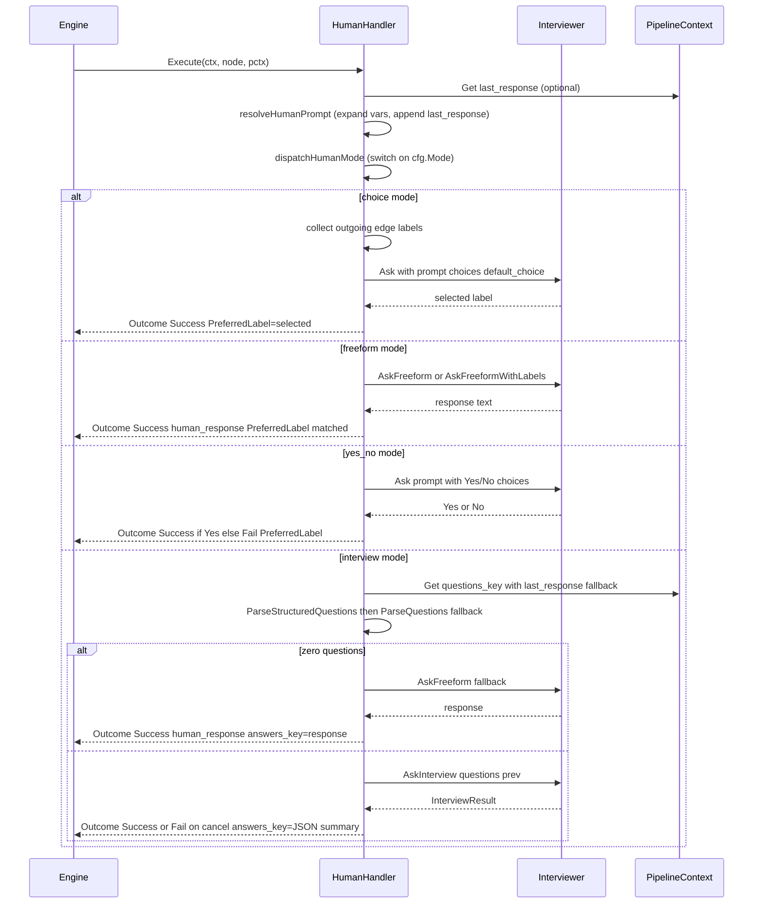

# Human Gate Handler (`wait.human`)

## Purpose

A human gate pauses the pipeline for a decision. The handler presents a
prompt to an `Interviewer` implementation, captures the response, and maps it
onto either a `PreferredLabel` (used by the engine to pick a labeled outgoing
edge) or a context write that downstream nodes read directly. The same
handler serves five input modes — choice, freeform, yes/no, interview, and
hybrid — routed via the `mode` attr. The `Interviewer` is swappable: a real
TUI for interactive runs, `AutoApproveInterviewer` for tests,
`AutopilotInterviewer` for LLM-backed headless runs, or `WebhookInterviewer`
for external callback systems.

Ground truth:
[`pipeline/handlers/human.go`](../../../pipeline/handlers/human.go).

## Node attributes

| Attribute | Type | Default | Behavior |
|-----------|------|---------|----------|
| `mode` | string | `choice` | One of `choice`, `freeform`, `yes_no`, `interview`. Absent or unknown falls through to choice. |
| `prompt` | string | node `Label` | Text shown to the user. Variable expansion applied (`${ctx.foo}`, `${graph.bar}`, `${params.baz}`). |
| `default_choice` | string | falls back to `default` | Pre-selected option in choice mode. `default_choice` wins if both are present. |
| `default` | string | — | Used by freeform-label mode (matches against edge labels); also secondary for `default_choice`. |
| `timeout` | duration | 0 (no timeout) | Max wait for user input. On timeout, behavior depends on `timeout_action`. |
| `timeout_action` | string | `default` | `fail` → `OutcomeFail` with `human_response=timed out`; `default` → pick `default_choice` with `OutcomeSuccess` (or fail if no default set). |
| `questions_key` | string | `interview_questions` | Context key to read structured questions from (interview mode). Falls back to `last_response` if the primary key is empty. |
| `answers_key` | string | `interview_answers` | Context key to write serialized answers under (interview mode). |
| `writes` | string | — | Comma-separated JSON key list; interview answers are extracted and written as top-level context keys. |

Typed accessor: [`Node.HumanConfig`](../../../pipeline/node_config.go).

## Mode dispatch



## Execute lifecycle



## Mode details

### Choice (default)

- `executeChoice` collects labels from outgoing edges (falling back to edge
  `To` node ID when a label is empty).
- Presents them via `Interviewer.Ask(prompt, choices, default_choice)`.
- Returns `OutcomeSuccess` with `PreferredLabel=selected`. Routing picks
  the edge whose `Label` matches.
- Uses the bare `default_choice` attr (not the `HumanConfig.DefaultChoice`
  accessor) to avoid the fallback to `default`, which has different
  semantics in freeform mode.

### Freeform

- `executeFreeform` asks the `FreeformInterviewer` interface for open text.
- If the interviewer also implements `LabeledFreeformInterviewer` AND the
  node has labeled outgoing edges, it calls `AskFreeformWithLabels` — the
  TUI shows a hybrid radio+textarea modal (see `CLAUDE.md` § Human gate UX).
- Writes `human_response` and `response.<nodeID>` context keys.
- Attempts to match the freeform text against an edge label via
  `matchFreeformLabel` (case-insensitive, trimmed); sets `PreferredLabel`
  when a match is found.

### Yes/No

- `executeYesNo` presents a fixed `["Yes", "No"]` choice via
  `Interviewer.Ask`.
- **Yes → `OutcomeSuccess`, No → `OutcomeFail`**. Pipelines route with
  `when ctx.outcome = success` / `when ctx.outcome = fail` conditions.
- This distinction from choice mode is load-bearing: choice mode always
  returns success and routes on `PreferredLabel`.
- `AutoApproveInterviewer` picks "Yes" (the first choice) by default —
  forward-progress semantics for unattended runs.

### Interview

- `executeInterview` requires the interviewer to implement
  `InterviewInterviewer`.
- Reads structured questions from `questions_key` (default
  `interview_questions`), falling back to `last_response`.
- [`parseInterviewQuestions`](../../../pipeline/handlers/human.go) tries
  `ParseStructuredQuestions` (JSON) first, then falls back to the
  markdown-heuristic `ParseQuestions`. Upstream agents should use
  `response_format: json_object` to force valid JSON.
- If zero questions parse, the handler falls back to
  `executeInterviewFallback` — freeform input with the node's `prompt`, and
  the response is also persisted under `answers_key` for downstream nodes.
- On success: writes `answers_key` (serialized JSON), `human_response` (a
  markdown summary), and `response.<nodeID>`.
- **Canceled interviews return `OutcomeFail`**, not `OutcomeSuccess`.
  Pipeline edges can route on cancellation via `when ctx.outcome = fail`.
- Previous answers (from a prior run of the same node during a retry) are
  loaded from `answers_key` via `DeserializeInterviewResult` and passed to
  `AskInterview` as pre-fill.

### Hybrid (labeled freeform)

Not a distinct `mode`, but the shape of `executeFreeform` when the
interviewer implements `LabeledFreeformInterviewer` and the node has labeled
edges. The TUI shows radio buttons for the labels plus an "other" textarea.
`CLAUDE.md` § Human gate UX specifies the threshold rules for when the TUI
picks `HybridContent` vs. `ReviewHybridContent` (prompt length, label
count).

## Interviewer implementations

| Interviewer | Source | Use |
|-------------|--------|-----|
| `ConsoleInterviewer` | `human.go` | Stdin/stdout interactive prompts (non-TUI). |
| `TUIInterviewer` | `tui/` | Default interactive mode. Implements `InterviewInterviewer` + `LabeledFreeformInterviewer`. |
| `AutoApproveInterviewer` / `AutoApproveFreeformInterviewer` | `human.go` | Deterministic — picks `default_choice`, first option, or "Yes". Used by `--auto-approve`. |
| `CallbackInterviewer` | `human.go` | Delegates `Ask` to a callback function. Used by test harnesses. |
| `QueueInterviewer` | `human.go` | Returns pre-seeded answers in order. Used by test fixtures. |
| `AutopilotInterviewer` | [autopilot.go](../../../pipeline/handlers/autopilot.go) | LLM-backed decisions with one of four personas. |
| `ClaudeCodeAutopilotInterviewer` | [autopilot_claudecode.go](../../../pipeline/handlers/autopilot_claudecode.go) | Autopilot via the `claude` CLI subprocess. |
| `WebhookInterviewer` | [webhook_interviewer.go](../../../pipeline/handlers/webhook_interviewer.go) | POSTs gates to an external URL and blocks on a signed callback. |

## Autopilot mode

From `CLAUDE.md` § Autopilot mode:

- `--autopilot <persona>` swaps the default interviewer for
  [`AutopilotInterviewer`](../../../pipeline/handlers/autopilot.go).
- Four personas:
  - `lax` — forward-progress bias; approve unless something is broken.
  - `mid` (default) — balanced; treats decisions like a senior engineer.
  - `hard` — high quality bar; scrutinize, push back on gaps.
  - `mentor` — always approve + provide detailed feedback in reasoning.
- Uses structured JSON output: `{"choice": "...", "reasoning": "..."}`.
  `response_format: json_object` is set on the underlying LLM call.
- **Provider errors hard-fail** per CLAUDE.md — only parse failures fall
  back to the default choice.
- `--backend claude-code` routes autopilot through
  `ClaudeCodeAutopilotInterviewer`, which shells out to `claude` — no API
  key needed.
- Default model is the cheapest of the configured provider via
  `Client.DefaultProvider()`; override with `WithAutopilotModel`.

## Webhook mode

`--webhook-url <URL>` swaps in
[`WebhookInterviewer`](../../../pipeline/handlers/webhook_interviewer.go).
The flow:

1. Handler calls `Ask` / `AskFreeform` / `AskFreeformWithLabels`.
2. Interviewer generates a per-gate ID and token, POSTs a
   `WebhookGatePayload` (prompt, choices, callback URL, timeout) to the
   configured webhook URL.
3. Interviewer blocks on an internal reply channel with the configured
   timeout (default 10m).
4. External system responds by POSTing a `WebhookGateResponse` back to the
   local callback server at `/gate/<gateID>` — with the per-gate token
   echoed in `X-Tracker-Gate-Token`.
5. Interviewer delivers the response to the waiting handler.

Used for fully headless execution where a real human responds over email /
Slack / push. See CLAUDE.md § Autopilot mode for the distinction between
autopilot (LLM judge) and webhook (human over a transport).

## Auto-approve mode

`--auto-approve` uses `AutoApproveFreeformInterviewer`:

- `Ask` → `default_choice` if set, else first choice.
- `AskFreeform` → canned `"auto-approved"`.
- `AskFreeformWithLabels` → `default_label` if set, else first label.
- `AskInterview` → "yes" for yes/no questions, first option for options,
  `"auto-approved"` for open-ended.

This is deterministic — no LLM call. It's the fastest way to smoke-test a
pipeline end-to-end.

## Outcomes produced

| Mode | Status | PreferredLabel | ContextUpdates |
|------|--------|----------------|----------------|
| choice | `OutcomeSuccess` | selected label | — |
| freeform | `OutcomeSuccess` | matched label (if any) | `human_response`, `response.<nodeID>` |
| yes_no | `OutcomeSuccess` (Yes) or `OutcomeFail` (No) | `"Yes"` or `"No"` | — |
| interview | `OutcomeSuccess`, or `OutcomeFail` on cancel | — | `answers_key` (JSON), `human_response` (summary), `response.<nodeID>` |
| interview (fallback) | `OutcomeSuccess` | matched label (if any) | `human_response`, `response.<nodeID>`, `answers_key` (same as response) |

On timeout with `timeout_action=default` and a `default_choice` set, the
handler returns `OutcomeSuccess` with `PreferredLabel=<default>` and
writes `human_response=<default>`. Without a default: `OutcomeFail` with
`human_response=timed out (no default)`.

## Events emitted

The handler emits no pipeline events directly — the engine emits
`EventStageStarted` / `Completed` / `Failed` around the `Execute` call.
However, the cancel path in interview mode is a specific concern:

- All modal content types in the TUI must implement `Cancellable` so
  Ctrl+C calls `Cancel()` to close reply channels.
- **Never block a handler goroutine on a channel with no cancellation
  path**. This is why the withTimeout/withTimeoutOutcome helpers exist:
  they race the user's response against the configured timeout so the
  handler can exit cleanly.

## Edge cases and gotchas

- **Choice mode requires outgoing edges.** `executeChoice` errors with
  `human gate node %q has no outgoing edges to derive choices from` if the
  node is a terminal sink.
- **`default` vs `default_choice` have different fallback chains.** Choice
  mode reads the raw `default_choice` attr only. Freeform mode reads the
  raw `default` attr only. `HumanConfig.DefaultChoice` (the typed
  accessor) unifies the two by preferring `default_choice` with fallback
  to `default` — used by timeout handling.
- **Timeout goroutine leaks are accepted.** `withTimeout` doesn't cancel
  the inner `Interviewer.Ask` call on timeout — the goroutine runs until
  the underlying I/O unblocks. Documented in
  [withTimeout](../../../pipeline/handlers/human.go) as a deliberate
  tradeoff to keep the `Interviewer` interface minimal.
- **Freeform mode + no `FreeformInterviewer`** is an error. The handler
  checks interface assertion and returns a hard error if the configured
  interviewer doesn't support freeform input.
- **Interview JSON parsing filters "other"-variant options.** The TUI always
  provides its own "Other" escape hatch, so upstream agents should list
  only the real options. `ParseStructuredQuestions` drops redundant "other"
  entries via `filterOtherOption`.
- **Canceled interview returns OutcomeFail.** Downstream edges should route
  on `when ctx.outcome = fail` if you want to handle cancellation — a
  retry of the node pre-fills previous answers.

## Example

```dip
wait.human ApprovePlan
  mode: "yes_no"
  prompt: "Approve this plan?\n\n${ctx.last_response}"
  timeout: "15m"
  timeout_action: "default"
  default_choice: "No"

Planner -> ApprovePlan
ApprovePlan -> Execute when: ctx.outcome = success
ApprovePlan -> Escalate when: ctx.outcome = fail
```

Presents a Yes/No prompt with the planner's output embedded. On 15-minute
timeout, takes the `No` default and routes to `Escalate`.

```dip
wait.human InterviewConstraints
  mode: "interview"
  prompt: "Answer the planner's questions:"
  questions_key: "interview_questions"
  answers_key: "constraint_answers"
  writes: "timeout_seconds,retry_strategy"

QuestionGen -> InterviewConstraints
InterviewConstraints -> Build when: ctx.outcome = success
InterviewConstraints -> Cancel when: ctx.outcome = fail
```

`QuestionGen` writes JSON questions to `interview_questions`. The gate
parses them, runs a form UI, serializes answers to `constraint_answers`,
and additionally extracts `timeout_seconds` and `retry_strategy` as
top-level context keys via `writes`.

## See also

- [`pipeline/handlers/human.go`](../../../pipeline/handlers/human.go) —
  handler core
- [`pipeline/handlers/autopilot.go`](../../../pipeline/handlers/autopilot.go)
  — LLM autopilot
- [`pipeline/handlers/webhook_interviewer.go`](../../../pipeline/handlers/webhook_interviewer.go)
  — external webhook
- [`pipeline/handlers/interview_parse.go`](../../../pipeline/handlers/interview_parse.go)
  — question parser
- [`pipeline/handlers/interview_result.go`](../../../pipeline/handlers/interview_result.go)
  — answer serialization
- [`tui/`](../../../tui/) — interactive modals (HybridContent,
  ReviewHybridContent, ReviewContent)
- [Pipeline Context Flow](../context-flow.md) —
  `human_response` / `preferred_label` semantics
- `CLAUDE.md` §§ `Human gate UX`, `Yes/No mode`, `Interview mode`,
  `Autopilot mode`
