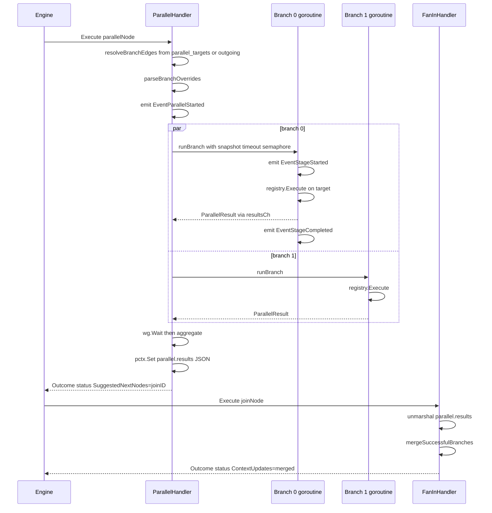

# Parallel and Fan-In Handlers (`parallel`, `parallel.fan_in`)

## Purpose

Parallel fan-out runs multiple branches concurrently and fan-in collects the
results. The parallel handler is the dispatch point: it spins up one
goroutine per branch target, hands each a fresh context snapshot, executes
them in parallel (subject to an optional concurrency cap), and stores the
collected `ParallelResult` array in context for the fan-in node to merge.

Use parallel+fan-in when the branches are independent — for example,
running the same review across three different models, or gathering
diagnostics from several sources before a human gate. When branches need to
pass data between themselves, use sequential nodes instead; each branch runs
with an isolated context and their writes only merge at fan-in.

Ground truth:
[`pipeline/handlers/parallel.go`](../../../pipeline/handlers/parallel.go),
[`pipeline/handlers/fanin.go`](../../../pipeline/handlers/fanin.go).

## Architectural note

From `CLAUDE.md`:

> The engine doesn't know about parallel/fan-in. The engine treats every
> node the same: execute handler, select edge, advance. The parallel
> handler does concurrent dispatch internally and hints the engine where to
> go next via `suggested_next_nodes`.

This matters for understanding the edge-routing flow: outgoing graph edges
from the parallel node are **ignored for branch dispatch** — dispatch
targets come from the `parallel_targets` attr. But outgoing edges to the
join node are still used by the engine's normal edge selector once the
parallel handler suggests the join.

## Node attributes — parallel

| Attribute | Type | Default | Behavior |
|-----------|------|---------|----------|
| `parallel_targets` | string (comma-separated) | — | Branch target node IDs. Required unless outgoing graph edges carry the targets. |
| `parallel_join` | string | empty | Node ID of the fan-in node branches should reconverge on. Written into `suggested_next_nodes` for engine routing. |
| `max_concurrency` | int | 0 (unbounded) | Cap on concurrent branch goroutines. Used as a semaphore. |
| `branch_timeout` | duration | 0 (none) | Per-branch wall-clock timeout applied via `context.WithTimeout`. |
| `branch.N.target` | string | — | Declares override group N applies to the given target node ID. |
| `branch.N.<attr>` | string | — | Attrs to override on branch N's target node (e.g. `branch.0.llm_model=gpt-4o`, `branch.1.fidelity=full`). |

Typed accessor: [`Node.ParallelConfig`](../../../pipeline/node_config.go).

## Node attributes — fan-in

| Attribute | Type | Default | Behavior |
|-----------|------|---------|----------|
| `fan_in_sources` | string (comma-separated) | — | Upstream source node IDs — documented for dippin adapter; reads happen from the shared `parallel.results` key. |

The fan-in handler reads `parallel.results` out of context directly; it
doesn't inspect its own attrs at runtime.

## Execute lifecycle



## Branch dispatch

[`collectBranchEdges`](../../../pipeline/handlers/parallel.go) picks one of
two sources for branch targets:

1. **`parallel_targets` attr** — when non-empty, split on commas, trim, and
   build synthetic `Edge{From: parallelNode.ID, To: target}` entries.
2. **Outgoing graph edges** — fallback when no `parallel_targets` attr is
   set. The edge to `parallel_join` is filtered out so it doesn't run as a
   branch.

In practice, dippin-lang `.dip` files carry `parallel_targets` via
`ParallelConfig.Targets`, which the adapter translates into the node attr.
The fallback exists for hand-written graphs and older DOT files.

## Branch context isolation

Each branch goroutine calls
[`pipeline.NewPipelineContextFrom(snapshot)`](../../../pipeline/context.go)
to build a fresh context from a snapshot of the parent's context at dispatch
time. This means:

- Branches see all parent context at launch (including `graph.*` attrs,
  previous node writes, `_artifact_dir`).
- Branch writes do not bleed into each other. Two branches writing the same
  key don't collide.
- Branch writes only flow back to the parent at fan-in, via the merge
  described below.

The artifact directory internal key is explicitly re-seeded on the branch
context so branches write into the same run artifact root as the parent.

## Branch overrides

[`parseBranchOverrides`](../../../pipeline/handlers/parallel.go) harvests
`branch.N.*` attrs on the parallel node and groups them by the `branch.N.target`
field. For each target node ID, the handler builds an override map applied
via a shallow clone of the target node:

```dip
parallel Review
  parallel_targets: "ReviewFast, ReviewDeep"
  parallel_join: "Merge"
  branch.0.target: "ReviewFast"
  branch.0.llm_model: "gpt-4o-mini"
  branch.1.target: "ReviewDeep"
  branch.1.llm_model: "o1"
```

Override semantics: node attrs are overlaid onto a clone of the target
node's `Attrs`; other fields (`Shape`, `Label`, `Handler`) are preserved.
The original target node in the graph is untouched, so a second parallel
node pointing at the same target isn't affected.

## Concurrency and timeout

- `max_concurrency` → a buffered `chan struct{}` used as a semaphore
  ([`makeSemaphore`](../../../pipeline/handlers/parallel.go)). A value of 0
  disables the semaphore (unbounded). Each goroutine acquires a slot before
  starting real work and releases it on exit via `defer`.
- `branch_timeout` → wraps each branch's execution context with
  `context.WithTimeout`. On timeout, the branch returns with whatever
  outcome the registry produced — typically a context-cancellation error
  that the handler treats as `OutcomeFail`.

The semaphore wait itself is cancellable: if the parent context cancels
while a branch is blocked waiting for a slot, the branch records
`context canceled while waiting for concurrency slot` and returns.
`wg.Done()` is deferred before the semaphore wait, so this early-exit path
still releases the WaitGroup — a prior bug where the defer sat after the
select could deadlock `wg.Wait()` on cancellation.

## Panic safety

Every branch goroutine has a deferred
[`recoverBranch`](../../../pipeline/handlers/parallel.go) that converts a
panic into a `ParallelResult{Status: OutcomeFail, Error: "panic in branch..."}`
plus an `EventStageFailed` event. The parent goroutine never crashes because
of a misbehaving branch handler.

## ParallelResult

```go
type ParallelResult struct {
    NodeID         string
    Status         string
    ContextUpdates map[string]string
    Error          string
    Stats          *pipeline.SessionStats
}
```

Each branch's result combines:

- The target node's `Outcome.Status` and `Outcome.ContextUpdates`.
- **Diff** of context writes applied to the branch context during
  execution (`branchCtx.DiffFrom(snapshot)`) — catches writes that
  happen inside sub-handlers but aren't in the outcome's explicit
  `ContextUpdates`. Both are merged with outcome updates winning on
  conflicts.
- `Stats` — the target handler's session stats (if codergen), so the parent
  node's trace entry can carry combined tokens/cost from all branches.

## Aggregate outcome from parallel handler

[`aggregateStatus`](../../../pipeline/handlers/parallel.go): `success` if at
least one branch succeeded, else `fail`. This is deliberately permissive —
fan-in reads the full results array and can route on richer criteria if
needed.

The outcome populates `suggested_next_nodes` with
`parallel_join` so the engine's edge selector prefers the join node. Any
outgoing edges from the parallel node that don't point to the join are
ignored (they were used for branch dispatch, not for post-fan-out routing).

## Fan-in merge

[`FanInHandler.Execute`](../../../pipeline/handlers/fanin.go):

1. Reads the JSON-encoded `parallel.results` from context.
2. Iterates in order. For each **successful** branch, merges its
   `ContextUpdates` into an accumulator map — later successful branches
   overwrite earlier ones on key conflict.
3. Returns `OutcomeSuccess` if any branch succeeded, `OutcomeFail`
   otherwise.

**Failed branches' context updates are discarded.** If you need data from a
failed branch, have the branch itself write to a non-conflicting key
(e.g. `<branchID>.error`) and it'll still be in `parallel.results` JSON
for inspection — but it won't be merged into the fan-in outcome.

## Events emitted

Parallel handler:

| Event | When |
|-------|------|
| `EventParallelStarted` | Before dispatch. `Message` lists branch IDs. |
| `EventStageStarted` | One per branch, inside `runBranch`, for TUI visibility. |
| `EventStageCompleted` / `EventStageFailed` | One per branch, emitted via `emitBranchComplete` based on the branch's status. |
| `EventParallelCompleted` | After all branches return, `Message` gives the aggregate status. |
| `EventStageFailed` (panic) | From `recoverBranch` when a goroutine panics. |

Fan-in handler emits none directly — engine emits the normal stage
lifecycle events.

## Aggregate session stats

[`aggregateBranchStats`](../../../pipeline/handlers/parallel.go) sums
`SessionStats` across branches: turns, tool calls, input/output tokens,
cost, compactions, cache hits/misses, longest turn (max), and the per-tool
call map (additive). `FilesModified`/`FilesCreated` lists are concatenated.
This single aggregated `Stats` is attached to the parallel node's outcome so
the parent trace entry reflects the full cost of the fan-out.

## Edge cases and gotchas

- **Parallel targets do not share context during execution.** Two branches
  writing to `last_response` are independent — neither sees the other. The
  fan-in sees both via `parallel.results[].context_updates`.
- **The adapter synthesizes implicit edges.** Dippin IR doesn't emit
  explicit edges for parallel target fan-out; the adapter generates them so
  the graph is structurally complete. See `CLAUDE.md` § Dippin-lang
  compatibility.
- **Branch overrides are keyed by target node ID, not by branch index.**
  Two parallel nodes pointing at the same target with different overrides
  will collide if they run concurrently — make the targets distinct node
  IDs instead.
- **`max_concurrency` can cause silent serialization.** Setting
  `max_concurrency=1` runs branches sequentially inside goroutines;
  correctness is preserved but you lose the parallelism benefit.
  Log inspection should confirm actual parallel execution before trusting
  throughput claims.

## Example

```dip
parallel ReviewFanOut
  parallel_targets: "ReviewArch, ReviewSec, ReviewPerf"
  parallel_join: "Merge"
  max_concurrency: "3"
  branch_timeout: "5m"
  branch.0.target: "ReviewArch"
  branch.0.llm_model: "gpt-4o"
  branch.1.target: "ReviewSec"
  branch.1.llm_model: "claude-sonnet-4"
  branch.2.target: "ReviewPerf"
  branch.2.llm_model: "o1-mini"

parallel.fan_in Merge
  fan_in_sources: "ReviewArch, ReviewSec, ReviewPerf"

Plan -> ReviewFanOut
ReviewFanOut -> Merge
Merge -> Done when: ctx.outcome = success
Merge -> Escalate when: ctx.outcome = fail
```

Three reviewer branches run concurrently with different models. Each gets
its own context snapshot at launch. `Merge` collects the results and merges
the writes from any branch that succeeded. Each branch has a 5-minute
ceiling.

## See also

- [`pipeline/handlers/parallel.go`](../../../pipeline/handlers/parallel.go)
  — dispatch, goroutines, overrides
- [`pipeline/handlers/fanin.go`](../../../pipeline/handlers/fanin.go) —
  merge
- [`pipeline/node_config.go`](../../../pipeline/node_config.go) —
  `ParallelNodeConfig`
- [`pipeline/dippin_adapter_edges.go`](../../../pipeline/dippin_adapter_edges.go)
  — synthesized edges from `ParallelConfig.Targets`
- [Conditional (edge evaluator)](./conditional.md) — how
  `suggested_next_nodes` is matched during edge selection
- [Pipeline Context Flow](../context-flow.md) — the
  `parallel.results` key shape
- `CLAUDE.md` § `Parallel execution`
