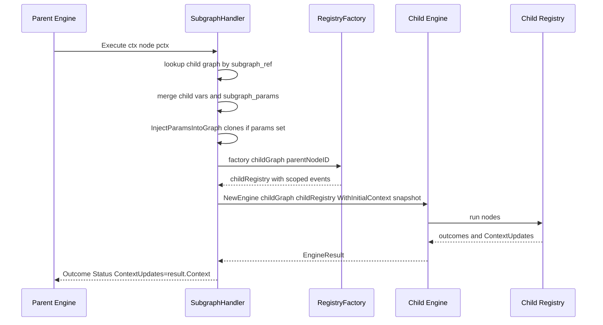

# Subgraph Handler (`subgraph`)

## Purpose

The subgraph handler runs a referenced sub-pipeline inline as a single node in
the parent graph. It enables composition — factoring a reusable workflow into
its own `.dip` file and referencing it from multiple parent pipelines, or
breaking a large pipeline into scoped sub-graphs with isolated contexts. The
parent engine treats the subgraph node as one opaque step: its handler spins
up a child engine, runs the referenced graph to completion, and maps the
child's final status onto the parent's outcome.

Use subgraphs for:

- Reusable blocks (e.g. a common "set up git repo, run tests, commit" loop).
- Scoping context: the child sees a snapshot of parent context at launch time
  and its writes don't bleed back until the child completes.
- Parameterized pipelines: pass `subgraph_params` as overrides to the child's
  declared `vars`.

## Node attributes

| Attribute | Type | Default | Behavior |
|-----------|------|---------|----------|
| `subgraph_ref` | string (required) | — | Name or path of the child `.dip` file to launch. Resolution is CLI-side (see below). |
| `subgraph_params` | string | empty | Comma-separated `key=value,key=value` pairs that override the child's declared vars. Parsed by `ParseSubgraphParams`. |

Ground truth:
[`pipeline/subgraph.go`](../../../pipeline/subgraph.go).

## Ref resolution

Resolution happens at pipeline load time, not at handler execution time.
[`cmd/tracker/loading.go`](../../../cmd/tracker/loading.go) walks every node
in the parent graph, collects `subgraph_ref` attrs, and resolves each one via
[`resolveSubgraphPath`](../../../cmd/tracker/loading.go), trying candidates in
order:

1. `<parentDir>/<ref>`
2. `<parentDir>/<ref>.dip`
3. `<cwd>/<ref>`
4. `<cwd>/<ref>.dip`

Each resolved file is loaded into a `*pipeline.Graph` and registered under its
original ref string. The resulting `map[string]*Graph` is handed to the
`SubgraphHandler` via its constructor.

### Recursion and the visited-set guard

[`loadSubgraphsRecursive`](../../../cmd/tracker/loading.go) walks into every
loaded subgraph and repeats the scan, so subgraphs can reference other
subgraphs transitively. A `visited` map keyed by the resolved absolute path
blocks cycles — if the same file would be loaded a second time while already
in the visited set, loading fails with:

> `circular subgraph reference detected: %q resolves to %q which is already
> being loaded (cycle)`

The visited entry is removed (`defer delete`) once the subgraph has been
loaded, so two sibling nodes pointing at the same child reuse the cached
`*Graph` rather than re-loading, but without tripping the cycle guard.

## Execute lifecycle



## Param passing

`subgraph_params` flows through two merge steps in
[`SubgraphHandler.Execute`](../../../pipeline/subgraph.go):

1. **Extract child defaults** from the child graph's `vars` declarations (via
   `ExtractParamsFromGraphAttrs`).
2. **Parse parent overrides** from the node's `subgraph_params` attr (via
   `ParseSubgraphParams`).
3. **Merge** — parent overrides win; child defaults supply fallbacks for
   keys the parent didn't set.
4. **Pre-expand** the merged params into the child graph via
   `InjectParamsIntoGraph`. This clones the graph if any params are set so
   the original cached graph is not mutated.
5. **Write back** the effective params onto the clone's `Attrs` as
   `graph.params.<key>` entries, so runtime handlers that read
   `graph.Attrs` see the overridden values — not just the child's original
   declarations.

Without step 1, a pre-expansion of `${params.foo}` in the child would resolve
to empty when the parent didn't pass `foo` — silently dropping the child's
default.

## Context overlay

The child engine is started with
`WithInitialContext(pctx.Snapshot())` — a full copy of the parent's context
at launch time. This means the child sees:

- Every `graph.*` attr from the parent.
- Every node's writes so far (`last_response`, `tool_stdout`, `response.<id>`,
  etc.).
- Internal keys like `_artifact_dir`.

The child gets its own `PipelineContext` instance, so writes inside the child
do not bleed back to the parent during execution. When the child completes,
its final context is returned as `result.Context` and the handler maps it
into the parent via `Outcome.ContextUpdates` — the engine applies those
updates to the parent context just like any other handler's writes.

## Outcomes produced

| Field | Value |
|-------|-------|
| `Status` | `OutcomeSuccess` if `result.Status == OutcomeSuccess`, else `OutcomeFail`. Non-success child statuses (including `OutcomeRetry`, `OutcomeBudgetExceeded`, etc.) all collapse to `OutcomeFail` at the parent level. |
| `ContextUpdates` | The child's final context snapshot (`result.Context`). Every key the child wrote is visible to the parent. |
| `SuggestedNextNodes` | Not set. |
| `PreferredLabel` | Not set. |

## Events emitted

The subgraph handler does not emit events directly — the child engine emits
its own lifecycle events, which are routed through a
[`NodeScopedPipelineHandler`](../../../pipeline/events.go) that:

- **Prefixes** every child event's `NodeID` with `parentNodeID + "/"`. So a
  child node `Decompose` inside a parent subgraph node `Planner` shows up as
  `Planner/Decompose` to the outer TUI/logger.
- **Filters** child pipeline lifecycle events (`EventPipelineStarted`,
  `EventPipelineCompleted`, `EventPipelineFailed`) — the parent engine
  already tracks the subgraph node's own stage lifecycle, so the child's
  pipeline events would double-report.

Agent-level events are similarly scoped by `RegistryFactory`, which the
caller supplies when constructing the handler. The factory creates a child
registry where agent `Event` values carry namespaced node IDs.

## Edge cases and gotchas

- **Missing ref fails at load time, not at runtime.**
  [`validateSubgraphRefs`](../../../cmd/tracker/loading.go) checks that every
  `subgraph` node has a matching entry in the loaded `graphs` map before the
  engine ever runs. At runtime, `SubgraphHandler.Execute` still double-checks
  (`subgraph %q not found`) but that branch is a safety net, not the
  expected error path.
- **No per-subgraph budget.** Budget limits on the parent engine are enforced
  at parent-node boundaries, not at child-node boundaries. A runaway child
  can consume more cost than the parent budget allows — the breach is only
  detected after the child returns.
- **Subgraphs share the parent's artifact root.** The initial context
  includes `_artifact_dir`, so every node in the child writes into the same
  run directory. Child node artifacts get prefixed with the child node's
  own ID, not the parent's — so two subgraph instances with overlapping node
  IDs will collide unless the node IDs are made unique.
- **No distinct outcome for "subgraph ran, final node was retry".** A retry
  status at the child's exit node maps to `OutcomeFail` on the parent side.
  If you need richer signaling, write a specific context key in the child's
  final node and route on that.

## Example

```dip
subgraph BuildAndTest
  subgraph_ref: "build_and_test"
  subgraph_params: "target_branch=${ctx.branch},verbose=true"

Planner -> BuildAndTest
BuildAndTest -> Review when: ctx.outcome = success
BuildAndTest -> Escalate when: ctx.outcome = fail
```

Runs `build_and_test.dip` (resolved relative to this pipeline's directory) as
a single node named `BuildAndTest`. The child inherits the full parent
context plus the two overridden params.

## See also

- [`pipeline/subgraph.go`](../../../pipeline/subgraph.go) — handler
- [`cmd/tracker/loading.go`](../../../cmd/tracker/loading.go) —
  `loadSubgraphsRecursive`, `resolveSubgraphPath`, cycle guard
- [`pipeline/params.go`](../../../pipeline/params.go) —
  `ParseSubgraphParams`, `InjectParamsIntoGraph`
- [`pipeline/events.go`](../../../pipeline/events.go) —
  `NodeScopedPipelineHandler` event prefixing
- [Manager Loop Handler](../../manager-loop.md) — related pattern that runs a
  subgraph asynchronously with steering and polling
