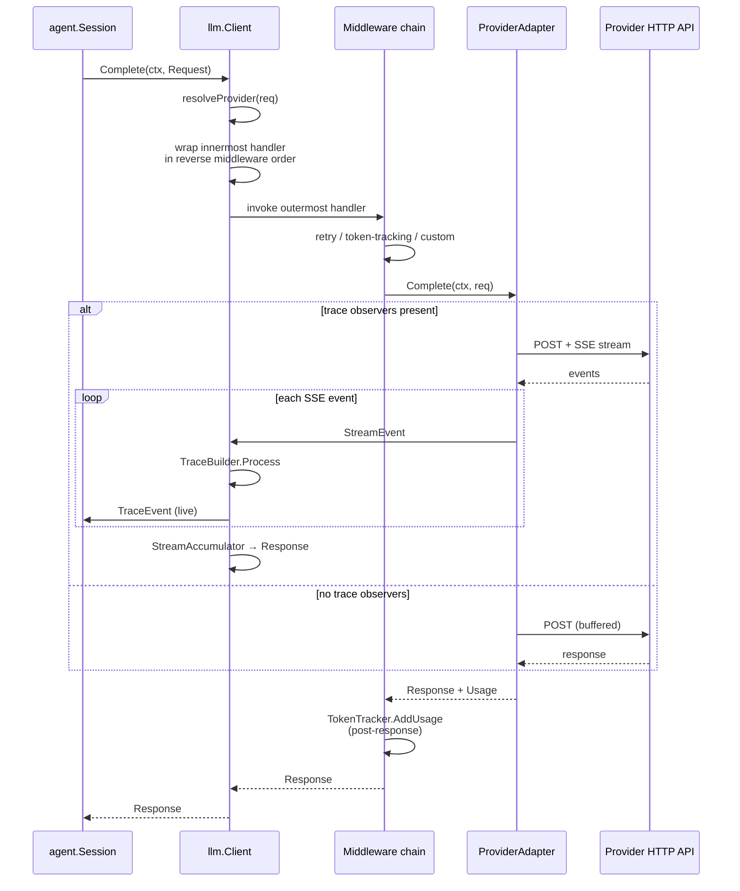
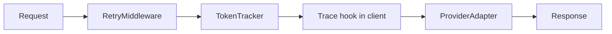
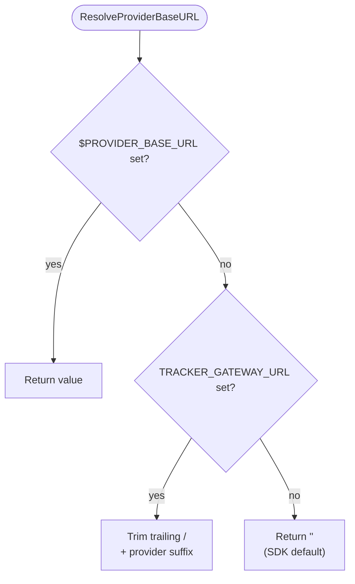

# LLM Subsystem (`llm/`)

The `llm` package is tracker's unified provider-agnostic client. Above it, every LLM-consuming subsystem (the agent session, the autopilot interviewer, the transcript collector) talks to one `llm.Client`. Below it, provider-native adapters translate the shared `Request`/`Response`/`StreamEvent` shapes into Anthropic Messages, OpenAI Responses, Gemini GenerateContent, and OpenAI-compat Chat Completions calls.

The package has three jobs:

1. **Dispatch** — route a `Request` to the right `ProviderAdapter` and run it through a middleware chain.
2. **Translate** — each provider adapter converts between tracker's canonical types and the provider's native wire format, including SSE stream parsing.
3. **Observe** — usage tracking, cost estimation, live trace observation, and retry all plug in as middleware or trace observers.

## Purpose

- Present one `Complete(ctx, req) → resp` API regardless of provider.
- Normalize usage accounting across providers that report tokens differently.
- Price results uniformly via the model catalog.
- Surface provider error classes (auth, quota, rate limit, context length, content filter) as typed errors the pipeline and agent layers can route on.
- Provide a live token-level trace (`TraceObserver`) the TUI and JSONL logger consume without the consumers having to re-parse provider SSE payloads.

## Key types

| Type | File | Description |
|------|------|-------------|
| `Client` | [client.go](../../llm/client.go) | Holds a provider map, default provider, middleware chain, trace observers. |
| `ProviderAdapter` | [provider.go](../../llm/provider.go) | Four methods: `Name`, `Complete`, `Stream`, `Close`. |
| `Request` / `Response` | [types.go](../../llm/types.go) | Canonical request and response envelopes. |
| `Message` / `ContentPart` | [types.go](../../llm/types.go) | Tagged-union content model (text, image, audio, document, tool call, tool result, thinking, redacted thinking). |
| `Usage` | [types.go](../../llm/types.go) | Input / output / total / reasoning / cache-read / cache-write tokens, `EstimatedCost`. |
| `Middleware` / `CompleteHandler` | [middleware.go](../../llm/middleware.go) | One-method interface; onion composition. |
| `TokenTracker` | [token_tracker.go](../../llm/token_tracker.go) | Per-provider `Usage` accumulator + model-last-seen; also a `Middleware`. |
| `RetryMiddleware` | [retry.go](../../llm/retry.go) | Exponential backoff for `Retryable()` errors; honors `RateLimitError.RetryAfter`. |
| `StreamEvent` / `StreamAccumulator` | [stream.go](../../llm/stream.go) | Canonical stream events plus the accumulator that folds them back into a `Response`. |
| `TraceEvent` / `TraceObserver` | [trace.go](../../llm/trace.go) | High-level live trace events (`TraceRequestStart`, `TraceText`, `TraceReasoning`, `TraceToolPrepare`, `TraceFinish`, `TraceProviderRaw`). |
| `ModelInfo` / catalog | [catalog.go](../../llm/catalog.go) | `ID + aliases + context window + max output + capabilities + input/output cost per million`. |
| `EstimateCost` | [pricing.go](../../llm/pricing.go) | Canonical cost function — used by `TokenTracker`, agent cost estimation, and CLI summary. |

Errors and their classifications (all implement `Retryable()`):

| Type | Retryable | Typical cause |
|------|-----------|---------------|
| `AuthenticationError` | no | Missing / invalid API key. |
| `NotFoundError` | no | Unknown model ID. |
| `InvalidRequestError` | no | Malformed request, tool schema problem. |
| `ContextLengthError` | no | Request exceeded model context window. |
| `ContentFilterError` | no | Provider refused the request. |
| `QuotaExceededError` | no | Hard-fail per CLAUDE.md — do not retry. |
| `RateLimitError` | yes | Backoff per `RetryAfter` if present. |
| `ServerError` | yes | Provider 5xx. |
| `ConfigurationError` | no | Missing default provider, unknown provider name. |

All live in [errors.go](../../llm/errors.go).

## Core flow



The dispatch logic is:

1. `Client.resolveProvider` picks the adapter by `req.Provider` or `c.defaultProvider`. Unknown provider → `ConfigurationError`.
2. `collectTraceObservers` merges client-level and request-level observers.
3. The innermost handler either calls `adapter.Complete` directly (no trace observers) or streams via `completeWithTrace` — the latter enables `ProviderOptions["tracker_emit_provider_events"] = true`, walks the SSE stream through `TraceBuilder`, notifies observers per event, and accumulates into a `Response` via `StreamAccumulator`.
4. Middleware wraps the handler outside-in (reverse order for onion pattern).
5. The result gets `resp.Provider = adapter.Name()` and `resp.Latency = time.Since(start)` stamped.

Only `Complete` runs through middleware. `Client.Stream` bypasses middleware and returns the adapter's raw event channel directly — streaming callers handle their own retry and accounting.

## Middleware chain

The chain is composed in `Client.Complete`:

```go
handler := CompleteHandler(func(ctx, req) { /* adapter */ })
for i := len(c.middleware) - 1; i >= 0; i-- {
    handler = c.middleware[i].WrapComplete(handler)
}
return handler(ctx, req)
```

Typical chain in the tracker library wiring (see [tracker.go](../../tracker.go)):



- `RetryMiddleware` retries on retryable errors with exponential backoff; it uses `RateLimitError.RetryAfter` when present.
- `TokenTracker` accumulates `resp.Usage` into a per-provider map and remembers the last model seen per provider — later used for cost attribution.
- The trace hook inside `Client.completeWithTrace` fires even when no middleware is registered.

`Client.AddMiddleware` exists so callers can register a `TokenTracker` after building a client from env (tracker's default path uses this).

## Token tracker and cost

`TokenTracker` has two entry points:

- **Middleware path** — `WrapComplete` captures `resp.Usage` after every successful call, normalizing the model string through the catalog (`normalizeModelID`). This maps versioned IDs like `claude-sonnet-4-5-20250514` back to the canonical catalog entry `claude-sonnet-4-5`. Introduced in v0.20.0 to fix cost underreporting on dated IDs.
- **Manual path** — `AddUsage(provider, usage, model...)` is called by the claude-code and ACP backends, which bypass the unified client. The same normalization runs so external-backend costs show up correctly in the TUI header and CLI summary.

Cost rollup lives in [token_tracker_cost.go](../../llm/token_tracker_cost.go):

- `CostByProvider(resolver)` calls `EstimateCost` per provider, using the resolver to pick the model for pricing. The typical resolver is `tracker.Result.Cost` built over `TokenTracker.ObservedModelResolver(fallbackModel)`.
- `TotalCostUSD(resolver)` sums the above.

`EstimateCost(model, usage)` in [pricing.go](../../llm/pricing.go) looks up the model in the catalog (ID + aliases) and multiplies per-million-token rates. **Cache read tokens are priced at 10% of input rate; cache write tokens at 25% of input rate** — Anthropic's convention applied uniformly because no other provider has contradictory documentation. Unknown models return 0 (no hallucinated cost).

Before v0.20.0, pricing was duplicated between `pricing.go` and a hardcoded map in `token_tracker.go`; catalog is now the single source of truth.

## Catalog

[catalog.go](../../llm/catalog.go) is a single `defaultCatalog` slice of `ModelInfo` entries ordered **newest-first per provider** so `GetLatestModel(provider, capability)` returns the freshest match. Each entry carries:

- `ID` (canonical).
- `Aliases` (short names users type; resolved by `GetModelInfo`).
- `Provider` (`anthropic`, `openai`, `gemini`, `openai-compat` — note **`gemini`**, not `google`).
- `ContextWindow` and `MaxOutput`.
- `SupportsTools`, `SupportsVision`, `SupportsReasoning`.
- `InputCostPerM` / `OutputCostPerM` in USD.

The v0.20.0 refresh added Claude Opus 4.7 / Sonnet 4.6, GPT-5.4 family, Gemini 3 Flash preview, and Gemini 3.1 Pro preview. See `CHANGELOG.md` entries under v0.20.0.

## Provider adapters

Each adapter under `llm/<provider>/` implements `ProviderAdapter`. The layout is uniform:

- `adapter.go` — HTTP client, `Complete`/`Stream`, `Name`, `Close`.
- `translate.go` — `Request` → provider JSON.
- `translate_response.go` / inline — provider JSON / SSE → `Response`.
- `adapter_sse.go` (OpenAI only) — SSE event handlers split out to keep the adapter file small.

### Anthropic ([llm/anthropic/adapter.go](../../llm/anthropic/adapter.go))

- Endpoint: `POST /v1/messages`, SSE when streaming.
- `response_format: json_object` is injected as a system-level instruction (Anthropic has no native "force JSON" flag in Messages).
- Thinking blocks (`thinking`, `redacted_thinking`) round-trip through the canonical `ContentPart` variants.
- **`WithExtraHeaders`** lets callers add arbitrary headers (e.g. `cf-aig-token` for Cloudflare AI Gateway). `tracker.go` populates this when `CF_AI_GATEWAY_TOKEN` is set.

### OpenAI ([llm/openai/adapter.go](../../llm/openai/adapter.go))

- Endpoint: `POST /v1/responses` (the Responses API, not Chat Completions). `openai-compat` targets Chat Completions.
- `response_format: json_object` maps to the native OpenAI `response_format.type = "json_object"` parameter.
- SSE event types include `response.created`, `response.output_item.added`, `response.output_text.delta`, `response.function_call_arguments.delta`, `response.output_item.done`, `response.completed`, `response.in_progress`, and — critically — `error` and `response.failed`.
- **200-OK-with-error gotcha**: the Responses API returns HTTP 200 and signals failure by sending an `error` or `response.failed` SSE event. `handleSSEError` in [adapter_sse.go](../../llm/openai/adapter_sse.go) parses these and converts the `code` field into the right typed error (`AuthenticationError`, `QuotaExceededError`, `RateLimitError`, `ContextLengthError`, `ContentFilterError`, `ServerError`, etc.). Failing to do this would look like a successful empty response. This is an explicit CLAUDE.md invariant: never silently swallow errors.

### Gemini ([llm/google/adapter.go](../../llm/google/adapter.go))

- Endpoints: `POST /v1beta/models/{model}:generateContent` and `:streamGenerateContent?alt=sse`.
- Provider name is `gemini` (the adapter package is `google` but `Name()` returns `gemini`).
- `response_format: json_object` maps to `generationConfig.responseMimeType = "application/json"`.
- `response_format: json_schema` also sets `responseSchema`.

### OpenAI-compat ([llm/openaicompat/adapter.go](../../llm/openaicompat/adapter.go))

- Endpoint: `POST /v1/chat/completions`. Targets any OpenAI-Chat-Completions-shaped API (OpenRouter, LM Studio, vLLM, Together, etc.).
- Maps `ResponseFormat` through the Chat Completions `response_format` field.
- The translator in [openaicompat/translate.go](../../llm/openaicompat/translate.go) preserves tool-call arguments as `json.RawMessage` to avoid re-serialization drift.

## Streaming model

`StreamEvent` ([stream.go](../../llm/stream.go)) is the normalized event enum every adapter emits:

- Text: `stream_start`, `text_start`, `text_delta`, `text_end`.
- Reasoning: `reasoning_start`, `reasoning_delta`, `reasoning_signature`, `reasoning_end`, `redacted_thinking`.
- Tool calls: `tool_call_start`, `tool_call_delta` (argument JSON fragments), `tool_call_end`.
- Terminal: `finish`, `error`.
- Pass-through: `provider_event` (opaque raw bytes).

`StreamAccumulator.Process` folds the event sequence back into a fully-formed `Response.Message` with `ContentPart` entries in insertion order. Adapters that buffer internally (non-streaming path) short-circuit and emit a single `stream_start`, text, tool calls, then `finish`.

## Base URL resolution

Tracker's library entry point (`tracker.Run`, `tracker.NewEngine`) resolves each provider's base URL via `tracker.ResolveProviderBaseURL(provider)` in [tracker.go](../../tracker.go). This is the canonical resolver; adapters do not call it themselves.



Provider → env key / suffix mapping:

| Provider | Env var | Gateway suffix |
|----------|---------|----------------|
| `anthropic` | `ANTHROPIC_BASE_URL` | `/anthropic` |
| `openai` | `OPENAI_BASE_URL` | `/openai` |
| `gemini` | `GEMINI_BASE_URL` | `/google-ai-studio` |
| `openai-compat` | `OPENAI_COMPAT_BASE_URL` | `/compat` |

Per-provider env vars always win. `resolveProviderBaseURLWithGateway` is the inner variant that accepts a `gatewayURL` string argument — used by the `--gateway-url` CLI flag, which sets `TRACKER_GATEWAY_URL` before the LLM client is built.

OpenAI has an extra normalization step: trailing `/v1` is stripped from the base URL because `responsesPath` already includes the `/v1` prefix. Without this, `OPENAI_BASE_URL=http://localhost:9999/v1` would produce `/v1/v1/responses`.

## Construction

Two paths:

### Explicit

```go
c, err := llm.NewClient(
    llm.WithProvider(anthropic.New(apiKey, anthropic.WithBaseURL(base))),
    llm.WithProvider(openai.New(apiKey)),
    llm.WithDefaultProvider("anthropic"),
    llm.WithMiddleware(llm.NewRetryMiddleware(llm.WithMaxRetries(3))),
)
```

### From environment

```go
c, err := llm.NewClientFromEnv(map[string]func(string) (llm.ProviderAdapter, error){
    "anthropic":     func(k string) (llm.ProviderAdapter, error) { return anthropic.New(k), nil },
    "openai":        func(k string) (llm.ProviderAdapter, error) { return openai.New(k), nil },
    "gemini":        func(k string) (llm.ProviderAdapter, error) { return google.New(k), nil },
    "openai-compat": func(k string) (llm.ProviderAdapter, error) { return openaicompat.New(k), nil },
})
```

`NewClientFromEnv` walks `providerPriority` (`anthropic`, `openai`, `gemini`, `openai-compat`), reads `providerEnvKeys` (including `GOOGLE_API_KEY` as a `GEMINI_API_KEY` alias), and picks the first configured provider as the default. No providers configured → `ConfigurationError` ("no providers configured"). The tracker CLI wraps this error with actionable instructions (see CLAUDE.md §Error surfacing).

## Integration points

- **Above**: `agent.Session.doLLMCall` builds a `Request` with messages, tools, reasoning effort, response format, and registered `TraceObservers` that fan out into `agent.Event`s.
- **Above**: `pipeline/handlers/autopilot.go` reuses the same client for headless gate decisions.
- **Above**: `cmd/tracker/summary.go` reads `TokenTracker.AllProviderUsage()` and `CostByProvider` for the CLI summary.
- **Sideways**: `pipeline/handlers/backend_claudecode.go` and `backend_acp.go` do not use the client at all — they pipe `TokenTracker.AddUsage` directly after parsing their subprocess output.
- **Below**: every adapter owns its own `http.Client` with a 5-minute timeout.

## Gotchas and invariants

- **Provider name is `gemini`, not `google`.** The package path is `llm/google/` for historical reasons, but `Name()` returns `gemini`, the env var is `GEMINI_API_KEY` (with `GOOGLE_API_KEY` as a fallback alias), and every other layer uses `gemini`.
- **OpenAI errors come as 200 + SSE events.** `handleSSEError` is the only place that handles this. Adding a new OpenAI SSE event type without routing it through `handleSSEDataOtherEvents` will silently drop errors.
- **Middleware runs only on `Complete`.** `Stream` bypasses everything — no retry, no token tracking. Callers that stream manually are responsible.
- **Usage normalization requires catalog presence.** A model missing from the catalog won't be normalized, and `EstimateCost` will return 0. Add new models to `defaultCatalog` when providers ship them; otherwise the TUI header and CLI cost summary under-report.
- **Cache tokens price differently.** Reads at 10% of input, writes at 25%. If a provider adds a new cache tier (e.g. "cache hit, fresh read"), `EstimateCost` needs updating.
- **Retry middleware does not reorder errors.** A non-retryable error (auth, quota, context length) is surfaced on the first try, unchanged. `QuotaExceededError` is intentionally non-retryable per CLAUDE.md — burning credits on retry is worse than a fast failure.
- **Trace observers may block.** `processAndNotify` calls them synchronously on the stream goroutine. Heavy observers should buffer.
- **Base URL resolution order matters at startup only.** Adapters capture their base URL at construction. Changing env vars after `NewClient` has run will not retarget existing adapters.

## Files

- [llm/client.go](../../llm/client.go) — `Client`, `Complete`, `Stream`, middleware composition, env-based construction.
- [llm/middleware.go](../../llm/middleware.go) — `Middleware` interface and `CompleteHandler`.
- [llm/provider.go](../../llm/provider.go) — `ProviderAdapter` interface.
- [llm/types.go](../../llm/types.go) — `Request`, `Response`, `Message`, `ContentPart`, `Usage`.
- [llm/stream.go](../../llm/stream.go) — `StreamEvent`, `StreamAccumulator`.
- [llm/token_tracker.go](../../llm/token_tracker.go) — per-provider accumulator and model normalization.
- [llm/token_tracker_cost.go](../../llm/token_tracker_cost.go) — `CostByProvider`, `TotalCostUSD`.
- [llm/pricing.go](../../llm/pricing.go) — `EstimateCost`.
- [llm/catalog.go](../../llm/catalog.go) — `ModelInfo`, `GetModelInfo`, `ListModels`, `GetLatestModel`.
- [llm/retry.go](../../llm/retry.go) — `RetryMiddleware` with `Retryable()` detection.
- [llm/errors.go](../../llm/errors.go) — typed error hierarchy.
- [llm/trace.go](../../llm/trace.go) / [llm/trace_logger.go](../../llm/trace_logger.go) — `TraceBuilder`, `TraceObserver`, file logger.
- [llm/anthropic/](../../llm/anthropic) / [llm/openai/](../../llm/openai) / [llm/google/](../../llm/google) / [llm/openaicompat/](../../llm/openaicompat) — provider adapters.
- [tracker.go](../../tracker.go) — `ResolveProviderBaseURL` and per-provider adapter factories.

## See also

- [../ARCHITECTURE.md](../../ARCHITECTURE.md) — top-level system view.
- [./agent.md](./agent.md) — the primary consumer of `Complete`.
- [./backends.md](./backends.md) — when the LLM client is *not* on the hot path (claude-code, ACP).
- [./artifacts.md](./artifacts.md) — where per-turn usage lands in `activity.jsonl` and audit reports.
