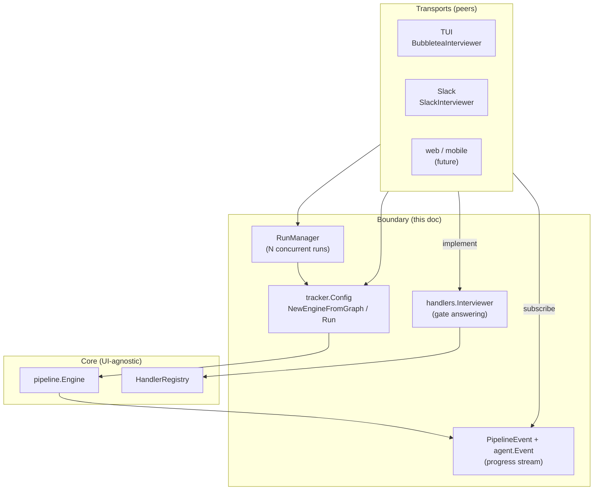

# Transport Boundary

A **transport** is a front-end that drives Tracker runs and relays them to a
human: the terminal TUI, the Slack bot ([`cmd/trackerbot`](../../cmd/trackerbot)),
or a future web/mobile app. This doc describes the boundary those front-ends
plug into — a small, deliberate library surface (`tracker.Config` → `Engine`,
plus `RunManager`) that the core exposes so **every transport is a first-class
peer**, none privileged.

The design goal: what the library can do and what the product can do are the
same set. The `tracker` CLI proves it — since the CLI→library unification it
runs on nothing but this boundary (see the run/TUI paths in
[`cmd/tracker/run.go`](../../cmd/tracker/run.go)).

Source: top-level [`tracker.go`](../../tracker.go), [`tracker_runmanager.go`](../../tracker_runmanager.go),
[`pipeline/events.go`](../../pipeline/events.go), [`pipeline/handlers/human.go`](../../pipeline/handlers/human.go).

## The shape



The core (`pipeline.Engine`) knows nothing about LLMs, subprocesses, human
gates, terminals, or Slack — see [`engine.md`](./engine.md). A transport is
fully described by **six interaction categories**, all composed from existing
public types.

## 1. Start a run

| Entry | Use |
|---|---|
| `tracker.Run(ctx, source, cfg)` | one-call convenience (parses, runs, closes) |
| `tracker.NewEngineWithContext(ctx, source, cfg)` → `Engine.Run(ctx)` | parse + run, holding the engine |
| `tracker.NewEngineFromGraph(ctx, graph, cfg)` → `Engine.Run(ctx)` | run a **pre-parsed** graph; the caller resolved the source (and any `subgraph_ref` files → `Config.Subgraphs`) itself |

Everything a transport supplies is a field on `tracker.Config` (all optional):

- `Interviewer handlers.Interviewer` — the human-gate seam (category 2).
- `EventHandler pipeline.PipelineEventHandler`, `AgentEvents agent.EventHandler`,
  `LLMTrace llm.TraceObserver` — the progress streams (category 3).
- `Subgraphs`, `ToolSafety`, `Budget`, `Backend`, `Model`, `Provider`,
  `GatewayURL`/`GatewayKind`, `Params`, `Context`, `Git`, `CheckpointDir`,
  `ResumeRunID`, `TokenTracker`, `LLMClient`.

`Config.TokenTracker` lets an in-process transport (the TUI) share one token/cost
tracker with the engine for its live spend readout.

## 2. Answer human gates — the key seam

`Config.Interviewer` accepts anything implementing the interviewer family in
[`pipeline/handlers/human.go`](../../pipeline/handlers/human.go); the human
handler upgrades to the richest supported mode via type assertion:

```go
type Interviewer interface { Ask(prompt string, choices []string, def string) (string, error) }
type FreeformInterviewer interface { Interviewer; AskFreeform(prompt string) (string, error) }
type LabeledFreeformInterviewer interface { FreeformInterviewer; AskFreeformWithLabels(...) (string, error) }
type InterviewInterviewer interface { FreeformInterviewer; AskInterview([]Question, *InterviewResult) (*InterviewResult, error) }
```

Optional side-interfaces (checked by assertion): `Actor() pipeline.Actor` (override
auditing), `Cancel()` (torn down on `Engine.Close`), `SetPipelineContext(ctx)`
(a run cancellation unblocks a waiting gate).

Reference implementations prove the seam is transport-neutral: `ConsoleInterviewer`,
`tui.BubbleteaInterviewer`, `WebhookInterviewer`, the autopilot interviewers, and
`trackerbot.SlackInterviewer`.

## 3. Observe progress

Two Config-wired streams (a transport merges them):

- **`pipeline.PipelineEventHandler`** — lifecycle: `pipeline_started` (carries a
  `RunSnapshot` — node inventory + resume state, so a mid-run subscriber can seed
  its model), `stage_*`, `cost_updated` (carries a `NodeID` for per-node
  attribution + a `CostSnapshot`), `budget_exceeded`, `validation_overridden`,
  and the terminal event (carries an authoritative `TerminalStatus` — `success` /
  `validation_overridden` / `fail` / `budget_exceeded`). The **top-level** engine
  emits exactly one terminal event carrying `TerminalStatus` for its own run —
  including panic and invariant-error exits, which the backstop covers — so "any
  event with a non-empty `TerminalStatus` **and an unscoped `NodeID`**" is the
  run-finished signal. (A subgraph / `manager_loop` child that trips the shared
  budget guard emits its own scoped `budget_exceeded`, which also carries a
  `TerminalStatus`; its `NodeID` is scoped with a `/`.)
- **`agent.EventHandler`** — per-tool-call activity: `session_*`, `tool_call_*`,
  `text_delta`, usage, provider/model.
- **`llm.TraceObserver`** (via `Config.LLMTrace`) — raw request/reasoning/text
  trace, for a transport that wants live tokens without owning the client.

`StreamEvent` (NDJSON, `tracker.NewNDJSONWriter`) is the flat wire form of the
pipeline stream, carrying `terminal_status` / `node_id`.

## 4. Control a run

- Cancel: cancel the `ctx` passed to `Run` (or `RunManager.Cancel(key)`).
- Resume: point `Config.CheckpointDir` at an existing checkpoint (or set
  `Config.ResumeRunID`); the engine replays from it automatically.

## 5. Deliver results & inspect state

- `tracker.Result` — `RunID`, `Status`, `Context`, `Cost`, `ArtifactRunDir`,
  `TokensByProvider`, `Trace`. `Engine.Run` returns the fail `Result` **alongside**
  the error, so a failed run is still correlatable.
- Read-only APIs any transport can serialize: `ListRuns`, `Audit`, `Diagnose`,
  `Simulate`, `ResolveRunDir`, `MostRecentRunID`, `LoadActivityLog`.
- `ExportBundle` for a portable run history; `NewLLMClient(cfg)` for a standalone
  model call outside a run (e.g. request classification).

## 6. Resolve what to run

`ResolveSource(name, workDir)` (path → local `.dip` → built-in catalog), the
`Workflows()` catalog, `LookupWorkflow`, `OpenWorkflow` — for a transport that
offers a workflow picker or maps free text onto a built-in.

## Concurrency: RunManager

[`tracker_runmanager.go`](../../tracker_runmanager.go) owns **N concurrent runs**
keyed by a caller-chosen external id, so a service (Slack, web) can drive many at
once from one process:

- `Start(ctx, key, source, cfg)` launches a run in its own goroutine, keyed by
  `key` (e.g. a Slack `thread_ts`); an atomic claim guards the active-key and an
  optional concurrency cap (`WithMaxConcurrent` → `ErrAtCapacity` /
  `ErrRunKeyActive` — mechanism, not policy).
- `ManagedRun` exposes `State`/`Done`/`Result`/`RunID`; the manager exposes
  `Get`/`List`/`Cancel`/`Forget`.
- Per-run isolation makes concurrency safe: distinct `WorkingDir` per run
  (`WithWorkDirBase`), no shared mutable state, and the webhook interviewer's
  callback port defaults to `:0` so two webhook-gated runs never collide.

## The transports as instances

| Transport | Interviewer | Progress | Concurrency |
|---|---|---|---|
| **TUI** ([`tui.md`](./tui.md)) | `BubbleteaInterviewer` via `Config.Interviewer` | `EventHandler`/`AgentEvents` → `prog.Send`; shares `Config.TokenTracker` | one run per process |
| **Slack** ([`cmd/trackerbot`](../../cmd/trackerbot/README.md)) | `SlackInterviewer` (thread gates) | `notifier` filters events → thread | `RunManager`, one run per thread |
| **web / mobile** | implement `handlers.Interviewer` | subscribe to the streams | `RunManager` |

## Building a new transport

1. Implement `handlers.Interviewer` (+ the richer extensions you support) to
   present gates in your medium; pass it as `Config.Interviewer`.
2. Provide a `PipelineEventHandler` (and optionally `AgentEvents` / `LLMTrace`)
   that renders progress; pass via `Config`.
3. For many concurrent runs, hold a `RunManager` keyed by your session id, with
   `WithWorkDirBase` for isolation.
4. Resolve requests to a workflow with `ResolveSource` / `Workflows`; deliver
   with `Result` + `Diagnose` / `ExportBundle`.
5. **Prove it with the conformance suite.** Run
   [`transport/conformance`](../../transport/conformance) `RunInterviewerSuite`
   from a test to verify your interviewer honours every gate mode (choice /
   yes-no / freeform / interview) and unblocks on cancellation — the executable
   definition of a correct interviewer, the same suite `SlackInterviewer` passes.

Nothing above touches the engine — the boundary is the whole contract.

## The invariants a transport inherits (enforced, not by convention)

These hold in the **core** regardless of transport — a front-end cannot violate
them, and gets them for free:

- **Exactly one top-level terminal event** carries `TerminalStatus` — including
  panic and invariant-error exits (the engine's backstop). Your run-finished
  signal never goes missing.
- **A handler panic is contained** — it becomes a `fail` terminal event, never a
  crashed host, so a `RunManager` driving many runs survives one bad run.
- **Per-run isolation** — distinct `WorkingDir`, no shared mutable state, per-run
  webhook port; N concurrent runs never collide.
- **Durable resume** — checkpoints are written atomically and keyed
  deterministically, so a process crash resumes from the last completed node.

Your transport's job is presentation and identity (who may run, how gates look);
these safety and durability properties are not yours to re-implement.
