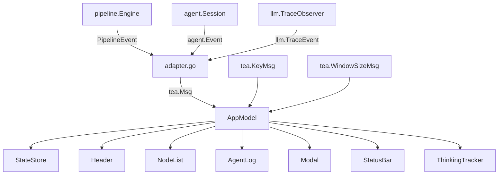
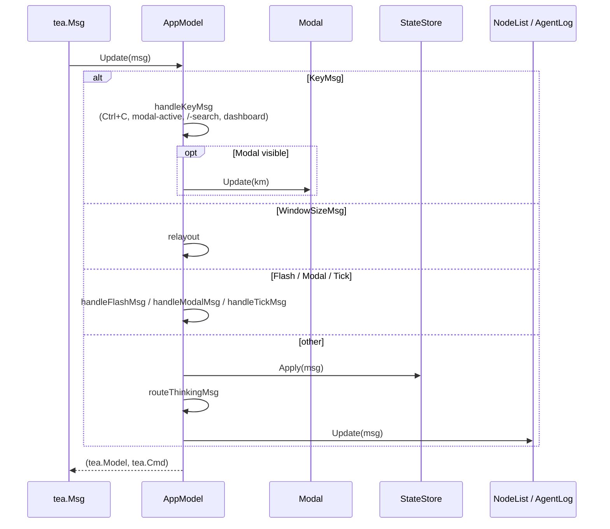
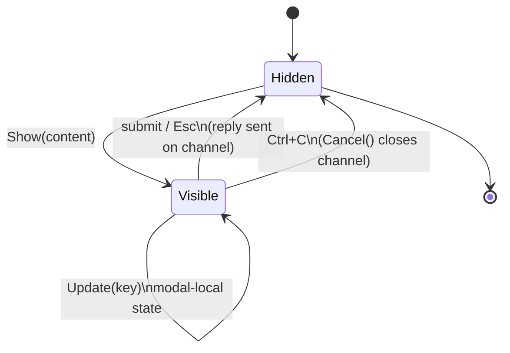

# TUI Subsystem (`tui/`)

The tracker TUI — internally the "Signal Cabin" dashboard — is a Bubbletea application that renders live pipeline execution as a grid of panels. It has three inputs (typed messages derived from engine / agent / LLM events, keystrokes, and window-resize events) and one output (a string frame written to the terminal every update cycle).

Everything above the TUI boundary (the pipeline engine, agent sessions, LLM trace observers) communicates with it through the event adapter in [adapter.go](../../tui/adapter.go), which is the **only** file in the package that imports engine types. Every other file works in terms of typed `MsgXxx` messages from [messages.go](../../tui/messages.go), keeping the TUI testable without spinning up a real pipeline.

## Purpose

- Render a compact, append-only activity log without re-rendering past content (terminal stability invariant).
- Show a per-node status panel that reflects lifecycle + current phase + token / cost usage.
- Handle human-in-the-loop gates via modal overlays with the right content type for the gate's shape.
- Stay responsive: all expensive work is synchronous per-message, no goroutines inside the model.

## Top-level architecture

The `AppModel` in [app.go](../../tui/app.go) is the root `tea.Model`. Its update function is a message dispatcher: key handling, modal routing, flash messages, tick messages, then a general "apply to store + children" fallthrough. The layout code in `View()` composes header, content, and status bar vertically and overlays the modal when visible.

## Key types

| Type | File | Description |
|------|------|-------------|
| `AppModel` | [app.go](../../tui/app.go) | Root Bubbletea model. Pointer fields so value-receiver updates propagate. |
| `StateStore` | [state.go](../../tui/state.go) | Central state. Node list, per-node `nodeInfo` (status, errMsg, phase, cost, duration), visit path, token tracker pointer. Applies typed messages via `Apply(msg)`. |
| `NodeEntry` / `NodeFlags` | [state.go](../../tui/state.go) | ID + label + parallel-role flags (`IsParallelDispatcher`, `IsParallelBranch`, `IsFanIn`). |
| `NodeList` | [nodelist.go](../../tui/nodelist.go) | Sidebar rendering node status lamps; owns scroll offset and drill-down selection cursor. |
| `AgentLog` | [agentlog.go](../../tui/agentlog.go) | Per-node stream buffers, append-only styled-line log, verbosity filter, node-focus drill-down, search integration. |
| `ThinkingTracker` | [thinking.go](../../tui/thinking.go) | Per-node spinner frames, current tool, elapsed-time ticker. |
| `Modal` + `ModalContent` | [modal.go](../../tui/modal.go) | Overlay dispatcher. `ModalContent` implementations implement `Update`/`View` and optionally `Cancellable`, `FullscreenContent`. |
| `Header` / `StatusBar` | [header.go](../../tui/header.go) / [statusbar.go](../../tui/statusbar.go) | Top-line status (pipeline name, run ID, tokens, cost) and bottom-line hints + flash. |
| `SearchBar` | [search.go](../../tui/search.go) | `/`-activated search over the agent log with n/N next/prev. |

Messages in [messages.go](../../tui/messages.go) are grouped as:

- **Pipeline lifecycle** — `MsgNodeStarted`, `MsgNodeCompleted`, `MsgNodeFailed`, `MsgNodeRetrying`, `MsgPipelineCompleted`, `MsgPipelineFailed`.
- **Agent activity** — `MsgThinkingStarted`/`Stopped`, `MsgTextChunk`, `MsgReasoningChunk`, `MsgToolCallStart`/`End`, `MsgAgentError`, `MsgVerifyStatus`.
- **LLM trace** — `MsgLLMRequestPreparing`/`Start`/`Finish`/`ProviderRaw`.
- **Gate** — `MsgGateChoice`, `MsgGateFreeform`, `MsgGateInterview`, `MsgGateAutopilot`.
- **Ticks / UX** — `MsgThinkingTick`, `MsgHeaderTick`, `MsgToggleExpand`, `MsgModalDismiss`, `MsgPipelineDone`, `MsgCycleVerbosity`, `MsgFocusNode`/`ClearFocus`, `MsgSearchActivate`/`Deactivate`/`Update`, `MsgStatusFlash`/`Clear`.

## Update cycle

### Message routing order (in `AppModel.Update`)

1. **Key messages** — handled specially. Ctrl+C calls `Modal.CancelAndHide()` (closes any pending reply channels) then quits, matching the "never block on channel send without cancellation" invariant from CLAUDE.md.
2. **Window resize** — updates `layout.width`/`height` and triggers `relayout()`.
3. **Flash messages** — status bar transient text; fires a 2-second `tea.Tick` to clear.
4. **Modal routing** — gate messages show the appropriate modal content; `MsgModalDismiss` hides; `MsgPipelineDone` quits.
5. **Tick messages** — spinner tick (`MsgThinkingTick`) and header tick (`MsgHeaderTick`) re-schedule themselves and update the thinking tracker / header clock.
6. **Everything else** — `Store.Apply(msg)` (state mutation) then fan out to `NodeList.Update` and `AgentLog.Update`.

The per-component `Update` methods are pure: they mutate their own state only.

## Modal content types

The modal is the single entrypoint for all human-in-the-loop interactions. Every implementation of `ModalContent` is also a `Cancellable` so Ctrl+C unblocks the pipeline handler waiting on the reply channel.

| Content type | File | When |
|--------------|------|------|
| `ChoiceContent` | [modal.go](../../tui/modal.go) | Default labeled gates (single-select, no freeform). Fixed `OutcomeSuccess`; routing uses `PreferredLabel`. |
| `FreeformContent` | [modal.go](../../tui/modal.go) | Freeform gate with no labels. Wrapping textarea, Enter inserts newline, Ctrl+S submits, Esc submits with content (approval) or cancels empty. |
| `HybridContent` | [hybrid.go](../../tui/hybrid.go) | Labeled freeform gate (short prompt). Radio labels + "other" option with inline textarea. |
| `ReviewContent` | [review.go](../../tui/review.go) | Long freeform prompt (20+ lines) without labels. Split-pane with glamour-rendered viewport. |
| `ReviewHybridContent` | [review_hybrid.go](../../tui/review_hybrid.go) | Labeled gate with long context (>200 chars or >5 lines after `---`). Fullscreen glamour viewport + radio labels + "other" textarea. |
| `InterviewContent` | [interview_content.go](../../tui/interview_content.go) | Structured multi-field form for `mode: interview` human nodes. One question per screen with progress, answered summary, and "Other" escape hatch. |
| `HelpContent` | [help.go](../../tui/help.go) | `?`-invoked keyboard shortcut reference overlay. |
| `AutopilotContent` | [modal.go](../../tui/modal.go) | Non-interactive display of the autopilot's decision; auto-closes after 2s. |

`Modal.Show(content)` installs the content; `propagateSize` tells the content how wide/tall it can be so textareas and glamour viewports resize correctly.

The glamour renderer is used only for content viewports that contain markdown (long prompts, labeled gate context). The activity log does **not** use glamour — it styles line-by-line with lipgloss once at newline time (see stability invariants below).

## Agent log

[agentlog.go](../../tui/agentlog.go) owns the activity-log panel. Its invariants, taken directly from CLAUDE.md §TUI stability:

- **Append-only, line-styled once**. A line is styled with lipgloss on newline and stored as a `styledLine`; it is never re-rendered. This prevents the scroll jitter that markdown-renderers produce when styling recomputes.
- **Per-node streams**. Each pipeline node has its own `nodeStream` buffer. When a newline arrives, the in-progress line is flushed to the unified log tagged with the node ID.
- **Separators on node change**. When the node ID flips between lines, a separator line is inserted so interleaved parallel-branch output stays visually distinct.
- **Activity indicator line always reserved**. One row at the bottom is reserved for the current thinking status, even when idle. This keeps the viewport from jumping when the indicator appears / disappears.
- **Count terminal rows, not entries**. Budgeting the visible region accounts for wrapped lines so a single long assistant message does not over-fill.

### Verbosity filter

`v` cycles the verbosity via `MsgCycleVerbosity`:

1. `all` — every line.
2. `tools` — `LineTool` lines only.
3. `errors` — `LineError` only.
4. `reasoning` — `LineReasoning` only.

Lines are tagged (`LineKind`) at creation; filtering is view-only. The underlying buffer retains everything so the user can cycle without losing context.

### Drill-down

Pressing `Enter` on the node list sends `MsgFocusNode{NodeID: …}` to the agent log. When a focus node is set, the log renders only lines tagged with that node. `Esc` sends `MsgClearFocus`.

### Search

`/` activates `SearchBar`. Subsequent characters update the search term; `n`/`N` navigates matches; `Esc` exits. Search spans the filtered view so verbosity interacts correctly.

### Zen mode

`z` toggles `AppModel.layout.zenMode`, which hides the node sidebar and the agent log takes the full width (`renderZenContent` vs `renderSplitContent`).

## Node list / sidebar

[nodelist.go](../../tui/nodelist.go) renders a signal-lamp column: one row per node, colored by `NodeState` (pending/running/done/failed/retrying/skipped), annotated with the thinking spinner frame when the node is active. The list order is topological (set by `cmd/tracker/nodes.go:buildNodeList` before launch).

### Subgraph pre-population (v0.19.0)

Subgraph child nodes are inserted directly after their parent subgraph node in the list:

- `cmd/tracker/nodes.go:buildNodeListVisited` recursively flattens child graphs, prefixing each child's ID with `<parent>/` to avoid collisions.
- A `visited` set tracks `subgraph_ref` values already being expanded so programmatically-constructed cyclic maps cannot recurse to stack overflow.
- Labels are preserved: if a child node has a user-set label (e.g. "Build step"), it stays — the UI does not clobber it with a prefixed ID.

This is done **at start-up** so users see the full execution plan before any node runs, including subgraph children that haven't dispatched yet.

### Dynamic insertion

`StateStore.ensureSubgraphNode` ([state.go](../../tui/state.go)) inserts subgraph children lazily when a `MsgNodeStarted` for an unknown ID arrives — a defense-in-depth for subgraphs that slipped past the pre-population path.

## Keyboard shortcuts

From CLAUDE.md §TUI keyboard shortcuts (v0.13.0+):

| Key | Action |
|-----|--------|
| `v` | Cycle log verbosity (`all` → `tools` → `errors` → `reasoning` → `all`). |
| `z` | Toggle zen mode (full-width log, sidebar hidden). |
| `/` | Activate search in the agent log. |
| `n` / `N` | Next / previous search match. |
| `?` | Show help overlay. |
| `Enter` | Drill into the selected node in the sidebar. |
| `Esc` | Clear focus / exit search / cancel modal. |
| `y` | Copy visible log to clipboard (platform-aware — `pbcopy`/`xclip`/`clip`). |
| `Ctrl+O` | Expand / collapse tool output in the log. |
| `Ctrl+C` | Cancel modal (closes reply channels) and quit. |
| `q` | Quit (outside modal). |

Special-key handling is in `AppModel.applyDashboardSpecialKey`; rune handling is `applyDashboardRuneAction`. Search-mode and modal-visible states intercept keystrokes earlier in the dispatch order.

## Event adapter

[adapter.go](../../tui/adapter.go) is the only file importing engine-layer packages. Three functions:

- `AdaptPipelineEvent(pipeline.PipelineEvent)` → lifecycle `MsgNode*` and `MsgPipeline*`.
- `AdaptAgentEvent(agent.Event, nodeID string)` → `MsgThinking*`, `MsgText/Tool/AgentError`, `MsgVerifyStatus`.
- `AdaptLLMTraceEvent(llm.TraceEvent, nodeID string, verbose bool)` → zero or more typed messages (`TraceRequestStart` emits `MsgLLMRequestStart`; `TraceText` / `TraceReasoning` emit chunk messages; `TraceFinish` emits `MsgLLMFinish`).

Adapters return `nil` for events that have no visual representation (e.g. `llm.TraceToolPrepare` — the real tool-call-start message arrives via the agent event stream a moment later).

Above the TUI, `cmd/tracker/run.go` builds pipeline, agent, and LLM event handlers that call these adapters and `tea.Program.Send` the resulting message.

## Gotchas and invariants

- **All model fields are pointers.** Bubbletea uses value-receiver `Update` semantics; without pointer fields, mutations in child components wouldn't survive across dispatches. `AppModel.lay` even has its own struct so primitive fields (width, height, zenMode) can be pointer-shared.
- **Ctrl+C must always call `Modal.CancelAndHide()`.** Forgetting this leaves the pipeline handler goroutine blocked on a channel send forever. Every `ModalContent` implements `Cancellable` and closes its reply channel.
- **The activity log never re-renders.** Line styling is applied once at newline time. Using glamour here would introduce scroll jitter because glamour restyles whenever the viewport width changes.
- **Glamour is only for modal content.** `ReviewContent`, `ReviewHybridContent`, and labeled-gate contexts that carry markdown use glamour; the log does not.
- **The activity indicator row is always reserved.** Even when idle, one row is set aside at the bottom so the indicator appearing does not push log content up.
- **Per-node streams, not a single interleaved buffer.** Parallel branches interleave at the log level with `───── <node> ─────` separators when the last-line node ID changes. Sharing a single buffer across nodes would produce confusing line-mid-other-line output.
- **Verbosity cache is rebuilt lazily.** `filteredCache` is invalidated via `filterDirty` and rebuilt when the log renders. The raw log is always complete; verbosity is a view.
- **Pre-populate subgraph nodes.** Users expect to see the full plan. `buildNodeList` runs once at startup with the subgraph map from `cmd/tracker/loading.go`.
- **The TUI does not perform any IO on the hot path.** Clipboard copy (`y`) shells out via `exec.Command` as a `tea.Cmd`; it does not block `Update`. File IO (artifact writing) is the engine's job.
- **State is one store; views are pluggable.** Tests inject a `StateStore` with pre-populated node info and render a `View()` off a zero-message dispatch, so most behavior is testable without running the pipeline.

## Files

- [tui/app.go](../../tui/app.go) — root `AppModel`, update dispatcher, layout.
- [tui/state.go](../../tui/state.go) — `StateStore`, `NodeState`, `NodePhase`, `NodeEntry`, `ensureSubgraphNode`.
- [tui/modal.go](../../tui/modal.go) — `Modal`, `ModalContent`, `ChoiceContent`, `FreeformContent`, `AutopilotContent`.
- [tui/hybrid.go](../../tui/hybrid.go) — `HybridContent`.
- [tui/review.go](../../tui/review.go) / [tui/review_hybrid.go](../../tui/review_hybrid.go) — glamour-rendered review modals.
- [tui/interview_content.go](../../tui/interview_content.go) — interview-mode form modal.
- [tui/nodelist.go](../../tui/nodelist.go) — sidebar panel.
- [tui/agentlog.go](../../tui/agentlog.go) — activity log with per-node streams.
- [tui/search.go](../../tui/search.go) — search bar.
- [tui/thinking.go](../../tui/thinking.go) — `ThinkingTracker` with spinner frames.
- [tui/header.go](../../tui/header.go) / [tui/statusbar.go](../../tui/statusbar.go) — header + status bar.
- [tui/messages.go](../../tui/messages.go) — typed message definitions.
- [tui/adapter.go](../../tui/adapter.go) — engine/agent/LLM event → TUI message.
- [tui/autopilot_interviewer.go](../../tui/autopilot_interviewer.go) — autopilot-specific modal handling.
- [cmd/tracker/nodes.go](../../cmd/tracker/nodes.go) — `buildNodeList`, `buildNodeListVisited`, topological sort.

## See also

- [../ARCHITECTURE.md](../../ARCHITECTURE.md) — system-level view.
- [./agent.md](./agent.md) — source of the agent events that drive the log.
- [./llm.md](./llm.md) — trace observer that feeds provider-level messages.
- [./handlers.md](./handlers.md) — human / interview / autopilot handlers that send `MsgGate*` messages.
