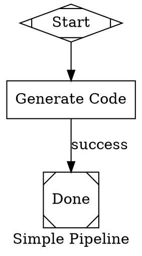
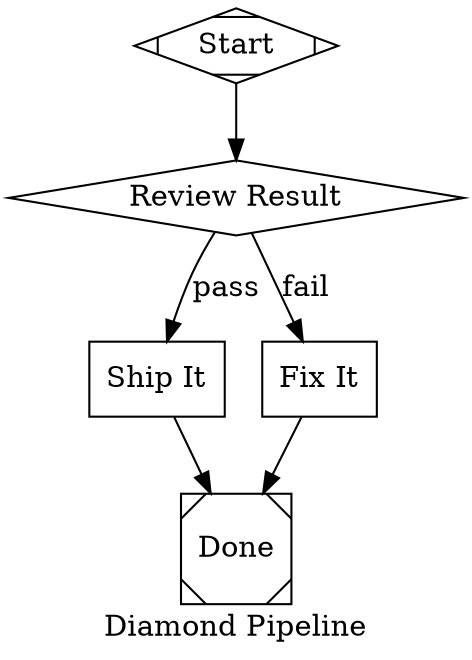
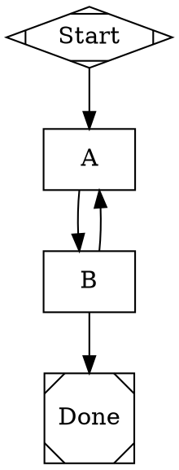

# Layer 3: Pipeline Engine Implementation Plan

> **For Claude:** REQUIRED SUB-SKILL: Use superpowers:executing-plans to implement this plan task-by-task.

**Goal:** Build a DOT-based pipeline orchestration engine with conditional routing, parallel execution, human gates, retry logic, and checkpoint/resume.

**Architecture:** Bottom-up construction matching Layer 1/2 patterns. Parse DOT via gographviz into a Graph model, validate structure, then execute nodes via a handler registry with edge selection, retry logic, and checkpoint serialization.

**Tech Stack:** Go, gographviz (DOT parsing), Layer 2 agent sessions, Layer 1 LLM client

---

## File Map

```
pipeline/
├── graph.go            # Graph, Node, Edge data model
├── graph_test.go
├── parser.go           # DOT → Graph using gographviz
├── parser_test.go
├── validate.go         # DAG validation rules
├── validate_test.go
├── context.go          # Pipeline context (shared key-value state)
├── context_test.go
├── condition.go        # Condition expression evaluator
├── condition_test.go
├── events.go           # Pipeline event types
├── events_test.go
├── handler.go          # Handler interface + registry
├── handler_test.go
├── stylesheet.go       # Model stylesheet (CSS-like LLM config)
├── stylesheet_test.go
├── engine.go           # Core execution loop
├── engine_test.go
├── checkpoint.go       # Checkpoint/resume serialization
├── checkpoint_test.go
├── handlers/
│   ├── start.go        # Start node handler
│   ├── exit.go         # Exit node handler
│   ├── conditional.go  # Diamond routing node
│   ├── tool.go         # Shell command execution
│   ├── human.go        # Human gate (hexagon)
│   ├── codergen.go     # LLM agent task (Layer 2)
│   ├── start_test.go
│   ├── exit_test.go
│   ├── conditional_test.go
│   ├── tool_test.go
│   ├── human_test.go
│   └── codergen_test.go
└── testdata/
    ├── simple.dot      # Start → box → exit
    ├── diamond.dot     # Start → diamond → two paths → exit
    └── cycle.dot       # Invalid: contains a cycle
```

## Dependency Order

Tasks must be built in this order due to dependencies:

```
Task 1 (graph) ──→ Task 2 (parser) ──→ Task 3 (validator)
                                              │
Task 4 (context) ─┐                           │
Task 5 (condition)─┤                           │
Task 6 (events)   ─┼─→ Task 7 (handler iface) ─┼─→ Task 8 (simple handlers)
                   │                           │    Task 9 (human handler)
                   │                           │    Task 10 (codergen handler)
                   │                           │
                   └───────────────────────────┴─→ Task 11 (stylesheet)
                                                   Task 12 (engine + checkpoint)
```

---

### Task 1: Graph Model

Data types for pipeline graphs: Graph, Node, Edge. Shape-to-handler mapping. No external dependencies.

**Files:**
- Create: `pipeline/graph.go`
- Create: `pipeline/graph_test.go`

**Step 1: Write the failing test**

```go
// pipeline/graph_test.go
// ABOUTME: Tests for the pipeline graph data model.
// ABOUTME: Validates Graph, Node, Edge construction and shape-to-handler mapping.
package pipeline

import (
	"testing"
)

func TestNewGraph(t *testing.T) {
	g := NewGraph("test-pipeline")
	if g.Name != "test-pipeline" {
		t.Errorf("expected name 'test-pipeline', got %q", g.Name)
	}
	if g.Nodes == nil {
		t.Error("expected Nodes map to be initialized")
	}
	if g.Edges == nil {
		t.Error("expected Edges slice to be initialized")
	}
	if g.Attrs == nil {
		t.Error("expected Attrs map to be initialized")
	}
}

func TestGraphAddNode(t *testing.T) {
	g := NewGraph("test")
	node := &Node{
		ID:    "n1",
		Shape: "box",
		Label: "Generate Code",
		Attrs: map[string]string{"prompt": "write hello world"},
	}
	g.AddNode(node)

	got := g.Nodes["n1"]
	if got == nil {
		t.Fatal("expected node n1 to exist")
	}
	if got.Label != "Generate Code" {
		t.Errorf("expected label 'Generate Code', got %q", got.Label)
	}
	if got.Handler != "codergen" {
		t.Errorf("expected handler 'codergen' for box shape, got %q", got.Handler)
	}
}

func TestGraphAddEdge(t *testing.T) {
	g := NewGraph("test")
	g.AddNode(&Node{ID: "a", Shape: "Mdiamond"})
	g.AddNode(&Node{ID: "b", Shape: "box"})
	edge := &Edge{From: "a", To: "b", Label: "go"}
	g.AddEdge(edge)

	if len(g.Edges) != 1 {
		t.Fatalf("expected 1 edge, got %d", len(g.Edges))
	}
	if g.Edges[0].Label != "go" {
		t.Errorf("expected label 'go', got %q", g.Edges[0].Label)
	}
}

func TestShapeToHandler(t *testing.T) {
	tests := []struct {
		shape   string
		handler string
		ok      bool
	}{
		{"Mdiamond", "start", true},
		{"Msquare", "exit", true},
		{"box", "codergen", true},
		{"hexagon", "wait.human", true},
		{"diamond", "conditional", true},
		{"component", "parallel", true},
		{"tripleoctagon", "parallel.fan_in", true},
		{"parallelogram", "tool", true},
		{"unknown_shape", "", false},
	}

	for _, tt := range tests {
		t.Run(tt.shape, func(t *testing.T) {
			handler, ok := ShapeToHandler(tt.shape)
			if ok != tt.ok {
				t.Errorf("ShapeToHandler(%q): ok = %v, want %v", tt.shape, ok, tt.ok)
			}
			if handler != tt.handler {
				t.Errorf("ShapeToHandler(%q) = %q, want %q", tt.shape, handler, tt.handler)
			}
		})
	}
}

func TestGraphStartAndExitNodes(t *testing.T) {
	g := NewGraph("test")
	g.AddNode(&Node{ID: "begin", Shape: "Mdiamond"})
	g.AddNode(&Node{ID: "work", Shape: "box"})
	g.AddNode(&Node{ID: "end", Shape: "Msquare"})

	if g.StartNode != "begin" {
		t.Errorf("expected StartNode 'begin', got %q", g.StartNode)
	}
	if g.ExitNode != "end" {
		t.Errorf("expected ExitNode 'end', got %q", g.ExitNode)
	}
}

func TestGraphOutgoingEdges(t *testing.T) {
	g := NewGraph("test")
	g.AddNode(&Node{ID: "a", Shape: "Mdiamond"})
	g.AddNode(&Node{ID: "b", Shape: "box"})
	g.AddNode(&Node{ID: "c", Shape: "box"})
	g.AddEdge(&Edge{From: "a", To: "b"})
	g.AddEdge(&Edge{From: "a", To: "c"})
	g.AddEdge(&Edge{From: "b", To: "c"})

	edges := g.OutgoingEdges("a")
	if len(edges) != 2 {
		t.Errorf("expected 2 outgoing edges from 'a', got %d", len(edges))
	}

	edges = g.OutgoingEdges("c")
	if len(edges) != 0 {
		t.Errorf("expected 0 outgoing edges from 'c', got %d", len(edges))
	}
}

func TestGraphIncomingEdges(t *testing.T) {
	g := NewGraph("test")
	g.AddNode(&Node{ID: "a", Shape: "Mdiamond"})
	g.AddNode(&Node{ID: "b", Shape: "box"})
	g.AddNode(&Node{ID: "c", Shape: "Msquare"})
	g.AddEdge(&Edge{From: "a", To: "c"})
	g.AddEdge(&Edge{From: "b", To: "c"})

	edges := g.IncomingEdges("c")
	if len(edges) != 2 {
		t.Errorf("expected 2 incoming edges to 'c', got %d", len(edges))
	}
}
```

**Step 2: Run test to verify it fails**

Run: `cd /Users/harper/Public/src/2389/tracker && go test ./pipeline/... -run TestNewGraph -v`
Expected: FAIL — package doesn't exist yet

**Step 3: Write minimal implementation**

```go
// pipeline/graph.go
// ABOUTME: Core data model for pipeline graphs: Graph, Node, Edge structs.
// ABOUTME: Provides shape-to-handler mapping and graph traversal helpers.
package pipeline

// shapeHandlerMap maps DOT node shapes to handler names.
var shapeHandlerMap = map[string]string{
	"Mdiamond":       "start",
	"Msquare":        "exit",
	"box":            "codergen",
	"hexagon":        "wait.human",
	"diamond":        "conditional",
	"component":      "parallel",
	"tripleoctagon":  "parallel.fan_in",
	"parallelogram":  "tool",
}

// ShapeToHandler returns the handler name for a DOT node shape.
// Returns ("", false) if the shape is not recognized.
func ShapeToHandler(shape string) (string, bool) {
	h, ok := shapeHandlerMap[shape]
	return h, ok
}

// Graph represents a parsed pipeline as a directed graph.
type Graph struct {
	Name      string
	Nodes     map[string]*Node
	Edges     []*Edge
	Attrs     map[string]string
	StartNode string
	ExitNode  string
}

// NewGraph creates an empty Graph with the given name.
func NewGraph(name string) *Graph {
	return &Graph{
		Name:  name,
		Nodes: make(map[string]*Node),
		Edges: make([]*Edge, 0),
		Attrs: make(map[string]string),
	}
}

// AddNode adds a node to the graph and resolves its handler from its shape.
// If the node has an Mdiamond shape, it is set as the start node.
// If the node has an Msquare shape, it is set as the exit node.
func (g *Graph) AddNode(n *Node) {
	if n.Attrs == nil {
		n.Attrs = make(map[string]string)
	}
	if handler, ok := ShapeToHandler(n.Shape); ok {
		n.Handler = handler
	}
	g.Nodes[n.ID] = n

	switch n.Shape {
	case "Mdiamond":
		g.StartNode = n.ID
	case "Msquare":
		g.ExitNode = n.ID
	}
}

// AddEdge adds a directed edge to the graph.
func (g *Graph) AddEdge(e *Edge) {
	if e.Attrs == nil {
		e.Attrs = make(map[string]string)
	}
	g.Edges = append(g.Edges, e)
}

// OutgoingEdges returns all edges originating from the given node ID.
func (g *Graph) OutgoingEdges(nodeID string) []*Edge {
	var result []*Edge
	for _, e := range g.Edges {
		if e.From == nodeID {
			result = append(result, e)
		}
	}
	return result
}

// IncomingEdges returns all edges terminating at the given node ID.
func (g *Graph) IncomingEdges(nodeID string) []*Edge {
	var result []*Edge
	for _, e := range g.Edges {
		if e.To == nodeID {
			result = append(result, e)
		}
	}
	return result
}

// Node represents a single step in the pipeline.
type Node struct {
	ID      string
	Shape   string
	Label   string
	Attrs   map[string]string
	Handler string
}

// Edge represents a directed connection between two nodes.
type Edge struct {
	From      string
	To        string
	Label     string
	Condition string
	Attrs     map[string]string
}
```

**Step 4: Run test to verify it passes**

Run: `cd /Users/harper/Public/src/2389/tracker && go test ./pipeline/... -run TestNewGraph -v`
Expected: PASS

Run: `cd /Users/harper/Public/src/2389/tracker && go test ./pipeline/... -run TestGraph -v`
Expected: PASS

Run: `cd /Users/harper/Public/src/2389/tracker && go test ./pipeline/... -run TestShapeToHandler -v`
Expected: PASS

**Step 5: Commit**

```bash
cd /Users/harper/Public/src/2389/tracker && git add pipeline/graph.go pipeline/graph_test.go && git commit -m "feat(pipeline): add graph model with node, edge, and shape mapping"
```

---

### Task 2: DOT Parser

Parse DOT files using gographviz into our Graph model. Requires `go get github.com/awalterschulze/gographviz`.

**Files:**
- Create: `pipeline/parser.go`
- Create: `pipeline/parser_test.go`
- Create: `pipeline/testdata/simple.dot`
- Create: `pipeline/testdata/diamond.dot`

**Step 0: Install dependency**

```bash
cd /Users/harper/Public/src/2389/tracker && go get github.com/awalterschulze/gographviz
```

**Step 1: Write the failing test**

First create the test DOT files:

`pipeline/testdata/simple.dot`:


`pipeline/testdata/diamond.dot`:


```go
// pipeline/parser_test.go
// ABOUTME: Tests for DOT file parsing into the pipeline Graph model.
// ABOUTME: Validates node extraction, edge extraction, attribute mapping, and error handling.
package pipeline

import (
	"os"
	"path/filepath"
	"testing"
)

func TestParseSimpleDOT(t *testing.T) {
	data, err := os.ReadFile(filepath.Join("testdata", "simple.dot"))
	if err != nil {
		t.Fatalf("failed to read test DOT file: %v", err)
	}

	g, err := ParseDOT(string(data))
	if err != nil {
		t.Fatalf("ParseDOT failed: %v", err)
	}

	if g.Name != "simple_pipeline" {
		t.Errorf("expected graph name 'simple_pipeline', got %q", g.Name)
	}

	if len(g.Nodes) != 3 {
		t.Errorf("expected 3 nodes, got %d", len(g.Nodes))
	}

	if len(g.Edges) != 2 {
		t.Errorf("expected 2 edges, got %d", len(g.Edges))
	}

	if g.StartNode != "start" {
		t.Errorf("expected StartNode 'start', got %q", g.StartNode)
	}

	if g.ExitNode != "done" {
		t.Errorf("expected ExitNode 'done', got %q", g.ExitNode)
	}

	gen := g.Nodes["generate"]
	if gen == nil {
		t.Fatal("expected node 'generate' to exist")
	}
	if gen.Handler != "codergen" {
		t.Errorf("expected handler 'codergen', got %q", gen.Handler)
	}
	if gen.Label != "Generate Code" {
		t.Errorf("expected label 'Generate Code', got %q", gen.Label)
	}
	if gen.Attrs["prompt"] != "Write hello world" {
		t.Errorf("expected prompt attr 'Write hello world', got %q", gen.Attrs["prompt"])
	}
	if gen.Attrs["llm_model"] != "claude-sonnet-4-5" {
		t.Errorf("expected llm_model 'claude-sonnet-4-5', got %q", gen.Attrs["llm_model"])
	}
}

func TestParseDiamondDOT(t *testing.T) {
	data, err := os.ReadFile(filepath.Join("testdata", "diamond.dot"))
	if err != nil {
		t.Fatalf("failed to read test DOT file: %v", err)
	}

	g, err := ParseDOT(string(data))
	if err != nil {
		t.Fatalf("ParseDOT failed: %v", err)
	}

	if len(g.Nodes) != 5 {
		t.Errorf("expected 5 nodes, got %d", len(g.Nodes))
	}

	if len(g.Edges) != 5 {
		t.Errorf("expected 5 edges, got %d", len(g.Edges))
	}

	check := g.Nodes["check"]
	if check == nil {
		t.Fatal("expected node 'check' to exist")
	}
	if check.Handler != "conditional" {
		t.Errorf("expected handler 'conditional', got %q", check.Handler)
	}

	// Verify edge conditions were parsed.
	outEdges := g.OutgoingEdges("check")
	if len(outEdges) != 2 {
		t.Fatalf("expected 2 outgoing edges from 'check', got %d", len(outEdges))
	}

	conditionFound := false
	for _, e := range outEdges {
		if e.Condition == "outcome=success" {
			conditionFound = true
		}
	}
	if !conditionFound {
		t.Error("expected to find edge with condition 'outcome=success'")
	}
}

func TestParseGraphAttrs(t *testing.T) {
	data, err := os.ReadFile(filepath.Join("testdata", "simple.dot"))
	if err != nil {
		t.Fatalf("failed to read test DOT file: %v", err)
	}

	g, err := ParseDOT(string(data))
	if err != nil {
		t.Fatalf("ParseDOT failed: %v", err)
	}

	if g.Attrs["default_max_retry"] != "2" {
		t.Errorf("expected graph attr default_max_retry='2', got %q", g.Attrs["default_max_retry"])
	}
}

func TestParseEdgeLabels(t *testing.T) {
	data, err := os.ReadFile(filepath.Join("testdata", "simple.dot"))
	if err != nil {
		t.Fatalf("failed to read test DOT file: %v", err)
	}

	g, err := ParseDOT(string(data))
	if err != nil {
		t.Fatalf("ParseDOT failed: %v", err)
	}

	edges := g.OutgoingEdges("generate")
	if len(edges) != 1 {
		t.Fatalf("expected 1 outgoing edge from 'generate', got %d", len(edges))
	}
	if edges[0].Label != "success" {
		t.Errorf("expected edge label 'success', got %q", edges[0].Label)
	}
}

func TestParseInvalidDOT(t *testing.T) {
	_, err := ParseDOT("this is not valid DOT syntax {{{")
	if err == nil {
		t.Error("expected error for invalid DOT input")
	}
}

func TestParseEmptyDOT(t *testing.T) {
	_, err := ParseDOT("")
	if err == nil {
		t.Error("expected error for empty DOT input")
	}
}
```

**Step 2: Run test to verify it fails**

Run: `cd /Users/harper/Public/src/2389/tracker && go test ./pipeline/... -run TestParse -v`
Expected: FAIL — ParseDOT doesn't exist yet

**Step 3: Write minimal implementation**

```go
// pipeline/parser.go
// ABOUTME: Parses Graphviz DOT format into the pipeline Graph model.
// ABOUTME: Uses gographviz for parsing and extracts nodes, edges, and attributes.
package pipeline

import (
	"fmt"
	"strings"

	"github.com/awalterschulze/gographviz"
)

// ParseDOT parses a DOT-format string into a Graph.
// Returns an error if the DOT syntax is invalid or the input is empty.
func ParseDOT(dot string) (*Graph, error) {
	if strings.TrimSpace(dot) == "" {
		return nil, fmt.Errorf("empty DOT input")
	}

	ast, err := gographviz.Parse([]byte(dot))
	if err != nil {
		return nil, fmt.Errorf("DOT parse error: %w", err)
	}

	gviz := gographviz.NewGraph()
	if err := gographviz.Analyse(ast, gviz); err != nil {
		return nil, fmt.Errorf("DOT analysis error: %w", err)
	}

	graphName := gviz.Name
	g := NewGraph(cleanQuotes(graphName))

	// Extract graph-level attributes.
	for key, val := range gviz.Attrs {
		g.Attrs[cleanQuotes(string(key))] = cleanQuotes(val)
	}

	// Extract nodes.
	for _, gvNode := range gviz.Nodes.Nodes {
		node := &Node{
			ID:    cleanQuotes(gvNode.Name),
			Attrs: make(map[string]string),
		}

		for key, val := range gvNode.Attrs {
			cleaned := cleanQuotes(val)
			switch string(key) {
			case "shape":
				node.Shape = cleaned
			case "label":
				node.Label = cleaned
			default:
				node.Attrs[string(key)] = cleaned
			}
		}

		g.AddNode(node)
	}

	// Extract edges.
	for _, gvEdge := range gviz.Edges.Edges {
		edge := &Edge{
			From:  cleanQuotes(gvEdge.Src),
			To:    cleanQuotes(gvEdge.Dst),
			Attrs: make(map[string]string),
		}

		for key, val := range gvEdge.Attrs {
			cleaned := cleanQuotes(val)
			switch string(key) {
			case "label":
				edge.Label = cleaned
			case "condition":
				edge.Condition = cleaned
			default:
				edge.Attrs[string(key)] = cleaned
			}
		}

		g.AddEdge(edge)
	}

	return g, nil
}

// cleanQuotes removes surrounding double quotes from a DOT attribute value.
func cleanQuotes(s string) string {
	if len(s) >= 2 && s[0] == '"' && s[len(s)-1] == '"' {
		return s[1 : len(s)-1]
	}
	return s
}
```

**Step 4: Run test to verify it passes**

Run: `cd /Users/harper/Public/src/2389/tracker && go test ./pipeline/... -run TestParse -v`
Expected: PASS

**Step 5: Commit**

```bash
cd /Users/harper/Public/src/2389/tracker && git add pipeline/parser.go pipeline/parser_test.go pipeline/testdata/ && git commit -m "feat(pipeline): add DOT parser using gographviz"
```

---

### Task 3: Validator

Validate parsed graphs: exactly one start (Mdiamond), exactly one exit (Msquare), no cycles, all shapes recognized, no unreachable nodes.

**Files:**
- Create: `pipeline/validate.go`
- Create: `pipeline/validate_test.go`
- Create: `pipeline/testdata/cycle.dot`

**Step 1: Write the failing test**

First create the cycle test file:

`pipeline/testdata/cycle.dot`:


```go
// pipeline/validate_test.go
// ABOUTME: Tests for pipeline graph validation rules.
// ABOUTME: Validates start/exit node requirements, cycle detection, shape recognition, and reachability.
package pipeline

import (
	"os"
	"path/filepath"
	"strings"
	"testing"
)

func TestValidateSimpleGraph(t *testing.T) {
	data, err := os.ReadFile(filepath.Join("testdata", "simple.dot"))
	if err != nil {
		t.Fatalf("failed to read DOT file: %v", err)
	}

	g, err := ParseDOT(string(data))
	if err != nil {
		t.Fatalf("ParseDOT failed: %v", err)
	}

	if err := Validate(g); err != nil {
		t.Errorf("expected simple graph to be valid, got: %v", err)
	}
}

func TestValidateDiamondGraph(t *testing.T) {
	data, err := os.ReadFile(filepath.Join("testdata", "diamond.dot"))
	if err != nil {
		t.Fatalf("failed to read DOT file: %v", err)
	}

	g, err := ParseDOT(string(data))
	if err != nil {
		t.Fatalf("ParseDOT failed: %v", err)
	}

	if err := Validate(g); err != nil {
		t.Errorf("expected diamond graph to be valid, got: %v", err)
	}
}

func TestValidateNoStartNode(t *testing.T) {
	g := NewGraph("no-start")
	g.AddNode(&Node{ID: "a", Shape: "box"})
	g.AddNode(&Node{ID: "b", Shape: "Msquare"})
	g.AddEdge(&Edge{From: "a", To: "b"})

	err := Validate(g)
	if err == nil {
		t.Fatal("expected error for missing start node")
	}
	if !strings.Contains(err.Error(), "start") {
		t.Errorf("error should mention 'start', got: %v", err)
	}
}

func TestValidateNoExitNode(t *testing.T) {
	g := NewGraph("no-exit")
	g.AddNode(&Node{ID: "a", Shape: "Mdiamond"})
	g.AddNode(&Node{ID: "b", Shape: "box"})
	g.AddEdge(&Edge{From: "a", To: "b"})

	err := Validate(g)
	if err == nil {
		t.Fatal("expected error for missing exit node")
	}
	if !strings.Contains(err.Error(), "exit") {
		t.Errorf("error should mention 'exit', got: %v", err)
	}
}

func TestValidateMultipleStartNodes(t *testing.T) {
	g := NewGraph("multi-start")
	// AddNode overwrites StartNode, so we manually set up two Mdiamond nodes.
	g.AddNode(&Node{ID: "s1", Shape: "Mdiamond"})
	g.AddNode(&Node{ID: "s2", Shape: "Mdiamond"})
	g.AddNode(&Node{ID: "end", Shape: "Msquare"})
	g.AddEdge(&Edge{From: "s1", To: "end"})
	g.AddEdge(&Edge{From: "s2", To: "end"})

	err := Validate(g)
	if err == nil {
		t.Fatal("expected error for multiple start nodes")
	}
	if !strings.Contains(err.Error(), "start") {
		t.Errorf("error should mention 'start', got: %v", err)
	}
}

func TestValidateCycleDetection(t *testing.T) {
	data, err := os.ReadFile(filepath.Join("testdata", "cycle.dot"))
	if err != nil {
		t.Fatalf("failed to read DOT file: %v", err)
	}

	g, err := ParseDOT(string(data))
	if err != nil {
		t.Fatalf("ParseDOT failed: %v", err)
	}

	err = Validate(g)
	if err == nil {
		t.Fatal("expected error for graph with cycle")
	}
	if !strings.Contains(err.Error(), "cycle") {
		t.Errorf("error should mention 'cycle', got: %v", err)
	}
}

func TestValidateUnrecognizedShape(t *testing.T) {
	g := NewGraph("bad-shape")
	g.AddNode(&Node{ID: "s", Shape: "Mdiamond"})
	g.AddNode(&Node{ID: "x", Shape: "trapezium"})
	g.AddNode(&Node{ID: "e", Shape: "Msquare"})
	g.AddEdge(&Edge{From: "s", To: "x"})
	g.AddEdge(&Edge{From: "x", To: "e"})

	err := Validate(g)
	if err == nil {
		t.Fatal("expected error for unrecognized shape")
	}
	if !strings.Contains(err.Error(), "trapezium") {
		t.Errorf("error should mention 'trapezium', got: %v", err)
	}
}

func TestValidateUnreachableNode(t *testing.T) {
	g := NewGraph("unreachable")
	g.AddNode(&Node{ID: "s", Shape: "Mdiamond"})
	g.AddNode(&Node{ID: "a", Shape: "box"})
	g.AddNode(&Node{ID: "orphan", Shape: "box"})
	g.AddNode(&Node{ID: "e", Shape: "Msquare"})
	g.AddEdge(&Edge{From: "s", To: "a"})
	g.AddEdge(&Edge{From: "a", To: "e"})
	// orphan has no incoming or outgoing edges from reachable nodes.

	err := Validate(g)
	if err == nil {
		t.Fatal("expected error for unreachable node")
	}
	if !strings.Contains(err.Error(), "unreachable") {
		t.Errorf("error should mention 'unreachable', got: %v", err)
	}
}

func TestValidateEmptyGraph(t *testing.T) {
	g := NewGraph("empty")
	err := Validate(g)
	if err == nil {
		t.Fatal("expected error for empty graph")
	}
}
```

**Step 2: Run test to verify it fails**

Run: `cd /Users/harper/Public/src/2389/tracker && go test ./pipeline/... -run TestValidate -v`
Expected: FAIL — Validate doesn't exist yet

**Step 3: Write minimal implementation**

```go
// pipeline/validate.go
// ABOUTME: Validates pipeline graph structure for correctness before execution.
// ABOUTME: Checks for single start/exit, no cycles, recognized shapes, and full reachability.
package pipeline

import (
	"fmt"
	"strings"
)

// ValidationError collects multiple validation failures into one error.
type ValidationError struct {
	Errors []string
}

func (e *ValidationError) Error() string {
	return strings.Join(e.Errors, "; ")
}

func (e *ValidationError) add(msg string) {
	e.Errors = append(e.Errors, msg)
}

func (e *ValidationError) hasErrors() bool {
	return len(e.Errors) > 0
}

// Validate checks a parsed Graph for structural correctness.
// Returns nil if the graph is valid, or a ValidationError listing all problems.
func Validate(g *Graph) error {
	ve := &ValidationError{}

	if len(g.Nodes) == 0 {
		ve.add("graph has no nodes")
		return ve
	}

	validateStartExit(g, ve)
	validateShapes(g, ve)
	validateReachability(g, ve)
	validateNoCycles(g, ve)

	if ve.hasErrors() {
		return ve
	}
	return nil
}

// validateStartExit checks for exactly one start (Mdiamond) and one exit (Msquare) node.
func validateStartExit(g *Graph, ve *ValidationError) {
	var startCount, exitCount int
	for _, n := range g.Nodes {
		switch n.Shape {
		case "Mdiamond":
			startCount++
		case "Msquare":
			exitCount++
		}
	}

	if startCount == 0 {
		ve.add("graph has no start node (shape=Mdiamond)")
	} else if startCount > 1 {
		ve.add(fmt.Sprintf("graph has %d start nodes (shape=Mdiamond), expected exactly 1", startCount))
	}

	if exitCount == 0 {
		ve.add("graph has no exit node (shape=Msquare)")
	} else if exitCount > 1 {
		ve.add(fmt.Sprintf("graph has %d exit nodes (shape=Msquare), expected exactly 1", exitCount))
	}
}

// validateShapes checks that every node has a recognized shape.
func validateShapes(g *Graph, ve *ValidationError) {
	for _, n := range g.Nodes {
		if _, ok := ShapeToHandler(n.Shape); !ok {
			ve.add(fmt.Sprintf("node %q has unrecognized shape %q", n.ID, n.Shape))
		}
	}
}

// validateReachability checks that all nodes are reachable from the start node via BFS.
func validateReachability(g *Graph, ve *ValidationError) {
	if g.StartNode == "" {
		return
	}

	visited := make(map[string]bool)
	queue := []string{g.StartNode}
	visited[g.StartNode] = true

	for len(queue) > 0 {
		current := queue[0]
		queue = queue[1:]

		for _, e := range g.OutgoingEdges(current) {
			if !visited[e.To] {
				visited[e.To] = true
				queue = append(queue, e.To)
			}
		}
	}

	for id := range g.Nodes {
		if !visited[id] {
			ve.add(fmt.Sprintf("node %q is unreachable from start node", id))
		}
	}
}

// validateNoCycles uses DFS coloring to detect cycles in the graph.
// White = unvisited, Gray = in current path, Black = fully processed.
func validateNoCycles(g *Graph, ve *ValidationError) {
	if g.StartNode == "" {
		return
	}

	const (
		white = 0
		gray  = 1
		black = 2
	)

	color := make(map[string]int)
	for id := range g.Nodes {
		color[id] = white
	}

	var dfs func(nodeID string) bool
	dfs = func(nodeID string) bool {
		color[nodeID] = gray
		for _, e := range g.OutgoingEdges(nodeID) {
			switch color[e.To] {
			case gray:
				return true
			case white:
				if dfs(e.To) {
					return true
				}
			}
		}
		color[nodeID] = black
		return false
	}

	if dfs(g.StartNode) {
		ve.add("graph contains a cycle")
	}
}
```

**Step 4: Run test to verify it passes**

Run: `cd /Users/harper/Public/src/2389/tracker && go test ./pipeline/... -run TestValidate -v`
Expected: PASS

**Step 5: Commit**

```bash
cd /Users/harper/Public/src/2389/tracker && git add pipeline/validate.go pipeline/validate_test.go pipeline/testdata/cycle.dot && git commit -m "feat(pipeline): add graph validator with cycle detection and reachability"
```

---

### Task 4: Context

Thread-safe key-value store with sync.RWMutex. Get/Set/Merge operations. Built-in keys.

**Files:**
- Create: `pipeline/context.go`
- Create: `pipeline/context_test.go`

**Step 1: Write the failing test**

```go
// pipeline/context_test.go
// ABOUTME: Tests for the pipeline context thread-safe key-value store.
// ABOUTME: Validates Get, Set, Merge, Snapshot, and concurrent access safety.
package pipeline

import (
	"sync"
	"testing"
)

func TestContextSetAndGet(t *testing.T) {
	ctx := NewPipelineContext()
	ctx.Set("key1", "value1")

	val, ok := ctx.Get("key1")
	if !ok {
		t.Fatal("expected key1 to exist")
	}
	if val != "value1" {
		t.Errorf("expected 'value1', got %q", val)
	}
}

func TestContextGetMissing(t *testing.T) {
	ctx := NewPipelineContext()
	_, ok := ctx.Get("nonexistent")
	if ok {
		t.Error("expected key to not exist")
	}
}

func TestContextMerge(t *testing.T) {
	ctx := NewPipelineContext()
	ctx.Set("existing", "old")

	ctx.Merge(map[string]string{
		"existing": "new",
		"added":    "fresh",
	})

	val, _ := ctx.Get("existing")
	if val != "new" {
		t.Errorf("expected 'new', got %q", val)
	}

	val, _ = ctx.Get("added")
	if val != "fresh" {
		t.Errorf("expected 'fresh', got %q", val)
	}
}

func TestContextMergeNil(t *testing.T) {
	ctx := NewPipelineContext()
	ctx.Set("key", "val")
	ctx.Merge(nil)

	val, ok := ctx.Get("key")
	if !ok || val != "val" {
		t.Error("merge of nil should not affect existing values")
	}
}

func TestContextSnapshot(t *testing.T) {
	ctx := NewPipelineContext()
	ctx.Set("a", "1")
	ctx.Set("b", "2")

	snap := ctx.Snapshot()
	if len(snap) != 2 {
		t.Errorf("expected 2 entries in snapshot, got %d", len(snap))
	}
	if snap["a"] != "1" || snap["b"] != "2" {
		t.Errorf("snapshot values incorrect: %v", snap)
	}

	// Mutating the snapshot should not affect the context.
	snap["a"] = "mutated"
	val, _ := ctx.Get("a")
	if val != "1" {
		t.Error("mutating snapshot should not affect context")
	}
}

func TestContextBuiltInKeys(t *testing.T) {
	if ContextKeyOutcome != "outcome" {
		t.Errorf("expected ContextKeyOutcome='outcome', got %q", ContextKeyOutcome)
	}
	if ContextKeyPreferredLabel != "preferred_label" {
		t.Errorf("expected ContextKeyPreferredLabel='preferred_label', got %q", ContextKeyPreferredLabel)
	}
	if ContextKeyGoal != "graph.goal" {
		t.Errorf("expected ContextKeyGoal='graph.goal', got %q", ContextKeyGoal)
	}
	if ContextKeyLastResponse != "last_response" {
		t.Errorf("expected ContextKeyLastResponse='last_response', got %q", ContextKeyLastResponse)
	}
}

func TestContextConcurrentAccess(t *testing.T) {
	ctx := NewPipelineContext()
	var wg sync.WaitGroup

	for i := 0; i < 100; i++ {
		wg.Add(2)
		go func(n int) {
			defer wg.Done()
			ctx.Set("key", "value")
		}(i)
		go func(n int) {
			defer wg.Done()
			ctx.Get("key")
		}(i)
	}

	wg.Wait()
}

func TestContextSetInternal(t *testing.T) {
	ctx := NewPipelineContext()
	ctx.SetInternal("retry_count.node1", "3")

	val, ok := ctx.GetInternal("retry_count.node1")
	if !ok {
		t.Fatal("expected internal key to exist")
	}
	if val != "3" {
		t.Errorf("expected '3', got %q", val)
	}

	// Internal keys should not appear in regular Get.
	_, ok = ctx.Get("retry_count.node1")
	if ok {
		t.Error("internal keys should not be visible via Get")
	}

	// Internal keys should not appear in Snapshot.
	snap := ctx.Snapshot()
	if _, found := snap["retry_count.node1"]; found {
		t.Error("internal keys should not appear in Snapshot")
	}
}
```

**Step 2: Run test to verify it fails**

Run: `cd /Users/harper/Public/src/2389/tracker && go test ./pipeline/... -run TestContext -v`
Expected: FAIL — NewPipelineContext doesn't exist yet

**Step 3: Write minimal implementation**

```go
// pipeline/context.go
// ABOUTME: Thread-safe key-value store shared across all pipeline nodes during execution.
// ABOUTME: Provides Get/Set/Merge/Snapshot operations and separate internal state for engine bookkeeping.
package pipeline

import (
	"sync"
)

// Built-in context keys used by the engine and handlers.
const (
	ContextKeyOutcome        = "outcome"
	ContextKeyPreferredLabel = "preferred_label"
	ContextKeyGoal           = "graph.goal"
	ContextKeyLastResponse   = "last_response"
	ContextKeyToolStdout     = "tool_stdout"
	ContextKeyToolStderr     = "tool_stderr"
)

// PipelineContext is a thread-safe key-value store shared across all pipeline
// nodes during execution. It has two namespaces: user-visible values and
// internal engine bookkeeping (retry counters, loop state).
type PipelineContext struct {
	mu       sync.RWMutex
	values   map[string]string
	internal map[string]string
}

// NewPipelineContext creates an empty pipeline context.
func NewPipelineContext() *PipelineContext {
	return &PipelineContext{
		values:   make(map[string]string),
		internal: make(map[string]string),
	}
}

// Get retrieves a value from the user-visible context.
// Returns the value and true if found, or ("", false) if not.
func (c *PipelineContext) Get(key string) (string, bool) {
	c.mu.RLock()
	defer c.mu.RUnlock()
	v, ok := c.values[key]
	return v, ok
}

// Set stores a value in the user-visible context.
func (c *PipelineContext) Set(key, value string) {
	c.mu.Lock()
	defer c.mu.Unlock()
	c.values[key] = value
}

// Merge applies all key-value pairs from updates into the user-visible context.
// Existing keys are overwritten.
func (c *PipelineContext) Merge(updates map[string]string) {
	if updates == nil {
		return
	}
	c.mu.Lock()
	defer c.mu.Unlock()
	for k, v := range updates {
		c.values[k] = v
	}
}

// Snapshot returns a shallow copy of the user-visible context values.
// The returned map is safe to mutate without affecting the context.
func (c *PipelineContext) Snapshot() map[string]string {
	c.mu.RLock()
	defer c.mu.RUnlock()
	snap := make(map[string]string, len(c.values))
	for k, v := range c.values {
		snap[k] = v
	}
	return snap
}

// GetInternal retrieves a value from the internal engine namespace.
func (c *PipelineContext) GetInternal(key string) (string, bool) {
	c.mu.RLock()
	defer c.mu.RUnlock()
	v, ok := c.internal[key]
	return v, ok
}

// SetInternal stores a value in the internal engine namespace.
func (c *PipelineContext) SetInternal(key, value string) {
	c.mu.Lock()
	defer c.mu.Unlock()
	c.internal[key] = value
}
```

**Step 4: Run test to verify it passes**

Run: `cd /Users/harper/Public/src/2389/tracker && go test ./pipeline/... -run TestContext -v`
Expected: PASS

**Step 5: Commit**

```bash
cd /Users/harper/Public/src/2389/tracker && git add pipeline/context.go pipeline/context_test.go && git commit -m "feat(pipeline): add thread-safe pipeline context with internal namespace"
```

---

### Task 5: Condition Evaluator

Parse and evaluate simple boolean expressions: `outcome=success && context.tests_passed=true`. Supports `=`, `!=`, `&&`.

**Files:**
- Create: `pipeline/condition.go`
- Create: `pipeline/condition_test.go`

**Step 1: Write the failing test**

```go
// pipeline/condition_test.go
// ABOUTME: Tests for the condition expression evaluator used in edge gating.
// ABOUTME: Validates equality, inequality, AND logic, empty conditions, and variable resolution.
package pipeline

import (
	"testing"
)

func TestConditionEmptyAlwaysTrue(t *testing.T) {
	ctx := NewPipelineContext()
	result, err := EvaluateCondition("", ctx)
	if err != nil {
		t.Fatalf("unexpected error: %v", err)
	}
	if !result {
		t.Error("empty condition should evaluate to true")
	}
}

func TestConditionWhitespaceAlwaysTrue(t *testing.T) {
	ctx := NewPipelineContext()
	result, err := EvaluateCondition("   ", ctx)
	if err != nil {
		t.Fatalf("unexpected error: %v", err)
	}
	if !result {
		t.Error("whitespace-only condition should evaluate to true")
	}
}

func TestConditionSimpleEquals(t *testing.T) {
	ctx := NewPipelineContext()
	ctx.Set("outcome", "success")

	result, err := EvaluateCondition("outcome=success", ctx)
	if err != nil {
		t.Fatalf("unexpected error: %v", err)
	}
	if !result {
		t.Error("expected outcome=success to be true")
	}
}

func TestConditionSimpleEqualsFailure(t *testing.T) {
	ctx := NewPipelineContext()
	ctx.Set("outcome", "fail")

	result, err := EvaluateCondition("outcome=success", ctx)
	if err != nil {
		t.Fatalf("unexpected error: %v", err)
	}
	if result {
		t.Error("expected outcome=success to be false when outcome is 'fail'")
	}
}

func TestConditionNotEquals(t *testing.T) {
	ctx := NewPipelineContext()
	ctx.Set("outcome", "fail")

	result, err := EvaluateCondition("outcome!=success", ctx)
	if err != nil {
		t.Fatalf("unexpected error: %v", err)
	}
	if !result {
		t.Error("expected outcome!=success to be true when outcome is 'fail'")
	}
}

func TestConditionNotEqualsFailure(t *testing.T) {
	ctx := NewPipelineContext()
	ctx.Set("outcome", "success")

	result, err := EvaluateCondition("outcome!=success", ctx)
	if err != nil {
		t.Fatalf("unexpected error: %v", err)
	}
	if result {
		t.Error("expected outcome!=success to be false when outcome is 'success'")
	}
}

func TestConditionAND(t *testing.T) {
	ctx := NewPipelineContext()
	ctx.Set("outcome", "success")
	ctx.Set("tests_passed", "true")

	result, err := EvaluateCondition("outcome=success && tests_passed=true", ctx)
	if err != nil {
		t.Fatalf("unexpected error: %v", err)
	}
	if !result {
		t.Error("expected AND condition to be true")
	}
}

func TestConditionANDPartialFail(t *testing.T) {
	ctx := NewPipelineContext()
	ctx.Set("outcome", "success")
	ctx.Set("tests_passed", "false")

	result, err := EvaluateCondition("outcome=success && tests_passed=true", ctx)
	if err != nil {
		t.Fatalf("unexpected error: %v", err)
	}
	if result {
		t.Error("expected AND condition to be false when one clause fails")
	}
}

func TestConditionMissingVariable(t *testing.T) {
	ctx := NewPipelineContext()

	result, err := EvaluateCondition("outcome=success", ctx)
	if err != nil {
		t.Fatalf("unexpected error: %v", err)
	}
	if result {
		t.Error("expected missing variable to evaluate to false for equality")
	}
}

func TestConditionMissingVariableNotEquals(t *testing.T) {
	ctx := NewPipelineContext()

	result, err := EvaluateCondition("outcome!=success", ctx)
	if err != nil {
		t.Fatalf("unexpected error: %v", err)
	}
	if !result {
		t.Error("expected missing variable != 'success' to be true (empty string != success)")
	}
}

func TestConditionInvalidExpression(t *testing.T) {
	ctx := NewPipelineContext()
	_, err := EvaluateCondition("this has no operator", ctx)
	if err == nil {
		t.Error("expected error for invalid expression")
	}
}

func TestConditionTripleAND(t *testing.T) {
	ctx := NewPipelineContext()
	ctx.Set("a", "1")
	ctx.Set("b", "2")
	ctx.Set("c", "3")

	result, err := EvaluateCondition("a=1 && b=2 && c=3", ctx)
	if err != nil {
		t.Fatalf("unexpected error: %v", err)
	}
	if !result {
		t.Error("expected triple AND to be true")
	}
}

func TestConditionWithSpaces(t *testing.T) {
	ctx := NewPipelineContext()
	ctx.Set("outcome", "success")

	result, err := EvaluateCondition("  outcome = success  ", ctx)
	if err != nil {
		t.Fatalf("unexpected error: %v", err)
	}
	if !result {
		t.Error("expected condition with extra spaces to work")
	}
}
```

**Step 2: Run test to verify it fails**

Run: `cd /Users/harper/Public/src/2389/tracker && go test ./pipeline/... -run TestCondition -v`
Expected: FAIL — EvaluateCondition doesn't exist yet

**Step 3: Write minimal implementation**

```go
// pipeline/condition.go
// ABOUTME: Evaluates simple boolean expressions for edge condition gating.
// ABOUTME: Supports = (equals), != (not equals), and && (AND) operators against pipeline context.
package pipeline

import (
	"fmt"
	"strings"
)

// EvaluateCondition evaluates a condition expression against the pipeline context.
// Empty or whitespace-only conditions always return true.
// Supported syntax: "key=value", "key!=value", "expr1 && expr2".
func EvaluateCondition(expr string, ctx *PipelineContext) (bool, error) {
	expr = strings.TrimSpace(expr)
	if expr == "" {
		return true, nil
	}

	// Split on && for AND clauses.
	clauses := strings.Split(expr, "&&")
	for _, clause := range clauses {
		result, err := evaluateClause(strings.TrimSpace(clause), ctx)
		if err != nil {
			return false, err
		}
		if !result {
			return false, nil
		}
	}
	return true, nil
}

// evaluateClause evaluates a single comparison clause: "key=value" or "key!=value".
func evaluateClause(clause string, ctx *PipelineContext) (bool, error) {
	// Try != first since it contains = as a substring.
	if idx := strings.Index(clause, "!="); idx >= 0 {
		key := strings.TrimSpace(clause[:idx])
		expected := strings.TrimSpace(clause[idx+2:])
		actual := resolveVariable(key, ctx)
		return actual != expected, nil
	}

	if idx := strings.Index(clause, "="); idx >= 0 {
		key := strings.TrimSpace(clause[:idx])
		expected := strings.TrimSpace(clause[idx+1:])
		actual := resolveVariable(key, ctx)
		return actual == expected, nil
	}

	return false, fmt.Errorf("invalid condition clause: %q (expected key=value or key!=value)", clause)
}

// resolveVariable looks up a variable name in the pipeline context.
// Returns the value if found, or empty string if not.
func resolveVariable(name string, ctx *PipelineContext) string {
	val, _ := ctx.Get(name)
	return val
}
```

**Step 4: Run test to verify it passes**

Run: `cd /Users/harper/Public/src/2389/tracker && go test ./pipeline/... -run TestCondition -v`
Expected: PASS

**Step 5: Commit**

```bash
cd /Users/harper/Public/src/2389/tracker && git add pipeline/condition.go pipeline/condition_test.go && git commit -m "feat(pipeline): add condition evaluator for edge gating expressions"
```

---

### Task 6: Pipeline Events

Event types for pipeline lifecycle. Same EventHandler pattern as Layer 2.

**Files:**
- Create: `pipeline/events.go`
- Create: `pipeline/events_test.go`

**Step 1: Write the failing test**

```go
// pipeline/events_test.go
// ABOUTME: Tests for pipeline event types and handler interface.
// ABOUTME: Validates event type uniqueness, handler func adapter, multi-handler fan-out, and noop handler.
package pipeline

import (
	"testing"
)

func TestPipelineEventTypesUnique(t *testing.T) {
	types := []PipelineEventType{
		EventPipelineStarted,
		EventPipelineCompleted,
		EventPipelineFailed,
		EventStageStarted,
		EventStageCompleted,
		EventStageFailed,
		EventStageRetrying,
		EventCheckpointSaved,
		EventInterviewStarted,
		EventInterviewCompleted,
		EventParallelStarted,
		EventParallelCompleted,
	}

	seen := make(map[PipelineEventType]bool)
	for _, et := range types {
		if seen[et] {
			t.Errorf("duplicate event type: %s", et)
		}
		seen[et] = true
	}
}

func TestPipelineEventHandlerFunc(t *testing.T) {
	var received []PipelineEvent
	handler := PipelineEventHandlerFunc(func(evt PipelineEvent) {
		received = append(received, evt)
	})

	handler.HandlePipelineEvent(PipelineEvent{
		Type:   EventStageStarted,
		NodeID: "test-node",
	})

	if len(received) != 1 {
		t.Fatalf("expected 1 event, got %d", len(received))
	}
	if received[0].NodeID != "test-node" {
		t.Errorf("expected node ID 'test-node', got %q", received[0].NodeID)
	}
}

func TestPipelineMultiHandler(t *testing.T) {
	count := 0
	handler := PipelineEventHandlerFunc(func(evt PipelineEvent) {
		count++
	})

	multi := PipelineMultiHandler(handler, handler, handler)
	multi.HandlePipelineEvent(PipelineEvent{Type: EventPipelineStarted})

	if count != 3 {
		t.Errorf("expected 3 handler calls, got %d", count)
	}
}

func TestPipelineNoopHandler(t *testing.T) {
	// Should not panic.
	PipelineNoopHandler.HandlePipelineEvent(PipelineEvent{Type: EventPipelineFailed})
}

func TestPipelineMultiHandlerNilSafe(t *testing.T) {
	handler := PipelineEventHandlerFunc(func(evt PipelineEvent) {})
	multi := PipelineMultiHandler(handler, nil, handler)
	// Should not panic.
	multi.HandlePipelineEvent(PipelineEvent{Type: EventStageCompleted})
}

func TestPipelineEventFields(t *testing.T) {
	evt := PipelineEvent{
		Type:    EventStageCompleted,
		RunID:   "run-123",
		NodeID:  "generate",
		Message: "code generated successfully",
	}

	if evt.RunID != "run-123" {
		t.Errorf("expected RunID 'run-123', got %q", evt.RunID)
	}
	if evt.NodeID != "generate" {
		t.Errorf("expected NodeID 'generate', got %q", evt.NodeID)
	}
}
```

**Step 2: Run test to verify it fails**

Run: `cd /Users/harper/Public/src/2389/tracker && go test ./pipeline/... -run TestPipeline -v`
Expected: FAIL — PipelineEventType doesn't exist yet

**Step 3: Write minimal implementation**

```go
// pipeline/events.go
// ABOUTME: Event types emitted during pipeline execution for UI and logging.
// ABOUTME: Mirrors the Layer 2 EventHandler pattern with pipeline-specific event types.
package pipeline

import "time"

// PipelineEventType identifies the kind of event during pipeline execution.
type PipelineEventType string

const (
	EventPipelineStarted   PipelineEventType = "pipeline_started"
	EventPipelineCompleted PipelineEventType = "pipeline_completed"
	EventPipelineFailed    PipelineEventType = "pipeline_failed"
	EventStageStarted      PipelineEventType = "stage_started"
	EventStageCompleted    PipelineEventType = "stage_completed"
	EventStageFailed       PipelineEventType = "stage_failed"
	EventStageRetrying     PipelineEventType = "stage_retrying"
	EventCheckpointSaved   PipelineEventType = "checkpoint_saved"
	EventInterviewStarted  PipelineEventType = "interview_started"
	EventInterviewCompleted PipelineEventType = "interview_completed"
	EventParallelStarted   PipelineEventType = "parallel_started"
	EventParallelCompleted PipelineEventType = "parallel_completed"
)

// PipelineEvent carries data about something that happened during pipeline execution.
type PipelineEvent struct {
	Type      PipelineEventType
	Timestamp time.Time
	RunID     string
	NodeID    string
	Message   string
	Err       error
}

// PipelineEventHandler receives events emitted during pipeline execution.
type PipelineEventHandler interface {
	HandlePipelineEvent(evt PipelineEvent)
}

// PipelineEventHandlerFunc adapts a function to the PipelineEventHandler interface.
type PipelineEventHandlerFunc func(evt PipelineEvent)

func (f PipelineEventHandlerFunc) HandlePipelineEvent(evt PipelineEvent) {
	f(evt)
}

type pipelineNoopHandler struct{}

func (pipelineNoopHandler) HandlePipelineEvent(PipelineEvent) {}

// PipelineNoopHandler silently discards all pipeline events.
var PipelineNoopHandler PipelineEventHandler = pipelineNoopHandler{}

// PipelineMultiHandler returns a PipelineEventHandler that fans out events to all handlers.
func PipelineMultiHandler(handlers ...PipelineEventHandler) PipelineEventHandler {
	return pipelineMultiHandler(handlers)
}

type pipelineMultiHandler []PipelineEventHandler

func (m pipelineMultiHandler) HandlePipelineEvent(evt PipelineEvent) {
	for _, h := range m {
		if h != nil {
			h.HandlePipelineEvent(evt)
		}
	}
}
```

**Step 4: Run test to verify it passes**

Run: `cd /Users/harper/Public/src/2389/tracker && go test ./pipeline/... -run TestPipeline -v`
Expected: PASS

**Step 5: Commit**

```bash
cd /Users/harper/Public/src/2389/tracker && git add pipeline/events.go pipeline/events_test.go && git commit -m "feat(pipeline): add pipeline event types and handler interface"
```

---

### Task 7: Handler Interface + Registry

Handler interface (Name, Execute returning Outcome), HandlerRegistry (register, lookup, execute). Similar to tools.Registry.

**Files:**
- Create: `pipeline/handler.go`
- Create: `pipeline/handler_test.go`

**Step 1: Write the failing test**

```go
// pipeline/handler_test.go
// ABOUTME: Tests for the pipeline handler interface and registry.
// ABOUTME: Validates handler registration, lookup, execution dispatch, and unknown handler errors.
package pipeline

import (
	"context"
	"testing"
)

// stubHandler is a test handler that returns a configurable outcome.
type stubHandler struct {
	name    string
	outcome Outcome
	err     error
}

func (s *stubHandler) Name() string { return s.name }
func (s *stubHandler) Execute(ctx context.Context, node *Node, pctx *PipelineContext) (Outcome, error) {
	return s.outcome, s.err
}

func TestOutcomeStatuses(t *testing.T) {
	if OutcomeSuccess != "success" {
		t.Errorf("expected OutcomeSuccess='success', got %q", OutcomeSuccess)
	}
	if OutcomeRetry != "retry" {
		t.Errorf("expected OutcomeRetry='retry', got %q", OutcomeRetry)
	}
	if OutcomeFail != "fail" {
		t.Errorf("expected OutcomeFail='fail', got %q", OutcomeFail)
	}
}

func TestHandlerRegistryRegisterAndGet(t *testing.T) {
	reg := NewHandlerRegistry()
	h := &stubHandler{name: "test-handler", outcome: Outcome{Status: OutcomeSuccess}}
	reg.Register(h)

	got := reg.Get("test-handler")
	if got == nil {
		t.Fatal("expected handler to be found")
	}
	if got.Name() != "test-handler" {
		t.Errorf("expected name 'test-handler', got %q", got.Name())
	}
}

func TestHandlerRegistryGetMissing(t *testing.T) {
	reg := NewHandlerRegistry()
	got := reg.Get("nonexistent")
	if got != nil {
		t.Error("expected nil for missing handler")
	}
}

func TestHandlerRegistryExecute(t *testing.T) {
	reg := NewHandlerRegistry()
	h := &stubHandler{
		name: "my-handler",
		outcome: Outcome{
			Status:         OutcomeSuccess,
			ContextUpdates: map[string]string{"key": "value"},
		},
	}
	reg.Register(h)

	node := &Node{ID: "n1", Handler: "my-handler"}
	ctx := context.Background()
	pctx := NewPipelineContext()

	outcome, err := reg.Execute(ctx, node, pctx)
	if err != nil {
		t.Fatalf("unexpected error: %v", err)
	}
	if outcome.Status != OutcomeSuccess {
		t.Errorf("expected status 'success', got %q", outcome.Status)
	}
	if outcome.ContextUpdates["key"] != "value" {
		t.Errorf("expected context update key=value, got %q", outcome.ContextUpdates["key"])
	}
}

func TestHandlerRegistryExecuteUnknown(t *testing.T) {
	reg := NewHandlerRegistry()
	node := &Node{ID: "n1", Handler: "unknown"}
	ctx := context.Background()
	pctx := NewPipelineContext()

	_, err := reg.Execute(ctx, node, pctx)
	if err == nil {
		t.Fatal("expected error for unknown handler")
	}
}

func TestHandlerRegistryExecuteError(t *testing.T) {
	reg := NewHandlerRegistry()
	h := &stubHandler{
		name: "fail-handler",
		err:  context.DeadlineExceeded,
	}
	reg.Register(h)

	node := &Node{ID: "n1", Handler: "fail-handler"}
	ctx := context.Background()
	pctx := NewPipelineContext()

	_, err := reg.Execute(ctx, node, pctx)
	if err == nil {
		t.Fatal("expected error from handler")
	}
}

func TestHandlerRegistryOverwrite(t *testing.T) {
	reg := NewHandlerRegistry()
	h1 := &stubHandler{name: "dup", outcome: Outcome{Status: OutcomeFail}}
	h2 := &stubHandler{name: "dup", outcome: Outcome{Status: OutcomeSuccess}}

	reg.Register(h1)
	reg.Register(h2)

	node := &Node{ID: "n1", Handler: "dup"}
	outcome, err := reg.Execute(context.Background(), node, NewPipelineContext())
	if err != nil {
		t.Fatalf("unexpected error: %v", err)
	}
	if outcome.Status != OutcomeSuccess {
		t.Error("expected second registration to overwrite first")
	}
}
```

**Step 2: Run test to verify it fails**

Run: `cd /Users/harper/Public/src/2389/tracker && go test ./pipeline/... -run TestHandler -v`
Expected: FAIL — Handler interface doesn't exist yet

Run: `cd /Users/harper/Public/src/2389/tracker && go test ./pipeline/... -run TestOutcome -v`
Expected: FAIL

**Step 3: Write minimal implementation**

```go
// pipeline/handler.go
// ABOUTME: Handler interface and registry for pipeline node execution dispatch.
// ABOUTME: Each node shape maps to a handler; the registry resolves and executes them.
package pipeline

import (
	"context"
	"fmt"
)

// Outcome status constants returned by handlers.
const (
	OutcomeSuccess = "success"
	OutcomeRetry   = "retry"
	OutcomeFail    = "fail"
)

// Outcome is the result of executing a pipeline handler.
type Outcome struct {
	Status         string
	ContextUpdates map[string]string
	PreferredLabel string
}

// Handler defines the interface for pipeline node executors.
// Each handler has a unique name and an Execute method that processes a node.
type Handler interface {
	Name() string
	Execute(ctx context.Context, node *Node, pctx *PipelineContext) (Outcome, error)
}

// HandlerRegistry holds registered handlers and dispatches execution by node handler name.
type HandlerRegistry struct {
	handlers map[string]Handler
}

// NewHandlerRegistry creates an empty handler registry.
func NewHandlerRegistry() *HandlerRegistry {
	return &HandlerRegistry{handlers: make(map[string]Handler)}
}

// Register adds a handler to the registry, keyed by its Name().
// If a handler with the same name exists, it is overwritten.
func (r *HandlerRegistry) Register(h Handler) {
	r.handlers[h.Name()] = h
}

// Get returns the handler with the given name, or nil if not found.
func (r *HandlerRegistry) Get(name string) Handler {
	return r.handlers[name]
}

// Execute dispatches execution to the handler matching the node's Handler field.
// Returns an error if no handler is registered for the node's handler name.
func (r *HandlerRegistry) Execute(ctx context.Context, node *Node, pctx *PipelineContext) (Outcome, error) {
	h := r.Get(node.Handler)
	if h == nil {
		return Outcome{}, fmt.Errorf("no handler registered for %q (node %q)", node.Handler, node.ID)
	}
	return h.Execute(ctx, node, pctx)
}
```

**Step 4: Run test to verify it passes**

Run: `cd /Users/harper/Public/src/2389/tracker && go test ./pipeline/... -run TestHandler -v`
Expected: PASS

Run: `cd /Users/harper/Public/src/2389/tracker && go test ./pipeline/... -run TestOutcome -v`
Expected: PASS

**Step 5: Commit**

```bash
cd /Users/harper/Public/src/2389/tracker && git add pipeline/handler.go pipeline/handler_test.go && git commit -m "feat(pipeline): add handler interface and registry for node execution"
```

---

### Task 8: Start, Exit, Conditional, and Tool Handlers

Simple handlers. Start/Exit are no-ops returning success. Conditional is a no-op (engine handles routing). Tool runs shell commands via exec.ExecutionEnvironment.

**Files:**
- Create: `pipeline/handlers/start.go`
- Create: `pipeline/handlers/start_test.go`
- Create: `pipeline/handlers/exit.go`
- Create: `pipeline/handlers/exit_test.go`
- Create: `pipeline/handlers/conditional.go`
- Create: `pipeline/handlers/conditional_test.go`
- Create: `pipeline/handlers/tool.go`
- Create: `pipeline/handlers/tool_test.go`

**Step 1: Write the failing tests**

```go
// pipeline/handlers/start_test.go
// ABOUTME: Tests for the start node handler (no-op, returns success).
// ABOUTME: Verifies the handler name and that execution always succeeds.
package handlers

import (
	"context"
	"testing"

	"github.com/2389-research/tracker/pipeline"
)

func TestStartHandlerName(t *testing.T) {
	h := NewStartHandler()
	if h.Name() != "start" {
		t.Errorf("expected name 'start', got %q", h.Name())
	}
}

func TestStartHandlerExecute(t *testing.T) {
	h := NewStartHandler()
	node := &pipeline.Node{ID: "begin", Shape: "Mdiamond", Handler: "start"}
	pctx := pipeline.NewPipelineContext()

	outcome, err := h.Execute(context.Background(), node, pctx)
	if err != nil {
		t.Fatalf("unexpected error: %v", err)
	}
	if outcome.Status != pipeline.OutcomeSuccess {
		t.Errorf("expected status 'success', got %q", outcome.Status)
	}
}
```

```go
// pipeline/handlers/exit_test.go
// ABOUTME: Tests for the exit node handler (no-op, returns success).
// ABOUTME: Verifies the handler name and that execution always succeeds.
package handlers

import (
	"context"
	"testing"

	"github.com/2389-research/tracker/pipeline"
)

func TestExitHandlerName(t *testing.T) {
	h := NewExitHandler()
	if h.Name() != "exit" {
		t.Errorf("expected name 'exit', got %q", h.Name())
	}
}

func TestExitHandlerExecute(t *testing.T) {
	h := NewExitHandler()
	node := &pipeline.Node{ID: "end", Shape: "Msquare", Handler: "exit"}
	pctx := pipeline.NewPipelineContext()

	outcome, err := h.Execute(context.Background(), node, pctx)
	if err != nil {
		t.Fatalf("unexpected error: %v", err)
	}
	if outcome.Status != pipeline.OutcomeSuccess {
		t.Errorf("expected status 'success', got %q", outcome.Status)
	}
}
```

```go
// pipeline/handlers/conditional_test.go
// ABOUTME: Tests for the conditional node handler (no-op, engine handles routing).
// ABOUTME: Verifies the handler name and that execution always succeeds.
package handlers

import (
	"context"
	"testing"

	"github.com/2389-research/tracker/pipeline"
)

func TestConditionalHandlerName(t *testing.T) {
	h := NewConditionalHandler()
	if h.Name() != "conditional" {
		t.Errorf("expected name 'conditional', got %q", h.Name())
	}
}

func TestConditionalHandlerExecute(t *testing.T) {
	h := NewConditionalHandler()
	node := &pipeline.Node{ID: "check", Shape: "diamond", Handler: "conditional"}
	pctx := pipeline.NewPipelineContext()
	pctx.Set("outcome", "success")

	outcome, err := h.Execute(context.Background(), node, pctx)
	if err != nil {
		t.Fatalf("unexpected error: %v", err)
	}
	if outcome.Status != pipeline.OutcomeSuccess {
		t.Errorf("expected status 'success', got %q", outcome.Status)
	}
}
```

```go
// pipeline/handlers/tool_test.go
// ABOUTME: Tests for the tool handler that executes shell commands.
// ABOUTME: Validates command execution, stdout/stderr capture, exit code handling, and missing command attr.
package handlers

import (
	"context"
	"testing"
	"time"

	"github.com/2389-research/tracker/agent/exec"
	"github.com/2389-research/tracker/pipeline"
)

func TestToolHandlerName(t *testing.T) {
	env := exec.NewLocalEnvironment(t.TempDir())
	h := NewToolHandler(env)
	if h.Name() != "tool" {
		t.Errorf("expected name 'tool', got %q", h.Name())
	}
}

func TestToolHandlerSuccess(t *testing.T) {
	env := exec.NewLocalEnvironment(t.TempDir())
	h := NewToolHandler(env)
	node := &pipeline.Node{
		ID:      "run-tests",
		Shape:   "parallelogram",
		Handler: "tool",
		Attrs:   map[string]string{"tool_command": "echo hello"},
	}
	pctx := pipeline.NewPipelineContext()

	outcome, err := h.Execute(context.Background(), node, pctx)
	if err != nil {
		t.Fatalf("unexpected error: %v", err)
	}
	if outcome.Status != pipeline.OutcomeSuccess {
		t.Errorf("expected status 'success', got %q", outcome.Status)
	}

	stdout, _ := pctx.Get(pipeline.ContextKeyToolStdout)
	if stdout == "" {
		t.Error("expected tool_stdout to be set in context")
	}
}

func TestToolHandlerFailure(t *testing.T) {
	env := exec.NewLocalEnvironment(t.TempDir())
	h := NewToolHandler(env)
	node := &pipeline.Node{
		ID:      "bad-command",
		Shape:   "parallelogram",
		Handler: "tool",
		Attrs:   map[string]string{"tool_command": "sh -c 'exit 1'"},
	}
	pctx := pipeline.NewPipelineContext()

	outcome, err := h.Execute(context.Background(), node, pctx)
	if err != nil {
		t.Fatalf("unexpected error: %v", err)
	}
	if outcome.Status != pipeline.OutcomeFail {
		t.Errorf("expected status 'fail', got %q", outcome.Status)
	}
}

func TestToolHandlerMissingCommand(t *testing.T) {
	env := exec.NewLocalEnvironment(t.TempDir())
	h := NewToolHandler(env)
	node := &pipeline.Node{
		ID:      "no-cmd",
		Shape:   "parallelogram",
		Handler: "tool",
		Attrs:   map[string]string{},
	}
	pctx := pipeline.NewPipelineContext()

	_, err := h.Execute(context.Background(), node, pctx)
	if err == nil {
		t.Fatal("expected error for missing tool_command")
	}
}

func TestToolHandlerTimeout(t *testing.T) {
	env := exec.NewLocalEnvironment(t.TempDir())
	h := NewToolHandler(env)
	node := &pipeline.Node{
		ID:      "slow",
		Shape:   "parallelogram",
		Handler: "tool",
		Attrs: map[string]string{
			"tool_command": "sleep 30",
			"timeout":      "100ms",
		},
	}
	pctx := pipeline.NewPipelineContext()

	_, err := h.Execute(context.Background(), node, pctx)
	if err == nil {
		t.Fatal("expected timeout error")
	}
}

func TestToolHandlerCustomTimeout(t *testing.T) {
	env := exec.NewLocalEnvironment(t.TempDir())
	h := NewToolHandler(env)
	node := &pipeline.Node{
		ID:      "quick",
		Shape:   "parallelogram",
		Handler: "tool",
		Attrs: map[string]string{
			"tool_command": "echo fast",
			"timeout":      "5s",
		},
	}
	pctx := pipeline.NewPipelineContext()

	outcome, err := h.Execute(context.Background(), node, pctx)
	if err != nil {
		t.Fatalf("unexpected error: %v", err)
	}
	if outcome.Status != pipeline.OutcomeSuccess {
		t.Errorf("expected success, got %q", outcome.Status)
	}
}

func TestToolHandlerDefaultTimeout(t *testing.T) {
	// Verify default timeout is used when none specified.
	env := exec.NewLocalEnvironment(t.TempDir())
	h := NewToolHandlerWithTimeout(env, 5*time.Second)
	node := &pipeline.Node{
		ID:      "default-timeout",
		Shape:   "parallelogram",
		Handler: "tool",
		Attrs:   map[string]string{"tool_command": "echo ok"},
	}
	pctx := pipeline.NewPipelineContext()

	outcome, err := h.Execute(context.Background(), node, pctx)
	if err != nil {
		t.Fatalf("unexpected error: %v", err)
	}
	if outcome.Status != pipeline.OutcomeSuccess {
		t.Errorf("expected success, got %q", outcome.Status)
	}
}
```

**Step 2: Run test to verify it fails**

Run: `cd /Users/harper/Public/src/2389/tracker && go test ./pipeline/handlers/... -run TestStart -v`
Expected: FAIL — package doesn't exist yet

**Step 3: Write minimal implementation**

```go
// pipeline/handlers/start.go
// ABOUTME: Start node handler for pipeline execution (Mdiamond shape).
// ABOUTME: No-op handler that always returns success to begin pipeline traversal.
package handlers

import (
	"context"

	"github.com/2389-research/tracker/pipeline"
)

// StartHandler handles the start node (Mdiamond shape).
// It is a no-op that always returns success.
type StartHandler struct{}

// NewStartHandler creates a new StartHandler.
func NewStartHandler() *StartHandler {
	return &StartHandler{}
}

func (h *StartHandler) Name() string { return "start" }

func (h *StartHandler) Execute(ctx context.Context, node *pipeline.Node, pctx *pipeline.PipelineContext) (pipeline.Outcome, error) {
	return pipeline.Outcome{Status: pipeline.OutcomeSuccess}, nil
}
```

```go
// pipeline/handlers/exit.go
// ABOUTME: Exit node handler for pipeline execution (Msquare shape).
// ABOUTME: No-op handler that always returns success to finalize pipeline traversal.
package handlers

import (
	"context"

	"github.com/2389-research/tracker/pipeline"
)

// ExitHandler handles the exit node (Msquare shape).
// It is a no-op that always returns success.
type ExitHandler struct{}

// NewExitHandler creates a new ExitHandler.
func NewExitHandler() *ExitHandler {
	return &ExitHandler{}
}

func (h *ExitHandler) Name() string { return "exit" }

func (h *ExitHandler) Execute(ctx context.Context, node *pipeline.Node, pctx *pipeline.PipelineContext) (pipeline.Outcome, error) {
	return pipeline.Outcome{Status: pipeline.OutcomeSuccess}, nil
}
```

```go
// pipeline/handlers/conditional.go
// ABOUTME: Conditional node handler for pipeline execution (diamond shape).
// ABOUTME: No-op handler; the engine handles routing based on edge conditions.
package handlers

import (
	"context"

	"github.com/2389-research/tracker/pipeline"
)

// ConditionalHandler handles conditional routing nodes (diamond shape).
// The handler itself is a no-op. Edge selection is performed by the engine
// using condition expressions on outgoing edges.
type ConditionalHandler struct{}

// NewConditionalHandler creates a new ConditionalHandler.
func NewConditionalHandler() *ConditionalHandler {
	return &ConditionalHandler{}
}

func (h *ConditionalHandler) Name() string { return "conditional" }

func (h *ConditionalHandler) Execute(ctx context.Context, node *pipeline.Node, pctx *pipeline.PipelineContext) (pipeline.Outcome, error) {
	return pipeline.Outcome{Status: pipeline.OutcomeSuccess}, nil
}
```

```go
// pipeline/handlers/tool.go
// ABOUTME: Tool handler that executes shell commands via the execution environment.
// ABOUTME: Captures stdout/stderr into pipeline context; exit code 0 = success, non-zero = fail.
package handlers

import (
	"context"
	"fmt"
	"time"

	"github.com/2389-research/tracker/agent/exec"
	"github.com/2389-research/tracker/pipeline"
)

const defaultToolTimeout = 30 * time.Second

// ToolHandler executes shell commands specified in node attributes.
type ToolHandler struct {
	env            exec.ExecutionEnvironment
	defaultTimeout time.Duration
}

// NewToolHandler creates a ToolHandler with the default timeout.
func NewToolHandler(env exec.ExecutionEnvironment) *ToolHandler {
	return &ToolHandler{env: env, defaultTimeout: defaultToolTimeout}
}

// NewToolHandlerWithTimeout creates a ToolHandler with a custom default timeout.
func NewToolHandlerWithTimeout(env exec.ExecutionEnvironment, timeout time.Duration) *ToolHandler {
	return &ToolHandler{env: env, defaultTimeout: timeout}
}

func (h *ToolHandler) Name() string { return "tool" }

func (h *ToolHandler) Execute(ctx context.Context, node *pipeline.Node, pctx *pipeline.PipelineContext) (pipeline.Outcome, error) {
	command := node.Attrs["tool_command"]
	if command == "" {
		return pipeline.Outcome{}, fmt.Errorf("node %q missing required attribute 'tool_command'", node.ID)
	}

	timeout := h.defaultTimeout
	if timeoutStr, ok := node.Attrs["timeout"]; ok {
		parsed, err := time.ParseDuration(timeoutStr)
		if err != nil {
			return pipeline.Outcome{}, fmt.Errorf("node %q has invalid timeout %q: %w", node.ID, timeoutStr, err)
		}
		timeout = parsed
	}

	result, err := h.env.ExecCommand(ctx, "sh", []string{"-c", command}, timeout)
	if err != nil {
		return pipeline.Outcome{}, fmt.Errorf("tool command failed for node %q: %w", node.ID, err)
	}

	pctx.Set(pipeline.ContextKeyToolStdout, result.Stdout)
	pctx.Set(pipeline.ContextKeyToolStderr, result.Stderr)

	status := pipeline.OutcomeSuccess
	if result.ExitCode != 0 {
		status = pipeline.OutcomeFail
	}

	return pipeline.Outcome{
		Status: status,
		ContextUpdates: map[string]string{
			pipeline.ContextKeyToolStdout: result.Stdout,
			pipeline.ContextKeyToolStderr: result.Stderr,
		},
	}, nil
}
```

**Step 4: Run test to verify it passes**

Run: `cd /Users/harper/Public/src/2389/tracker && go test ./pipeline/handlers/... -run TestStart -v`
Expected: PASS

Run: `cd /Users/harper/Public/src/2389/tracker && go test ./pipeline/handlers/... -run TestExit -v`
Expected: PASS

Run: `cd /Users/harper/Public/src/2389/tracker && go test ./pipeline/handlers/... -run TestConditional -v`
Expected: PASS

Run: `cd /Users/harper/Public/src/2389/tracker && go test ./pipeline/handlers/... -run TestTool -v`
Expected: PASS

**Step 5: Commit**

```bash
cd /Users/harper/Public/src/2389/tracker && git add pipeline/handlers/ && git commit -m "feat(pipeline): add start, exit, conditional, and tool handlers"
```

---

### Task 9: Human Gate Handler

Interviewer interface, ConsoleInterviewer, AutoApproveInterviewer. Human handler presents choices from outgoing edge labels.

**Files:**
- Create: `pipeline/handlers/human.go`
- Create: `pipeline/handlers/human_test.go`

**Step 1: Write the failing test**

```go
// pipeline/handlers/human_test.go
// ABOUTME: Tests for the human gate handler and interviewer implementations.
// ABOUTME: Validates AutoApproveInterviewer and human handler choice presentation.
package handlers

import (
	"context"
	"testing"

	"github.com/2389-research/tracker/pipeline"
)

func TestAutoApproveInterviewer(t *testing.T) {
	interviewer := &AutoApproveInterviewer{}
	choice, err := interviewer.Ask("Continue?", []string{"yes", "no"}, "yes")
	if err != nil {
		t.Fatalf("unexpected error: %v", err)
	}
	if choice != "yes" {
		t.Errorf("expected default choice 'yes', got %q", choice)
	}
}

func TestAutoApproveInterviewerNoDefault(t *testing.T) {
	interviewer := &AutoApproveInterviewer{}
	choice, err := interviewer.Ask("Pick one", []string{"alpha", "beta"}, "")
	if err != nil {
		t.Fatalf("unexpected error: %v", err)
	}
	if choice != "alpha" {
		t.Errorf("expected first choice 'alpha' when no default, got %q", choice)
	}
}

func TestAutoApproveInterviewerNoChoices(t *testing.T) {
	interviewer := &AutoApproveInterviewer{}
	_, err := interviewer.Ask("Pick one", []string{}, "")
	if err == nil {
		t.Fatal("expected error for empty choices")
	}
}

func TestHumanHandlerName(t *testing.T) {
	h := NewHumanHandler(&AutoApproveInterviewer{}, nil)
	if h.Name() != "wait.human" {
		t.Errorf("expected name 'wait.human', got %q", h.Name())
	}
}

func TestHumanHandlerWithAutoApprove(t *testing.T) {
	graph := pipeline.NewGraph("test")
	graph.AddNode(&pipeline.Node{ID: "gate", Shape: "hexagon"})
	graph.AddNode(&pipeline.Node{ID: "approve", Shape: "box"})
	graph.AddNode(&pipeline.Node{ID: "reject", Shape: "box"})
	graph.AddEdge(&pipeline.Edge{From: "gate", To: "approve", Label: "approve"})
	graph.AddEdge(&pipeline.Edge{From: "gate", To: "reject", Label: "reject"})

	h := NewHumanHandler(&AutoApproveInterviewer{}, graph)
	node := graph.Nodes["gate"]
	pctx := pipeline.NewPipelineContext()

	outcome, err := h.Execute(context.Background(), node, pctx)
	if err != nil {
		t.Fatalf("unexpected error: %v", err)
	}
	if outcome.Status != pipeline.OutcomeSuccess {
		t.Errorf("expected status 'success', got %q", outcome.Status)
	}
	if outcome.PreferredLabel != "approve" {
		t.Errorf("expected preferred label 'approve' (first choice), got %q", outcome.PreferredLabel)
	}
}

func TestHumanHandlerWithDefaultChoice(t *testing.T) {
	graph := pipeline.NewGraph("test")
	graph.AddNode(&pipeline.Node{
		ID:    "gate",
		Shape: "hexagon",
		Attrs: map[string]string{"default_choice": "reject"},
	})
	graph.AddNode(&pipeline.Node{ID: "approve", Shape: "box"})
	graph.AddNode(&pipeline.Node{ID: "reject", Shape: "box"})
	graph.AddEdge(&pipeline.Edge{From: "gate", To: "approve", Label: "approve"})
	graph.AddEdge(&pipeline.Edge{From: "gate", To: "reject", Label: "reject"})

	h := NewHumanHandler(&AutoApproveInterviewer{}, graph)
	node := graph.Nodes["gate"]
	pctx := pipeline.NewPipelineContext()

	outcome, err := h.Execute(context.Background(), node, pctx)
	if err != nil {
		t.Fatalf("unexpected error: %v", err)
	}
	if outcome.PreferredLabel != "reject" {
		t.Errorf("expected preferred label 'reject' (default choice), got %q", outcome.PreferredLabel)
	}
}

func TestHumanHandlerNoOutgoingEdges(t *testing.T) {
	graph := pipeline.NewGraph("test")
	graph.AddNode(&pipeline.Node{ID: "gate", Shape: "hexagon"})

	h := NewHumanHandler(&AutoApproveInterviewer{}, graph)
	node := graph.Nodes["gate"]
	pctx := pipeline.NewPipelineContext()

	_, err := h.Execute(context.Background(), node, pctx)
	if err == nil {
		t.Fatal("expected error for human gate with no outgoing edges")
	}
}

type recordingInterviewer struct {
	promptReceived  string
	choicesReceived []string
	response        string
}

func (r *recordingInterviewer) Ask(prompt string, choices []string, defaultChoice string) (string, error) {
	r.promptReceived = prompt
	r.choicesReceived = choices
	return r.response, nil
}

func TestHumanHandlerPassesLabelAsPrompt(t *testing.T) {
	graph := pipeline.NewGraph("test")
	graph.AddNode(&pipeline.Node{
		ID:    "gate",
		Shape: "hexagon",
		Label: "Review the code changes",
	})
	graph.AddNode(&pipeline.Node{ID: "yes", Shape: "box"})
	graph.AddEdge(&pipeline.Edge{From: "gate", To: "yes", Label: "looks good"})

	recorder := &recordingInterviewer{response: "looks good"}
	h := NewHumanHandler(recorder, graph)
	node := graph.Nodes["gate"]
	pctx := pipeline.NewPipelineContext()

	_, err := h.Execute(context.Background(), node, pctx)
	if err != nil {
		t.Fatalf("unexpected error: %v", err)
	}
	if recorder.promptReceived != "Review the code changes" {
		t.Errorf("expected prompt 'Review the code changes', got %q", recorder.promptReceived)
	}
	if len(recorder.choicesReceived) != 1 || recorder.choicesReceived[0] != "looks good" {
		t.Errorf("expected choices [looks good], got %v", recorder.choicesReceived)
	}
}
```

**Step 2: Run test to verify it fails**

Run: `cd /Users/harper/Public/src/2389/tracker && go test ./pipeline/handlers/... -run TestHuman -v`
Expected: FAIL

Run: `cd /Users/harper/Public/src/2389/tracker && go test ./pipeline/handlers/... -run TestAutoApprove -v`
Expected: FAIL

**Step 3: Write minimal implementation**

```go
// pipeline/handlers/human.go
// ABOUTME: Human gate handler that pauses pipeline execution for human decision-making.
// ABOUTME: Uses an Interviewer interface to present choices derived from outgoing edge labels.
package handlers

import (
	"bufio"
	"context"
	"fmt"
	"io"
	"os"
	"strings"

	"github.com/2389-research/tracker/pipeline"
)

// Interviewer is the interface for presenting choices to a human and collecting a response.
type Interviewer interface {
	Ask(prompt string, choices []string, defaultChoice string) (string, error)
}

// AutoApproveInterviewer always returns the default choice (or the first choice if no default).
// Used in CI/testing environments where human interaction is not possible.
type AutoApproveInterviewer struct{}

func (a *AutoApproveInterviewer) Ask(prompt string, choices []string, defaultChoice string) (string, error) {
	if len(choices) == 0 {
		return "", fmt.Errorf("no choices available")
	}
	if defaultChoice != "" {
		return defaultChoice, nil
	}
	return choices[0], nil
}

// ConsoleInterviewer presents choices on the terminal and reads user input.
type ConsoleInterviewer struct {
	Reader io.Reader
	Writer io.Writer
}

// NewConsoleInterviewer creates a ConsoleInterviewer using stdin/stdout.
func NewConsoleInterviewer() *ConsoleInterviewer {
	return &ConsoleInterviewer{Reader: os.Stdin, Writer: os.Stdout}
}

func (c *ConsoleInterviewer) Ask(prompt string, choices []string, defaultChoice string) (string, error) {
	if len(choices) == 0 {
		return "", fmt.Errorf("no choices available")
	}

	fmt.Fprintf(c.Writer, "\n%s\n", prompt)
	for i, choice := range choices {
		marker := "  "
		if choice == defaultChoice {
			marker = "* "
		}
		fmt.Fprintf(c.Writer, "%s%d) %s\n", marker, i+1, choice)
	}

	if defaultChoice != "" {
		fmt.Fprintf(c.Writer, "Enter choice [%s]: ", defaultChoice)
	} else {
		fmt.Fprintf(c.Writer, "Enter choice: ")
	}

	scanner := bufio.NewScanner(c.Reader)
	if !scanner.Scan() {
		if defaultChoice != "" {
			return defaultChoice, nil
		}
		return "", fmt.Errorf("no input received")
	}

	input := strings.TrimSpace(scanner.Text())
	if input == "" && defaultChoice != "" {
		return defaultChoice, nil
	}

	// Check if input matches a choice label directly.
	for _, choice := range choices {
		if strings.EqualFold(input, choice) {
			return choice, nil
		}
	}

	// Check if input is a number.
	var idx int
	if _, err := fmt.Sscanf(input, "%d", &idx); err == nil {
		if idx >= 1 && idx <= len(choices) {
			return choices[idx-1], nil
		}
	}

	return "", fmt.Errorf("invalid choice: %q", input)
}

// HumanHandler presents a human gate during pipeline execution.
// It derives choices from outgoing edge labels and uses an Interviewer to collect the response.
type HumanHandler struct {
	interviewer Interviewer
	graph       *pipeline.Graph
}

// NewHumanHandler creates a HumanHandler with the given interviewer and graph reference.
func NewHumanHandler(interviewer Interviewer, graph *pipeline.Graph) *HumanHandler {
	return &HumanHandler{interviewer: interviewer, graph: graph}
}

func (h *HumanHandler) Name() string { return "wait.human" }

func (h *HumanHandler) Execute(ctx context.Context, node *pipeline.Node, pctx *pipeline.PipelineContext) (pipeline.Outcome, error) {
	edges := h.graph.OutgoingEdges(node.ID)
	if len(edges) == 0 {
		return pipeline.Outcome{}, fmt.Errorf("human gate node %q has no outgoing edges to derive choices from", node.ID)
	}

	var choices []string
	for _, e := range edges {
		label := e.Label
		if label == "" {
			label = e.To
		}
		choices = append(choices, label)
	}

	prompt := node.Label
	if prompt == "" {
		prompt = fmt.Sprintf("Human gate: %s", node.ID)
	}

	defaultChoice := node.Attrs["default_choice"]

	selected, err := h.interviewer.Ask(prompt, choices, defaultChoice)
	if err != nil {
		return pipeline.Outcome{}, fmt.Errorf("human gate interview failed for node %q: %w", node.ID, err)
	}

	return pipeline.Outcome{
		Status:         pipeline.OutcomeSuccess,
		PreferredLabel: selected,
	}, nil
}
```

**Step 4: Run test to verify it passes**

Run: `cd /Users/harper/Public/src/2389/tracker && go test ./pipeline/handlers/... -run TestHuman -v`
Expected: PASS

Run: `cd /Users/harper/Public/src/2389/tracker && go test ./pipeline/handlers/... -run TestAutoApprove -v`
Expected: PASS

**Step 5: Commit**

```bash
cd /Users/harper/Public/src/2389/tracker && git add pipeline/handlers/human.go pipeline/handlers/human_test.go && git commit -m "feat(pipeline): add human gate handler with interviewer interface"
```

---

### Task 10: Codergen Handler

Creates agent.Session from node attributes, runs agent loop, captures result. The key integration point between Layer 3 and Layer 2.

**Files:**
- Create: `pipeline/handlers/codergen.go`
- Create: `pipeline/handlers/codergen_test.go`

**Step 1: Write the failing test**

```go
// pipeline/handlers/codergen_test.go
// ABOUTME: Tests for the codergen handler that invokes Layer 2 agent sessions.
// ABOUTME: Uses a mock Completer to verify session creation, prompt passing, and result capture.
package handlers

import (
	"context"
	"testing"

	"github.com/2389-research/tracker/llm"
	"github.com/2389-research/tracker/pipeline"
)

// fakeCompleter implements agent.Completer for testing the codergen handler.
type fakeCompleter struct {
	responseText string
	err          error
}

func (f *fakeCompleter) Complete(ctx context.Context, req *llm.Request) (*llm.Response, error) {
	if f.err != nil {
		return nil, f.err
	}
	return &llm.Response{
		Message: llm.AssistantMessage(f.responseText),
		Usage:   llm.Usage{InputTokens: 10, OutputTokens: 20, TotalTokens: 30},
	}, nil
}

func TestCodergenHandlerName(t *testing.T) {
	h := NewCodergenHandler(nil, "")
	if h.Name() != "codergen" {
		t.Errorf("expected name 'codergen', got %q", h.Name())
	}
}

func TestCodergenHandlerMissingPrompt(t *testing.T) {
	client := &fakeCompleter{responseText: "done"}
	h := NewCodergenHandler(client, t.TempDir())
	node := &pipeline.Node{
		ID:      "gen",
		Shape:   "box",
		Handler: "codergen",
		Attrs:   map[string]string{},
	}
	pctx := pipeline.NewPipelineContext()

	_, err := h.Execute(context.Background(), node, pctx)
	if err == nil {
		t.Fatal("expected error for missing prompt")
	}
}

func TestCodergenHandlerSuccess(t *testing.T) {
	client := &fakeCompleter{responseText: "Hello, World!"}
	h := NewCodergenHandler(client, t.TempDir())
	node := &pipeline.Node{
		ID:      "gen",
		Shape:   "box",
		Handler: "codergen",
		Attrs: map[string]string{
			"prompt":       "Write hello world",
			"llm_model":    "claude-sonnet-4-5",
			"llm_provider": "anthropic",
		},
	}
	pctx := pipeline.NewPipelineContext()

	outcome, err := h.Execute(context.Background(), node, pctx)
	if err != nil {
		t.Fatalf("unexpected error: %v", err)
	}
	if outcome.Status != pipeline.OutcomeSuccess {
		t.Errorf("expected status 'success', got %q", outcome.Status)
	}

	lastResp, ok := pctx.Get(pipeline.ContextKeyLastResponse)
	if !ok {
		t.Fatal("expected last_response to be set in context")
	}
	if lastResp != "Hello, World!" {
		t.Errorf("expected last_response 'Hello, World!', got %q", lastResp)
	}
}

func TestCodergenHandlerCapturesOutcomeInContext(t *testing.T) {
	client := &fakeCompleter{responseText: "completed task"}
	h := NewCodergenHandler(client, t.TempDir())
	node := &pipeline.Node{
		ID:      "gen",
		Shape:   "box",
		Handler: "codergen",
		Attrs:   map[string]string{"prompt": "do something"},
	}
	pctx := pipeline.NewPipelineContext()

	outcome, err := h.Execute(context.Background(), node, pctx)
	if err != nil {
		t.Fatalf("unexpected error: %v", err)
	}

	if outcome.ContextUpdates[pipeline.ContextKeyLastResponse] != "completed task" {
		t.Errorf("expected context update for last_response, got %v", outcome.ContextUpdates)
	}
}

func TestCodergenHandlerLLMError(t *testing.T) {
	client := &fakeCompleter{err: context.DeadlineExceeded}
	h := NewCodergenHandler(client, t.TempDir())
	node := &pipeline.Node{
		ID:      "gen",
		Shape:   "box",
		Handler: "codergen",
		Attrs:   map[string]string{"prompt": "do something"},
	}
	pctx := pipeline.NewPipelineContext()

	outcome, err := h.Execute(context.Background(), node, pctx)
	if err != nil {
		t.Fatalf("handler should not return error on LLM failure, got: %v", err)
	}
	if outcome.Status != pipeline.OutcomeFail {
		t.Errorf("expected status 'fail' on LLM error, got %q", outcome.Status)
	}
}

func TestCodergenHandlerAutoStatusSuccess(t *testing.T) {
	client := &fakeCompleter{responseText: "STATUS:success\nAll tests pass."}
	h := NewCodergenHandler(client, t.TempDir())
	node := &pipeline.Node{
		ID:      "gen",
		Shape:   "box",
		Handler: "codergen",
		Attrs: map[string]string{
			"prompt":      "run tests",
			"auto_status": "true",
		},
	}
	pctx := pipeline.NewPipelineContext()

	outcome, err := h.Execute(context.Background(), node, pctx)
	if err != nil {
		t.Fatalf("unexpected error: %v", err)
	}
	if outcome.Status != pipeline.OutcomeSuccess {
		t.Errorf("expected status 'success', got %q", outcome.Status)
	}
}

func TestCodergenHandlerAutoStatusFail(t *testing.T) {
	client := &fakeCompleter{responseText: "STATUS:fail\nTests failed."}
	h := NewCodergenHandler(client, t.TempDir())
	node := &pipeline.Node{
		ID:      "gen",
		Shape:   "box",
		Handler: "codergen",
		Attrs: map[string]string{
			"prompt":      "run tests",
			"auto_status": "true",
		},
	}
	pctx := pipeline.NewPipelineContext()

	outcome, err := h.Execute(context.Background(), node, pctx)
	if err != nil {
		t.Fatalf("unexpected error: %v", err)
	}
	if outcome.Status != pipeline.OutcomeFail {
		t.Errorf("expected status 'fail', got %q", outcome.Status)
	}
}

func TestCodergenHandlerAutoStatusRetry(t *testing.T) {
	client := &fakeCompleter{responseText: "STATUS:retry\nNeed more context."}
	h := NewCodergenHandler(client, t.TempDir())
	node := &pipeline.Node{
		ID:      "gen",
		Shape:   "box",
		Handler: "codergen",
		Attrs: map[string]string{
			"prompt":      "analyze code",
			"auto_status": "true",
		},
	}
	pctx := pipeline.NewPipelineContext()

	outcome, err := h.Execute(context.Background(), node, pctx)
	if err != nil {
		t.Fatalf("unexpected error: %v", err)
	}
	if outcome.Status != pipeline.OutcomeRetry {
		t.Errorf("expected status 'retry', got %q", outcome.Status)
	}
}

func TestCodergenHandlerSystemPrompt(t *testing.T) {
	client := &fakeCompleter{responseText: "done"}
	h := NewCodergenHandler(client, t.TempDir())
	node := &pipeline.Node{
		ID:      "gen",
		Shape:   "box",
		Handler: "codergen",
		Attrs: map[string]string{
			"prompt":        "do work",
			"system_prompt": "You are a helpful coding assistant.",
		},
	}
	pctx := pipeline.NewPipelineContext()

	outcome, err := h.Execute(context.Background(), node, pctx)
	if err != nil {
		t.Fatalf("unexpected error: %v", err)
	}
	if outcome.Status != pipeline.OutcomeSuccess {
		t.Errorf("expected success, got %q", outcome.Status)
	}
}
```

**Step 2: Run test to verify it fails**

Run: `cd /Users/harper/Public/src/2389/tracker && go test ./pipeline/handlers/... -run TestCodergen -v`
Expected: FAIL — NewCodergenHandler doesn't exist yet

**Step 3: Write minimal implementation**

```go
// pipeline/handlers/codergen.go
// ABOUTME: Codergen handler creates Layer 2 agent sessions from node attributes and runs the agent loop.
// ABOUTME: Captures the LLM response text into pipeline context and supports auto_status parsing.
package handlers

import (
	"context"
	"fmt"
	"strings"
	"time"

	"github.com/2389-research/tracker/agent"
	"github.com/2389-research/tracker/agent/exec"
	"github.com/2389-research/tracker/pipeline"
)

// CodergenHandler invokes a Layer 2 agent session for LLM-driven code generation tasks.
type CodergenHandler struct {
	client     agent.Completer
	workingDir string
}

// NewCodergenHandler creates a CodergenHandler with the given LLM client and working directory.
func NewCodergenHandler(client agent.Completer, workingDir string) *CodergenHandler {
	return &CodergenHandler{client: client, workingDir: workingDir}
}

func (h *CodergenHandler) Name() string { return "codergen" }

func (h *CodergenHandler) Execute(ctx context.Context, node *pipeline.Node, pctx *pipeline.PipelineContext) (pipeline.Outcome, error) {
	prompt := node.Attrs["prompt"]
	if prompt == "" {
		return pipeline.Outcome{}, fmt.Errorf("node %q missing required attribute 'prompt'", node.ID)
	}

	config := h.buildConfig(node)

	var opts []agent.SessionOption
	workDir := h.workingDir
	if wd, ok := node.Attrs["working_dir"]; ok && wd != "" {
		workDir = wd
	}
	if workDir != "" {
		env := exec.NewLocalEnvironment(workDir)
		opts = append(opts, agent.WithEnvironment(env))
	}

	session, err := agent.NewSession(h.client, config, opts...)
	if err != nil {
		return pipeline.Outcome{}, fmt.Errorf("failed to create session for node %q: %w", node.ID, err)
	}

	result, err := session.Run(ctx, prompt)
	if err != nil {
		pctx.Set(pipeline.ContextKeyLastResponse, fmt.Sprintf("error: %s", err.Error()))
		return pipeline.Outcome{
			Status: pipeline.OutcomeFail,
			ContextUpdates: map[string]string{
				pipeline.ContextKeyLastResponse: fmt.Sprintf("error: %s", err.Error()),
			},
		}, nil
	}

	responseText := extractResponseText(result)
	pctx.Set(pipeline.ContextKeyLastResponse, responseText)

	status := pipeline.OutcomeSuccess
	if node.Attrs["auto_status"] == "true" {
		status = parseAutoStatus(responseText)
	}

	return pipeline.Outcome{
		Status: status,
		ContextUpdates: map[string]string{
			pipeline.ContextKeyLastResponse: responseText,
		},
	}, nil
}

// buildConfig creates a SessionConfig from node attributes.
func (h *CodergenHandler) buildConfig(node *pipeline.Node) agent.SessionConfig {
	config := agent.DefaultConfig()

	if model, ok := node.Attrs["llm_model"]; ok {
		config.Model = model
	}
	if provider, ok := node.Attrs["llm_provider"]; ok {
		config.Provider = provider
	}
	if sp, ok := node.Attrs["system_prompt"]; ok {
		config.SystemPrompt = sp
	}
	if timeout, ok := node.Attrs["timeout"]; ok {
		if d, err := time.ParseDuration(timeout); err == nil {
			config.CommandTimeout = d
		}
	}

	return config
}

// extractResponseText gets the final text response from a session result.
// The SessionResult doesn't directly expose the final text, so we use a
// simple approach: the result's String() method contains the summary.
func extractResponseText(result agent.SessionResult) string {
	return result.String()
}

// parseAutoStatus extracts a STATUS: prefix from the response text.
// Supported formats: "STATUS:success", "STATUS:fail", "STATUS:retry".
func parseAutoStatus(text string) string {
	lines := strings.Split(text, "\n")
	for _, line := range lines {
		line = strings.TrimSpace(line)
		if strings.HasPrefix(line, "STATUS:") {
			status := strings.TrimPrefix(line, "STATUS:")
			status = strings.TrimSpace(strings.ToLower(status))
			switch status {
			case pipeline.OutcomeSuccess, pipeline.OutcomeFail, pipeline.OutcomeRetry:
				return status
			}
		}
	}
	return pipeline.OutcomeSuccess
}
```

**Step 4: Run test to verify it passes**

Run: `cd /Users/harper/Public/src/2389/tracker && go test ./pipeline/handlers/... -run TestCodergen -v`
Expected: PASS

**Step 5: Commit**

```bash
cd /Users/harper/Public/src/2389/tracker && git add pipeline/handlers/codergen.go pipeline/handlers/codergen_test.go && git commit -m "feat(pipeline): add codergen handler integrating Layer 2 agent sessions"
```

---

### Task 11: Model Stylesheet

Parse CSS-like model_stylesheet attribute. Apply specificity rules (* < .class < #id). Resolve final LLM config per node.

**Files:**
- Create: `pipeline/stylesheet.go`
- Create: `pipeline/stylesheet_test.go`

**Step 1: Write the failing test**

```go
// pipeline/stylesheet_test.go
// ABOUTME: Tests for the CSS-like model stylesheet parser and resolver.
// ABOUTME: Validates universal, class, and ID selectors with specificity-based override rules.
package pipeline

import (
	"testing"
)

func TestParseStylesheetUniversal(t *testing.T) {
	input := `* { llm_model: claude-sonnet-4-5; }`
	ss, err := ParseStylesheet(input)
	if err != nil {
		t.Fatalf("unexpected error: %v", err)
	}
	if len(ss.Rules) != 1 {
		t.Fatalf("expected 1 rule, got %d", len(ss.Rules))
	}
	if ss.Rules[0].Selector != "*" {
		t.Errorf("expected selector '*', got %q", ss.Rules[0].Selector)
	}
	if ss.Rules[0].Properties["llm_model"] != "claude-sonnet-4-5" {
		t.Errorf("expected llm_model 'claude-sonnet-4-5', got %q", ss.Rules[0].Properties["llm_model"])
	}
}

func TestParseStylesheetClass(t *testing.T) {
	input := `.code { llm_model: claude-opus-4-6; temperature: 0.2; }`
	ss, err := ParseStylesheet(input)
	if err != nil {
		t.Fatalf("unexpected error: %v", err)
	}
	if len(ss.Rules) != 1 {
		t.Fatalf("expected 1 rule, got %d", len(ss.Rules))
	}
	if ss.Rules[0].Selector != ".code" {
		t.Errorf("expected selector '.code', got %q", ss.Rules[0].Selector)
	}
	if ss.Rules[0].Properties["temperature"] != "0.2" {
		t.Errorf("expected temperature '0.2', got %q", ss.Rules[0].Properties["temperature"])
	}
}

func TestParseStylesheetID(t *testing.T) {
	input := `#review { reasoning_effort: high; }`
	ss, err := ParseStylesheet(input)
	if err != nil {
		t.Fatalf("unexpected error: %v", err)
	}
	if len(ss.Rules) != 1 {
		t.Fatalf("expected 1 rule, got %d", len(ss.Rules))
	}
	if ss.Rules[0].Selector != "#review" {
		t.Errorf("expected selector '#review', got %q", ss.Rules[0].Selector)
	}
}

func TestParseStylesheetMultipleRules(t *testing.T) {
	input := `
		* { llm_model: claude-sonnet-4-5; }
		.code { llm_model: claude-opus-4-6; }
		#review { reasoning_effort: high; }
	`
	ss, err := ParseStylesheet(input)
	if err != nil {
		t.Fatalf("unexpected error: %v", err)
	}
	if len(ss.Rules) != 3 {
		t.Fatalf("expected 3 rules, got %d", len(ss.Rules))
	}
}

func TestParseStylesheetEmpty(t *testing.T) {
	ss, err := ParseStylesheet("")
	if err != nil {
		t.Fatalf("unexpected error: %v", err)
	}
	if len(ss.Rules) != 0 {
		t.Errorf("expected 0 rules for empty input, got %d", len(ss.Rules))
	}
}

func TestParseStylesheetInvalid(t *testing.T) {
	_, err := ParseStylesheet("not valid { css } {{ broken")
	if err != nil {
		// We accept lenient parsing; only truly malformed input should error.
		t.Logf("got error (acceptable): %v", err)
	}
}

func TestStylesheetSpecificity(t *testing.T) {
	if specificityOf("*") >= specificityOf(".code") {
		t.Error("universal should have lower specificity than class")
	}
	if specificityOf(".code") >= specificityOf("#review") {
		t.Error("class should have lower specificity than ID")
	}
}

func TestResolveStyleUniversalOnly(t *testing.T) {
	ss, _ := ParseStylesheet(`* { llm_model: claude-sonnet-4-5; temperature: 0.5; }`)
	node := &Node{
		ID:    "gen",
		Attrs: map[string]string{},
	}

	resolved := ss.Resolve(node)
	if resolved["llm_model"] != "claude-sonnet-4-5" {
		t.Errorf("expected llm_model 'claude-sonnet-4-5', got %q", resolved["llm_model"])
	}
	if resolved["temperature"] != "0.5" {
		t.Errorf("expected temperature '0.5', got %q", resolved["temperature"])
	}
}

func TestResolveStyleClassOverridesUniversal(t *testing.T) {
	ss, _ := ParseStylesheet(`
		* { llm_model: claude-sonnet-4-5; temperature: 0.5; }
		.code { llm_model: claude-opus-4-6; }
	`)
	node := &Node{
		ID:    "gen",
		Attrs: map[string]string{"class": "code"},
	}

	resolved := ss.Resolve(node)
	if resolved["llm_model"] != "claude-opus-4-6" {
		t.Errorf("expected class to override universal: got %q", resolved["llm_model"])
	}
	if resolved["temperature"] != "0.5" {
		t.Errorf("expected temperature from universal: got %q", resolved["temperature"])
	}
}

func TestResolveStyleIDOverridesClass(t *testing.T) {
	ss, _ := ParseStylesheet(`
		* { llm_model: claude-sonnet-4-5; }
		.code { llm_model: claude-opus-4-6; }
		#special { llm_model: gpt-4o; }
	`)
	node := &Node{
		ID:    "special",
		Attrs: map[string]string{"class": "code"},
	}

	resolved := ss.Resolve(node)
	if resolved["llm_model"] != "gpt-4o" {
		t.Errorf("expected ID to override class: got %q", resolved["llm_model"])
	}
}

func TestResolveStyleNodeAttrsOverrideAll(t *testing.T) {
	ss, _ := ParseStylesheet(`
		* { llm_model: claude-sonnet-4-5; }
		#gen { llm_model: gpt-4o; }
	`)
	node := &Node{
		ID:    "gen",
		Attrs: map[string]string{"llm_model": "explicit-model"},
	}

	resolved := ss.Resolve(node)
	if resolved["llm_model"] != "explicit-model" {
		t.Errorf("expected explicit node attr to override stylesheet: got %q", resolved["llm_model"])
	}
}

func TestResolveStyleNoMatchingRules(t *testing.T) {
	ss, _ := ParseStylesheet(`.code { llm_model: claude-opus-4-6; }`)
	node := &Node{
		ID:    "gen",
		Attrs: map[string]string{},
	}

	resolved := ss.Resolve(node)
	if _, ok := resolved["llm_model"]; ok {
		t.Error("expected no llm_model when no rules match")
	}
}

func TestResolveStyleMultipleClasses(t *testing.T) {
	ss, _ := ParseStylesheet(`
		.code { llm_model: claude-opus-4-6; }
		.fast { temperature: 0.1; }
	`)
	node := &Node{
		ID:    "gen",
		Attrs: map[string]string{"class": "code fast"},
	}

	resolved := ss.Resolve(node)
	if resolved["llm_model"] != "claude-opus-4-6" {
		t.Errorf("expected llm_model from .code class, got %q", resolved["llm_model"])
	}
	if resolved["temperature"] != "0.1" {
		t.Errorf("expected temperature from .fast class, got %q", resolved["temperature"])
	}
}
```

**Step 2: Run test to verify it fails**

Run: `cd /Users/harper/Public/src/2389/tracker && go test ./pipeline/... -run TestParseStylesheet -v`
Expected: FAIL — ParseStylesheet doesn't exist yet

Run: `cd /Users/harper/Public/src/2389/tracker && go test ./pipeline/... -run TestResolveStyle -v`
Expected: FAIL

Run: `cd /Users/harper/Public/src/2389/tracker && go test ./pipeline/... -run TestStylesheet -v`
Expected: FAIL

**Step 3: Write minimal implementation**

```go
// pipeline/stylesheet.go
// ABOUTME: CSS-like model stylesheet parser for per-node LLM configuration.
// ABOUTME: Supports universal (*), class (.name), and ID (#name) selectors with specificity ordering.
package pipeline

import (
	"fmt"
	"sort"
	"strings"
)

// StyleRule represents a single CSS-like rule with a selector and properties.
type StyleRule struct {
	Selector   string
	Properties map[string]string
}

// Stylesheet holds parsed CSS-like rules for model configuration.
type Stylesheet struct {
	Rules []StyleRule
}

// ParseStylesheet parses a CSS-like stylesheet string into a Stylesheet.
// Format: "selector { key: value; key2: value2; }"
func ParseStylesheet(input string) (*Stylesheet, error) {
	input = strings.TrimSpace(input)
	ss := &Stylesheet{}

	if input == "" {
		return ss, nil
	}

	// Split on '}' to find each rule block.
	blocks := strings.Split(input, "}")
	for _, block := range blocks {
		block = strings.TrimSpace(block)
		if block == "" {
			continue
		}

		// Split on '{' to separate selector from properties.
		parts := strings.SplitN(block, "{", 2)
		if len(parts) != 2 {
			return nil, fmt.Errorf("invalid stylesheet rule: %q", block)
		}

		selector := strings.TrimSpace(parts[0])
		propsStr := strings.TrimSpace(parts[1])

		if selector == "" {
			return nil, fmt.Errorf("empty selector in rule: %q", block)
		}

		properties := make(map[string]string)
		propParts := strings.Split(propsStr, ";")
		for _, prop := range propParts {
			prop = strings.TrimSpace(prop)
			if prop == "" {
				continue
			}

			colonIdx := strings.Index(prop, ":")
			if colonIdx < 0 {
				return nil, fmt.Errorf("invalid property (missing colon): %q", prop)
			}

			key := strings.TrimSpace(prop[:colonIdx])
			value := strings.TrimSpace(prop[colonIdx+1:])
			if key != "" && value != "" {
				properties[key] = value
			}
		}

		if len(properties) > 0 {
			ss.Rules = append(ss.Rules, StyleRule{
				Selector:   selector,
				Properties: properties,
			})
		}
	}

	return ss, nil
}

// specificityOf returns a numeric specificity for a selector.
// Universal (*) = 0, class (.name) = 1, ID (#name) = 2.
func specificityOf(selector string) int {
	if strings.HasPrefix(selector, "#") {
		return 2
	}
	if strings.HasPrefix(selector, ".") {
		return 1
	}
	return 0
}

// Resolve applies stylesheet rules to a node and returns the resolved properties.
// Specificity order: * < .class < #id < explicit node attributes.
func (ss *Stylesheet) Resolve(node *Node) map[string]string {
	// Collect matching rules with their specificity.
	type matchedRule struct {
		specificity int
		order       int
		properties  map[string]string
	}

	var matches []matchedRule
	nodeClasses := parseClasses(node)

	for i, rule := range ss.Rules {
		if ruleMatchesNode(rule.Selector, node, nodeClasses) {
			matches = append(matches, matchedRule{
				specificity: specificityOf(rule.Selector),
				order:       i,
				properties:  rule.Properties,
			})
		}
	}

	// Sort by specificity (ascending), then by source order (ascending).
	// Later entries override earlier ones, so lower specificity is applied first.
	sort.SliceStable(matches, func(i, j int) bool {
		if matches[i].specificity != matches[j].specificity {
			return matches[i].specificity < matches[j].specificity
		}
		return matches[i].order < matches[j].order
	})

	// Build resolved properties: stylesheet rules first, then node attrs override.
	resolved := make(map[string]string)
	for _, m := range matches {
		for k, v := range m.properties {
			resolved[k] = v
		}
	}

	// Explicit node attributes override everything from the stylesheet.
	for k, v := range node.Attrs {
		if k == "class" || k == "shape" || k == "label" {
			continue
		}
		resolved[k] = v
	}

	return resolved
}

// ruleMatchesNode checks if a stylesheet selector matches a given node.
func ruleMatchesNode(selector string, node *Node, nodeClasses map[string]bool) bool {
	if selector == "*" {
		return true
	}
	if strings.HasPrefix(selector, "#") {
		return node.ID == selector[1:]
	}
	if strings.HasPrefix(selector, ".") {
		return nodeClasses[selector[1:]]
	}
	return false
}

// parseClasses extracts the set of class names from a node's "class" attribute.
func parseClasses(node *Node) map[string]bool {
	classes := make(map[string]bool)
	if classAttr, ok := node.Attrs["class"]; ok {
		for _, c := range strings.Fields(classAttr) {
			classes[c] = true
		}
	}
	return classes
}
```

**Step 4: Run test to verify it passes**

Run: `cd /Users/harper/Public/src/2389/tracker && go test ./pipeline/... -run TestParseStylesheet -v`
Expected: PASS

Run: `cd /Users/harper/Public/src/2389/tracker && go test ./pipeline/... -run TestResolveStyle -v`
Expected: PASS

Run: `cd /Users/harper/Public/src/2389/tracker && go test ./pipeline/... -run TestStylesheet -v`
Expected: PASS

**Step 5: Commit**

```bash
cd /Users/harper/Public/src/2389/tracker && git add pipeline/stylesheet.go pipeline/stylesheet_test.go && git commit -m "feat(pipeline): add CSS-like model stylesheet with specificity resolution"
```

---

### Task 12: Engine + Checkpoint

The core execution loop: traverse graph, execute handlers, select edges, handle retries, goal gates. Checkpoint serialization for resume. Integration tests with real DOT files.

**Files:**
- Create: `pipeline/checkpoint.go`
- Create: `pipeline/checkpoint_test.go`
- Create: `pipeline/engine.go`
- Create: `pipeline/engine_test.go`

**Step 1: Write the failing tests**

First, the checkpoint tests:

```go
// pipeline/checkpoint_test.go
// ABOUTME: Tests for checkpoint serialization and deserialization.
// ABOUTME: Validates save, load, round-trip fidelity, and missing file handling.
package pipeline

import (
	"os"
	"path/filepath"
	"testing"
	"time"
)

func TestCheckpointSaveAndLoad(t *testing.T) {
	dir := t.TempDir()
	cp := &Checkpoint{
		RunID:          "run-abc",
		CurrentNode:    "generate",
		CompletedNodes: []string{"start"},
		RetryCounts:    map[string]int{"generate": 1},
		Context:        map[string]string{"outcome": "success"},
		Timestamp:      time.Now().Truncate(time.Second),
	}

	path := filepath.Join(dir, "checkpoint.json")
	if err := SaveCheckpoint(cp, path); err != nil {
		t.Fatalf("SaveCheckpoint failed: %v", err)
	}

	loaded, err := LoadCheckpoint(path)
	if err != nil {
		t.Fatalf("LoadCheckpoint failed: %v", err)
	}

	if loaded.RunID != cp.RunID {
		t.Errorf("RunID mismatch: got %q, want %q", loaded.RunID, cp.RunID)
	}
	if loaded.CurrentNode != cp.CurrentNode {
		t.Errorf("CurrentNode mismatch: got %q, want %q", loaded.CurrentNode, cp.CurrentNode)
	}
	if len(loaded.CompletedNodes) != 1 || loaded.CompletedNodes[0] != "start" {
		t.Errorf("CompletedNodes mismatch: got %v", loaded.CompletedNodes)
	}
	if loaded.RetryCounts["generate"] != 1 {
		t.Errorf("RetryCounts mismatch: got %v", loaded.RetryCounts)
	}
	if loaded.Context["outcome"] != "success" {
		t.Errorf("Context mismatch: got %v", loaded.Context)
	}
}

func TestCheckpointLoadMissing(t *testing.T) {
	_, err := LoadCheckpoint("/nonexistent/path/checkpoint.json")
	if err == nil {
		t.Fatal("expected error for missing checkpoint file")
	}
}

func TestCheckpointSaveCreatesDirectory(t *testing.T) {
	dir := t.TempDir()
	path := filepath.Join(dir, "sub", "dir", "checkpoint.json")
	cp := &Checkpoint{
		RunID:       "run-1",
		CurrentNode: "start",
	}

	if err := SaveCheckpoint(cp, path); err != nil {
		t.Fatalf("SaveCheckpoint should create directories: %v", err)
	}

	if _, err := os.Stat(path); os.IsNotExist(err) {
		t.Fatal("checkpoint file was not created")
	}
}

func TestCheckpointIsCompleted(t *testing.T) {
	cp := &Checkpoint{
		CompletedNodes: []string{"start", "generate"},
	}

	if !cp.IsCompleted("start") {
		t.Error("expected 'start' to be completed")
	}
	if !cp.IsCompleted("generate") {
		t.Error("expected 'generate' to be completed")
	}
	if cp.IsCompleted("unknown") {
		t.Error("expected 'unknown' to not be completed")
	}
}

func TestCheckpointRetryCount(t *testing.T) {
	cp := &Checkpoint{
		RetryCounts: map[string]int{"gen": 2},
	}

	if cp.RetryCount("gen") != 2 {
		t.Errorf("expected retry count 2, got %d", cp.RetryCount("gen"))
	}
	if cp.RetryCount("other") != 0 {
		t.Errorf("expected retry count 0 for unknown node, got %d", cp.RetryCount("other"))
	}
}

func TestCheckpointIncrementRetry(t *testing.T) {
	cp := &Checkpoint{
		RetryCounts: make(map[string]int),
	}

	cp.IncrementRetry("gen")
	if cp.RetryCount("gen") != 1 {
		t.Errorf("expected 1, got %d", cp.RetryCount("gen"))
	}

	cp.IncrementRetry("gen")
	if cp.RetryCount("gen") != 2 {
		t.Errorf("expected 2, got %d", cp.RetryCount("gen"))
	}
}
```

Now the engine tests:

```go
// pipeline/engine_test.go
// ABOUTME: Tests for the pipeline execution engine including traversal, edge selection, and retries.
// ABOUTME: Integration tests using real DOT files and stub handlers to validate end-to-end execution.
package pipeline

import (
	"context"
	"fmt"
	"os"
	"path/filepath"
	"strings"
	"testing"
)

// testHandler is a configurable handler for engine tests.
type testHandler struct {
	name      string
	executeFn func(ctx context.Context, node *Node, pctx *PipelineContext) (Outcome, error)
}

func (h *testHandler) Name() string { return h.name }
func (h *testHandler) Execute(ctx context.Context, node *Node, pctx *PipelineContext) (Outcome, error) {
	if h.executeFn != nil {
		return h.executeFn(ctx, node, pctx)
	}
	return Outcome{Status: OutcomeSuccess}, nil
}

func newTestRegistry() *HandlerRegistry {
	reg := NewHandlerRegistry()
	reg.Register(&testHandler{name: "start"})
	reg.Register(&testHandler{name: "exit"})
	reg.Register(&testHandler{name: "codergen"})
	reg.Register(&testHandler{name: "conditional"})
	reg.Register(&testHandler{name: "tool"})
	reg.Register(&testHandler{name: "wait.human"})
	reg.Register(&testHandler{name: "parallel"})
	reg.Register(&testHandler{name: "parallel.fan_in"})
	return reg
}

func TestEngineSimplePipeline(t *testing.T) {
	data, err := os.ReadFile(filepath.Join("testdata", "simple.dot"))
	if err != nil {
		t.Fatalf("failed to read DOT file: %v", err)
	}

	g, err := ParseDOT(string(data))
	if err != nil {
		t.Fatalf("ParseDOT failed: %v", err)
	}

	if err := Validate(g); err != nil {
		t.Fatalf("Validate failed: %v", err)
	}

	reg := newTestRegistry()
	eng := NewEngine(g, reg)

	result, err := eng.Run(context.Background())
	if err != nil {
		t.Fatalf("engine run failed: %v", err)
	}

	if result.Status != OutcomeSuccess {
		t.Errorf("expected pipeline status 'success', got %q", result.Status)
	}

	if len(result.CompletedNodes) < 3 {
		t.Errorf("expected at least 3 completed nodes, got %d: %v", len(result.CompletedNodes), result.CompletedNodes)
	}
}

func TestEngineDiamondPipeline(t *testing.T) {
	data, err := os.ReadFile(filepath.Join("testdata", "diamond.dot"))
	if err != nil {
		t.Fatalf("failed to read DOT file: %v", err)
	}

	g, err := ParseDOT(string(data))
	if err != nil {
		t.Fatalf("ParseDOT failed: %v", err)
	}

	if err := Validate(g); err != nil {
		t.Fatalf("Validate failed: %v", err)
	}

	// Register a conditional handler that sets outcome=success.
	reg := newTestRegistry()
	reg.Register(&testHandler{
		name: "conditional",
		executeFn: func(ctx context.Context, node *Node, pctx *PipelineContext) (Outcome, error) {
			return Outcome{
				Status:         OutcomeSuccess,
				ContextUpdates: map[string]string{"outcome": "success"},
			}, nil
		},
	})

	eng := NewEngine(g, reg)
	result, err := eng.Run(context.Background())
	if err != nil {
		t.Fatalf("engine run failed: %v", err)
	}

	if result.Status != OutcomeSuccess {
		t.Errorf("expected pipeline status 'success', got %q", result.Status)
	}
}

func TestEngineEdgeSelectionByCondition(t *testing.T) {
	g := NewGraph("test")
	g.AddNode(&Node{ID: "s", Shape: "Mdiamond"})
	g.AddNode(&Node{ID: "check", Shape: "diamond"})
	g.AddNode(&Node{ID: "path_a", Shape: "box"})
	g.AddNode(&Node{ID: "path_b", Shape: "box"})
	g.AddNode(&Node{ID: "e", Shape: "Msquare"})
	g.AddEdge(&Edge{From: "s", To: "check"})
	g.AddEdge(&Edge{From: "check", To: "path_a", Label: "yes", Condition: "outcome=success"})
	g.AddEdge(&Edge{From: "check", To: "path_b", Label: "no", Condition: "outcome!=success"})
	g.AddEdge(&Edge{From: "path_a", To: "e"})
	g.AddEdge(&Edge{From: "path_b", To: "e"})

	reg := newTestRegistry()
	reg.Register(&testHandler{
		name: "conditional",
		executeFn: func(ctx context.Context, node *Node, pctx *PipelineContext) (Outcome, error) {
			return Outcome{
				Status:         OutcomeSuccess,
				ContextUpdates: map[string]string{"outcome": "success"},
			}, nil
		},
	})

	eng := NewEngine(g, reg)
	result, err := eng.Run(context.Background())
	if err != nil {
		t.Fatalf("engine run failed: %v", err)
	}

	// path_a should be visited since outcome=success matches.
	foundPathA := false
	for _, nodeID := range result.CompletedNodes {
		if nodeID == "path_a" {
			foundPathA = true
		}
	}
	if !foundPathA {
		t.Errorf("expected path_a to be visited, completed: %v", result.CompletedNodes)
	}
}

func TestEngineEdgeSelectionByPreferredLabel(t *testing.T) {
	g := NewGraph("test")
	g.AddNode(&Node{ID: "s", Shape: "Mdiamond"})
	g.AddNode(&Node{ID: "decide", Shape: "diamond"})
	g.AddNode(&Node{ID: "left", Shape: "box"})
	g.AddNode(&Node{ID: "right", Shape: "box"})
	g.AddNode(&Node{ID: "e", Shape: "Msquare"})
	g.AddEdge(&Edge{From: "s", To: "decide"})
	g.AddEdge(&Edge{From: "decide", To: "left", Label: "left"})
	g.AddEdge(&Edge{From: "decide", To: "right", Label: "right"})
	g.AddEdge(&Edge{From: "left", To: "e"})
	g.AddEdge(&Edge{From: "right", To: "e"})

	reg := newTestRegistry()
	reg.Register(&testHandler{
		name: "conditional",
		executeFn: func(ctx context.Context, node *Node, pctx *PipelineContext) (Outcome, error) {
			return Outcome{
				Status:         OutcomeSuccess,
				PreferredLabel: "right",
			}, nil
		},
	})

	eng := NewEngine(g, reg)
	result, err := eng.Run(context.Background())
	if err != nil {
		t.Fatalf("engine run failed: %v", err)
	}

	foundRight := false
	for _, nodeID := range result.CompletedNodes {
		if nodeID == "right" {
			foundRight = true
		}
	}
	if !foundRight {
		t.Errorf("expected 'right' to be visited via preferred label, completed: %v", result.CompletedNodes)
	}
}

func TestEngineEdgeSelectionByWeight(t *testing.T) {
	g := NewGraph("test")
	g.AddNode(&Node{ID: "s", Shape: "Mdiamond"})
	g.AddNode(&Node{ID: "low", Shape: "box"})
	g.AddNode(&Node{ID: "high", Shape: "box"})
	g.AddNode(&Node{ID: "e", Shape: "Msquare"})
	g.AddEdge(&Edge{From: "s", To: "low", Attrs: map[string]string{"weight": "1"}})
	g.AddEdge(&Edge{From: "s", To: "high", Attrs: map[string]string{"weight": "10"}})
	g.AddEdge(&Edge{From: "low", To: "e"})
	g.AddEdge(&Edge{From: "high", To: "e"})

	reg := newTestRegistry()
	eng := NewEngine(g, reg)
	result, err := eng.Run(context.Background())
	if err != nil {
		t.Fatalf("engine run failed: %v", err)
	}

	// 'high' should be visited since it has higher weight.
	foundHigh := false
	for _, nodeID := range result.CompletedNodes {
		if nodeID == "high" {
			foundHigh = true
		}
	}
	if !foundHigh {
		t.Errorf("expected 'high' to be visited via weight, completed: %v", result.CompletedNodes)
	}
}

func TestEngineRetryLogic(t *testing.T) {
	attemptCount := 0
	g := NewGraph("retry-test")
	g.Attrs["default_max_retry"] = "3"
	g.AddNode(&Node{ID: "s", Shape: "Mdiamond"})
	g.AddNode(&Node{ID: "flaky", Shape: "box", Attrs: map[string]string{"retry_target": "flaky"}})
	g.AddNode(&Node{ID: "e", Shape: "Msquare"})
	g.AddEdge(&Edge{From: "s", To: "flaky"})
	g.AddEdge(&Edge{From: "flaky", To: "e"})

	reg := newTestRegistry()
	reg.Register(&testHandler{
		name: "codergen",
		executeFn: func(ctx context.Context, node *Node, pctx *PipelineContext) (Outcome, error) {
			attemptCount++
			if attemptCount < 3 {
				return Outcome{Status: OutcomeRetry}, nil
			}
			return Outcome{Status: OutcomeSuccess}, nil
		},
	})

	eng := NewEngine(g, reg)
	result, err := eng.Run(context.Background())
	if err != nil {
		t.Fatalf("engine run failed: %v", err)
	}

	if result.Status != OutcomeSuccess {
		t.Errorf("expected success after retries, got %q", result.Status)
	}
	if attemptCount != 3 {
		t.Errorf("expected 3 attempts, got %d", attemptCount)
	}
}

func TestEngineRetryExhausted(t *testing.T) {
	g := NewGraph("retry-exhausted")
	g.Attrs["default_max_retry"] = "2"
	g.AddNode(&Node{ID: "s", Shape: "Mdiamond"})
	g.AddNode(&Node{ID: "always_fail", Shape: "box", Attrs: map[string]string{"retry_target": "always_fail"}})
	g.AddNode(&Node{ID: "e", Shape: "Msquare"})
	g.AddEdge(&Edge{From: "s", To: "always_fail"})
	g.AddEdge(&Edge{From: "always_fail", To: "e"})

	reg := newTestRegistry()
	reg.Register(&testHandler{
		name: "codergen",
		executeFn: func(ctx context.Context, node *Node, pctx *PipelineContext) (Outcome, error) {
			return Outcome{Status: OutcomeRetry}, nil
		},
	})

	eng := NewEngine(g, reg)
	result, err := eng.Run(context.Background())
	if err != nil {
		t.Fatalf("engine run failed: %v", err)
	}

	if result.Status != OutcomeFail {
		t.Errorf("expected fail after retries exhausted, got %q", result.Status)
	}
}

func TestEngineHandlerError(t *testing.T) {
	g := NewGraph("error-test")
	g.AddNode(&Node{ID: "s", Shape: "Mdiamond"})
	g.AddNode(&Node{ID: "broken", Shape: "box"})
	g.AddNode(&Node{ID: "e", Shape: "Msquare"})
	g.AddEdge(&Edge{From: "s", To: "broken"})
	g.AddEdge(&Edge{From: "broken", To: "e"})

	reg := newTestRegistry()
	reg.Register(&testHandler{
		name: "codergen",
		executeFn: func(ctx context.Context, node *Node, pctx *PipelineContext) (Outcome, error) {
			return Outcome{}, fmt.Errorf("something went wrong")
		},
	})

	eng := NewEngine(g, reg)
	_, err := eng.Run(context.Background())
	if err == nil {
		t.Fatal("expected error from engine when handler returns error")
	}
	if !strings.Contains(err.Error(), "something went wrong") {
		t.Errorf("expected error message to contain 'something went wrong', got: %v", err)
	}
}

func TestEngineContextCancellation(t *testing.T) {
	g := NewGraph("cancel-test")
	g.AddNode(&Node{ID: "s", Shape: "Mdiamond"})
	g.AddNode(&Node{ID: "slow", Shape: "box"})
	g.AddNode(&Node{ID: "e", Shape: "Msquare"})
	g.AddEdge(&Edge{From: "s", To: "slow"})
	g.AddEdge(&Edge{From: "slow", To: "e"})

	reg := newTestRegistry()
	ctx, cancel := context.WithCancel(context.Background())
	reg.Register(&testHandler{
		name: "codergen",
		executeFn: func(ctx context.Context, node *Node, pctx *PipelineContext) (Outcome, error) {
			cancel()
			return Outcome{Status: OutcomeSuccess}, nil
		},
	})

	eng := NewEngine(g, reg)
	_, err := eng.Run(ctx)
	if err == nil {
		t.Fatal("expected error from cancelled context")
	}
}

func TestEngineEventEmission(t *testing.T) {
	g := NewGraph("events-test")
	g.AddNode(&Node{ID: "s", Shape: "Mdiamond"})
	g.AddNode(&Node{ID: "e", Shape: "Msquare"})
	g.AddEdge(&Edge{From: "s", To: "e"})

	reg := newTestRegistry()

	var events []PipelineEvent
	handler := PipelineEventHandlerFunc(func(evt PipelineEvent) {
		events = append(events, evt)
	})

	eng := NewEngine(g, reg, WithPipelineEventHandler(handler))
	_, err := eng.Run(context.Background())
	if err != nil {
		t.Fatalf("engine run failed: %v", err)
	}

	if len(events) == 0 {
		t.Fatal("expected events to be emitted")
	}

	// Check that pipeline started and completed events were emitted.
	hasStarted := false
	hasCompleted := false
	for _, evt := range events {
		if evt.Type == EventPipelineStarted {
			hasStarted = true
		}
		if evt.Type == EventPipelineCompleted {
			hasCompleted = true
		}
	}
	if !hasStarted {
		t.Error("expected EventPipelineStarted")
	}
	if !hasCompleted {
		t.Error("expected EventPipelineCompleted")
	}
}

func TestEngineGoalGate(t *testing.T) {
	g := NewGraph("goal-test")
	g.AddNode(&Node{ID: "s", Shape: "Mdiamond"})
	g.AddNode(&Node{ID: "critical", Shape: "box", Attrs: map[string]string{"goal_gate": "true"}})
	g.AddNode(&Node{ID: "e", Shape: "Msquare"})
	g.AddEdge(&Edge{From: "s", To: "critical"})
	g.AddEdge(&Edge{From: "critical", To: "e"})

	reg := newTestRegistry()
	reg.Register(&testHandler{
		name: "codergen",
		executeFn: func(ctx context.Context, node *Node, pctx *PipelineContext) (Outcome, error) {
			return Outcome{Status: OutcomeFail}, nil
		},
	})

	eng := NewEngine(g, reg)
	result, err := eng.Run(context.Background())
	if err != nil {
		t.Fatalf("engine run failed: %v", err)
	}

	if result.Status != OutcomeFail {
		t.Errorf("expected pipeline to fail when goal gate node fails, got %q", result.Status)
	}
}

func TestEngineCheckpointResume(t *testing.T) {
	dir := t.TempDir()

	g := NewGraph("resume-test")
	g.AddNode(&Node{ID: "s", Shape: "Mdiamond"})
	g.AddNode(&Node{ID: "step1", Shape: "box"})
	g.AddNode(&Node{ID: "step2", Shape: "box"})
	g.AddNode(&Node{ID: "e", Shape: "Msquare"})
	g.AddEdge(&Edge{From: "s", To: "step1"})
	g.AddEdge(&Edge{From: "step1", To: "step2"})
	g.AddEdge(&Edge{From: "step2", To: "e"})

	// Simulate a checkpoint after step1 completed.
	cp := &Checkpoint{
		RunID:          "run-resume",
		CurrentNode:    "step2",
		CompletedNodes: []string{"s", "step1"},
		RetryCounts:    make(map[string]int),
		Context:        map[string]string{"outcome": "success"},
	}
	cpPath := filepath.Join(dir, "checkpoint.json")
	if err := SaveCheckpoint(cp, cpPath); err != nil {
		t.Fatalf("SaveCheckpoint failed: %v", err)
	}

	executedNodes := make(map[string]bool)
	reg := newTestRegistry()
	reg.Register(&testHandler{
		name: "codergen",
		executeFn: func(ctx context.Context, node *Node, pctx *PipelineContext) (Outcome, error) {
			executedNodes[node.ID] = true
			return Outcome{Status: OutcomeSuccess}, nil
		},
	})

	eng := NewEngine(g, reg, WithCheckpointPath(cpPath))
	result, err := eng.Run(context.Background())
	if err != nil {
		t.Fatalf("engine run failed: %v", err)
	}

	if result.Status != OutcomeSuccess {
		t.Errorf("expected success, got %q", result.Status)
	}

	// step1 should NOT have been re-executed.
	if executedNodes["step1"] {
		t.Error("step1 should not have been re-executed on resume")
	}
	// step2 should have been executed.
	if !executedNodes["step2"] {
		t.Error("step2 should have been executed on resume")
	}
}

func TestEngineWithStylesheet(t *testing.T) {
	g := NewGraph("style-test")
	g.Attrs["model_stylesheet"] = `* { llm_model: claude-sonnet-4-5; } #gen { llm_model: gpt-4o; }`
	g.AddNode(&Node{ID: "s", Shape: "Mdiamond"})
	g.AddNode(&Node{ID: "gen", Shape: "box", Attrs: map[string]string{"prompt": "hello"}})
	g.AddNode(&Node{ID: "e", Shape: "Msquare"})
	g.AddEdge(&Edge{From: "s", To: "gen"})
	g.AddEdge(&Edge{From: "gen", To: "e"})

	var capturedNode *Node
	reg := newTestRegistry()
	reg.Register(&testHandler{
		name: "codergen",
		executeFn: func(ctx context.Context, node *Node, pctx *PipelineContext) (Outcome, error) {
			capturedNode = node
			return Outcome{Status: OutcomeSuccess}, nil
		},
	})

	eng := NewEngine(g, reg, WithStylesheetResolution(true))
	_, err := eng.Run(context.Background())
	if err != nil {
		t.Fatalf("engine run failed: %v", err)
	}

	if capturedNode == nil {
		t.Fatal("expected codergen handler to be called")
	}
	if capturedNode.Attrs["llm_model"] != "gpt-4o" {
		t.Errorf("expected stylesheet to resolve llm_model to 'gpt-4o', got %q", capturedNode.Attrs["llm_model"])
	}
}

func TestEngineNoEdgesFromNode(t *testing.T) {
	g := NewGraph("dead-end")
	g.AddNode(&Node{ID: "s", Shape: "Mdiamond"})
	g.AddNode(&Node{ID: "dead", Shape: "box"})
	g.AddNode(&Node{ID: "e", Shape: "Msquare"})
	g.AddEdge(&Edge{From: "s", To: "dead"})
	// dead has no outgoing edges (and is not exit node).

	reg := newTestRegistry()
	eng := NewEngine(g, reg)
	_, err := eng.Run(context.Background())
	if err == nil {
		t.Fatal("expected error when node has no outgoing edges and is not exit")
	}
}
```

**Step 2: Run test to verify it fails**

Run: `cd /Users/harper/Public/src/2389/tracker && go test ./pipeline/... -run TestCheckpoint -v`
Expected: FAIL — Checkpoint types don't exist yet

Run: `cd /Users/harper/Public/src/2389/tracker && go test ./pipeline/... -run TestEngine -v`
Expected: FAIL — Engine types don't exist yet

**Step 3: Write minimal implementation**

First, checkpoint:

```go
// pipeline/checkpoint.go
// ABOUTME: Checkpoint serialization for pipeline resume after interruption.
// ABOUTME: Saves and loads execution state (current node, completed nodes, retry counts, context) as JSON.
package pipeline

import (
	"encoding/json"
	"fmt"
	"os"
	"path/filepath"
	"time"
)

// Checkpoint holds the execution state of a pipeline run for serialization.
type Checkpoint struct {
	RunID          string            `json:"run_id"`
	CurrentNode    string            `json:"current_node"`
	CompletedNodes []string          `json:"completed_nodes"`
	RetryCounts    map[string]int    `json:"retry_counts"`
	Context        map[string]string `json:"context"`
	Timestamp      time.Time         `json:"timestamp"`
}

// IsCompleted returns true if the given node ID is in the completed list.
func (cp *Checkpoint) IsCompleted(nodeID string) bool {
	for _, id := range cp.CompletedNodes {
		if id == nodeID {
			return true
		}
	}
	return false
}

// RetryCount returns the number of retries for a given node.
func (cp *Checkpoint) RetryCount(nodeID string) int {
	if cp.RetryCounts == nil {
		return 0
	}
	return cp.RetryCounts[nodeID]
}

// IncrementRetry increments the retry counter for a node.
func (cp *Checkpoint) IncrementRetry(nodeID string) {
	if cp.RetryCounts == nil {
		cp.RetryCounts = make(map[string]int)
	}
	cp.RetryCounts[nodeID]++
}

// MarkCompleted adds a node to the completed list.
func (cp *Checkpoint) MarkCompleted(nodeID string) {
	if !cp.IsCompleted(nodeID) {
		cp.CompletedNodes = append(cp.CompletedNodes, nodeID)
	}
}

// SaveCheckpoint serializes a checkpoint to a JSON file.
// Creates intermediate directories as needed.
func SaveCheckpoint(cp *Checkpoint, path string) error {
	dir := filepath.Dir(path)
	if err := os.MkdirAll(dir, 0755); err != nil {
		return fmt.Errorf("failed to create checkpoint directory: %w", err)
	}

	data, err := json.MarshalIndent(cp, "", "  ")
	if err != nil {
		return fmt.Errorf("failed to marshal checkpoint: %w", err)
	}

	if err := os.WriteFile(path, data, 0644); err != nil {
		return fmt.Errorf("failed to write checkpoint: %w", err)
	}

	return nil
}

// LoadCheckpoint deserializes a checkpoint from a JSON file.
func LoadCheckpoint(path string) (*Checkpoint, error) {
	data, err := os.ReadFile(path)
	if err != nil {
		return nil, fmt.Errorf("failed to read checkpoint: %w", err)
	}

	var cp Checkpoint
	if err := json.Unmarshal(data, &cp); err != nil {
		return nil, fmt.Errorf("failed to unmarshal checkpoint: %w", err)
	}

	return &cp, nil
}
```

Now the engine:

```go
// pipeline/engine.go
// ABOUTME: Core pipeline execution engine that traverses a graph from start to exit.
// ABOUTME: Handles handler dispatch, edge selection, retry logic, goal gates, and checkpoint save/resume.
package pipeline

import (
	"context"
	"crypto/rand"
	"encoding/hex"
	"fmt"
	"sort"
	"strconv"
	"time"
)

// EngineResult holds the final result of a pipeline execution.
type EngineResult struct {
	RunID          string
	Status         string
	CompletedNodes []string
	Context        map[string]string
}

// EngineOption configures the Engine.
type EngineOption func(*Engine)

// WithPipelineEventHandler attaches an event handler to the engine.
func WithPipelineEventHandler(h PipelineEventHandler) EngineOption {
	return func(e *Engine) {
		e.eventHandler = h
	}
}

// WithCheckpointPath sets the path for checkpoint save/load.
func WithCheckpointPath(path string) EngineOption {
	return func(e *Engine) {
		e.checkpointPath = path
	}
}

// WithStylesheetResolution enables stylesheet-based attribute resolution.
func WithStylesheetResolution(enabled bool) EngineOption {
	return func(e *Engine) {
		e.resolveStylesheet = enabled
	}
}

// Engine orchestrates pipeline execution by traversing a graph and dispatching handlers.
type Engine struct {
	graph             *Graph
	registry          *HandlerRegistry
	eventHandler      PipelineEventHandler
	checkpointPath    string
	resolveStylesheet bool
}

// NewEngine creates a pipeline engine for the given graph and handler registry.
func NewEngine(graph *Graph, registry *HandlerRegistry, opts ...EngineOption) *Engine {
	e := &Engine{
		graph:        graph,
		registry:     registry,
		eventHandler: PipelineNoopHandler,
	}
	for _, opt := range opts {
		opt(e)
	}
	return e
}

// Run executes the pipeline from start to exit (or from a checkpoint resume point).
func (e *Engine) Run(ctx context.Context) (EngineResult, error) {
	runID := generateRunID()
	pctx := NewPipelineContext()
	checkpoint := e.loadOrCreateCheckpoint(runID)

	// Restore context from checkpoint.
	if checkpoint.Context != nil {
		pctx.Merge(checkpoint.Context)
	}

	// Parse stylesheet if present and resolution is enabled.
	var stylesheet *Stylesheet
	if e.resolveStylesheet {
		if ssText, ok := e.graph.Attrs["model_stylesheet"]; ok && ssText != "" {
			var err error
			stylesheet, err = ParseStylesheet(ssText)
			if err != nil {
				return EngineResult{}, fmt.Errorf("failed to parse model stylesheet: %w", err)
			}
		}
	}

	e.emit(PipelineEvent{Type: EventPipelineStarted, RunID: runID})

	// Determine starting node.
	currentNodeID := e.graph.StartNode
	if checkpoint.CurrentNode != "" {
		currentNodeID = checkpoint.CurrentNode
	}

	maxRetry := e.defaultMaxRetry()

	// Track goal gate outcomes.
	goalGateOutcomes := make(map[string]string)

	for {
		if err := ctx.Err(); err != nil {
			e.emit(PipelineEvent{Type: EventPipelineFailed, RunID: runID, Err: err})
			return EngineResult{
				RunID:          runID,
				Status:         OutcomeFail,
				CompletedNodes: checkpoint.CompletedNodes,
				Context:        pctx.Snapshot(),
			}, err
		}

		node := e.graph.Nodes[currentNodeID]
		if node == nil {
			return EngineResult{}, fmt.Errorf("node %q not found in graph", currentNodeID)
		}

		// Skip already-completed nodes (checkpoint resume).
		if checkpoint.IsCompleted(currentNodeID) {
			edges := e.graph.OutgoingEdges(currentNodeID)
			if len(edges) == 0 {
				if currentNodeID == e.graph.ExitNode {
					break
				}
				return EngineResult{}, fmt.Errorf("node %q has no outgoing edges", currentNodeID)
			}
			nextEdge, err := e.selectEdge(edges, pctx, "")
			if err != nil {
				return EngineResult{}, fmt.Errorf("edge selection failed at node %q: %w", currentNodeID, err)
			}
			currentNodeID = nextEdge.To
			continue
		}

		// Apply stylesheet resolution if enabled.
		if stylesheet != nil {
			resolved := stylesheet.Resolve(node)
			for k, v := range resolved {
				node.Attrs[k] = v
			}
		}

		e.emit(PipelineEvent{Type: EventStageStarted, RunID: runID, NodeID: currentNodeID})

		// Execute handler.
		outcome, err := e.registry.Execute(ctx, node, pctx)
		if err != nil {
			e.emit(PipelineEvent{Type: EventStageFailed, RunID: runID, NodeID: currentNodeID, Err: err})
			return EngineResult{
				RunID:          runID,
				Status:         OutcomeFail,
				CompletedNodes: checkpoint.CompletedNodes,
				Context:        pctx.Snapshot(),
			}, fmt.Errorf("handler execution failed for node %q: %w", currentNodeID, err)
		}

		// Merge context updates.
		if outcome.ContextUpdates != nil {
			pctx.Merge(outcome.ContextUpdates)
		}
		pctx.Set(ContextKeyOutcome, outcome.Status)
		if outcome.PreferredLabel != "" {
			pctx.Set(ContextKeyPreferredLabel, outcome.PreferredLabel)
		}

		// Handle retry logic.
		if outcome.Status == OutcomeRetry {
			nodeMaxRetry := maxRetry
			if nmr, ok := node.Attrs["max_retries"]; ok {
				if parsed, parseErr := strconv.Atoi(nmr); parseErr == nil {
					nodeMaxRetry = parsed
				}
			}

			if checkpoint.RetryCount(currentNodeID) < nodeMaxRetry {
				checkpoint.IncrementRetry(currentNodeID)
				e.emit(PipelineEvent{
					Type:    EventStageRetrying,
					RunID:   runID,
					NodeID:  currentNodeID,
					Message: fmt.Sprintf("retry %d/%d", checkpoint.RetryCount(currentNodeID), nodeMaxRetry),
				})

				retryTarget := currentNodeID
				if rt, ok := node.Attrs["retry_target"]; ok {
					retryTarget = rt
				}
				currentNodeID = retryTarget
				e.saveCheckpoint(checkpoint, pctx, currentNodeID, runID)
				continue
			}

			// Retries exhausted: check for fallback.
			if fallback, ok := node.Attrs["fallback_retry_target"]; ok {
				currentNodeID = fallback
				e.saveCheckpoint(checkpoint, pctx, currentNodeID, runID)
				continue
			}

			e.emit(PipelineEvent{Type: EventStageFailed, RunID: runID, NodeID: currentNodeID, Message: "retries exhausted"})
			return EngineResult{
				RunID:          runID,
				Status:         OutcomeFail,
				CompletedNodes: checkpoint.CompletedNodes,
				Context:        pctx.Snapshot(),
			}, nil
		}

		// Handle failure with fallback.
		if outcome.Status == OutcomeFail {
			if node.Attrs["goal_gate"] == "true" {
				goalGateOutcomes[currentNodeID] = OutcomeFail
			}

			if fallback, ok := node.Attrs["fallback_retry_target"]; ok {
				currentNodeID = fallback
				e.saveCheckpoint(checkpoint, pctx, currentNodeID, runID)
				continue
			}

			// Goal gate failure without fallback = pipeline failure.
			if node.Attrs["goal_gate"] == "true" {
				e.emit(PipelineEvent{Type: EventPipelineFailed, RunID: runID, NodeID: currentNodeID, Message: "goal gate failed"})
				return EngineResult{
					RunID:          runID,
					Status:         OutcomeFail,
					CompletedNodes: checkpoint.CompletedNodes,
					Context:        pctx.Snapshot(),
				}, nil
			}
		}

		if outcome.Status == OutcomeSuccess && node.Attrs["goal_gate"] == "true" {
			goalGateOutcomes[currentNodeID] = OutcomeSuccess
		}

		// Mark node completed.
		checkpoint.MarkCompleted(currentNodeID)
		e.emit(PipelineEvent{Type: EventStageCompleted, RunID: runID, NodeID: currentNodeID})

		// Check if this is the exit node.
		if currentNodeID == e.graph.ExitNode {
			break
		}

		// Select next edge.
		edges := e.graph.OutgoingEdges(currentNodeID)
		if len(edges) == 0 {
			return EngineResult{}, fmt.Errorf("node %q has no outgoing edges and is not the exit node", currentNodeID)
		}

		nextEdge, err := e.selectEdge(edges, pctx, outcome.PreferredLabel)
		if err != nil {
			return EngineResult{}, fmt.Errorf("edge selection failed at node %q: %w", currentNodeID, err)
		}

		currentNodeID = nextEdge.To

		// Clear preferred label after use.
		pctx.Set(ContextKeyPreferredLabel, "")

		// Save checkpoint.
		e.saveCheckpoint(checkpoint, pctx, currentNodeID, runID)
	}

	// Final goal gate check.
	for nodeID, gateOutcome := range goalGateOutcomes {
		if gateOutcome != OutcomeSuccess {
			e.emit(PipelineEvent{Type: EventPipelineFailed, RunID: runID, Message: fmt.Sprintf("goal gate %q not satisfied", nodeID)})
			return EngineResult{
				RunID:          runID,
				Status:         OutcomeFail,
				CompletedNodes: checkpoint.CompletedNodes,
				Context:        pctx.Snapshot(),
			}, nil
		}
	}

	e.emit(PipelineEvent{Type: EventPipelineCompleted, RunID: runID})
	return EngineResult{
		RunID:          runID,
		Status:         OutcomeSuccess,
		CompletedNodes: checkpoint.CompletedNodes,
		Context:        pctx.Snapshot(),
	}, nil
}

// selectEdge picks the best outgoing edge using the priority algorithm:
// 1. Condition match, 2. Preferred label, 3. Edge weight, 4. Lexical order.
func (e *Engine) selectEdge(edges []*Edge, pctx *PipelineContext, preferredLabel string) (*Edge, error) {
	if len(edges) == 0 {
		return nil, fmt.Errorf("no edges to select from")
	}

	if len(edges) == 1 {
		return edges[0], nil
	}

	// 1. Try condition match: filter to edges whose conditions evaluate true.
	var conditionMatches []*Edge
	for _, edge := range edges {
		if edge.Condition != "" {
			result, err := EvaluateCondition(edge.Condition, pctx)
			if err != nil {
				continue
			}
			if result {
				conditionMatches = append(conditionMatches, edge)
			}
		}
	}
	if len(conditionMatches) == 1 {
		return conditionMatches[0], nil
	}

	candidates := edges
	if len(conditionMatches) > 1 {
		candidates = conditionMatches
	}

	// 2. Try preferred label match.
	if preferredLabel != "" {
		for _, edge := range candidates {
			if edge.Label == preferredLabel {
				return edge, nil
			}
		}
	}

	// Also check context for preferred_label.
	if ctxLabel, ok := pctx.Get(ContextKeyPreferredLabel); ok && ctxLabel != "" {
		for _, edge := range candidates {
			if edge.Label == ctxLabel {
				return edge, nil
			}
		}
	}

	// 3. Try edge weight (higher weight wins).
	type weightedEdge struct {
		edge   *Edge
		weight int
	}
	var weighted []weightedEdge
	for _, edge := range candidates {
		w := 0
		if ws, ok := edge.Attrs["weight"]; ok {
			if parsed, err := strconv.Atoi(ws); err == nil {
				w = parsed
			}
		}
		weighted = append(weighted, weightedEdge{edge: edge, weight: w})
	}
	sort.SliceStable(weighted, func(i, j int) bool {
		return weighted[i].weight > weighted[j].weight
	})

	if len(weighted) > 1 && weighted[0].weight > weighted[1].weight {
		return weighted[0].edge, nil
	}

	// 4. Lexical ordering (deterministic fallback).
	sort.SliceStable(candidates, func(i, j int) bool {
		return candidates[i].To < candidates[j].To
	})
	return candidates[0], nil
}

// emit sends a pipeline event with the current timestamp.
func (e *Engine) emit(evt PipelineEvent) {
	evt.Timestamp = time.Now()
	e.eventHandler.HandlePipelineEvent(evt)
}

// loadOrCreateCheckpoint loads an existing checkpoint or creates a fresh one.
func (e *Engine) loadOrCreateCheckpoint(runID string) *Checkpoint {
	if e.checkpointPath != "" {
		cp, err := LoadCheckpoint(e.checkpointPath)
		if err == nil {
			return cp
		}
	}
	return &Checkpoint{
		RunID:          runID,
		CompletedNodes: make([]string, 0),
		RetryCounts:    make(map[string]int),
		Context:        make(map[string]string),
	}
}

// saveCheckpoint persists the current execution state.
func (e *Engine) saveCheckpoint(cp *Checkpoint, pctx *PipelineContext, currentNode string, runID string) {
	if e.checkpointPath == "" {
		return
	}
	cp.CurrentNode = currentNode
	cp.Context = pctx.Snapshot()
	cp.Timestamp = time.Now()
	cp.RunID = runID

	if err := SaveCheckpoint(cp, e.checkpointPath); err != nil {
		e.emit(PipelineEvent{Type: EventStageFailed, RunID: runID, Message: fmt.Sprintf("checkpoint save failed: %v", err)})
		return
	}
	e.emit(PipelineEvent{Type: EventCheckpointSaved, RunID: runID})
}

// defaultMaxRetry reads the graph-level default_max_retry attribute.
func (e *Engine) defaultMaxRetry() int {
	if val, ok := e.graph.Attrs["default_max_retry"]; ok {
		if n, err := strconv.Atoi(val); err == nil {
			return n
		}
	}
	return 3
}

// generateRunID creates a short random hex identifier for a pipeline run.
func generateRunID() string {
	b := make([]byte, 6)
	if _, err := rand.Read(b); err != nil {
		return "000000"
	}
	return hex.EncodeToString(b)
}
```

**Step 4: Run test to verify it passes**

Run: `cd /Users/harper/Public/src/2389/tracker && go test ./pipeline/... -run TestCheckpoint -v`
Expected: PASS

Run: `cd /Users/harper/Public/src/2389/tracker && go test ./pipeline/... -run TestEngine -v`
Expected: PASS

Run: `cd /Users/harper/Public/src/2389/tracker && go test ./pipeline/... -v`
Expected: ALL PASS

**Step 5: Commit**

```bash
cd /Users/harper/Public/src/2389/tracker && git add pipeline/checkpoint.go pipeline/checkpoint_test.go pipeline/engine.go pipeline/engine_test.go && git commit -m "feat(pipeline): add execution engine with edge selection, retries, goal gates, and checkpoint"
```

---

## Final Integration Test

After all 12 tasks are complete, run the full test suite to verify everything works together:

```bash
cd /Users/harper/Public/src/2389/tracker && go test ./pipeline/... -v -count=1
cd /Users/harper/Public/src/2389/tracker && go test ./pipeline/handlers/... -v -count=1
```

Both commands should report all tests passing.
